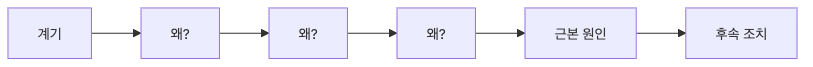

# Root Cause Analysis

incident가 일어나면 누구나 빨리 원인을 찾고 싶어 합니다. 그런데 현장에서는 가장 먼저 눈에 보인 사건을 곧바로 근본 원인으로 받아들이는 경우가 많습니다.

배포 직후 장애가 났다면 배포가 원인처럼 보이고, 누군가 잘못된 명령을 실행했다면 그 사람이 원인처럼 보입니다. 하지만 그 한 단계 아래를 더 내려가 보면, 실제로는 보호 장치와 프로세스 빈틈이 함께 드러나는 경우가 대부분입니다.

이 글은 Incident Response 101 시리즈의 6번째 글입니다. 여기서는 trigger와 root cause를 구분하는 기준, 5 Whys를 운영 문서에 남기는 방법, 그리고 검증 가능한 action item으로 이어지는 RCA 흐름을 다룹니다.

## 이 글에서 다룰 문제

RCA에서 가장 흔한 실패는 trigger와 root cause를 같은 것으로 보는 일입니다. trigger는 사건을 직접 터뜨린 마지막 계기일 수 있지만, root cause는 그 계기가 실제 장애로 이어지게 만든 조건입니다. 이 둘을 구분하지 못하면 같은 incident는 형태만 바꿔 다시 반복됩니다.

> RCA의 목적은 마지막 계기를 탓하는 것이 아니라, 그 계기가 incident로 이어질 수 있었던 구조적 조건을 찾는 데 있습니다.

- incident의 진짜 원인은 어떻게 찾아야 할까요?
- 왜 5 Whys가 여전히 유용할까요?
- trigger와 root cause는 어디서 갈릴까요?
- contributing factor는 왜 별도로 봐야 할까요?
- 사람을 원인으로 적는 문장이 왜 위험할까요?

## 왜 이 주제가 중요한가

trigger만 고치면 같은 root cause는 다음 incident에서 다시 터집니다. 예를 들어 특정 배포가 장애를 일으켰다고 해도, 실제 root cause는 보호 장치 없는 배포 프로세스, 부족한 검증, 취약한 기본값일 수 있습니다. 마지막 계기만 지우면 시스템은 여전히 같은 종류의 사고를 허용합니다.

RCA는 비난을 위한 절차가 아니라 재발 방지를 위한 분석입니다. 무엇이 가능 조건이었는지, 어떤 축에서 실패가 겹쳤는지, 어떤 후속 조치가 검증 가능해야 하는지를 분명히 해야 postmortem과 prevention 단계도 제대로 이어집니다.

## 한눈에 보는 구조



*한눈에 보는 구조*
이 흐름에서 핵심은 한 번 더 묻는 습관입니다. 처음 눈에 보이는 설명에서 멈추지 않고, 왜 그 설명이 가능했는지 계속 내려가야 root cause에 가까워집니다.

## 핵심 용어

- **trigger**: incident를 직접 일으킨 계기입니다.
- **root cause**: 그 계기가 가능하도록 만든 조건입니다.
- **contributing factor**: incident를 키운 기여 요인입니다.
- **5 whys**: 왜를 여러 번 물어 깊이를 확보하는 기법입니다.
- **systems thinking**: 사람보다 시스템과 구조를 먼저 보는 관점입니다.

이 용어를 분리하면 RCA 문서가 훨씬 또렷해집니다. trigger는 사건의 마지막 스위치일 수 있지만, root cause는 더 깊은 곳에 있습니다. contributing factor는 한 축이 아니라 여러 축에서 함께 붙는 경우가 많습니다.

## 전후 비교

이전: trigger를 곧바로 root cause로 적습니다.

이후: 5 Whys와 기여 요인을 따라 구조적 조건까지 내려갑니다.

이후 상태의 장점은 사고 재발 가능성을 더 정확히 줄일 수 있다는 점입니다. 사람 한 명이나 마지막 이벤트 하나를 바꾸는 것보다, 사건을 가능하게 만든 구조를 바꾸는 편이 훨씬 오래 갑니다.

## 단계별 실습: 작은 RCA 워크북 만들기

### 1단계 — 5 Whys 체인 만들기

질문을 반복해 분석 깊이를 남기는 구조입니다. 중요한 것은 답 자체보다 왜가 몇 단계까지 내려갔는지를 보존하는 일입니다.

```python
def five_whys(start):
    chain = [start]
    for _ in range(5):
        chain.append(input(f"why? {chain[-1]} -> "))
    return chain
```

### 2단계 — 기여 요인 모으기

incident는 한 축에서만 생기지 않는 경우가 많습니다. 사람, 프로세스, 도구, 시스템처럼 여러 축을 함께 봐야 합니다.

```python
def factors():
    return {"people": [], "process": [], "tooling": [], "system": []}
```

### 3단계 — trigger와 root cause 구분하기

어떤 항목이 근본 원인인지 판단하려면 더 많은 근거가 필요합니다. 여기서는 증거 수로 간단히 구분합니다.

```python
def classify(item, evidence):
    return "root" if evidence >= 3 else "trigger"
```

### 4단계 — 후속 조치로 연결하기

RCA는 설명으로 끝나면 안 됩니다. root cause를 실제 수정 작업으로 옮겨야 합니다.

```python
def actions(root):
    return [{"root": root, "action": f"fix {root}"}]
```

### 5단계 — 검증 가능성 확인하기

좋은 action item은 검증할 수 있어야 합니다. 막연한 다짐보다 동사로 시작하는 구체 작업이 유리합니다.

```python
def is_actionable(action):
    return action["action"].startswith(("add ", "fix ", "remove ", "test "))
```

## 이 코드에서 먼저 볼 점

- 체인 구조가 있어야 분석 깊이를 잃지 않습니다.
- 기여 요인은 네 축으로 나눠 보는 편이 좋습니다.
- action item은 동사로 시작해야 실행 가능성이 높아집니다.

여기서 중요한 감각은 “누가 잘못했는가”보다 “왜 그런 실수가 incident로 이어질 수 있었는가”를 먼저 보는 것입니다. 개인의 실수는 자주 trigger일 수는 있어도, 반복 가능한 root cause는 대개 시스템과 프로세스 쪽에 남아 있습니다.

## 자주 하는 실수 5가지

1. 첫 답에서 바로 멈춥니다.
2. 사람을 root cause로 단정합니다.
3. trigger만 고치고 incident를 닫습니다.
4. action item이 지나치게 추상적입니다.
5. 검증할 수 없는 action item을 남깁니다.

가장 위험한 실수는 “원인을 찾았다”는 말로 분석을 너무 빨리 끝내는 일입니다. RCA가 짧게 끝났다면 root cause에 도달해서가 아니라 중간에서 멈췄을 가능성도 함께 의심해야 합니다.

## 실무에서는 이렇게 봅니다

실무에서는 postmortem 템플릿 안에 5 Whys 섹션과 contributing factors 표를 고정해 두는 경우가 많습니다. 이렇게 해야 incident마다 분석 깊이가 들쭉날쭉해지는 일을 줄일 수 있습니다.

시니어 엔지니어는 RCA에서 사람보다 시스템을 먼저 의심합니다. 그리고 action item이 측정 가능하고 검증 가능한지까지 함께 봅니다. 설명만 길고 바뀌는 것이 없다면, 그 RCA는 기록은 될 수 있어도 예방 장치는 되기 어렵습니다.

## trigger와 root cause를 구분하는 예시

예를 들어 새 배포 직후 결제 장애가 났다고 가정해 보겠습니다. 이때 “배포가 원인”이라고 적는 것은 trigger 수준 설명에 가깝습니다. 조금 더 내려가 보면 이렇게 정리할 수 있습니다.

- trigger: 잘못된 timeout 설정이 포함된 배포
- contributing factor: staging 환경에 실제 결제 부하 테스트가 없음
- root cause: timeout 변경이 검증 없이 프로덕션에 들어갈 수 있는 배포 보호 장치 부재
- action item: timeout 변경 시 회귀 테스트와 배포 차단 규칙 추가

이렇게 쓰면 사람이나 마지막 이벤트를 탓하는 대신, 다음 incident를 막을 수 있는 변경점이 더 또렷해집니다.

## 체크리스트

- [ ] RCA 템플릿 섹션이 미리 준비되어 있다.
- [ ] 사람, 프로세스, 도구, 시스템 네 축을 함께 봤다.
- [ ] action item을 동사로 시작하는 규칙을 적용했다.
- [ ] 각 action item의 검증 기준을 적었다.

## 연습 문제

1. trigger와 root cause의 차이를 한 문장으로 적어 보세요.
2. 5 Whys를 한 문장으로 정의해 보세요.
3. contributing factor를 한 문장으로 정의해 보세요.

## 정리와 다음 글

RCA의 목적은 마지막 계기를 찾는 데서 끝나지 않습니다. trigger와 root cause를 구분하고, 여러 기여 요인을 함께 보고, 검증 가능한 action item으로 이어져야 incident가 다시 반복되는 일을 줄일 수 있습니다.

다음 글에서는 피해를 멈추는 mitigation과 원인을 제거하는 resolution을 어떻게 구분하고 운영할지 다루겠습니다.

<!-- toc:begin -->
- [Incident란 무엇인가?](./01-what-is-incident.md)
- [Severity 분류](./02-severity.md)
- [초기 대응](./03-initial-response.md)
- [Communication](./04-communication.md)
- [Timeline 작성](./05-timeline.md)
- **Root Cause Analysis (현재 글)**
- Mitigation과 Resolution (예정)
- Postmortem (예정)
- 재발 방지 (예정)
- Incident Runbook 만들기 (예정)
<!-- toc:end -->

## 참고 자료

### 공식 문서
- [Root cause analysis - PagerDuty](https://response.pagerduty.com/after/root_cause_analysis/)
- [Postmortem Culture - Google SRE Book](https://sre.google/sre-book/postmortem-culture/)
- [Postmortem templates - Atlassian](https://www.atlassian.com/incident-management/postmortem/templates)
- [NIST SP 800-61 Rev. 2 Computer Security Incident Handling Guide](https://csrc.nist.gov/pubs/sp/800/61/r2/final)

### 예제 소스
- [incident-response-101 canonical source in book-content](https://github.com/yeongseon-books/book-content/tree/main/content/incident-response-101)

Tags: Incident, RCA, Postmortem, Analysis, Operations
