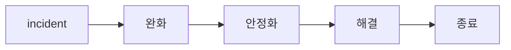

# Mitigation과 Resolution

이 글은 Incident Response 101 시리즈의 7번째 글입니다.

incident 대응에서 자주 생기는 혼동 하나는 피해를 멈춘 상태와 원인을 제거한 상태를 같은 것으로 보는 일입니다. 고객 영향이 줄어들면 마음이 급히 놓이고, 그 순간 incident가 끝났다고 느끼기 쉽습니다. 하지만 많은 사고는 바로 그 지점에서 다시 터집니다. 잠깐 진정된 것과 실제로 해결된 것은 다르기 때문입니다.

## 이 글에서 다룰 문제

mitigation은 damage를 멈추는 조치이고, resolution은 cause를 제거하는 조치입니다. 둘은 목적도, 속도도, 책임자도 다를 수 있습니다. 이 구분이 흐려지면 임시 조치를 영구 해결처럼 발표하거나, 반대로 완전한 해결이 나올 때까지 고객 공지를 늦추는 문제가 생깁니다.

> mitigation은 피해를 멈추는 일이고, resolution은 원인을 제거하는 일입니다. 순서도 다르고 소유권도 다를 수 있습니다.

- 불을 끄는 일과 원인을 없애는 일은 어떻게 다를까요?
- 롤백은 왜 가장 강력한 mitigation 수단일까요?
- 스케일 아웃, 스로틀, 킬 스위치는 언제 써야 할까요?
- mitigation을 resolution이라고 발표하면 왜 위험할까요?
- 복구 검증은 어떤 숫자로 확인해야 할까요?

## 왜 이 주제가 중요한가

mitigation과 resolution을 혼동하면 같은 incident가 밤에 다시 열릴 수 있습니다. 예를 들어 feature flag를 꺼서 증상을 잠시 멈췄는데, 이를 해결 완료로 간주하고 후속 수정 없이 닫아 버리면 조건이 그대로 남아 있기 때문입니다. 반대로 원인을 완전히 제거할 때까지 공지를 미루면 고객은 이미 안정화된 사실조차 늦게 알게 됩니다.

좋은 대응은 두 단계를 분리합니다. 먼저 피해를 줄이고, 그다음 차분하게 원인을 없앱니다. 이 구분이 있어야 복구 일정과 커뮤니케이션도 정직해집니다.

## 한눈에 보는 구조



incident 대응은 보통 이 순서를 따릅니다. 먼저 서비스를 안정화하고, 그 뒤에 근본 조치를 적용합니다. 두 단계를 섞으면 판단과 공지가 함께 흔들립니다.

## 핵심 용어

- **mitigation**: 피해 확산을 멈추는 조치입니다.
- **resolution**: 원인을 제거하는 조치입니다.
- **rollback**: 이전 버전으로 되돌리는 조치입니다.
- **kill switch**: 기능을 즉시 끄는 안전 장치입니다.
- **throttle**: 유입 트래픽을 제한하는 조치입니다.

이 용어를 분리해 두면 공지가 더 정확해집니다. “완화됨”은 고객 영향이 줄었다는 뜻이지, 원인이 사라졌다는 뜻이 아닙니다. “해결됨”은 그보다 더 강한 표현이어야 합니다.

## 전후 비교

이전: 완전히 고친 뒤에만 공지합니다.

이후: 피해를 막는 즉시 완화 사실을 알리고, 원인 제거는 별도로 공지합니다.

이 차이는 신뢰에 직접 연결됩니다. 고객은 현재 영향이 줄었는지 알고 싶어 하고, 팀은 아직 임시 조치 상태인지 완전 해결 상태인지 구분해서 운영해야 합니다.

## 단계별 실습: 작은 mitigation 키트 만들기

### 1단계 — 롤백 준비하기

가장 빠른 완화 수단은 대개 이전 정상 상태로 돌아가는 것입니다. 그래서 롤백 절차는 incident 전에 준비돼 있어야 합니다.

```python
def rollback(version):
    return {"action": "rollback", "to": version}
```

### 2단계 — 스케일 아웃하기

용량 부족형 incident라면 인스턴스를 늘리는 것만으로도 피해를 빠르게 줄일 수 있습니다.

```python
def scale_out(service, replicas):
    return {"service": service, "replicas": replicas}
```

### 3단계 — 스로틀 걸기

과도한 요청이 문제라면 유입량 제한이 현실적인 완화 수단이 됩니다.

```python
def throttle(endpoint, rps):
    return {"endpoint": endpoint, "rps": rps}
```

### 4단계 — 킬 스위치 실행하기

문제 기능을 빠르게 끌 수 있다면 incident 폭을 크게 줄일 수 있습니다. 킬 스위치는 복잡하면 소용이 없습니다.

```python
FLAGS = {}

def kill(feature):
    FLAGS[feature] = False
    return FLAGS[feature]
```

### 5단계 — 복구 검증하기

“괜찮아 보인다”로는 부족합니다. 완화나 해결 뒤에는 수치로 복구를 확인해야 합니다.

```python
def verify(metrics):
    return metrics.get("err_ratio", 1) < 0.01
```

## 이 코드에서 먼저 볼 점

- mitigation은 큰 개편보다 작은 조치로 빨리 실행해야 합니다.
- 킬 스위치는 플래그 한 줄로 바로 꺼질 정도로 단순해야 합니다.
- 복구 검증은 느낌이 아니라 수치로 확인해야 합니다.

incident 현장에서는 “일단 살리고 나중에 바로잡는다”는 순서가 매우 중요합니다. 완전한 해결을 기다리다 보면 고객 영향이 불필요하게 길어질 수 있습니다.

## 자주 하는 실수 5가지

1. 롤백 수단 없이 전진만 시도합니다.
2. 킬 스위치를 미리 준비하지 않습니다.
3. mitigation을 곧바로 resolution이라고 발표합니다.
4. 검증 없이 incident를 닫습니다.
5. 스로틀을 해제해야 한다는 사실을 잊습니다.

특히 세 번째 실수는 커뮤니케이션 신뢰를 해칩니다. 고객 영향이 줄어든 것과 원인이 제거된 것은 다르기 때문에, 공지 문장도 그 차이를 솔직하게 반영해야 합니다.

## 실무에서는 이렇게 봅니다

실무에서는 feature flag 시스템과 autoscaler를 runbook 명령어 한 줄로 묶어 2분 안에 mitigation할 수 있게 준비하는 경우가 많습니다. 핵심은 incident 현장에서 새로 설계하지 않아도 되게 만드는 것입니다.

시니어 엔지니어는 mitigation을 최우선으로 두되, resolution은 더 차분한 검증과 함께 가져갑니다. 그리고 unthrottle 같은 후속 이벤트도 별도 사건처럼 기록합니다. 완화 이후의 상태 전환도 운영에서는 중요하기 때문입니다.

## 체크리스트

- [ ] 롤백 절차가 문서화되어 있다.
- [ ] 킬 스위치 목록이 정리되어 있다.
- [ ] 스로틀 정책이 준비되어 있다.
- [ ] 복구 검증 지표가 정의되어 있다.

## 연습 문제

1. mitigation을 한 문장으로 정의해 보세요.
2. resolution을 한 문장으로 정의해 보세요.
3. 킬 스위치가 왜 incident 대응에서 강력한 수단인지 설명해 보세요.

## 정리와 다음 글

mitigation은 피해를 멈추는 일이고, resolution은 원인을 제거하는 일입니다. 둘을 구분해야 incident 현장에서 빠른 완화와 정직한 커뮤니케이션, 그리고 안전한 후속 수정이 가능합니다. 롤백, 스케일 아웃, 스로틀, 킬 스위치 같은 수단은 먼저 서비스를 살리는 데 쓰고, 해결 완료 여부는 숫자로 검증해야 합니다.

다음 글에서는 incident가 끝난 뒤 학습을 조직 자산으로 바꾸는 postmortem을 다루겠습니다.

<!-- toc:begin -->
- [Incident란 무엇인가?](./01-what-is-incident.md)
- [Severity 분류](./02-severity.md)
- [초기 대응](./03-initial-response.md)
- [Communication](./04-communication.md)
- [Timeline 작성](./05-timeline.md)
- [Root Cause Analysis](./06-root-cause-analysis.md)
- **Mitigation과 Resolution (현재 글)**
- Postmortem (예정)
- 재발 방지 (예정)
- Incident Runbook 만들기 (예정)
<!-- toc:end -->

## 참고 자료

- [Mitigation vs Resolution - PagerDuty](https://response.pagerduty.com/during/mitigation/)
- [Rollback Strategies - Google SRE Book](https://sre.google/sre-book/release-engineering/)
- [Feature Flags - Martin Fowler](https://martinfowler.com/articles/feature-toggles.html)
- [Throttling and Backpressure - Increment](https://increment.com/reliability/throttling/)

Tags: Incident, Mitigation, Resolution, Rollback, Operations
