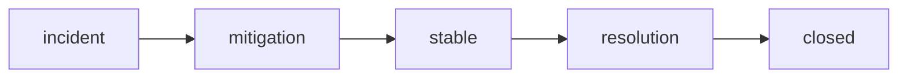

# Mitigation과 Resolution

> Incident Response 101 시리즈 (7/10)


## 이 글에서 다룰 문제

Mitigation을 Resolution로 착각하면 같은 사건이 밤에 다시 터질 수 있습니다.

## 전체 흐름


## Before/After

**Before**: 완전히 고친 뒤에만 공지합니다.

**After**: 피해를 막는 즉시 공지하고, 원인 제거는 별도로 공지합니다.

## 미니 Mitigation 키트

### 1단계 — 롤백

```python
def rollback(version):
    return {"action": "rollback", "to": version}
```

### 2단계 — 스케일 아웃

```python
def scale_out(service, replicas):
    return {"service": service, "replicas": replicas}
```

### 3단계 — 스로틀

```python
def throttle(endpoint, rps):
    return {"endpoint": endpoint, "rps": rps}
```

### 4단계 — 킬 스위치

```python
FLAGS = {}

def kill(feature):
    FLAGS[feature] = False
    return FLAGS[feature]
```

### 5단계 — 복구 검증

```python
def verify(metrics):
    return metrics.get("err_ratio", 1) < 0.01
```

## 이 코드에서 주목할 점

- Mitigation은 큰 개편보다 작은 동작으로 빨리 실행해야 합니다.
- 킬 스위치는 플래그 한 줄로 바로 꺼질 정도로 단순해야 합니다.
- 검증은 느낌이 아니라 수치로 확인해야 합니다.

## 자주 하는 실수 5가지

1. 롤백 수단 없이 전진만 시도합니다.
2. 킬 스위치를 미리 준비하지 않습니다.
3. Mitigation을 곧바로 Resolution이라고 발표합니다.
4. 검증 없이 closed 상태로 넘깁니다.
5. 스로틀을 해제해야 한다는 사실을 잊습니다.

## 실무에서는 이렇게 쓰입니다

Feature flag 시스템과 autoscaler를 runbook 명령어 한 줄로 묶어 2분 안에 Mitigation할 수 있게 준비합니다.

## 체크리스트

- [ ] 롤백 절차를 문서화했는지 확인합니다.
- [ ] 킬 스위치 목록을 정리했는지 확인합니다.
- [ ] 스로틀 정책을 준비했는지 확인합니다.
- [ ] 복구 검증 지표를 정의했는지 확인합니다.

## 정리 및 다음 단계

다음 글은 Postmortem입니다.

<!-- toc:begin -->
- [Incident란 무엇인가?](./01-what-is-incident.md)
- [Severity 분류](./02-severity.md)
- [초기 대응](./03-initial-response.md)
- [Communication](./04-communication.md)
- [Timeline 작성](./05-timeline.md)
- [Root Cause Analysis](./06-root-cause-analysis.md)
- **Mitigation과 Resolution (현재 글)**
- Postmortem (예정)
- 재발 방지 (예정)
- Incident Runbook 만들기 (예정)
<!-- toc:end -->

## 참고 자료

- [Mitigation vs Resolution - PagerDuty](https://response.pagerduty.com/during/mitigation/)
- [Rollback Strategies - Google SRE Book](https://sre.google/sre-book/release-engineering/)
- [Feature Flags - Martin Fowler](https://martinfowler.com/articles/feature-toggles.html)
- [Throttling and Backpressure - Increment](https://increment.com/reliability/throttling/)

Tags: Incident, Mitigation, Resolution, Rollback, Operations
