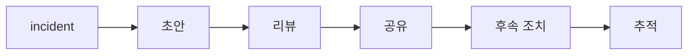

# Postmortem

이 글은 Incident Response 101 시리즈의 8번째 글입니다.

incident가 끝나면 팀은 잠깐 안도합니다. 서비스가 복구됐고, 호출도 멈췄고, 채널도 조용해졌기 때문입니다. 그런데 바로 그 시점에 가장 중요한 작업 하나가 남습니다. 이번 사건에서 배운 내용을 조직 자산으로 바꾸는 일입니다. 이 단계를 건너뛰면 같은 문제를 다른 날짜에 다시 맞게 됩니다.

## 이 글에서 다룰 문제

많은 팀이 사후 분석 문서를 쓰지만, 실제로는 두 극단으로 흔들리기 쉽습니다. 하나는 비난 문서가 되는 경우이고, 다른 하나는 예쁘게 정리된 기록만 남고 후속 조치가 사라지는 경우입니다. 좋은 postmortem은 이 둘을 피하고, 사실과 학습과 실행을 한 문서로 묶어야 합니다.

> 좋은 postmortem은 누군가를 탓하는 문서가 아니라, 사실·영향·원인·후속 조치를 남기는 학습 문서입니다.

- postmortem은 왜 incident 종료 뒤에 꼭 필요할까요?
- 비난 없는 원칙은 책임 없음과 어떻게 다를까요?
- 매번 새 양식을 만드는 대신 템플릿을 고정해야 하는 이유는 무엇일까요?
- action item에는 무엇이 반드시 들어가야 할까요?
- 문서를 쓰고 끝내지 않으려면 어떤 추적 장치가 필요할까요?

## 왜 이 주제가 중요한가

같은 incident가 반복된다는 말은 대개 시스템보다 학습 루프가 끊겼다는 신호입니다. 사건은 끝났는데 원인이 구조로 정리되지 않았고, 후속 조치가 추적되지 않았으며, 다음 사람에게 전달되지 않았기 때문입니다. postmortem은 회고 문서이면서 동시에 예방 장치입니다.

또 하나 중요한 이유는 기억의 왜곡입니다. 사건이 끝난 직후에는 모두가 생생하게 기억한다고 생각하지만, 며칠만 지나도 순서와 판단 근거가 흐려집니다. 사실을 남기지 않으면 조직은 가장 큰 목소리나 마지막 기억에 의존하게 됩니다.

## 한눈에 보는 구조



postmortem은 publish로 끝나면 안 됩니다. 공유 뒤에 action item 등록과 추적이 이어져야 학습이 행동으로 바뀝니다.

## 핵심 용어

- **blameless**: 개인 비난 없이 시스템과 맥락을 중심으로 원인을 보는 원칙입니다.
- **summary**: 사건을 짧게 이해할 수 있도록 정리한 요약입니다.
- **impact**: 고객이 실제로 겪은 영향입니다.
- **action item**: 검증 가능한 후속 작업입니다.
- **owner**: 후속 작업의 책임자입니다.

여기서 비난 없는 원칙은 책임을 지우지 않는다는 말이 아닙니다. 개인을 원인으로 끝내지 않는다는 말입니다. 어떤 경보가 없었는지, 어떤 리뷰가 부족했는지, 어떤 기본값이 위험했는지를 함께 봐야 같은 사고를 줄일 수 있습니다.

## 전후 비교

이전: 내부에서만 돌고 비난과 방어가 섞인 문서를 남깁니다.

이후: 조직 전체가 참고할 수 있는 비난 없는 문서와 후속 조치 목록을 남깁니다.

이후 상태에서는 문서의 용도가 바뀝니다. 읽는 사람은 누구를 탓해야 하는지가 아니라, 다음에 무엇을 바꿔야 하는지를 찾습니다. 그래서 좋은 postmortem은 감정보다 구조가 앞에 옵니다.

## 단계별 실습: 작은 postmortem 빌더 만들기

### 1단계 — 템플릿 고정하기

사건마다 양식이 달라지면 비교와 검색이 어려워집니다. summary, impact, timeline, rca, actions 정도는 고정하는 편이 좋습니다.

```python
TEMPLATE = ("summary", "impact", "timeline", "rca", "actions")

def new_doc():
    return {k: "" for k in TEMPLATE}
```

### 2단계 — 요약 길이 제한하기

요약이 길어지면 읽는 사람이 핵심을 놓칩니다. 첫머리에는 짧은 사고 개요가 있어야 합니다.

```python
def is_short(text):
    return text.count(".") <= 3
```

### 3단계 — 영향 수치화하기

영향을 “컸다”라고만 쓰면 다음 비교가 어렵습니다. 사용자 수와 지속 시간처럼 비교 가능한 단위를 남기는 편이 좋습니다.

```python
def impact(users, minutes):
    return {"users": users, "minutes": minutes}
```

### 4단계 — 후속 조치 등록하기

후속 조치에는 내용만 있으면 안 됩니다. 누가 맡는지와 언제까지 끝낼지가 함께 있어야 추적할 수 있습니다.

```python
def action(text, owner, due):
    return {"text": text, "owner": owner, "due": due}
```

### 5단계 — 기한 지난 작업 찾기

추적은 복잡할 필요가 없습니다. 오늘 날짜와 due date를 비교하는 것만으로도 방치된 작업을 찾을 수 있습니다.

```python
def overdue(actions, today):
    return [a for a in actions if a["due"] < today]
```

## 이 코드에서 먼저 볼 점

- 템플릿이 고정돼 있어 문서 구조가 흔들리지 않습니다.
- impact는 숫자로 남겨 비교 가능하게 합니다.
- 추적은 결국 owner와 deadline을 확인하는 일입니다.

좋은 postmortem은 글을 잘 쓰는 재능보다 구조를 잘 고정하는 습관에서 나옵니다. 양식이 일정해야 읽는 사람도 빨리 훑을 수 있고, 사건 사이 비교도 쉬워집니다.

## 자주 하는 실수 5가지

1. 개인 이름을 그대로 원인으로 적고 시스템 원인을 더 보지 않습니다.
2. 후속 조치에 담당자를 붙이지 않습니다.
3. due date가 없어 추적이 끊깁니다.
4. 문서를 대응팀 내부에서만 보고 조직에 공유하지 않습니다.
5. 사건마다 템플릿을 새로 만들어 비교 가능성을 잃습니다.

가장 위험한 실수는 후속 조치 없는 postmortem입니다. 문서는 근사하지만 무엇도 바뀌지 않습니다. 그 문서는 기록일 수는 있어도 학습 장치는 아닙니다.

## 실무에서는 이렇게 봅니다

실무에서는 Notion이나 Confluence에 postmortem 템플릿을 고정해 두고, 후속 조치는 Jira 같은 추적 도구와 연결하는 경우가 많습니다. 그리고 분기 리뷰에서 기한을 넘긴 항목을 다시 확인합니다. 이 분기 리뷰가 있어야 문서와 운영이 다시 연결됩니다.

시니어 엔지니어는 blameless를 문화라고 봅니다. 사고의 원인을 개인에게만 묶지 않고, 시스템과 프로세스의 빈틈으로 확장해서 봅니다. 동시에 문서만 남겨서는 아무 의미가 없다는 점도 잘 압니다.

## 체크리스트

- [ ] 고정된 postmortem 템플릿이 있다.
- [ ] action item마다 owner와 due date가 있다.
- [ ] 문서를 저장하고 검색할 공용 공간이 있다.
- [ ] 분기 리뷰 등 추적 루프가 운영되고 있다.

## 연습 문제

1. blameless를 한 문장으로 정의해 보세요.
2. action item에 owner가 빠지면 왜 문제가 되는지 설명해 보세요.
3. 여러분 팀의 postmortem 템플릿에 반드시 들어가야 할 항목 다섯 개를 적어 보세요.

## 정리와 다음 글

postmortem은 incident 뒤에 남기는 회고 메모가 아니라, 조직 학습을 실제 행동으로 바꾸는 문서입니다. 비난 없는 원칙으로 사실과 맥락을 정리하고, 영향을 수치로 남기고, 후속 조치에 담당자와 기한을 붙여야 같은 문제가 반복되는 일을 줄일 수 있습니다.

다음 글에서는 이렇게 남긴 학습을 실제 재발 방지 체계로 바꾸는 방법을 다루겠습니다.

<!-- toc:begin -->
- [Incident란 무엇인가?](./01-what-is-incident.md)
- [Severity 분류](./02-severity.md)
- [초기 대응](./03-initial-response.md)
- [Communication](./04-communication.md)
- [Timeline 작성](./05-timeline.md)
- [Root Cause Analysis](./06-root-cause-analysis.md)
- [Mitigation과 Resolution](./07-mitigation-and-resolution.md)
- **Postmortem (현재 글)**
- 재발 방지 (예정)
- Incident Runbook 만들기 (예정)
<!-- toc:end -->

## 참고 자료

- [Postmortem Culture - Google SRE Book](https://sre.google/sre-book/postmortem-culture/)
- [Blameless Postmortems - PagerDuty](https://response.pagerduty.com/after/post_mortem_process/)
- [Postmortem Templates - Atlassian](https://www.atlassian.com/incident-management/postmortem/templates)
- [Etsy Code as Craft Postmortems](https://www.etsy.com/codeascraft/blameless-postmortems/)

Tags: Incident, Postmortem, Blameless, Learning, Operations