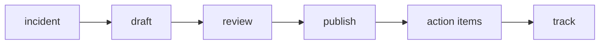

# Postmortem

> Incident Response 101 시리즈 (8/10)

<!-- a-grade-intro:begin -->

**핵심 질문**: *Incident* 가 *끝* 난 뒤, *학습* 을 *어떻게* *조직* 의 자산으로 만들까요?

> *Postmortem* 은 *블레임리스* 한 문서로 *사실*, *영향*, *원인*, *액션* 을 정리합니다.

<!-- a-grade-intro:end -->

## 이 글에서 배울 것

- *블레임리스* 원칙
- *템플릿* 구조
- *액션 아이템*
- *추적 방법*
- *공유 범위*

## 왜 중요한가

*같은 사건* 이 *반복* 되는 조직은 *학습* 이 *문서* 까지만 가고 *행동* 으로 못 갑니다.

## 개념 한눈에 보기



## 핵심 용어 정리

- **blameless**: *사람* 비난 없음.
- **summary**: *3 문장* 요약.
- **impact**: *고객* 에게 *어떤 영향*.
- **action item**: *검증 가능* 한 후속 작업.
- **owner**: *액션* 의 *책임자*.

## Before/After

**Before**: *내부* 만 보는 *비난* 문서.

**After**: *모두* 가 보는 *블레임리스* 문서.

## 실습: 미니 Postmortem 빌더

### 1단계 — 템플릿

```python
TEMPLATE = ("summary", "impact", "timeline", "rca", "actions")

def new_doc():
    return {k: "" for k in TEMPLATE}
```

### 2단계 — 요약 검사

```python
def is_short(text):
    return text.count(".") <= 3
```

### 3단계 — 영향 정량화

```python
def impact(users, minutes):
    return {"users": users, "minutes": minutes}
```

### 4단계 — 액션 등록

```python
def action(text, owner, due):
    return {"text": text, "owner": owner, "due": due}
```

### 5단계 — 추적

```python
def overdue(actions, today):
    return [a for a in actions if a["due"] < today]
```

## 이 코드에서 주목할 점

- *템플릿* 은 *튜플* 로 *고정*.
- *영향* 은 *수치*.
- *추적* 은 *기한* 비교 한 줄.

## 자주 하는 실수 5가지

1. ***개인* 을 *원인* 으로.**
2. ***액션* 에 *주인* 없음.**
3. ***기한* 없는 *액션*.**
4. ***내부* 만 공유.**
5. ***템플릿* 매번 새로.**

## 실무에서는 이렇게 쓰입니다

*Postmortem* 을 *Notion/Confluence* 템플릿으로 두고 *액션* 을 *Jira* 와 *연동* 합니다. *분기 리뷰* 에서 *추적* 합니다.

## 시니어 엔지니어는 이렇게 생각합니다

- *블레임리스* 는 *문화*.
- *액션* 이 없으면 *문서* 도 없음.
- *영향* 은 *수치*.
- *공유* 는 *전사*.
- *분기 리뷰* 가 *루프* 를 닫음.

## 체크리스트

- [ ] *템플릿*.
- [ ] *액션 등록처*.
- [ ] *추적 도구*.
- [ ] *분기 리뷰* 일정.

## 연습 문제

1. *blameless* 의 의미 한 줄로.
2. *action item* 의 의미 한 줄로.
3. *owner* 의 의미 한 줄로.

## 정리 및 다음 단계

다음 글은 *재발 방지* 입니다.

<!-- toc:begin -->
- [Incident란 무엇인가?](./01-what-is-incident.md)
- [Severity 분류](./02-severity.md)
- [초기 대응](./03-initial-response.md)
- [Communication](./04-communication.md)
- [Timeline 작성](./05-timeline.md)
- [Root Cause Analysis](./06-root-cause-analysis.md)
- [Mitigation과 Resolution](./07-mitigation-and-resolution.md)
- **Postmortem (현재 글)**
- 재발 방지 (예정)
- Incident Runbook 만들기 (예정)
<!-- toc:end -->

## 참고 자료

- [Postmortem Culture - Google SRE Book](https://sre.google/sre-book/postmortem-culture/)
- [Blameless Postmortems - PagerDuty](https://response.pagerduty.com/after/post_mortem_process/)
- [Postmortem Templates - Atlassian](https://www.atlassian.com/incident-management/postmortem/templates)
- [Etsy Code as Craft Postmortems](https://www.etsy.com/codeascraft/blameless-postmortems/)

Tags: Incident, Postmortem, Blameless, Learning, Operations
