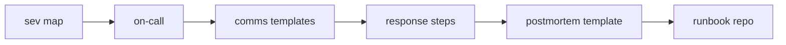

# Incident Runbook 만들기

> Incident Response 101 시리즈 (10/10)


## 이 글에서 다룰 문제

*문서* 가 *흩어져* 있으면 *새벽 3시* 에 *어디부터* 봐야 할지 모릅니다.

## 개념 한눈에 보기



## Before/After

**Before**: *Wiki*, *Slack pin*, *개인 메모* 로 *분산*.

**After**: *Git 저장소* 에 *코드* 로 *통합*.

## 실습: Runbook 캡스톤

### 1단계 — SEV 매핑

```python
SEV = {
    "SEV1": {"page": True, "comms": 15},
    "SEV2": {"page": True, "comms": 30},
    "SEV3": {"page": False, "comms": 60},
}
```

### 2단계 — 온콜 조회

```python
def on_call(schedule, now):
    return next(p for p in schedule if p["from"] <= now <= p["to"])
```

### 3단계 — 커뮤니케이션 템플릿

```python
def comms(audience, sev, summary):
    return {"to": audience, "sev": sev, "text": summary}
```

### 4단계 — 대응 단계

```python
STEPS = ("ack", "stabilize", "communicate", "investigate", "resolve")

def next_step(current):
    i = STEPS.index(current)
    return STEPS[i + 1] if i + 1 < len(STEPS) else "done"
```

### 5단계 — Postmortem 템플릿 링크

```python
def link_postmortem(incident_id):
    return f"runbook/postmortems/{incident_id}.md"
```

### 6단계 — 통합 실행

```python
def run_incident(sev, schedule, now, summary):
    person = on_call(schedule, now)
    msg = comms("internal", sev, summary)
    return {
        "sev": SEV[sev],
        "ic": person["name"],
        "first_msg": msg,
        "step": "ack",
        "postmortem": link_postmortem("INC-001"),
    }
```

## 이 코드에서 주목할 점

- *전 단계* 가 *데이터 구조* 로 표현.
- *상태 전환* 은 *튜플 인덱스*.
- *Postmortem* 은 *파일 링크*.

## 자주 하는 실수 5가지

1. ***Runbook* 을 *Wiki* 에만.**
2. ***SEV* 마다 *동일* 한 절차.**
3. ***온콜* 정보가 *외부* 도구에만.**
4. ***템플릿* 이 *최신* 이 아님.**
5. ***연습* 없이 *실전*.**

## 실무에서는 이렇게 쓰입니다

*runbook/* 디렉터리에 *Markdown* + *Python script* 를 두고, *PR 리뷰* 로 *변경* 을 *추적* 합니다. *분기* 마다 *Drill* 을 실행해 *현행화* 합니다.

## 체크리스트

- [ ] *SEV 매핑*.
- [ ] *온콜 일정*.
- [ ] *커뮤니케이션 템플릿*.
- [ ] *Postmortem 템플릿*.
- [ ] *분기 Drill*.

## 정리 및 다음 단계

이 시리즈는 여기서 마무리합니다. 다음 단계로 *SRE 101* 과 *Information Security 101* 시리즈를 읽어 *신뢰성* 과 *보안* 을 함께 키우세요.

<!-- toc:begin -->
- [Incident란 무엇인가?](./01-what-is-incident.md)
- [Severity 분류](./02-severity.md)
- [초기 대응](./03-initial-response.md)
- [Communication](./04-communication.md)
- [Timeline 작성](./05-timeline.md)
- [Root Cause Analysis](./06-root-cause-analysis.md)
- [Mitigation과 Resolution](./07-mitigation-and-resolution.md)
- [Postmortem](./08-postmortem.md)
- [재발 방지](./09-prevention.md)
- **Incident Runbook 만들기 (현재 글)**
<!-- toc:end -->

## 참고 자료

- [Runbook Template - PagerDuty](https://response.pagerduty.com/oncall/runbooks/)
- [Runbooks as Code - Google SRE Workbook](https://sre.google/workbook/managing-load/)
- [On-Call Rotations - Atlassian](https://www.atlassian.com/incident-management/on-call)
- [Chaos Drills and Game Days - Increment](https://increment.com/reliability/game-days/)

Tags: Incident, Runbook, OnCall, Capstone, Operations
