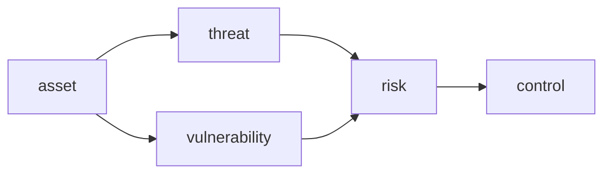

# What Is Information Security?

> Information Security 101 series (1/10)

<!-- a-grade-intro:begin -->

**Core question**: Is security the work of "blocking" or the work of "deciding"?

> Security is not the work of reducing threats to zero — it is the work of knowing the threats and deciding how much you can absorb.

<!-- a-grade-intro:end -->

## What You Will Learn

- The definition of information security and the CIA triad (confidentiality, integrity, availability)
- The difference between threat, vulnerability, and risk
- The starting point of threat modeling (STRIDE at a glance)
- Five basic principles of security
- The fastest way for a developer to contribute to security

## Why It Matters

Security incidents almost never happen because the team lacked technology — they happen because the team did not make a decision. The other nine posts cover "how"; this one defines "what" and "why." Everything else stands on top of it.

> Security is a discipline of decisions, not technology.

## Concept at a Glance



When an asset meets a threat through a vulnerability, you get risk. Security is the work of controlling that risk.

## Key Terms

- **Confidentiality**: Only authorized people see it.
- **Integrity**: Data is not changed unintentionally.
- **Availability**: It works when needed.
- **Threat / Vulnerability / Risk**: Adversary intent / Weakness / What can happen when both meet.
- **STRIDE**: Spoofing, Tampering, Repudiation, Information disclosure, DoS, Elevation of privilege.

## Before/After

**Before — security is the infra team's job**

```text
last-minute review -> schedule slip -> partial workarounds
```

**After — threat modeling at design time**

```text
one-page STRIDE in design review -> risk priority decided -> agreed controls
```

The industry's observation is consistent: pushing security later multiplies its cost.

## Hands-on: A One-Page Threat Model

### Step 1 — write down assets

```text
1_assets.md
- user passwords
- payment tokens
- admin session cookies
```

Begin with the list of "things to protect." Without assets you cannot define threats.

### Step 2 — list threats by STRIDE

```text
2_threats.md
- Spoofing: impersonate another user (bypass auth)
- Tampering: alter the payment amount
- Repudiation: deny the payment
- Information disclosure: DB dump exposed
- DoS: login flood stalls service
- Elevation: ordinary user gains admin
```

A single STRIDE line per asset reveals the gaps quickly.

### Step 3 — risk priority (simple)

```python
# 3_risk.py
def risk_score(likelihood, impact):
    return likelihood * impact   # 1-5 scale
print(risk_score(3, 5))   # 15
```

This score alone splits "block now" from "look later."

### Step 4 — control mapping

```text
4_controls.md
- Spoofing -> MFA, password policy
- Tampering -> HMAC, audit log
- Information disclosure -> encryption, access control
```

Controls are mapped per threat. Vague "improve security" cannot be verified.

### Step 5 — agree on residual risk

```text
5_residual.md
- DoS only weakly defended via CDN rate limit
- Incident response in episode 9
- Reassessed quarterly
```

Not every risk can be removed. Explicitly agreeing on what remains is the adult version of security.

## What to Notice in This Code

- A threat model aims for "shared picture," not "perfection."
- STRIDE is a checklist that prevents omissions.
- Risk scores are for comparison, not absolute values.
- Writing residual risk down clarifies responsibility.

## Five Common Mistakes

1. **Listing threats without listing assets.** You cannot decide controls for unknown protectees.
2. **Treating every threat the same.** Security without priorities is never realized.
3. **Doing security last.** Change costs grow 100x.
4. **Trying to drive risk to zero.** Security without tradeoffs kills availability.
5. **Adding controls without an incident process.** Incidents will happen anyway.

## How This Shows Up in Production

OWASP threat modeling, ISO 27001 / SOC 2 risk assessments, AWS Well-Architected Security Pillar, and the Microsoft SDL all share the same skeleton (asset - threat - risk - control). The bigger the org, the more this single page is the starting point of decisions.

## How a Senior Engineer Thinks

- They treat security as "deciding," not "blocking."
- They put a one-page STRIDE into the PR template.
- Residual risks become tickets and are reassessed quarterly.
- Incident response runbooks come before stronger controls.
- They speak about cost vs. effect in numbers.

## Checklist

- [ ] Can you explain CIA in one line?
- [ ] Can you apply six STRIDE items to one asset?
- [ ] Can you state the difference between threat, vulnerability, and risk?
- [ ] Is the term "residual risk" natural to you?
- [ ] Can you order work by risk priority?

## Practice Problems

1. List five assets in your service and apply STRIDE to each.
2. Score likelihood and impact 1-5 to find the most dangerous item.
3. Turn the result into one page and share it with your team.

## Wrap-up and Next Steps

The starting point of information security is not control technology — it is the question "what are we protecting and why." Next we cover the most common control: authentication and authorization.

<!-- toc:begin -->
- **What Is Information Security? (current)**
- authentication and authorization (upcoming)
- cryptography and hashing (upcoming)
- TLS and certificates (upcoming)
- web security basics (upcoming)
- SQL injection and XSS (upcoming)
- secret management (upcoming)
- least privilege (upcoming)
- logging and audit (upcoming)
- security incident response (upcoming)
<!-- toc:end -->

## References

- [OWASP Threat Modeling](https://owasp.org/www-community/Threat_Modeling)
- [Microsoft STRIDE](https://learn.microsoft.com/en-us/azure/security/develop/threat-modeling-tool-threats)
- [NIST SP 800-30 Risk Assessment](https://csrc.nist.gov/publications/detail/sp/800-30/rev-1/final)
- [AWS Well-Architected Security Pillar](https://docs.aws.amazon.com/wellarchitected/latest/security-pillar/welcome.html)

Tags: Computer Science, Security, CIA, ThreatModel, RiskAssessment, InfoSec
