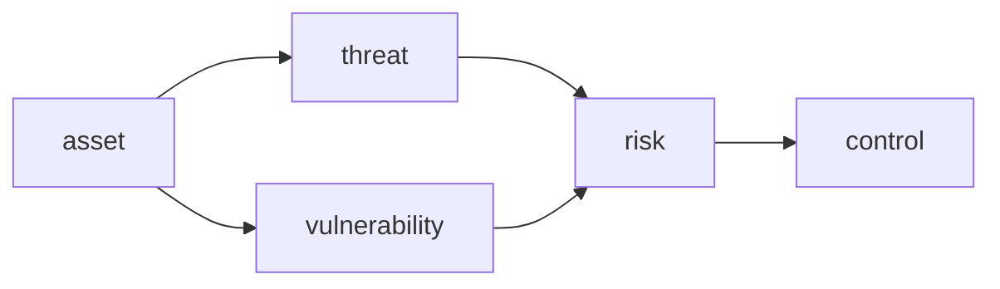

# Information Security 101 (1/10): What Is Information Security?

> Information Security 101 series (1/10)

**Core question**: Is security the work of "blocking" or the work of "deciding"?

> Security is not the work of reducing threats to zero — it is the work of knowing the threats and deciding how much you can absorb.

This is the first post in the Information Security 101 series.


*information security 101 chapter 1 flow overview*
> Information security is not knowing technology names. It is building a state where your team can say "we protect X, we watch for Y, we accept Z."

## Questions to Keep in Mind

- What boundary should you inspect first when applying What Is Information Security??
- Which signal should the example or diagram make visible for What Is Information Security??
- What failure should be prevented first when What Is Information Security? reaches a real system?

## What You Will Learn

- The definition of information security and the CIA triad (confidentiality, integrity, availability)
- The difference between threat, vulnerability, and risk
- The starting point of threat modeling (STRIDE at a glance)
- Five basic principles of security
- The fastest way for a developer to contribute to security

## Why It Matters

Security incidents almost never happen because the team lacked technology — they happen because the team did not make a decision. The other nine posts cover "how"; this one defines "what" and "why." Everything else stands on top of it.

> Security is a discipline of decisions, not technology.


```mermaid
flowchart LR
    A["asset"] --> T["threat"]
    A --> V["vulnerability"]
    T --> R["risk"]
    V --> R
    R --> C["control"]
```

When an asset meets a threat through a vulnerability, you get risk. Security is the work of controlling that risk.

## Key Terms

- **Confidentiality**: Only authorized people see it.
- **Integrity**: Data is not changed unintentionally.
- **Availability**: It works when needed.
- **Threat / Vulnerability / Risk**: Adversary intent / Weakness / What can happen when both meet.
- **STRIDE**: Spoofing, Tampering, Repudiation, Information disclosure, DoS, Elevation of privilege.

## Before/After

**Before — security is the infra team's job**

```text
last-minute review -> schedule slip -> partial workarounds
```

**After — threat modeling at design time**

```text
one-page STRIDE in design review -> risk priority decided -> agreed controls
```

The industry's observation is consistent: pushing security later multiplies its cost.

## Hands-on: A One-Page Threat Model

### Step 1 — write down assets

```text
1_assets.md
- user passwords
- payment tokens
- admin session cookies
```

Begin with the list of "things to protect." Without assets you cannot define threats.

### Step 2 — list threats by STRIDE

```text
2_threats.md
- Spoofing: impersonate another user (bypass auth)
- Tampering: alter the payment amount
- Repudiation: deny the payment
- Information disclosure: DB dump exposed
- DoS: login flood stalls service
- Elevation: ordinary user gains admin
```

A single STRIDE line per asset reveals the gaps quickly.

### Step 3 — risk priority (simple)

```python
# 3_risk.py
def risk_score(likelihood, impact):
    return likelihood * impact   # 1-5 scale
print(risk_score(3, 5))   # 15
```

This score alone splits "block now" from "look later."

### Step 4 — control mapping

```text
4_controls.md
- Spoofing -> MFA, password policy
- Tampering -> HMAC, audit log
- Information disclosure -> encryption, access control
```

Controls are mapped per threat. Vague "improve security" cannot be verified.

### Step 5 — agree on residual risk

```text
5_residual.md
- DoS only weakly defended via CDN rate limit
- Incident response in episode 9
- Reassessed quarterly
```

Not every risk can be removed. Explicitly agreeing on what remains is the adult version of security.

## What to Notice in This Code

- A threat model aims for "shared picture," not "perfection."
- STRIDE is a checklist that prevents omissions.
- Risk scores are for comparison, not absolute values.
- Writing residual risk down clarifies responsibility.

## Five Common Mistakes

1. **Listing threats without listing assets.** You cannot decide controls for unknown protectees.
2. **Treating every threat the same.** Security without priorities is never realized.
3. **Doing security last.** Change costs grow 100x.
4. **Trying to drive risk to zero.** Security without tradeoffs kills availability.
5. **Adding controls without an incident process.** Incidents will happen anyway.

## How This Shows Up in Production

### CIA Triad in Real Incidents

| Scenario | Broken axis | Early signal | Business impact | Priority control |
| --- | --- | --- | --- | --- |
| Backup bucket left public | Confidentiality | External scanner access logs spike | Customer data exposure, compliance violation | Bucket policy block, key rotation, access audit |
| Order amount tampered in request | Integrity | Payment vs. ledger mismatch | Settlement errors, financial loss | Request signing (HMAC), dual verification, audit log |
| Login API flood | Availability | Error rate spike, latency increase | Revenue loss, SLA breach | Rate limit, WAF rules, auto-scaling |
| Admin session hijack | Confidentiality + Integrity | Abnormal admin behavior pattern | Privilege abuse, config tampering | MFA enforcement, session re-auth, behavior detection |

Framing threats by CIA axis replaces gut-feel arguments with a structured question: which axis of loss is unacceptable? A payment service prioritizes integrity and availability; a medical record store prioritizes confidentiality.

### Security Frameworks at a Glance

| Framework | Core question | Strength | Watch-out | Starting point |
| --- | --- | --- | --- | --- |
| NIST CSF 2.0 | Are we balancing identify/protect/detect/respond/recover? | Ops-centric language, engineer-friendly | Evidence system needs separate design | Map current controls, run gap analysis |
| ISO 27001 | Does our ISMS operate repeatably? | Org-level process alignment | Low-quality docs risk becoming theater | Asset inventory → risk assessment → SoA |
| CIS Controls | Are we prioritizing the highest-impact basics? | Clear execution priority | Without org context, over/under-control | Start from IG1, phase in |
| SOC 2 | How do we prove control trust to customers? | External trust acquisition | Audit prep burden | Define service boundary and responsibility model |

In practice teams combine: NIST CSF + CIS for operational improvement, ISO/SOC 2 for external trust and contract compliance. What matters is not which framework you pick but whether risk priorities and control execution are actually repeatable.

### Quantifying Risk — Minimal Model

```python
# risk_register.py
from dataclasses import dataclass

@dataclass
class RiskItem:
    name: str
    likelihood: int   # 1..5
    impact: int       # 1..5

    @property
    def score(self) -> int:
        return self.likelihood * self.impact

items = [
    RiskItem("admin session hijack", 3, 5),
    RiskItem("public bucket exposure", 2, 5),
    RiskItem("login endpoint DoS", 4, 4),
]

for i in sorted(items, key=lambda x: x.score, reverse=True):
    print(i.name, i.score)
```

The score is a consensus tool, not ground truth. The habit of scoring with a shared scale and reassessing quarterly matters more than the number itself.

### Risk Register Example

| Risk ID | Scenario | Likelihood | Impact | Score | Treatment |
| --- | --- | --- | --- | --- | --- |
| R-01 | Admin session hijack | 3 | 5 | 15 | MFA enforcement, session re-auth |
| R-02 | Public bucket exposure | 2 | 5 | 10 | Public-block policy, periodic scan |
| R-03 | Login API overload | 4 | 4 | 16 | Rate limit, WAF, auto-scale |

A risk register only reduces risk when it connects to the product backlog as tickets. Scores without tickets change nothing.

## How a Senior Engineer Thinks

### Design Review Security Questions

Paste these five questions into every feature design doc:

1. What assets does this feature handle?
2. Which CIA axis matters most for those assets?
3. Which STRIDE threat has the highest likelihood × impact?
4. What residual risk remains after current controls?
5. Who accepts that residual risk, and when is the next review?

Five questions in the design template turn security from a schedule-end checkbox into an in-flow decision.

### Operational Review Loop

| Cadence | Check | Output |
| --- | --- | --- |
| Daily | High-severity alerts, auth failure spikes, permission denial spikes | Daily security brief |
| Weekly | Security impact of new deployments | Change review note |
| Monthly | Expiring keys/tokens/certs, unused permissions, stale secrets | Monthly hygiene report |
| Quarterly | Threat model re-assessment, runbook drill, control effectiveness | Quarterly security retro |

Actionable documentation requires: named owner + backup, numeric failure/escalation criteria, results tracked as tickets, and exception approvals with expiry dates.

### Converting Security Requirements to Product Work

Abstract goals like "reduce account takeover" must decompose into implementation items:

1. Lock account after 10 consecutive login failures.
2. Force MFA re-verification on lock.
3. Push lock event to security channel immediately.
4. Review false-positive/false-negative ratio in monthly retro.

This keeps security inside the feature development flow — product backlog, QA scenarios, and alerting rules all align on one thread.

## Checklist

- [ ] Can you explain CIA in one line?
- [ ] Can you apply six STRIDE items to one asset?
- [ ] Can you state the difference between threat, vulnerability, and risk?
- [ ] Is the term "residual risk" natural to you?
- [ ] Can you order work by risk priority?

## Practice Problems

1. List five assets in your service and apply STRIDE to each.
2. Score likelihood and impact 1-5 to find the most dangerous item.
3. Turn the result into one page and share it with your team.

## Wrap-up and Next Steps

The starting point of information security is not control technology — it is the question "what are we protecting and why." Next we cover the most common control: authentication and authorization.

## Answering the Opening Questions

- **What exactly does information security mean?**
  - The asset → threat → risk → control flow shown in the diagram is the foundation of every security decision. At each stage you must decide "what," "why," and "by when."
- **How do CIA, threats, vulnerabilities, and risks connect?**
  - The step-by-step exercise (steps 1–5) is about building a one-page STRIDE threat model hands-on to experience this flow for yourself.
- **Why is STRIDE a useful checklist even for beginners?**
  - The goal is not perfect security. It's documenting the risk priorities your team agrees on and the controls mapped to each threat.
<!-- toc:begin -->
## In this series

- **What Is Information Security? (current)**
- Authentication and Authorization (upcoming)
- Cryptography and Hashing (upcoming)
- TLS and Certificates (upcoming)
- Web Security Basics (upcoming)
- SQL Injection and XSS (upcoming)
- Secret Management (upcoming)
- Least Privilege (upcoming)
- Logging and Audit (upcoming)
- Incident Response (upcoming)

<!-- toc:end -->

## References

- [OWASP Threat Modeling](https://owasp.org/www-community/Threat_Modeling)
- [Microsoft STRIDE](https://learn.microsoft.com/en-us/azure/security/develop/threat-modeling-tool-threats)
- [NIST SP 800-30 Risk Assessment](https://csrc.nist.gov/publications/detail/sp/800-30/rev-1/final)
- [AWS Well-Architected Security Pillar](https://docs.aws.amazon.com/wellarchitected/latest/security-pillar/welcome.html)

Tags: Computer Science, Security, CIA, ThreatModel, RiskAssessment, InfoSec
