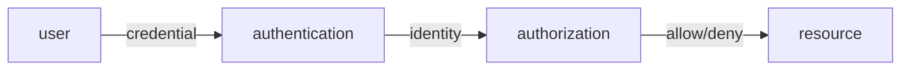

# Information Security 101 (2/10): Authentication and Authorization

> Information Security 101 series (2/10)

**Core question**: Is "who are you" the same question as "what are you allowed to do"?

> Authentication is about identity. Authorization is about permission. Mix them up and half of your security collapses.

This is post 2 in the Information Security 101 series.


*information security 101 chapter 2 flow overview*
> Authentication and authorization are not just about verifying identity. They are about proving "user X performed action Y at time Z from location L" with audit trails that survive server restarts.

## Questions to Keep in Mind

- What boundary should you inspect first when applying Authentication and Authorization?
- Which signal should the example or diagram make visible for Authentication and Authorization?
- What failure should be prevented first when Authentication and Authorization reaches a real system?

## What You Will Learn

- The definition and difference between authentication and authorization
- The security models behind passwords, MFA, and biometrics
- Sessions vs tokens (including JWT)
- The skeleton of OAuth 2.0 / OIDC flows
- A comparison of RBAC and ABAC and how to choose

## Why It Matters

Most breaches start with stolen credentials or abused permissions. Separating authentication from authorization, and choosing the right pattern for each, closes two of the biggest doors at once.

> Verifying "who" and deciding "what" are different responsibilities.



First confirm the identity, then check the permissions of that identity. The two stages are separated in time and in code.

## Key Terms

- **Authentication**: Confirms the identity the user claims.
- **Authorization**: Decides whether that identity may access a resource.
- **MFA**: Two or more of knowledge, possession, inherence.
- **Session vs Token**: Server holds state vs token is self-evidence.
- **RBAC / ABAC**: Role-based vs attribute-based authorization models.

## Before/After

**Before — password only**

```text
once leaked, permanent intrusion
```

**After — password + MFA + token expiry + RBAC**

```text
multi-factor, time-limited, permission-split -> one weak link does not break everything
```

Defense is layered, not single.

## Hands-on: Auth in Short Code

### Step 1 — store passwords safely

```python
# 1_password.py
import bcrypt
def hash_pw(pw): return bcrypt.hashpw(pw.encode(), bcrypt.gensalt(12))
def check_pw(pw, h): return bcrypt.checkpw(pw.encode(), h)
```

bcrypt / argon2 / scrypt — intentionally slow hashes. SHA-256 is not a password hash.

### Step 2 — TOTP MFA

```python
# 2_totp.py
import pyotp
totp = pyotp.TOTP("JBSWY3DPEHPK3PXP")
print(totp.now())                   # 6-digit code
print(totp.verify("123456"))        # bool
```

A possession factor (the seed in your phone) means one broken factor is not enough.

### Step 3 — session vs JWT

```python
# 3_session_vs_jwt.py
# session: server stores sid -> user (easy to revoke, stateful)
# jwt:    token carries user/exp/sig (hard to revoke, stateless)
import jwt
t = jwt.encode({"sub": "u1", "exp": 9999999999}, "secret", algorithm="HS256")
print(jwt.decode(t, "secret", algorithms=["HS256"]))
```

Sessions when revoke is frequent. JWT for stateless calls between microservices.

### Step 4 — OAuth 2.0 authorization code (pseudocode)

```text
4_oauth.txt
client -> auth server: GET /authorize?response_type=code
user logs in & consents
auth server -> client: redirect with ?code=...
client -> auth server: POST /token (code + secret) -> access_token
client -> resource server: GET /api with Bearer access_token
```

The essence of OAuth is never giving the password to a third party.

### Step 5 — RBAC decision

```python
# 5_rbac.py
ROLE_PERMS = {"admin": {"read","write","delete"}, "user": {"read"}}
def can(role, action): return action in ROLE_PERMS.get(role, set())
print(can("user", "delete"))   # False
```

The simplest authorization — bind a permission set to a role. Enough for small systems.

## What to Notice in This Code

- Passwords are not stored with fast hashes — slow on purpose.
- MFA promises "even if one factor breaks."
- JWT security is key management; a leaked secret allows forging every token.
- OAuth access tokens stay short-lived, refresh tokens stay safe.

## Five Common Mistakes

1. **Hashing passwords with MD5/SHA.** A GPU can try billions per minute.
2. **Long-lived JWTs.** No revocation; nothing to do after theft.
3. **Authorization checks in the client.** Without server checks, defenseless.
4. **Bundling all permissions into one role.** Violates least privilege.
5. **Verbose login error messages.** Enables user enumeration.

## How This Shows Up in Production

Almost every web/mobile app uses OIDC (the identity standard on top of OAuth) and SSO. Cloud IAM mixes RBAC and ABAC. Large orgs standardize on SSO + MFA + short tokens + audit logs.

## How a Senior Engineer Thinks

- They do not roll their own auth (use auth0, Keycloak, Cognito).
- Authorization is moved to a policy engine (e.g., OPA), separate from code.
- MFA is the default.
- Tokens expire quickly and recover via refresh.
- Permission changes always land in audit logs.

## Checklist

- [ ] Can you state the difference between authentication and authorization in one line?
- [ ] Can you list the requirements of a password hash function?
- [ ] Can you explain the tradeoff between session and JWT?
- [ ] Can you draw the OAuth authorization code flow?
- [ ] Can you decide between RBAC and ABAC?

## Practice Problems

1. Diagram the auth flow of your service from a session/token point of view.
2. Write a one-page password policy (length, complexity, lockout).
3. Pick the most dangerous permission and design an RBAC matrix around it.

## Wrap-up and Next Steps

Authentication and authorization are the two largest doors in security. Next we cover the foundation of data protection — cryptography and hashing.

## Answering the Opening Questions

- **What boundary should you inspect first when applying Authentication and Authorization?**
  - The article treats Authentication and Authorization as a set of boundaries rather than one abstract idea, then separates input, processing, verification, and operational signals.
- **Which signal should the example or diagram make visible for Authentication and Authorization?**
  - The example and diagram should make visible what enters the system, where it changes, and which check decides pass or fail.
- **What failure should be prevented first when Authentication and Authorization reaches a real system?**
  - In production, keep that decision in checklists, logs, and tests so the same failure does not return after the next change.

<!-- toc:begin -->
## In this series

- [Information Security 101 (1/10): What Is Information Security?](./01-what-is-information-security.md)
- **Authentication and Authorization (current)**
- Cryptography and Hashing (upcoming)
- TLS and Certificates (upcoming)
- Web Security Basics (upcoming)
- SQL Injection and XSS (upcoming)
- Secret Management (upcoming)
- Least Privilege (upcoming)
- Logging and Audit (upcoming)
- Incident Response (upcoming)

<!-- toc:end -->

## References

- [OWASP Authentication Cheat Sheet](https://cheatsheetseries.owasp.org/cheatsheets/Authentication_Cheat_Sheet.html)
- [OAuth 2.0 RFC 6749](https://datatracker.ietf.org/doc/html/rfc6749)
- [OpenID Connect Core](https://openid.net/specs/openid-connect-core-1_0.html)
- [NIST SP 800-63B Digital Identity](https://pages.nist.gov/800-63-3/sp800-63b.html)

Tags: Computer Science, Security, Authentication, Authorization, OAuth, RBAC
