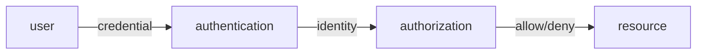

# Information Security 101 (2/10): Authentication and Authorization

> Information Security 101 series (2/10)

**Core question**: Is "who are you" the same question as "what are you allowed to do"?

> Authentication is about identity. Authorization is about permission. Mix them up and half of your security collapses.

This is the 2nd post in the Information Security 101 series.


*information security 101 chapter 2 flow overview*
> Authentication and authorization are not just about verifying identity. They are about proving "user X performed action Y at time Z from location L" with audit trails that survive server restarts.

## Questions to Keep in Mind

- What boundary should you inspect first when applying Authentication and Authorization?
- Which signal should the example or diagram make visible for Authentication and Authorization?
- What failure should be prevented first when Authentication and Authorization reaches a real system?

## What You Will Learn

- The definition and difference between authentication and authorization
- The security models behind passwords, MFA, and biometrics
- Sessions vs tokens (including JWT)
- The skeleton of OAuth 2.0 / OIDC flows
- A comparison of RBAC and ABAC and how to choose

## Why It Matters

Most breaches start with stolen credentials or abused permissions. Separating authentication from authorization, and choosing the right pattern for each, closes two of the biggest doors at once.

> Verifying "who" and deciding "what" are different responsibilities.


```mermaid
flowchart LR
    U["user"] -->|credential| AuthN["authentication"]
    AuthN -->|identity| AuthZ["authorization"]
    AuthZ -->|allow/deny| R["resource"]
```

First confirm the identity, then check the permissions of that identity. The two stages are separated in time and in code.

## Key Terms

- **Authentication**: Confirms the identity the user claims.
- **Authorization**: Decides whether that identity may access a resource.
- **MFA**: Two or more of knowledge, possession, inherence.
- **Session vs Token**: Server holds state vs token is self-evidence.
- **RBAC / ABAC**: Role-based vs attribute-based authorization models.

## Before/After

**Before — password only**

```text
once leaked, permanent intrusion
```

**After — password + MFA + token expiry + RBAC**

```text
multi-factor, time-limited, permission-split -> one weak link does not break everything
```

Defense is layered, not single.

## Hands-on: Auth in Short Code

### Step 1 — store passwords safely

```python
# 1_password.py
import bcrypt
def hash_pw(pw): return bcrypt.hashpw(pw.encode(), bcrypt.gensalt(12))
def check_pw(pw, h): return bcrypt.checkpw(pw.encode(), h)
```

bcrypt / argon2 / scrypt — intentionally slow hashes. SHA-256 is not a password hash.

### Step 2 — TOTP MFA

```python
# 2_totp.py
import pyotp
totp = pyotp.TOTP("JBSWY3DPEHPK3PXP")
print(totp.now())                   # 6-digit code
print(totp.verify("123456"))        # bool
```

A possession factor (the seed in your phone) means one broken factor is not enough.

### Step 3 — session vs JWT

```python
# 3_session_vs_jwt.py
# session: server stores sid -> user (easy to revoke, stateful)
# jwt:    token carries user/exp/sig (hard to revoke, stateless)
import jwt
t = jwt.encode({"sub": "u1", "exp": 9999999999}, "secret", algorithm="HS256")
print(jwt.decode(t, "secret", algorithms=["HS256"]))
```

Sessions when revoke is frequent. JWT for stateless calls between microservices.

### Step 4 — OAuth 2.0 authorization code (pseudocode)

```text
4_oauth.txt
client -> auth server: GET /authorize?response_type=code
user logs in & consents
auth server -> client: redirect with ?code=...
client -> auth server: POST /token (code + secret) -> access_token
client -> resource server: GET /api with Bearer access_token
```

The essence of OAuth is never giving the password to a third party.

### Step 5 — RBAC decision

```python
# 5_rbac.py
ROLE_PERMS = {"admin": {"read","write","delete"}, "user": {"read"}}
def can(role, action): return action in ROLE_PERMS.get(role, set())
print(can("user", "delete"))   # False
```

The simplest authorization — bind a permission set to a role. Enough for small systems.

## What to Notice in This Code

- Passwords are not stored with fast hashes — slow on purpose.
- MFA promises "even if one factor breaks."
- JWT security is key management; a leaked secret allows forging every token.
- OAuth access tokens stay short-lived, refresh tokens stay safe.

## Five Common Mistakes

1. **Hashing passwords with MD5/SHA.** A GPU can try billions per minute.
2. **Long-lived JWTs.** No revocation; nothing to do after theft.
3. **Authorization checks in the client.** Without server checks, defenseless.
4. **Bundling all permissions into one role.** Violates least privilege.
5. **Verbose login error messages.** Enables user enumeration.

## How This Shows Up in Production

### Authentication Methods Compared

| Method | Strength | Weakness | Recommended use |
| --- | --- | --- | --- |
| Password only | Simple, low cost | Vulnerable to phishing/reuse/breach | Dev environments, low-risk internal tools only |
| Password + MFA (TOTP/WebAuthn) | Raises takeover difficulty | Weak recovery flow can be bypassed | Default standard for user auth |
| SSO (OIDC/SAML) | Central control, unified audit | IdP outage affects all services | Multi-service orgs |

MFA has UX cost but directly lowers account takeover probability. SSO is an operational model, not a security feature — design account lifecycle, deactivation propagation, and audit trail together.

### Password Storage Baseline (Python)

```python
# auth_password_store.py
import bcrypt
from typing import Final

COST: Final[int] = 12

def hash_password(raw: str) -> str:
    return bcrypt.hashpw(raw.encode(), bcrypt.gensalt(rounds=COST)).decode()

def verify_password(raw: str, hashed: str) -> bool:
    return bcrypt.checkpw(raw.encode(), hashed.encode())

stored = hash_password("CorrectHorseBatteryStaple!")
assert verify_password("CorrectHorseBatteryStaple!", stored)
assert not verify_password("wrong", stored)
```

Operational notes:
- Review cost factor (rounds) periodically as hardware improves.
- Without login-failure rate limiting + backoff, online guessing remains viable.
- Hash upgrades (e.g., rounds 10→12) can happen progressively on successful login.

### SSO Does Not Equal Authorization

| Concern | SSO handles | Application handles |
| --- | --- | --- |
| Identity proof | User authn, MFA, lockout | Consuming token validation result |
| Permission decision | Basic claims (groups/roles) | Resource-level authz policy |
| Audit | Login events | Domain action events (e.g., refund approval) |

"We added SSO so permissions are safe" is never true. Identity and authorization must remain separated end-to-end.

### Permission Matrix (RBAC Baseline)

| Resource / Action | viewer | editor | admin |
| --- | --- | --- | --- |
| View reports | allow | allow | allow |
| Edit reports | deny | allow | allow |
| Change user permissions | deny | deny | allow |
| Approve refunds | deny | deny | allow |

This matrix must be enforced in API tests — if `viewer` calls the edit endpoint, CI must assert 403.

### Token Lifecycle Policy

| Token type | Recommended TTL | Storage | Revocation strategy |
| --- | --- | --- | --- |
| Access token | 5–15 min | Memory / secure storage | Expires automatically |
| Refresh token | 1–7 days | Server-tracked + secure storage | Rotation on reissue; immediate invalidation on theft |
| One-time auth code | 30–180 sec | Server temp store | Single-use, then discard |

The critical incident-response capability is "force logout" — tokens must be centrally revocable to contain a breach.

### Auth Architecture Patterns

| Pattern | Strength | Watch-out | Best fit |
| --- | --- | --- | --- |
| Session-based | Easy forced invalidation, strong server control | Needs session store for horizontal scale | Single product, back-office |
| JWT-based | Stateless, easy cross-service propagation | Key leak = wide blast radius, hard to revoke | Microservice APIs |
| OIDC + external IdP | SSO, centralized policy, unified audit | IdP outage propagates | Multi-product orgs |

Choose based on incident response: "How fast can we force-block an account?" beats architecture aesthetics.

### OAuth 2.1 Key Changes

- **Implicit Flow removed** — no more tokens exposed in redirect URIs.
- **PKCE mandatory** — all clients must use Proof Key for Code Exchange.
- **ROPC removed** — no more passwords typed directly into clients.
- **Refresh token rotation** — previous token invalidated on every reissue.

New services should start from OAuth 2.1 baseline. Existing services should audit for Implicit/ROPC usage and plan migration.

## How a Senior Engineer Thinks

- They never roll their own auth — use Auth0, Keycloak, Cognito.
- Authorization lives in a policy engine (OPA, Cedar), separate from application code.
- MFA is the default; exceptions require documented risk acceptance with expiry.
- Tokens expire quickly; refresh via rotation.
- Every permission change lands in audit logs with actor, target, before/after, reason, and approver.
- Auth failure detection is automated: 10 failures in 5 min → lock + alert + forced MFA re-enrollment.

## Checklist

- [ ] Can you state the difference between authentication and authorization in one line?
- [ ] Can you list the requirements of a password hash function?
- [ ] Can you explain the tradeoff between session and JWT?
- [ ] Can you draw the OAuth authorization code flow?
- [ ] Can you decide between RBAC and ABAC?

## Practice Problems

1. Diagram the auth flow of your service from a session/token point of view.
2. Write a one-page password policy (length, complexity, lockout).
3. Pick the most dangerous permission and design an RBAC matrix around it.

## Wrap-up and Next Steps

Authentication and authorization are the two largest doors in security. Next we cover the foundation of data protection — cryptography and hashing.

## Answering the Opening Questions

- **What is the precise difference between authentication and authorization?**
  - Clarify what log is produced and where failure is handled at each stage: password storage, login verification, session creation, and permission check.
- **What security model underlies passwords, MFA, and biometrics?**
  - Tracing where bcrypt hashing, TOTP generation, JWT tokens, and RBAC policies are processed—and where failures are logged—makes the security architecture clear.
- **What distinguishes sessions from tokens, especially JWT?**
  - Define login-failure thresholds, token renewal policies, and permission-change monitoring rules, then audit regularly for privilege leaks.
<!-- toc:begin -->
## In this series

- [Information Security 101 (1/10): What Is Information Security?](./01-what-is-information-security.md)
- **Authentication and Authorization (current)**
- Cryptography and Hashing (upcoming)
- TLS and Certificates (upcoming)
- Web Security Basics (upcoming)
- SQL Injection and XSS (upcoming)
- Secret Management (upcoming)
- Least Privilege (upcoming)
- Logging and Audit (upcoming)
- Incident Response (upcoming)

<!-- toc:end -->

## References

- [OWASP Authentication Cheat Sheet](https://cheatsheetseries.owasp.org/cheatsheets/Authentication_Cheat_Sheet.html)
- [OAuth 2.0 RFC 6749](https://datatracker.ietf.org/doc/html/rfc6749)
- [OpenID Connect Core](https://openid.net/specs/openid-connect-core-1_0.html)
- [NIST SP 800-63B Digital Identity](https://pages.nist.gov/800-63-3/sp800-63b.html)

Tags: Computer Science, Security, Authentication, Authorization, OAuth, RBAC
