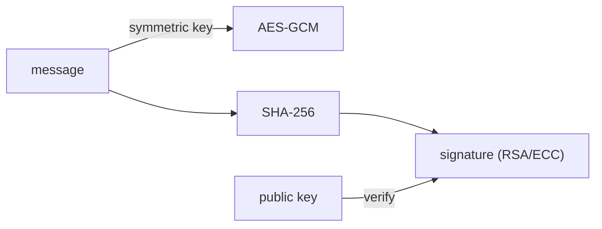

# Cryptography and Hashing

> Information Security 101 series (3/10)

<!-- a-grade-intro:begin -->

**Core question**: If "encryption equals safety" is not true, what should we use where?

> Encryption and hashing do different jobs. A strong algorithm used wrongly is the same as no algorithm — sometimes worse.

<!-- a-grade-intro:end -->

This is post 3 in the Information Security 101 series.

## What You Will Learn

- Symmetric encryption (AES-GCM) and asymmetric encryption (RSA/ECC)
- Hashes, HMAC, and digital signatures
- The difference between encryption and authentication (why we need AEAD)
- The meaning of randomness and nonce/IV
- A one-line guide to which algorithm fits which situation

## Why It Matters

Most crypto incidents come from wrong combinations, not weak algorithms. Knowing what guarantees what blocks the major paths to disaster.

> Algorithms are tools; safety lives in their composition and operation.

## Concept at a Glance



Encryption guarantees secrecy, hashes guarantee integrity, signatures guarantee origin. Three different tools.

## Key Terms

- **Symmetric encryption**: Same key for encrypt/decrypt (AES).
- **Asymmetric encryption**: Public/private key pair (RSA, ECC).
- **Hash**: Arbitrary input -> fixed output, one-way (SHA-256).
- **HMAC**: Key + hash to prevent tampering.
- **AEAD**: Encryption + authentication in one step (AES-GCM, ChaCha20-Poly1305).

## Before/After

**Before — AES-CBC only (no authentication)**

```text
attacker tampers ciphertext -> wrong plaintext on decrypt -> exploited
```

**After — AES-GCM (AEAD)**

```text
tampered ciphertext is rejected at decryption -> authenticated secrecy
```

Encryption alone is not enough — AEAD is the modern standard for this reason.

## Hands-on: See the Difference in Code

### Step 1 — AES-GCM (symmetric, AEAD)

```python
# 1_aes_gcm.py
from cryptography.hazmat.primitives.ciphers.aead import AESGCM
import os
key = AESGCM.generate_key(bit_length=256)
aes = AESGCM(key)
nonce = os.urandom(12)
ct = aes.encrypt(nonce, b"hello", None)
print(aes.decrypt(nonce, ct, None))   # b'hello'
```

Never reuse a nonce per key. Reuse breaks GCM's security.

### Step 2 — SHA-256 and HMAC

```python
# 2_hash_hmac.py
import hashlib, hmac
print(hashlib.sha256(b"hello").hexdigest())
print(hmac.new(b"secret", b"hello", hashlib.sha256).hexdigest())
```

SHA alone does not tell you who created the digest. HMAC ensures only the key holder could have produced it.

### Step 3 — RSA sign/verify

```python
# 3_rsa.py
from cryptography.hazmat.primitives.asymmetric import rsa, padding
from cryptography.hazmat.primitives import hashes
priv = rsa.generate_private_key(public_exponent=65537, key_size=2048)
pub = priv.public_key()
msg = b"hello"
sig = priv.sign(msg, padding.PSS(mgf=padding.MGF1(hashes.SHA256()), salt_length=32), hashes.SHA256())
pub.verify(sig, msg, padding.PSS(mgf=padding.MGF1(hashes.SHA256()), salt_length=32), hashes.SHA256())
```

A signature gives integrity + origin at the same time.

### Step 4 — safe randomness

```python
# 4_random.py
import secrets
print(secrets.token_bytes(16))
print(secrets.token_urlsafe(32))
```

Generate keys, nonces, and tokens with `secrets`, not `random.random()`.

### Step 5 — wrong patterns (counter-examples)

```python
# 5_bad.py
# import md5      # collisions found -> integrity not assured
# AES-ECB         # identical plaintext blocks -> identical ciphertext
# reused nonce    # GCM safety destroyed
```

Knowing common mistakes is half of the defense.

## What to Notice in This Code

- AES-GCM is highly fragile to nonce reuse.
- HMAC keys must never leak.
- Signatures answer both origin (who) and integrity (untampered).
- Safe randomness comes from OS entropy.

## Five Common Mistakes

1. **Using MD5/SHA1 for integrity.** Collision attacks exist.
2. **AES-ECB.** Plaintext patterns leak directly.
3. **Reused GCM nonce.** Key recovery becomes possible.
4. **Generating keys/tokens with `random.random()`.** Predictable.
5. **Inventing your own algorithm.** Crypto without public review is not safe.

## How This Shows Up in Production

TLS combines asymmetric (key exchange) + symmetric (data). Mobile secure storage (iOS Keychain, Android Keystore) and cloud KMS (AWS KMS, GCP KMS) handle key management. Database transparent encryption is mostly AES-GCM under the hood.

## How a Senior Engineer Thinks

- For new systems, only AES-GCM or ChaCha20-Poly1305 are considered.
- Keys live in a KMS, not in code.
- Key rotation strategy is decided before algorithm choice.
- Self-implemented crypto is forbidden — use libraries.
- The randomness source is verified explicitly.

## Checklist

- [ ] Can you say why AEAD is needed?
- [ ] Can you state the difference between HMAC and a hash in one line?
- [ ] Can you describe how nonces/IVs are managed per key?
- [ ] Do you know the safe source of randomness?
- [ ] Can you clearly distinguish signing from encryption?

## Practice Problems

1. Explain the difference between AES-CBC and AES-GCM in a paragraph.
2. Write pseudocode for verifying webhook signatures with HMAC.
3. Write a one-page key-rotation policy (cycle, storage, retirement).

## Wrap-up and Next Steps

Encryption and hashing do different jobs. Next we look at how these tools combine on the network — TLS and certificates.

<!-- toc:begin -->
- [What Is Information Security?](./01-what-is-information-security.md)
- [Authentication and Authorization](./02-authentication-and-authorization.md)
- **Cryptography and Hashing (current)**
- TLS and certificates (upcoming)
- web security basics (upcoming)
- SQL injection and XSS (upcoming)
- secret management (upcoming)
- least privilege (upcoming)
- logging and audit (upcoming)
- security incident response (upcoming)
<!-- toc:end -->

## References

- [Cryptography 101 — Khan Academy](https://www.khanacademy.org/computing/computer-science/cryptography)
- [NIST Cryptographic Standards](https://csrc.nist.gov/projects/cryptographic-standards-and-guidelines)
- [Cryptographic Right Answers — Latacora](https://www.latacora.com/blog/2018/04/03/cryptographic-right-answers/)
- [Python cryptography library](https://cryptography.io/)

Tags: Computer Science, Security, Cryptography, Hash, SymmetricEncryption, PublicKey
