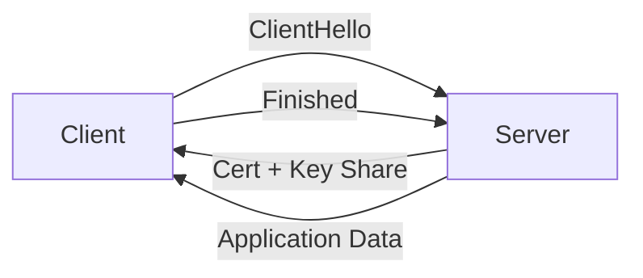

# TLS and Certificates

> Information Security 101 series (4/10)

<!-- a-grade-intro:begin -->

**Core question**: What does the browser padlock actually guarantee?

> TLS bundles three things — secrecy, integrity, and origin. Drop one and the padlock starts lying.

<!-- a-grade-intro:end -->

This is post 4 in the Information Security 101 series.

## What You Will Learn

- The stages of the TLS 1.3 handshake
- X.509 certificate structure and chain validation
- Root CAs, intermediate CAs, trust stores
- mTLS (mutual TLS) and where to use it
- Let's Encrypt and automated renewal

## Why It Matters

More than half of service-to-service traffic is protected by TLS. Operating without understanding it leads to expired certificates, weak ciphers, and skipped validation — all common incidents.

> The padlock icon is not magic; it is a precise procedure.

## Concept at a Glance



TLS 1.3 finishes key agreement and server authentication in one round trip.

## Key Terms

- **TLS**: Encryption protocol layered above TCP.
- **X.509**: Standard format for certificates.
- **CA**: Authority that issues certificates.
- **Chain**: Server cert -> intermediate CA -> root CA.
- **mTLS**: Client also presents a certificate.

## Before/After

**Before — Plain HTTP**

```text
A middlebox can read and modify packets -> credentials leaked
```

**After — TLS 1.3**

```text
Key agreement + server auth + AEAD -> secrecy, integrity, origin
```

The jump from plaintext to TLS is the baseline of modern security.

## Hands-on Step by Step

### Step 1 — Inspect a Certificate

```bash
# 1_view_cert.sh
openssl s_client -connect example.com:443 -servername example.com </dev/null 2>/dev/null \
  | openssl x509 -noout -subject -issuer -dates
```

Subject, issuer, and validity in one command.

### Step 2 — TLS Connection in Python

```python
# 2_tls_client.py
import ssl, socket
ctx = ssl.create_default_context()
with socket.create_connection(("example.com", 443)) as sock:
    with ctx.wrap_socket(sock, server_hostname="example.com") as s:
        print(s.version())          # TLSv1.3
        print(s.cipher())
```

`create_default_context()` ships safe defaults: verification on, modern ciphers.

### Step 3 — Self-signed Certificate (Dev Only)

```bash
# 3_selfsigned.sh
openssl req -x509 -newkey rsa:2048 -keyout key.pem -out cert.pem \
  -days 365 -nodes -subj "/CN=localhost"
```

Never use in production — there is no trust chain.

### Step 4 — Verify a Chain

```bash
# 4_verify_chain.sh
openssl verify -CAfile chain.pem server.pem
```

A broken chain causes browser warnings.

### Step 5 — mTLS Server (Python)

```python
# 5_mtls.py
import ssl
ctx = ssl.create_default_context(ssl.Purpose.CLIENT_AUTH)
ctx.verify_mode = ssl.CERT_REQUIRED
ctx.load_cert_chain("server.pem", "server.key")
ctx.load_verify_locations("client_ca.pem")
# server.serve_forever() ...
```

Service-to-service traffic verifies the client too.

## What to Notice in This Code

- Hostname verification is never disabled.
- Only TLS 1.2+ is enabled; 1.0 and 1.1 are off.
- Weak suites (RC4, 3DES) are turned off.
- Certificates have an automated renewal pipeline.

## Five Common Mistakes

1. **Disabling certificate verification.** `verify=False` is forbidden in production.
2. **No expiry monitoring.** Surprise outages from expired certs.
3. **Allowing weak suites.** Opens the door to downgrade attacks.
4. **Self-signed certs in production.** No trust chain.
5. **No key rotation in mTLS.** A leak becomes permanent exposure.

## How This Shows Up in Production

Let's Encrypt plus cert-manager renews 90-day certs automatically in Kubernetes. Service meshes (Istio, Linkerd) issue and rotate mTLS certs invisibly. AWS ACM and GCP Certificate Manager integrate certs into cloud load balancers.

## How a Senior Engineer Thinks

- Certificate expiry is an automation problem, not an alert problem.
- Trust store changes go through change management.
- Service-to-service traffic is mTLS by default.
- TLS termination location (LB? sidecar? app?) is an explicit decision.
- Weak algorithms are reviewed yearly.

## Checklist

- [ ] Can you describe the TLS 1.3 handshake stages?
- [ ] Can you describe certificate chain validation?
- [ ] Can you state the difference between mTLS and one-way TLS?
- [ ] Do certificates renew automatically?
- [ ] Can you identify weak cipher suites?

## Practice Problems

1. Name two major differences between TLS 1.2 and 1.3.
2. Describe two scenarios where mTLS is a good fit.
3. Sketch pseudocode that alerts 30 days before certificate expiry.

## Wrap-up and Next Steps

TLS bundles secrecy, integrity, and origin. Next we look at security on top of that protected web — web security basics.

<!-- toc:begin -->
- [What is Information Security?](./01-what-is-information-security.md)
- [Authentication and Authorization](./02-authentication-and-authorization.md)
- [Cryptography and Hashes](./03-cryptography-and-hash.md)
- **TLS and Certificates (current)**
- Web Security Basics (upcoming)
- SQL Injection and XSS (upcoming)
- Secret Management (upcoming)
- Least Privilege (upcoming)
- Logging and Audit (upcoming)
- Incident Response (upcoming)
<!-- toc:end -->

## References

- [RFC 8446 — TLS 1.3](https://datatracker.ietf.org/doc/html/rfc8446)
- [Mozilla SSL Configuration Generator](https://ssl-config.mozilla.org/)
- [Let's Encrypt — How It Works](https://letsencrypt.org/how-it-works/)
- [BetterTLS — Test Suite](https://bettertls.com/)

Tags: Computer Science, Security, TLS, Certificate, PKI, mTLS
