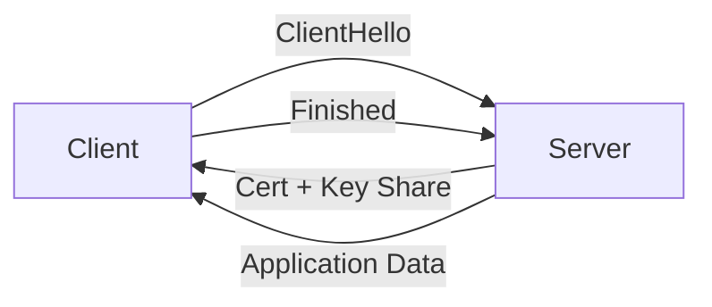

# Information Security 101 (4/10): TLS and Certificates

> Information Security 101 series (4/10)

**Core question**: What does the browser padlock actually guarantee?

> TLS bundles three things — secrecy, integrity, and origin. Drop one and the padlock starts lying.

This is the 4th post in the Information Security 101 series.


*information security 101 chapter 4 flow overview*
> TLS is not just encryption in transit. It is about proving "this server is really example.com" via a chain of trust, and preventing a middle node from breaking into the conversation.

## Questions to Keep in Mind

- What boundary should you inspect first when applying TLS and Certificates?
- Which signal should the example or diagram make visible for TLS and Certificates?
- What failure should be prevented first when TLS and Certificates reaches a real system?

## What You Will Learn

- The stages of the TLS 1.3 handshake
- X.509 certificate structure and chain validation
- Root CAs, intermediate CAs, trust stores
- mTLS (mutual TLS) and where to use it
- Let's Encrypt and automated renewal

## Why It Matters

More than half of service-to-service traffic is protected by TLS. Operating without understanding it leads to expired certificates, weak ciphers, and skipped validation — all common incidents.

> The padlock icon is not magic; it is a precise procedure.



TLS 1.3 finishes key agreement and server authentication in one round trip.

## Key Terms

- **TLS**: Encryption protocol layered above TCP.
- **X.509**: Standard format for certificates.
- **CA**: Authority that issues certificates.
- **Chain**: Server cert -> intermediate CA -> root CA.
- **mTLS**: Client also presents a certificate.

## Before/After

**Before — Plain HTTP**

```text
A middlebox can read and modify packets -> credentials leaked
```

**After — TLS 1.3**

```text
Key agreement + server auth + AEAD -> secrecy, integrity, origin
```

The jump from plaintext to TLS is the baseline of modern security.

## Hands-on Step by Step

### Step 1 — Inspect a Certificate

```bash
# 1_view_cert.sh
openssl s_client -connect example.com:443 -servername example.com </dev/null 2>/dev/null \
  | openssl x509 -noout -subject -issuer -dates
```

Subject, issuer, and validity in one command.

### Step 2 — TLS Connection in Python

```python
# 2_tls_client.py
import ssl, socket
ctx = ssl.create_default_context()
with socket.create_connection(("example.com", 443)) as sock:
    with ctx.wrap_socket(sock, server_hostname="example.com") as s:
        print(s.version())          # TLSv1.3
        print(s.cipher())
```

`create_default_context()` ships safe defaults: verification on, modern ciphers.

### Step 3 — Self-signed Certificate (Dev Only)

```bash
# 3_selfsigned.sh
openssl req -x509 -newkey rsa:2048 -keyout key.pem -out cert.pem \
  -days 365 -nodes -subj "/CN=localhost"
```

Never use in production — there is no trust chain.

### Step 4 — Verify a Chain

```bash
# 4_verify_chain.sh
openssl verify -CAfile chain.pem server.pem
```

A broken chain causes browser warnings.

### Step 5 — mTLS Server (Python)

```python
# 5_mtls.py
import ssl
ctx = ssl.create_default_context(ssl.Purpose.CLIENT_AUTH)
ctx.verify_mode = ssl.CERT_REQUIRED
ctx.load_cert_chain("server.pem", "server.key")
ctx.load_verify_locations("client_ca.pem")
# server.serve_forever() ...
```

Service-to-service traffic verifies the client too.

## What to Notice in This Code

- Hostname verification is never disabled.
- Only TLS 1.2+ is enabled; 1.0 and 1.1 are off.
- Weak suites (RC4, 3DES) are turned off.
- Certificates have an automated renewal pipeline.

## Five Common Mistakes

1. **Disabling certificate verification.** `verify=False` is forbidden in production.
2. **No expiry monitoring.** Surprise outages from expired certs.
3. **Allowing weak suites.** Opens the door to downgrade attacks.
4. **Self-signed certs in production.** No trust chain.
5. **No key rotation in mTLS.** A leak becomes permanent exposure.

## How This Shows Up in Production

Let's Encrypt plus cert-manager renews 90-day certs automatically in Kubernetes. Service meshes (Istio, Linkerd) issue and rotate mTLS certs invisibly. AWS ACM and GCP Certificate Manager integrate certs into cloud load balancers.

## How a Senior Engineer Thinks

- Certificate expiry is an automation problem, not an alert problem.
- Trust store changes go through change management.
- Service-to-service traffic is mTLS by default.
- TLS termination location (LB? sidecar? app?) is an explicit decision.
- Weak algorithms are reviewed yearly.

## Checklist

- [ ] Can you describe the TLS 1.3 handshake stages?
- [ ] Can you describe certificate chain validation?
- [ ] Can you state the difference between mTLS and one-way TLS?
- [ ] Do certificates renew automatically?
- [ ] Can you identify weak cipher suites?

## Practice Problems

1. Name two major differences between TLS 1.2 and 1.3.
2. Describe two scenarios where mTLS is a good fit.
3. Sketch pseudocode that alerts 30 days before certificate expiry.

## Wrap-up and Next Steps

TLS bundles secrecy, integrity, and origin. Next we look at security on top of that protected web — web security basics.

## Tracing the TLS 1.3 Handshake Step by Step

TLS 1.3 reduced round trips, but the internal decisions became more precise. From an operational perspective, separate these five stages:

1. **ClientHello** — The client presents supported versions, cipher suites, and its key share.
2. **ServerHello** — The server returns its chosen cipher suite and key share.
3. **Certificate** — The server provides its certificate chain.
4. **CertificateVerify + Finished** — The server proves private-key possession and finalizes handshake integrity.
5. **Client Finished** — The client confirms completion using the same transcript.

The most common failure points are stage 3 (certificate chain issues) and stages 1–2 (incompatible cipher suites or TLS versions). When a TLS-related outage occurs, check TLS negotiation logs before application code.

## Certificate Chain Verification Checklist

| Verification Item | Failure Symptom | How to Confirm |
| --- | --- | --- |
| SAN includes requested domain | Browser name-mismatch warning | `openssl x509 -text` |
| Not Before / Not After validity | Sudden connection failure | Expiry monitoring / alerts |
| Intermediate certificate present | Only certain clients fail | Verify fullchain deployment |
| Root trust store alignment | Errors in some environments only | Check OS/runtime trust store |
| Revocation status (OCSP/CRL) | Security warning or block | Review OCSP/CRL policy |

Understanding the chain lets you quickly narrow down "works on my machine but fails in production" problems.

## Probing TLS Certificate Details in Python

```python
# tls_probe.py
import socket
import ssl
from datetime import datetime


def probe(host: str, port: int = 443) -> None:
    ctx = ssl.create_default_context()
    with socket.create_connection((host, port), timeout=5) as raw:
        with ctx.wrap_socket(raw, server_hostname=host) as tls:
            cert = tls.getpeercert()
            print("version:", tls.version())
            print("cipher:", tls.cipher())
            print("subject:", cert.get("subject"))
            print("issuer:", cert.get("issuer"))
            print("notAfter:", cert.get("notAfter"))
            if cert.get("notAfter"):
                exp = datetime.strptime(cert["notAfter"], "%b %d %H:%M:%S %Y %Z")
                print("days_left:", (exp - datetime.utcnow()).days)

probe("example.com")
```

Run this probe periodically in health checks to catch impending expiry, version downgrade, or unexpected certificate changes early.

## mTLS vs One-way TLS — Operational Comparison

| Aspect | One-way TLS | mTLS |
| --- | --- | --- |
| Server identity verification | Required | Required |
| Client identity verification | Usually none | Required |
| Certificate issuance/rotation volume | Relatively low | Grows with service count |
| Blast radius on compromise | Server key leak | Both server and client keys require management |

Before adopting mTLS, prepare automated issuance and rotation (e.g., service mesh, cert-manager). Manual certificate operations fail at scale over time.

## Certificate Transparency and CT Logs

Certificate Transparency (CT) forces CAs to record every issued certificate in a public, append-only log. This is the primary mechanism for early detection of mis-issuance or rogue CAs.

| Component | Role | Operational Meaning |
| --- | --- | --- |
| CT log server | Records issued certificates in append-only log | Evidence trail for forged certificates |
| SCT (Signed Certificate Timestamp) | Proof that a certificate was logged | Browsers can reject certificates without SCT |
| Monitoring service | Watches for new issuance on your domains | Early warning for phishing / shadow domains |

CT monitoring is highly practical from a defensive standpoint. If someone issues a certificate for your domain, you get alerted — enabling early detection of domain hijacking or subdomain takeover.

```bash
# Query CT logs for certificate issuance history of a domain
# Simple check via crt.sh
curl -s "https://crt.sh/?q=%.example.com&output=json" | python3 -m json.tool | head -30
```

## TLS Cipher Suite Audit Script

Periodically verify that production services meet your TLS baseline. This script extracts the negotiated cipher and flags weak configurations:

```python
# tls_cipher_audit.py
import ssl
import socket
from typing import Final

WEAK_CIPHERS: Final[set] = {"RC4", "3DES", "DES", "NULL", "EXPORT"}


def audit_ciphers(host: str, port: int = 443) -> list[str]:
    ctx = ssl.create_default_context()
    warnings = []
    with socket.create_connection((host, port), timeout=5) as raw:
        with ctx.wrap_socket(raw, server_hostname=host) as tls:
            cipher_name, protocol, bits = tls.cipher()
            for weak in WEAK_CIPHERS:
                if weak in cipher_name.upper():
                    warnings.append(f"Weak cipher detected: {cipher_name}")
            if bits < 128:
                warnings.append(f"Insufficient key length: {bits}bit")
            if "TLSv1.0" in protocol or "TLSv1.1" in protocol:
                warnings.append(f"Legacy protocol: {protocol}")
    return warnings


issues = audit_ciphers("example.com")
if issues:
    for w in issues:
        print(f"[WARN] {w}")
else:
    print("[OK] TLS configuration meets baseline")
```

Add this to your CI/CD pipeline to catch TLS configuration regressions at deploy time.

## Firewall Rules and TLS Termination Points

Deciding where to terminate TLS also means designing network rules. Minimum recommended rules:

| Segment | Allowed Port | Source | Destination | Policy |
| --- | --- | --- | --- | --- |
| Internet → Edge LB | 443 | Any | LB | Allow |
| Internet → App node | 80, 443 | Any | App | Deny |
| LB → App service | 443 | LB subnet | App | Allow |
| App → DB | 5432 | App subnet | DB | Allow |

Even with TLS enabled, broad port exposure leaves a large attack surface. "Encrypted" and "access-controlled" are separate concerns — always review firewall rules alongside TLS configuration.

## Certificate Incident Runbook Summary

1. On expiry alert, confirm the list of affected domains.
2. Before issuing a new certificate, verify fullchain composition.
3. Validate handshake in staging, then roll out incrementally.
4. After deployment, re-verify with `openssl s_client` and application health checks.
5. In the post-incident review, tighten alert thresholds and close automation gaps.

## TLS Configuration Baseline

| Item | Recommended | Forbidden |
| --- | --- | --- |
| Protocol version | TLS 1.2, TLS 1.3 | TLS 1.0, TLS 1.1 |
| Key exchange | ECDHE | Static RSA key exchange |
| Symmetric cipher | AES-GCM, ChaCha20-Poly1305 | RC4, 3DES |
| Certificate key length | RSA 2048+ or ECDSA P-256+ | RSA 1024 or less |

Document the baseline so new services onboard with a known-good default. Per-service manual decisions lead to configuration drift.

## Answering the Opening Questions

- **What exactly does the browser padlock guarantee?**
  - Understanding each step—reading the server certificate on an HTTPS request, client verifying via the CA chain, public-key handshake establishing the session—lets you respond to certificate errors.
- **What stages does a TLS 1.3 handshake go through?**
  - Distinguishing self-signed from CA-signed certificates and wildcard from SAN certificate validation reduces deployment failures.
- **How is an X.509 certificate chain verified?**
  - Define certificate expiration monitoring, renewal-script verification, certificate-pinning policy, and logging rules for certificate errors.
<!-- toc:begin -->
## In this series

- [Information Security 101 (1/10): What Is Information Security?](./01-what-is-information-security.md)
- [Information Security 101 (2/10): Authentication and Authorization](./02-authentication-and-authorization.md)
- [Information Security 101 (3/10): Cryptography and Hashing](./03-cryptography-and-hash.md)
- **TLS and Certificates (current)**
- Web Security Basics (upcoming)
- SQL Injection and XSS (upcoming)
- Secret Management (upcoming)
- Least Privilege (upcoming)
- Logging and Audit (upcoming)
- Incident Response (upcoming)

<!-- toc:end -->

## References

- [RFC 8446 — TLS 1.3](https://datatracker.ietf.org/doc/html/rfc8446)
- [Mozilla SSL Configuration Generator](https://ssl-config.mozilla.org/)
- [Let's Encrypt — How It Works](https://letsencrypt.org/how-it-works/)
- [BetterTLS — Test Suite](https://bettertls.com/)

Tags: Computer Science, Security, TLS, Certificate, PKI, mTLS
