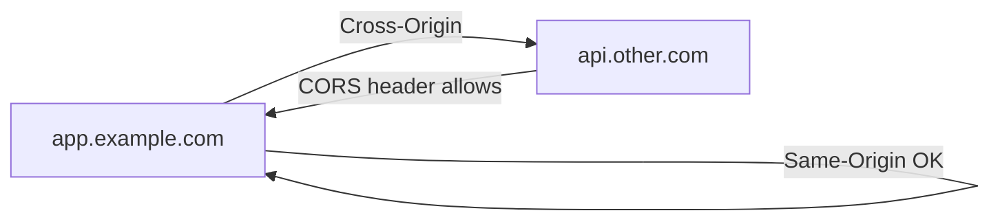

# Information Security 101 (5/10): Web Security Basics

> Information Security 101 series (5/10)

**Core question**: How does the browser protect us from other origins?

> Browser security revolves around the concept of origin. Once origin clicks, CORS, CSP, and cookies all line up.

This is the 5th post in the Information Security 101 series.


*information security 101 chapter 5 flow overview*
> Web security is not about HTTPS alone. It is about ensuring that at every layer—HTTP headers, authentication checks, SQL composition, browser rendering—untrusted input cannot become a command.

## Questions to Keep in Mind

- What boundary should you inspect first when applying Web Security Basics?
- Which signal should the example or diagram make visible for Web Security Basics?
- What failure should be prevented first when Web Security Basics reaches a real system?

## What You Will Learn

- The exact definition of same-origin policy
- CORS — what is allowed and how
- CSP (Content Security Policy)
- Cookie flags (Secure, HttpOnly, SameSite)
- The essence of CSRF and how to defend

## Why It Matters

About 80% of web security is the same handful of concepts repeated. Understanding origin and cookies blocks the bulk of CSRF and XSS exposure.

> Origin is the security boundary.



Same origin: free. Different origin: explicit allowance.

## Key Terms

- **Origin**: scheme + host + port.
- **CORS**: server mechanism that allows cross-origin requests.
- **CSP**: header that restricts where resources can load from.
- **CSRF**: forged request that abuses an authenticated session.
- **SameSite cookie**: limits cookie attachment on cross-site requests.

## Before/After

**Before — All cookies sent on cross-site requests**

```text
Malicious site triggers a request with the victim's session cookie -> CSRF
```

**After — SameSite=Lax default**

```text
Cross-site POST omits the cookie -> CSRF blocked
```

Stronger browser defaults sharpen the operator's responsibility.

## Hands-on Step by Step

### Step 1 — CORS in Flask

```python
# 1_cors.py
from flask import Flask, jsonify
from flask_cors import CORS
app = Flask(__name__)
CORS(app, resources={r"/api/*": {"origins": "https://app.example.com"}})

@app.get("/api/me")
def me(): return jsonify(user="alice")
```

Wildcard (`*`) is forbidden with credentialed requests.

### Step 2 — Add a CSP Header

```python
# 2_csp.py
@app.after_request
def csp(resp):
    resp.headers["Content-Security-Policy"] = (
        "default-src 'self'; script-src 'self'; img-src 'self' data:"
    )
    return resp
```

Avoiding `unsafe-inline` dramatically reduces XSS impact.

### Step 3 — Safe Cookie Setup

```python
# 3_cookie.py
@app.get("/login")
def login():
    resp = app.make_response("ok")
    resp.set_cookie("sid", "xyz", secure=True, httponly=True, samesite="Lax")
    return resp
```

The three flags (Secure, HttpOnly, SameSite) travel together.

### Step 4 — CSRF Token Check (Pseudo)

```python
# 4_csrf.py
def verify_csrf(req):
    if req.method in ("POST", "PUT", "DELETE"):
        if req.headers.get("X-CSRF") != session["csrf"]:
            raise PermissionError
```

Pick double-submit or the synchronizer pattern, but pick one.

### Step 5 — XSS Defense: Auto Escape

```python
# 5_xss.py
from markupsafe import escape
def render(name):
    return f"<h1>Hello {escape(name)}</h1>"
```

Trust the template engine's auto-escape, but escape per context (HTML, JS, URL) explicitly.

## What to Notice in This Code

- CORS is allowance, not protection — pair it with auth.
- Roll out CSP gradually (Report-Only -> Enforce).
- Cookie flags travel as a set.
- CSRF defense is consistent: token or SameSite, not both half-done.

## Five Common Mistakes

1. **CORS `*` with credentials.** Forbidden by spec.
2. **`unsafe-inline` in CSP.** Defeats the protection.
3. **Missing Secure or HttpOnly on cookies.** XSS becomes session theft.
4. **State-changing GETs.** Vulnerable to caching, links, and CSRF.
5. **Trusting Referer without Origin.** Spoofable in many setups.

## How This Shows Up in Production

CSP is rolled out gradually with nonces or hashes. Authenticated APIs combine a CORS allowlist, SameSite=Strict cookies, and CSRF tokens. Adding security headers at the edge (e.g. CloudFront Functions) is a common pattern.

## How a Senior Engineer Thinks

- Security headers are managed in one place (middleware or edge).
- CSP starts in Report-Only, then becomes Enforce after data review.
- Cookie policy changes ship with rollout plans and monitoring.
- CSRF and XSS defenses live in a single source of truth.
- Origin policy is documented with a change log.

## Checklist

- [ ] Can you state the definition of same-origin?
- [ ] Who owns the CORS allowlist?
- [ ] Is CSP applied?
- [ ] Do all session cookies carry the three flags?
- [ ] Is the CSRF defense documented?

## Practice Problems

1. Are `https://app.example.com` and `https://app.example.com:8443` the same origin?
2. Name an attack that `default-src 'self'` alone does not block.
3. List two UX impacts of using SameSite=Strict.

## Wrap-up and Next Steps

The big arc of web security is origin and cookies. Next we look at the two famous code-level vulnerabilities — SQL Injection and XSS.

## Answering the Opening Questions

- **What exactly does the same-origin policy mean?**
  - Clarify where validation happens and where logs are written at each step: form submission → route dispatch → query construction → response generation → cookie setting.
- **What does CORS allow and what does it block?**
  - Understanding GET vs. POST cookie transmission, why CORS preflight requests are needed, and how CSP headers defend against XSS reduces post-deploy confusion.
- **Why is CSP important for reducing XSS damage?**
  - Define security header settings (HSTS/X-Frame-Options/X-Content-Type-Options), cookie attribute audits, and regression tests for input-validation rule changes.
<!-- toc:begin -->
## In this series

- [Information Security 101 (1/10): What Is Information Security?](./01-what-is-information-security.md)
- [Information Security 101 (2/10): Authentication and Authorization](./02-authentication-and-authorization.md)
- [Information Security 101 (3/10): Cryptography and Hashing](./03-cryptography-and-hash.md)
- [Information Security 101 (4/10): TLS and Certificates](./04-tls-and-certificates.md)
- **Web Security Basics (current)**
- SQL Injection and XSS (upcoming)
- Secret Management (upcoming)
- Least Privilege (upcoming)
- Logging and Audit (upcoming)
- Incident Response (upcoming)

<!-- toc:end -->

## References

- [OWASP — Web Security Testing Guide](https://owasp.org/www-project-web-security-testing-guide/)
- [MDN — Same-origin policy](https://developer.mozilla.org/en-US/docs/Web/Security/Same-origin_policy)
- [MDN — Content Security Policy](https://developer.mozilla.org/en-US/docs/Web/HTTP/CSP)
- [web.dev — SameSite cookies explained](https://web.dev/articles/samesite-cookies-explained)

Tags: Computer Science, Security, WebSecurity, CORS, CSP, SameOrigin
