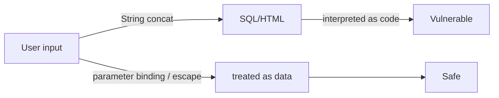

# Information Security 101 (6/10): SQL Injection and XSS

> Information Security 101 series (6/10)

**Core question**: Where does input become code, and where does it stay data?

> Both bugs share one root: never let input be interpreted as code.

This is the 6th post in the Information Security 101 series.


*information security 101 chapter 6 flow overview*
> SQL Injection and XSS both turn untrusted input into executable code in its target context. Defense is not input filtering; it is prepared statements for SQL and context-aware escaping for HTML.

## Questions to Keep in Mind

- What boundary should you inspect first when applying SQL Injection and XSS?
- Which signal should the example or diagram make visible for SQL Injection and XSS?
- What failure should be prevented first when SQL Injection and XSS reaches a real system?

## What You Will Learn

- The exact mechanism of SQL injection
- Parameter binding and the limits of ORM safety
- The three types of XSS (Reflected, Stored, DOM-based)
- Output encoding and context awareness
- The priority of input validation vs output encoding

## Why It Matters

Both bugs have stayed in the OWASP Top 10 for years. Once you understand the principle, you can defend the same way in any new framework or language.

> Treat input as data; encode output for its context.



Same input, different handling — opposite outcomes.

## Key Terms

- **SQL Injection**: input parsed as SQL syntax.
- **Parameterized query**: input bound separately as data.
- **Reflected XSS**: input echoed straight back in the response.
- **Stored XSS**: input stored, then served to other users.
- **Output encoding**: escaping fitted to the output context (HTML, JS, URL).

## Before/After

**Before — String concatenation**

```python
cur.execute(f"SELECT * FROM users WHERE name='{name}'")
# name = "' OR 1=1 --"  -> returns every row
```

**After — Parameter binding**

```python
cur.execute("SELECT * FROM users WHERE name=%s", (name,))
```

A one-line difference splits incident from safety.

## Hands-on Step by Step

### Step 1 — Safe SQL

```python
# 1_sql_safe.py
import sqlite3
con = sqlite3.connect(":memory:")
con.execute("CREATE TABLE u (id int, name text)")
con.execute("INSERT INTO u VALUES (?, ?)", (1, "alice"))
print(con.execute("SELECT * FROM u WHERE name=?", ("alice",)).fetchall())
```

Never inline input into the `?` or `%s` slot.

### Step 2 — ORM Is Not a Cure

```python
# 2_orm_dynamic.py
# SQLAlchemy raw escape hatches stay risky
# session.execute(text(f"SELECT * FROM u WHERE name='{name}'"))  # do not do this
```

The `raw` / `text` escape hatches need parameter binding too.

### Step 3 — Reflected XSS Defense

```python
# 3_xss_reflect.py
from markupsafe import escape
def search(q):
    return f"<p>Query: {escape(q)}</p>"
```

Always escape before rendering on the server.

### Step 4 — Stored XSS Defense

```python
# 4_xss_stored.py
def render_comment(html):
    # store the original; encode at output time
    return f"<div>{escape(html)}</div>"
```

Store raw, encode on output — one consistent rule.

### Step 5 — DOM-based XSS

```javascript
// 5_dom_xss.js
// document.body.innerHTML = location.hash;   // dangerous
const text = decodeURIComponent(location.hash.slice(1));
const node = document.createTextNode(text);   // safe
document.body.appendChild(node);
```

Use text-node APIs instead of `innerHTML`.

### Step 6 — Safe vs Unsafe Query Comparison

```python
# 6_safe_vs_unsafe.py
import sqlite3

# Vulnerable — never do this
def unsafe_query(name):
    con = sqlite3.connect(":memory:")
    con.execute("CREATE TABLE users (id int, name text)")
    con.execute("INSERT INTO users VALUES (1, 'alice')")
    cursor = con.execute(f"SELECT * FROM users WHERE name='{name}'")
    return cursor.fetchall()

# Safe — always do this
def safe_query(name):
    con = sqlite3.connect(":memory:")
    con.execute("CREATE TABLE users (id int, name text)")
    con.execute("INSERT INTO users VALUES (1, 'alice')")
    cursor = con.execute("SELECT * FROM users WHERE name=?", (name,))
    return cursor.fetchall()

# Test
attack_payload = "' OR '1'='1"
print("Unsafe:", unsafe_query(attack_payload))  # returns all rows
print("Safe:", safe_query(attack_payload))      # empty result
```

The vulnerable query interprets the attack payload as SQL syntax. The safe query treats the same value as plain string data. This one-line difference separates full database exfiltration from safe operation.

## Input Validation Strategies

Input validation is a secondary defense layer. The primary defense is parameter binding and output encoding. Still, input validation reduces the attack surface.

### Allowlist Approach

```python
# allow_list.py
ALLOWED_SORT_COLUMNS = {"name", "created_at", "id"}

def get_users(sort_by: str):
    if sort_by not in ALLOWED_SORT_COLUMNS:
        raise ValueError(f"Invalid sort column: {sort_by}")
    # Direct insertion is safe here (allowlist verified)
    return f"SELECT * FROM users ORDER BY {sort_by}"
```

Allowlists work best when the set of valid values is small and predictable — column names, sort directions, table names.

### Denylist Limitations

```python
# denylist.py — not recommended
FORBIDDEN_PATTERNS = ["--", ";", "'", '"', "OR", "DROP"]

def unsafe_filter(user_input: str):
    for pattern in FORBIDDEN_PATTERNS:
        if pattern.lower() in user_input.lower():
            raise ValueError("Forbidden pattern detected")
    return user_input

# Bypass methods are endless:
# 1. Case variations: oR, Or
# 2. URL encoding: %4F%52 (OR)
# 3. Comments: /**/ to insert spaces
# 4. Unicode: fullwidth characters
```

Denylists have infinite bypass methods. Prefer allowlists combined with parameter binding.

### Type-Based Validation

```python
# type_validation.py
from pydantic import BaseModel, validator

class UserQuery(BaseModel):
    user_id: int
    sort: str

    @validator("sort")
    def validate_sort(cls, v):
        allowed = {"name", "created_at"}
        if v not in allowed:
            raise ValueError(f"Sort must be one of {allowed}")
        return v
```

Framework-level type and value validation prevents bad input from reaching handlers. This approach unifies API contract validation and security validation.

## OWASP Top 10 and SQLi/XSS

| OWASP Top 10 Item | Connection to SQLi/XSS | Prevention Core |
| --- | --- | --- |
| A03 Injection | SQL/NoSQL/OS command injection | Parameterization, input boundary validation |
| A03 Injection (includes XSS) | Script execution in browser | Context encoding, CSP |
| A01 Broken Access Control | Privilege escalation after injection | Server-side authorization re-verification |
| A09 Security Logging Failures | Detection delay | Attack signal logging and alerting |

Input vulnerabilities are not standalone issues — they amplify through permissions, logging, and deployment pipelines.

## Defense Code Patterns

```python
# vuln_defense_patterns.py
import sqlite3
from markupsafe import escape

con = sqlite3.connect(":memory:")
con.execute("CREATE TABLE users (id INTEGER, name TEXT)")


def safe_lookup(name: str):
    # SQL injection defense: parameter binding
    return con.execute("SELECT id, name FROM users WHERE name = ?", (name,)).fetchall()


def safe_html(name: str) -> str:
    # XSS defense: escape at output time
    return f"<p>{escape(name)}</p>"


def validate_limit(limit: int) -> int:
    # Input validation: enforce allowed range
    if not 1 <= limit <= 100:
        raise ValueError("limit out of range")
    return limit
```

The critical insight: defense layers are different.

- SQL defense: query construction stage
- XSS defense: rendering stage
- Input validation: business rules stage

No single layer solves everything.

## Security Regression Test Cases

| Test Target | Malicious Input | Expected Result |
| --- | --- | --- |
| User lookup API | `' OR 1=1 --` | 400 or empty result |
| Comment rendering | `<script>alert(1)</script>` | Script not executed, escaped output |
| Sort parameter | `name; DROP TABLE users` | Non-allowlist value rejected |

Combining SAST (static analysis) and DAST (dynamic testing) reduces leaks on both code and runtime sides.

## Detection Signals to Always Log

- Repeated SQL syntax errors in a short window
- Abnormally long query parameters from a specific user/IP
- Sudden spike in inputs containing HTML/JS special characters
- Correlation between WAF block events and application error logs

Without detection signals you cannot know whether defenses are working. Design defense and detection together.

## WAF vs Application Defense

WAF is a supplementary filter that reduces attack noise. The fundamental defense must live in application code.

```text
Request -> WAF first filter -> App input validation -> Bound query -> Output encoding -> Response
```

Relying solely on WAF without code-level defense leads to false positives on legitimate requests and repeated bypass attacks. Document defense responsibilities per layer.

## Database Account Separation

SQL injection defense is not just about query construction — it pairs with the DB permission model. If the app account has excessive privileges, a successful bypass causes maximum damage.

| Account | Allowed Permissions | Forbidden Permissions |
| --- | --- | --- |
| Read-only API account | SELECT | INSERT/UPDATE/DELETE/DDL |
| General write API account | SELECT/INSERT/UPDATE | DROP/ALTER/GRANT |
| Migration account | DDL (time-limited) | Permanent use forbidden |

## XSS Incident Response Steps

- Block the vulnerable path immediately and purge cached malicious content.
- Decide on session cookie rotation and forced logout.
- Collect CSP violation reports to analyze recurrence paths.
- Classify entry vectors (input forms, admin panels, external sync).

Injection vulnerabilities do not end with a single patch. Strengthening all four boundaries — input, storage, rendering, and permissions — together is what brings the recurrence rate down.

## Security Test Automation

```python
# test_injection_regression.py
import requests

BASE = "https://staging.example.com"

def test_sql_injection_payload_rejected():
    payload = "' OR 1=1 --"
    r = requests.get(f"{BASE}/api/users", params={"name": payload}, timeout=5)
    assert r.status_code in (200, 400)
    assert "alice" not in r.text

def test_xss_payload_escaped():
    payload = "<script>alert(1)</script>"
    r = requests.post(f"{BASE}/comments", json={"body": payload}, timeout=5)
    assert r.status_code == 201
    page = requests.get(f"{BASE}/comments/latest", timeout=5)
    assert "<script>" not in page.text
```

Adding security tests to CI prevents vulnerabilities from regressing back in. Once a vulnerability is fixed, lock it with a test.

## Injection Response Priority

| Priority | Action | Completion Criteria |
| --- | --- | --- |
| 1 | Block vulnerable path temporarily | Reproduction payload blocked |
| 2 | Code fix (binding/encoding) | Security test passes |
| 3 | Log-based impact analysis | Affected user/data scope confirmed |
| 4 | Add prevention rules | Static analysis/test gate added |

Explicit priorities reduce argument time during incidents and speed up recovery.

## What to Notice in This Code

- All SQL goes through parameter binding.
- Output encoding depends on context (HTML body, attribute, URL, JS).
- Avoid `innerHTML` in DOM manipulation.
- Input validation is a secondary defense, not the main one.

## Five Common Mistakes

1. **f-string SQL.** The most common injection path.
2. **Storing HTML input then rendering without sanitization.** Stored XSS.
3. **HTML escape applied to JS context.** Wrong encoder.
4. **`innerHTML` for user input.** DOM XSS.
5. **Blacklist-based filters.** Easy to bypass — use allowlists.

## How This Shows Up in Production

Big systems allow only typed queries through the ORM and require code review for raw SQL. Frontends trust framework text interpolation but gate `dangerouslySetInnerHTML` with explicit approvals. A WAF is an extra layer, not the main defense.

## How a Senior Engineer Thinks

- Two-line rule: input as data, output encoded for context.
- Lint rules block raw SQL.
- One well-known HTML sanitizer, used everywhere.
- DOM XSS is caught with code review and static analysis.
- New input paths trigger a threat-model update.

## Checklist

- [ ] Does every SQL statement use parameter binding?
- [ ] Is output encoding applied per context?
- [ ] Have you audited `innerHTML` usage?
- [ ] Is the HTML sanitizer standardized?
- [ ] Is there code-level defense beyond the WAF?

## Practice Problems

1. Write the one-line fix that blocks `name=' OR '1'='1`.
2. List two operational differences between Reflected and Stored XSS.
3. Describe one React pattern that prevents DOM XSS.

## Wrap-up and Next Steps

Both bugs stem from inconsistent input handling. Next we step away from code into configuration — secret management.

## Answering the Opening Questions

- **What mechanism exactly causes SQL injection?**
  - Distinguishing prepared-statement construction in `SELECT * FROM users WHERE id = ?` from automatic escaping in HTML templates makes implementation clear.
- **Does using an ORM truly make you safe?**
  - Tracing how a payload is parsed and at which stage it's either rejected or executed gives you clear response criteria.
- **Where do Reflected, Stored, and DOM-based XSS diverge?**
  - Define suspicious-grammar inspection in query logs, XSS simulation tests, and escaping-rule change monitoring when updating external libraries.
<!-- toc:begin -->
## In this series

- [Information Security 101 (1/10): What Is Information Security?](./01-what-is-information-security.md)
- [Information Security 101 (2/10): Authentication and Authorization](./02-authentication-and-authorization.md)
- [Information Security 101 (3/10): Cryptography and Hashing](./03-cryptography-and-hash.md)
- [Information Security 101 (4/10): TLS and Certificates](./04-tls-and-certificates.md)
- [Information Security 101 (5/10): Web Security Basics](./05-web-security-basics.md)
- **SQL Injection and XSS (current)**
- Secret Management (upcoming)
- Least Privilege (upcoming)
- Logging and Audit (upcoming)
- Incident Response (upcoming)

<!-- toc:end -->

## References

- [OWASP — SQL Injection](https://owasp.org/www-community/attacks/SQL_Injection)
- [OWASP — XSS](https://owasp.org/www-community/attacks/xss/)
- [OWASP Cheat Sheet — XSS Prevention](https://cheatsheetseries.owasp.org/cheatsheets/Cross_Site_Scripting_Prevention_Cheat_Sheet.html)
- [PortSwigger Web Security Academy](https://portswigger.net/web-security)

Tags: Computer Science, Security, SQLInjection, XSS, InputValidation, OutputEncoding
