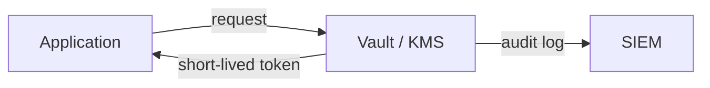

# Information Security 101 (7/10): Secret Management

> Information Security 101 series (7/10)

**Core question**: What do we lose the moment a secret enters source code?

> Secret management is not about where you put them; it is about how you rotate them.

This is the 7th post in the Information Security 101 series.


*information security 101 chapter 7 flow overview*
> Secret management is not just storing encrypted keys. It is tracking who accessed what secret when, detecting abnormal access patterns, and proving that no key was exposed during its lifetime.

## Questions to Keep in Mind

- What boundary should you inspect first when applying Secret Management?
- Which signal should the example or diagram make visible for Secret Management?
- What failure should be prevented first when Secret Management reaches a real system?

## What You Will Learn

- Secret types (static, dynamic, user, system)
- The limits of environment variables
- The role of vault and KMS
- Core rotation policy ideas
- Safe patterns for handling secrets in code

## Why It Matters

More than half of large incidents start with leaked secrets. A leaked secret without rotation is a permanent risk.

> Secrets are liabilities, not assets — keep their lifetime short.



Code holds the right to fetch a secret, not the secret itself.

## Key Terms

- **Static secret**: manually configured key or password.
- **Dynamic secret**: short-lived credential generated per request.
- **Vault**: secret manager such as HashiCorp Vault.
- **KMS**: key management service (AWS KMS, GCP KMS).
- **Rotation**: regularly replacing a secret.

## Before/After

**Before — Plaintext `.env`**

```text
Accidentally committed -> permanent leak -> rotate every environment
```

**After — Short-lived token from a vault**

```text
App requests a token at boot -> auto-rotates on expiry
```

Lifetime, not location, drives security.

## Hands-on Step by Step

### Step 1 — Environment Variables (Bare Minimum)

```python
# 1_env.py
import os
db_url = os.environ["DATABASE_URL"]
# Never hard-code: db_url = "postgres://user:pw@..."
```

Never commit `.env` files to git.

### Step 2 — Fetch a Secret from Vault

```python
# 2_vault.py
import hvac
client = hvac.Client(url="http://vault:8200", token=os.environ["VAULT_TOKEN"])
data = client.secrets.kv.read_secret_version(path="myapp/db")
db_pw = data["data"]["data"]["password"]
```

The vault token itself must also be short-lived (AppRole, Kubernetes SA, etc).

### Step 3 — Encrypt Data Keys with KMS

```python
# 3_kms.py
import boto3
kms = boto3.client("kms")
resp = kms.generate_data_key(KeyId="alias/app", KeySpec="AES_256")
plaintext = resp["Plaintext"]      # in-memory only
ciphertext = resp["CiphertextBlob"] # store in DB
```

The plaintext data key only lives in memory briefly.

### Step 4 — Secret Scanner (Prevention)

```bash
# 4_scan.sh
# pre-commit hook: trufflehog scans before commit
trufflehog filesystem . --only-verified
```

Always assume git history is hostile, and block leaks early.

### Step 5 — Rotation Pseudocode

```python
# 5_rotation.py
def rotate_db_password():
    new_pw = generate_strong_password()
    db.execute(f"ALTER USER app WITH PASSWORD %s", (new_pw,))
    vault.put("myapp/db", {"password": new_pw})
    notify_apps_to_reload()
```

Rotation must be automated.

## What to Notice in This Code

- Secrets carry the shortest possible lifetime.
- Plaintext secrets only live in memory.
- Every secret access leaves an audit trail.
- Rotation runs as automation, not as a runbook step.

## Five Common Mistakes

1. **Committing `.env`.** The single most common incident.
2. **One master key for everything.** Cannot rotate.
3. **Logging secrets in errors or app logs.** Wide exposure via SIEM.
4. **No rotation policy.** A leak becomes an indefinite exposure.
5. **Sharing secrets via Slack or email.** A searchable secret is no secret.

## How This Shows Up in Production

Kubernetes uses `Secret` plus External Secrets Operator (ESO) to sync from vault. CI/CD federates with OIDC to mint short-lived credentials and removes static keys. AWS issues per-instance short-lived credentials through IAM Roles and STS.

## How a Senior Engineer Thinks

- Every secret has an expiry.
- Secret management is co-designed with identity (IAM).
- `.env` is for local development only.
- Time-to-rotate after an incident is an SLO (e.g., under one hour).
- Secret scanners run at both pre-commit and CI.

## Checklist

- [ ] Does every secret have a defined rotation period?
- [ ] Is `.env` in `.gitignore`?
- [ ] Are secret accesses captured as audit logs?
- [ ] Is the rotation runbook documented?
- [ ] Are static credentials removed from CI/CD?

## Practice Problems

1. Explain the difference between environment variables and a vault in one paragraph.
2. How would you measure a rotation SLO?
3. Outline the safe procedure for handling a secret accidentally committed to git.

## Wrap-up and Next Steps

Secret management is about lifetime, not location. Next we look at what the holder of a secret should be allowed to do — least privilege.

## Answering the Opening Questions

- **How do static secrets and dynamic secrets differ?**
  - Clarify where API keys, DB passwords, and OAuth tokens are stored, who can read them, and what logs are produced on access.
- **How far does an environment variable's validity extend?**
  - Understanding Vault secret renewal—existing secret's TTL, new secret's start time, rolling method—reduces deployment failures.
- **What roles do Vault and KMS each play?**
  - Define secret-access log analysis, secret-rotation script audits, and leaked-secret scan automation (git-secrets/truffleHog).
<!-- toc:begin -->
## In this series

- [Information Security 101 (1/10): What Is Information Security?](./01-what-is-information-security.md)
- [Information Security 101 (2/10): Authentication and Authorization](./02-authentication-and-authorization.md)
- [Information Security 101 (3/10): Cryptography and Hashing](./03-cryptography-and-hash.md)
- [Information Security 101 (4/10): TLS and Certificates](./04-tls-and-certificates.md)
- [Information Security 101 (5/10): Web Security Basics](./05-web-security-basics.md)
- [Information Security 101 (6/10): SQL Injection and XSS](./06-sql-injection-and-xss.md)
- **Secret Management (current)**
- Least Privilege (upcoming)
- Logging and Audit (upcoming)
- Incident Response (upcoming)

<!-- toc:end -->

## References

- [HashiCorp Vault — Documentation](https://developer.hashicorp.com/vault/docs)
- [AWS KMS — Best Practices](https://docs.aws.amazon.com/kms/latest/developerguide/best-practices.html)
- [OWASP — Secrets Management Cheat Sheet](https://cheatsheetseries.owasp.org/cheatsheets/Secrets_Management_Cheat_Sheet.html)
- [trufflehog — Find Leaked Credentials](https://github.com/trufflesecurity/trufflehog)

Tags: Computer Science, Security, Secrets, Vault, KMS, Rotation
