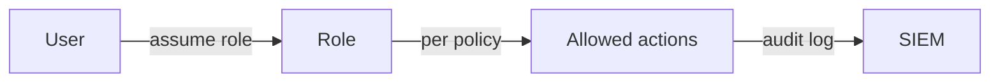

# Information Security 101 (8/10): Least Privilege

> Information Security 101 series (8/10)

**Core question**: Why is "convenient extra access" so dangerous?

> Least privilege defines your blast radius when an incident happens.

This is post 8 in the Information Security 101 series.

## Questions to Keep in Mind

- What boundary should you inspect first when applying Least Privilege?
- Which signal should the example or diagram make visible for Least Privilege?
- What failure should be prevented first when Least Privilege reaches a real system?

## Big Picture


*information security 101 chapter 8 flow overview*

This picture places Least Privilege inside an operating flow. The point is not to memorize the concept in isolation, but to see how input, processing, verification, and operational signals connect across boundaries.

> The core of Least Privilege is not the feature name; it is deciding what to verify at each boundary and which signal to keep.

## What You Will Learn

- The exact meaning of the principle of least privilege (PoLP)
- Writing deny and allow IAM policies
- RBAC vs ABAC vs ReBAC
- What zero trust actually means in practice
- Separating human and system privileges

## Why It Matters

You cannot always prevent compromise, but you can always shrink the blast radius. Least privilege determines the cost of any incident.

> Privileges are not granted; they are loaned.

## Concept at a Glance



Every privilege is explicit and traceable.

## Key Terms

- **PoLP**: just enough privilege to do the job.
- **RBAC**: role-based access control.
- **ABAC**: attribute-based (tags, time, location).
- **Zero Trust**: verify every time, regardless of network location.
- **Privilege escalation**: must be blocked everywhere.

## Before/After

**Before — Every service runs as admin**

```text
One service compromised -> full cluster control lost
```

**After — Per-service least privilege**

```text
One service compromised -> only that service's resources affected
```

Blast radius decides the severity of the incident.

## Hands-on Step by Step

### Step 1 — AWS IAM (Least Privilege)

```json
{
  "Version": "2012-10-17",
  "Statement": [{
    "Effect": "Allow",
    "Action": ["s3:GetObject"],
    "Resource": "arn:aws:s3:::my-bucket/reports/*"
  }]
}
```

`Action: "*"` and `Resource: "*"` are red flags.

### Step 2 — Kubernetes RBAC

```yaml
# 2_role.yaml
kind: Role
apiVersion: rbac.authorization.k8s.io/v1
metadata: { namespace: app, name: pod-reader }
rules:
- apiGroups: [""]
  resources: ["pods"]
  verbs: ["get", "list"]
```

Scoped to one namespace, one resource, read-only.

### Step 3 — Service Account Separation

```yaml
# 3_sa.yaml
kind: ServiceAccount
apiVersion: v1
metadata: { name: reports-reader, namespace: app }
```

Each workload gets its own dedicated service account.

### Step 4 — Temporary Privilege (sudo Pattern)

```python
# 4_temp_grant.py
def assume_emergency_role():
    # break-glass: 30-minute expiry, alerting, audit log
    issue_short_lived_credential(role="incident-responder", ttl_min=30)
```

No standing privilege; issue only when needed.

### Step 5 — Policy Validation (Static Analysis)

```bash
# 5_check.sh
# Detect wildcards in IAM policies
grep -r '"\*"' iam/ && echo "WARNING: wildcard in IAM"
```

Treat policy as code; lint it.

## What to Notice in This Code

- Wildcards trigger lint warnings.
- Privileges may have time limits (TTL).
- Human privileges and system privileges are separated.
- Break-glass always carries alerting and audit.

## Five Common Mistakes

1. **Admin everywhere.** Maximum blast radius.
2. **Temporary grants that never expire.** Privilege accretion.
3. **Overly broad RBAC roles.** Effectively admin.
4. **No alerting on break-glass.** Emergency access becomes routine.
5. **No periodic review.** Over time everyone becomes admin.

## How This Shows Up in Production

AWS layers SCP + IAM + Resource Policy + Permission Boundary. Kubernetes layers Namespace + RBAC + NetworkPolicy + PodSecurityAdmission. Human access flows through an IdP (Okta) with Just-In-Time issuance to remove standing privileges.

## How a Senior Engineer Thinks

- Privileges are reviewed on a schedule (quarterly).
- New grants ship with an expiry date.
- Policies live in git and change via PR.
- Every incident review revisits blast radius.
- "Temporary" grants do not exist outside the official process.

## Checklist

- [ ] Does every service account have a dedicated identity?
- [ ] Are wildcards absent from IAM policies?
- [ ] Is there a defined access-review cadence?
- [ ] Does break-glass come with alerting?
- [ ] Is human access JIT-issued?

## Practice Problems

1. Explain the difference between RBAC and ABAC in one paragraph.
2. List two alert events that should fire on break-glass usage.
3. Describe two architectural choices that shrink blast radius when one service is compromised.

## Wrap-up and Next Steps

Least privilege defines the cost of an incident. Next we look at what makes incidents detectable in the first place — logging and audit.

## Answering the Opening Questions

- **What boundary should you inspect first when applying Least Privilege?**
  - The article treats Least Privilege as a set of boundaries rather than one abstract idea, then separates input, processing, verification, and operational signals.
- **Which signal should the example or diagram make visible for Least Privilege?**
  - The example and diagram should make visible what enters the system, where it changes, and which check decides pass or fail.
- **What failure should be prevented first when Least Privilege reaches a real system?**
  - In production, keep that decision in checklists, logs, and tests so the same failure does not return after the next change.

<!-- toc:begin -->
## In this series

- [Information Security 101 (1/10): What Is Information Security?](./01-what-is-information-security.md)
- [Information Security 101 (2/10): Authentication and Authorization](./02-authentication-and-authorization.md)
- [Information Security 101 (3/10): Cryptography and Hashing](./03-cryptography-and-hash.md)
- [Information Security 101 (4/10): TLS and Certificates](./04-tls-and-certificates.md)
- [Information Security 101 (5/10): Web Security Basics](./05-web-security-basics.md)
- [Information Security 101 (6/10): SQL Injection and XSS](./06-sql-injection-and-xss.md)
- [Information Security 101 (7/10): Secret Management](./07-secret-management.md)
- **Least Privilege (current)**
- Logging and Audit (upcoming)
- Incident Response (upcoming)

<!-- toc:end -->

## References

- [NIST — Principle of Least Privilege](https://csrc.nist.gov/glossary/term/least_privilege)
- [AWS — IAM Best Practices](https://docs.aws.amazon.com/IAM/latest/UserGuide/best-practices.html)
- [Kubernetes — RBAC Authorization](https://kubernetes.io/docs/reference/access-authn-authz/rbac/)
- [Google — BeyondCorp Zero Trust](https://cloud.google.com/beyondcorp)

Tags: Computer Science, Security, LeastPrivilege, IAM, AccessControl, ZeroTrust
