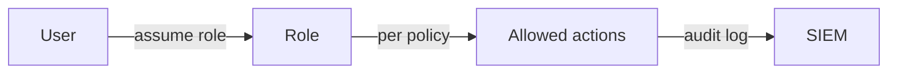

# Information Security 101 (8/10): Least Privilege

> Information Security 101 series (8/10)

**Core question**: Why is "convenient extra access" so dangerous?

> Least privilege defines your blast radius when an incident happens.

This is the 8th post in the Information Security 101 series.


*information security 101 chapter 8 flow overview*
> Least privilege is not about giving fewer permissions. It is about asking "does this user/service need this permission right now in this context?" at every access decision.

## Questions to Keep in Mind

- What boundary should you inspect first when applying Least Privilege?
- Which signal should the example or diagram make visible for Least Privilege?
- What failure should be prevented first when Least Privilege reaches a real system?

## What You Will Learn

- The exact meaning of the principle of least privilege (PoLP)
- Writing deny and allow IAM policies
- RBAC vs ABAC vs ReBAC
- What zero trust actually means in practice
- Separating human and system privileges

## Why It Matters

You cannot always prevent compromise, but you can always shrink the blast radius. Least privilege determines the cost of any incident.

> Privileges are not granted; they are loaned.


```mermaid
flowchart LR
    U["User"] -->|"assume role"| R["Role"]
    R -->|"per policy"| A["Allowed actions"]
    A -->|"audit log"| L["SIEM"]
```

Every privilege is explicit and traceable.

## Key Terms

- **PoLP**: just enough privilege to do the job.
- **RBAC**: role-based access control.
- **ABAC**: attribute-based (tags, time, location).
- **Zero Trust**: verify every time, regardless of network location.
- **Privilege escalation**: must be blocked everywhere.

## Before/After

**Before — Every service runs as admin**

```text
One service compromised -> full cluster control lost
```

**After — Per-service least privilege**

```text
One service compromised -> only that service's resources affected
```

Blast radius decides the severity of the incident.

## Hands-on Step by Step

### Step 1 — AWS IAM (Least Privilege)

```json
{
  "Version": "2012-10-17",
  "Statement": [{
    "Effect": "Allow",
    "Action": ["s3:GetObject"],
    "Resource": "arn:aws:s3:::my-bucket/reports/*"
  }]
}
```

`Action: "*"` and `Resource: "*"` are red flags.

### Step 2 — Kubernetes RBAC

```yaml
# 2_role.yaml
kind: Role
apiVersion: rbac.authorization.k8s.io/v1
metadata: { namespace: app, name: pod-reader }
rules:
- apiGroups: [""]
  resources: ["pods"]
  verbs: ["get", "list"]
```

Scoped to one namespace, one resource, read-only.

### Step 3 — Service Account Separation

```yaml
# 3_sa.yaml
kind: ServiceAccount
apiVersion: v1
metadata: { name: reports-reader, namespace: app }
```

Each workload gets its own dedicated service account.

### Step 4 — Temporary Privilege (sudo Pattern)

```python
# 4_temp_grant.py
def assume_emergency_role():
    # break-glass: 30-minute expiry, alerting, audit log
    issue_short_lived_credential(role="incident-responder", ttl_min=30)
```

No standing privilege; issue only when needed.

### Step 5 — Policy Validation (Static Analysis)

```bash
# 5_check.sh
# Detect wildcards in IAM policies
grep -r '"\*"' iam/ && echo "WARNING: wildcard in IAM"
```

Treat policy as code; lint it.

## What to Notice in This Code

- Wildcards trigger lint warnings.
- Privileges may have time limits (TTL).
- Human privileges and system privileges are separated.
- Break-glass always carries alerting and audit.

## Five Common Mistakes

1. **Admin everywhere.** Maximum blast radius.
2. **Temporary grants that never expire.** Privilege accretion.
3. **Overly broad RBAC roles.** Effectively admin.
4. **No alerting on break-glass.** Emergency access becomes routine.
5. **No periodic review.** Over time everyone becomes admin.

## How This Shows Up in Production

### RBAC vs. ABAC for Privilege Models

| Aspect | RBAC | ABAC |
| --- | --- | --- |
| Policy expression | Role-centric (`admin`, `viewer`) | Attribute-centric (dept, region, time, resource tag) |
| Complexity | Low | Medium–High |
| Exception handling | Role proliferation | Flexible condition expressions |
| Audit trail | Clear per-role | Requires condition evaluation logs |

Start with RBAC. When role explosion hits, layer ABAC conditions in specific areas.

### Permission Matrix Example

| API | guest | user | analyst | admin |
| --- | --- | --- | --- | --- |
| GET /reports | deny | allow(own) | allow(team) | allow(all) |
| POST /reports | deny | deny | allow(team) | allow(all) |
| POST /users/{id}/role | deny | deny | deny | allow |
| DELETE /reports/{id} | deny | deny | deny | allow |

This matrix must map to integration tests. `allow(own)` conditions need resource-ownership verification logic.

### Unused Permission Detection

```python
# unused_permissions.py
from datetime import datetime, timedelta

def find_unused_permissions(user_id: str, days: int = 90):
    cutoff = datetime.now() - timedelta(days=days)
    granted = get_user_permissions(user_id)
    used = get_audit_log_permissions(user_id, since=cutoff)
    return granted - used  # candidates for revocation
```

Permissions unused for 90 days are revocation candidates. Without audit logs this analysis is impossible.

### Temporary Permission Workflow

```python
# permission_request.py
def request_permission(requester, resource, action, justification):
    return {
        "requester": requester,
        "resource": resource,
        "action": action,
        "justification": justification,
        "status": "pending",
        "expires_at": datetime.now() + timedelta(hours=4),
    }

def approve(request_id, approver):
    # grant_temporary_permission + audit_log("permission_granted")
    ...
```

Replace standing privileges with request-approve-expire flows. Every request and approval must land in audit logs.

### Auto-Expiry Enforcement

```python
# Runs every 10 minutes
def revoke_expired_permissions():
    for perm in get_permissions_expiring_before(datetime.now()):
        revoke_permission(perm["user_id"], perm["resource"], perm["action"])
        audit_log("permission_expired", perm)
```

Explicit expiry + automated revocation prevents privilege accretion.

### Permission Change Audit Fields

Every permission mutation must record:
- `actor_id` — who changed it
- `target_id` — whose permission changed
- `before`/`after` — what changed
- `reason` — why
- `approved_by` — approver
- `expires_at` — when temporary grants end

Without these fields, post-incident root cause analysis cannot answer "who opened that door and why."

## How a Senior Engineer Thinks

- Privileges are reviewed quarterly; findings become tickets.
- New grants always ship with an expiry date.
- Policies live in git and change via PR — no console clicks.
- Every incident review revisits blast radius and tightens boundaries.
- "Temporary" grants outside the official workflow do not exist.
- Break-glass usage triggers immediate alerts to security channel + audit log entry.

## Checklist

- [ ] Does every service account have a dedicated identity?
- [ ] Are wildcards absent from IAM policies?
- [ ] Is there a defined access-review cadence?
- [ ] Does break-glass come with alerting?
- [ ] Is human access JIT-issued?

## Practice Problems

1. Explain the difference between RBAC and ABAC in one paragraph.
2. List two alert events that should fire on break-glass usage.
3. Describe two architectural choices that shrink blast radius when one service is compromised.

## Wrap-up and Next Steps

Least privilege defines the cost of an incident. Next we look at what makes incidents detectable in the first place — logging and audit.

## Answering the Opening Questions

- **What exactly does the principle of least privilege mean?**
  - Clarify which API endpoints the USER role can access, which it cannot, and where that enforcement is applied.
- **How should you design allow and deny in IAM policies?**
  - Documenting in policy form why service A can read B's data but C cannot write to it lets you respond to permission errors.
- **When do RBAC, ABAC, and ReBAC diverge?**
  - Define role and permission audit logs, permission-request approval processes, and periodic cleanup rules for unused permissions.
<!-- toc:begin -->
## In this series

- [Information Security 101 (1/10): What Is Information Security?](./01-what-is-information-security.md)
- [Information Security 101 (2/10): Authentication and Authorization](./02-authentication-and-authorization.md)
- [Information Security 101 (3/10): Cryptography and Hashing](./03-cryptography-and-hash.md)
- [Information Security 101 (4/10): TLS and Certificates](./04-tls-and-certificates.md)
- [Information Security 101 (5/10): Web Security Basics](./05-web-security-basics.md)
- [Information Security 101 (6/10): SQL Injection and XSS](./06-sql-injection-and-xss.md)
- [Information Security 101 (7/10): Secret Management](./07-secret-management.md)
- **Least Privilege (current)**
- Logging and Audit (upcoming)
- Incident Response (upcoming)

<!-- toc:end -->

## References

- [NIST — Principle of Least Privilege](https://csrc.nist.gov/glossary/term/least_privilege)
- [AWS — IAM Best Practices](https://docs.aws.amazon.com/IAM/latest/UserGuide/best-practices.html)
- [Kubernetes — RBAC Authorization](https://kubernetes.io/docs/reference/access-authn-authz/rbac/)
- [Google — BeyondCorp Zero Trust](https://cloud.google.com/beyondcorp)

Tags: Computer Science, Security, LeastPrivilege, IAM, AccessControl, ZeroTrust
