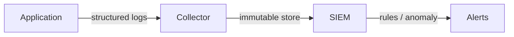

# Information Security 101 (9/10): Logging and Audit

> Information Security 101 series (9/10)

**Core question**: Some incidents cannot be prevented — so how do we notice them?

> Logs are the system's memory. A system without memory does not even know it was breached.

This is the 9th post in the Information Security 101 series.


*information security 101 chapter 9 flow overview*
> Logging and audit are not post-incident analysis tools. They are real-time detection systems that catch anomalies as they happen and trigger immediate response.

## Questions to Keep in Mind

- What boundary should you inspect first when applying Logging and Audit?
- Which signal should the example or diagram make visible for Logging and Audit?
- What failure should be prevented first when Logging and Audit reaches a real system?

## What You Will Learn

- The difference between security logs and operational logs
- What to log and what never to log
- The immutability of audit logs
- The role of SIEM
- The connection to compliance (SOC2, ISO 27001)

## Why It Matters

Without detection there is no response. The mean time to detect a breach is over 200 days — good logging cuts that to hours.

> A breach noticed in 200 days is not an incident; it is a disaster.



Collect -> store -> analyze -> alert.

## Key Terms

- **Audit log**: who did what, when.
- **Structured logging**: machine-readable formats like JSON.
- **Immutability**: cannot be modified or deleted once written.
- **SIEM**: Security Information and Event Management.
- **Retention**: how long logs are kept — driven by compliance.

## Before/After

**Before — Plain text, free-form**

```text
"User did something at /api/x" -> not searchable, not aggregable
```

**After — Structured + immutable**

```json
{"ts":"2026-05-04T10:00Z","user":"alice","action":"read","resource":"reports/2026"}
```

Same event, different format — and only one can be analyzed.

## Hands-on Step by Step

### Step 1 — Structured Logging

```python
# 1_struct_log.py
import json, time, sys
def log(event, **fields):
    rec = {"ts": time.strftime("%FT%TZ"), "event": event, **fields}
    sys.stdout.write(json.dumps(rec) + "\n")

log("auth_login", user="alice", ip="10.0.0.1", ok=True)
```

Key-value rather than free-form strings.

### Step 2 — Never Log These

```python
# 2_no_log.py
# log("login", user=user, password=pw)        # forbidden
# log("token", token=jwt)                     # forbidden
# log("card", number="4111-...", cvv=cvv)     # forbidden
```

Passwords, tokens, and PII must be masked or never written.

### Step 3 — Separate Audit Log

```python
# 3_audit.py
def audit(actor, action, resource, result):
    rec = {"actor": actor, "action": action, "resource": resource, "result": result}
    write_to_immutable_store(rec)   # WORM (write-once-read-many)
```

Separating from operational logs preserves integrity.

### Step 4 — Log Integrity (HMAC Chain)

```python
# 4_chain.py
import hmac, hashlib, json
def append(prev_mac, record, key):
    payload = json.dumps(record, sort_keys=True).encode()
    return hmac.new(key, prev_mac + payload, hashlib.sha256).hexdigest()
```

Chaining signatures over previous records exposes tampering.

### Step 5 — SIEM Rule (Pseudo)

```text
# 5_rule.txt
RULE "brute force":
  WHEN count(auth_login WHERE ok=false) > 10 BY user, ip IN 5min
  THEN alert(severity=high)
```

Rules run on top of a stable data model.

### Step 6 — Structured Audit Logging with structlog

```python
# 6_structlog_audit.py
import structlog
from datetime import datetime

structlog.configure(
    processors=[
        structlog.processors.TimeStamper(fmt="iso"),
        structlog.processors.JSONRenderer(),
    ],
    logger_factory=structlog.PrintLoggerFactory(),
)

audit_logger = structlog.get_logger("audit")

def audit_action(actor: str, action: str, resource: str, result: str, ip: str = None):
    audit_logger.info(
        "audit_event",
        actor=actor,
        action=action,
        resource=resource,
        result=result,
        ip=ip,
        timestamp=datetime.utcnow().isoformat(),
    )

# Usage
audit_action(
    actor="alice",
    action="delete_user",
    resource="users/123",
    result="success",
    ip="10.0.1.5",
)
# Output: {"event": "audit_event", "actor": "alice", "action": "delete_user", ...}
```

structlog produces structured records by default. JSON output lets tools like Elasticsearch, Splunk, or CloudWatch Logs Insights query events without regex.

## What to Notice in This Code

- Every log is structured.
- Secrets and PII never appear in plaintext.
- Audit logs use a separate store from operational logs.
- Integrity protections (signing, WORM) are applied.

## Log Retention Policy

How long to keep logs balances legal obligations, cost, and incident response timelines.

### Retention Periods

| Log Type | Recommended Retention | Rationale |
|---|---|---|
| **Audit logs** | 1 year+ | Privacy laws (3 yr), SOC 2 Type II (1 yr) |
| **Security event logs** | 90 days+ | NIST recommendation |
| **Application logs** | 30 days | Cost vs debugging utility |
| **Infrastructure logs** | 7 days | Cost vs troubleshooting utility |

Audit logs face the strictest regulation. Security incidents require at least 90 days of logs. Application and infrastructure logs can use shorter windows to reduce cost.

### Tiered Log Storage

```python
# log_retention.py
from enum import Enum

class StorageTier(Enum):
    HOT = "hot"          # immediate search (7 days)
    WARM = "warm"        # minutes to search (30 days)
    COLD = "cold"        # hours to search (90 days)
    ARCHIVE = "archive"  # restore then search (1 year+)

def rotate_logs_to_tier(log_age_days: int) -> StorageTier:
    if log_age_days <= 7:
        return StorageTier.HOT
    elif log_age_days <= 30:
        return StorageTier.WARM
    elif log_age_days <= 90:
        return StorageTier.COLD
    else:
        return StorageTier.ARCHIVE

# S3 lifecycle policy mapping:
# - 7 days  -> STANDARD -> STANDARD_IA
# - 30 days -> STANDARD_IA -> GLACIER
# - 365 days -> GLACIER -> DEEP_ARCHIVE
```

Tiered storage keeps long retention affordable. Recent logs stay searchable; older logs move to cold tiers and are restored only when needed.

### Log Deletion Policy

```python
# log_deletion_policy.py
from datetime import datetime, timedelta

def can_delete_log(log_type: str, log_date: datetime) -> bool:
    """Check if log can be safely deleted per retention policy."""
    now = datetime.utcnow()
    age_days = (now - log_date).days

    retention = {
        "audit": 365,
        "security": 90,
        "application": 30,
        "infrastructure": 7,
    }

    if log_type not in retention:
        return False  # unknown log types are never deleted

    return age_days > retention[log_type]
```

Encode retention as code, not tribal knowledge. Manual deletion risks losing critical evidence.

## Security Testing Tool Comparison: SAST, DAST, SCA

Logging and audit become more effective when connected to development pipeline security testing. Understanding SAST, DAST, and SCA separately clarifies where each fits.

| Tool Type | What It Inspects | Strength | Limitation | Operational Point |
|---|---|---|---|---|
| SAST | Source code / bytecode | Finds vulnerable patterns early in dev | High false-positive rate (no runtime context) | Gate at PR stage |
| DAST | Running application | Confirms exploitability in real behavior | Environment setup cost, limited coverage | Scheduled staging scans |
| SCA | Open-source dependencies | Strong at tracking known CVEs | Cannot detect unknown vulnerabilities | Pair with dependency update policy |

Treat these three not as competitors but as complements — each covers a different failure mode.

## Audit Log Schema Design

Audit logs must be "queryable data," not "readable prose." A minimal schema:

```yaml
# audit-log-schema.yaml
version: 1
fields:
  - name: ts
    type: datetime
    required: true
  - name: event_type
    type: string
    required: true
  - name: actor_id
    type: string
    required: true
  - name: actor_type
    type: enum[user,service]
    required: true
  - name: action
    type: string
    required: true
  - name: resource
    type: string
    required: true
  - name: result
    type: enum[allow,deny,error]
    required: true
  - name: trace_id
    type: string
    required: false
```

Including `trace_id` lets you correlate security events with application request traces, dramatically speeding incident investigation.

## Python Security Logger with Redaction

```python
# security_logger.py
import json
import logging
from datetime import datetime, timezone

logger = logging.getLogger("security")
handler = logging.StreamHandler()
handler.setFormatter(logging.Formatter("%(message)s"))
logger.addHandler(handler)
logger.setLevel(logging.INFO)


def sec_event(event_type: str, **fields) -> None:
    rec = {
        "ts": datetime.now(timezone.utc).isoformat(),
        "event_type": event_type,
        **fields,
    }
    # Redact sensitive fields
    for key in ("password", "token", "secret"):
        if key in rec:
            rec[key] = "***REDACTED***"
    logger.info(json.dumps(rec, ensure_ascii=False))

sec_event(
    "authz_denied",
    actor_id="user-120",
    actor_type="user",
    action="delete_report",
    resource="report-2026-01",
    result="deny",
    trace_id="8c4f2f7a"
)
```

The redaction loop ensures that even if a caller accidentally passes a secret, it never reaches the log sink.

## Connecting Detection Rules to Audit Events

- Link SAST-flagged vulnerable file paths to runtime error logs.
- Match DAST reproduction requests against WAF / application logs.
- Verify whether SCA high-risk CVE packages are actually loaded at runtime via audit events.

When test tool results are disconnected from production logs, prioritization lags. When connected, you can rapidly answer: "Is this vulnerability actually exploitable in our service?"

## Operational Review Loop

The most frequently missing piece in security documentation is "what do we check periodically?" The following cadence bridges concepts to operations.

| Cadence | Check Item | Output |
|---|---|---|
| Daily | High-severity alerts, auth failure spikes, permission denial spikes | Daily security briefing |
| Weekly | Security impact of new deployments | Change review notes |
| Monthly | Expiring keys/tokens/certs, unused permissions, stale secrets | Monthly hygiene report |
| Quarterly | Threat model reassessment, runbook drills, control effectiveness | Quarterly security retrospective |

Actionable documentation requires:

- Named owner and backup owner.
- Failure conditions and escalation thresholds defined numerically.
- Results tracked as tickets or action items.
- Exceptions always carry an expiration date.

Security is an operational loop, not a one-time project.

## Audit Event Priority and Response Playbook

Not all events deserve the same urgency. Define what triggers immediate action:

| Event | Severity | Automated Action | Manual Follow-up |
|---|---|---|---|
| Admin privilege change | High | Immediate alert + ticket creation | Verify approval basis |
| Mass login failures | Medium | Switch account to protection mode | Analyze attack IPs |
| Audit log deletion attempt | High | Block immediately + forensic preservation | Investigate insider threat |

## Immutable Store Operational Rules

- Grant only write-only roles to audit log buckets.
- Allow deletion only through a separately approved disposal workflow.
- Record log-access events themselves as audit events (meta-audit).
- Run quarterly restore drills to verify log availability.

Security logs matter less in volume than in quality — specifically, whether they can reconstruct an incident timeline.

## Detection Rule Quality Maintenance

Writing rules is the easy part; maintaining them is what matters.

| Activity | Cadence | Output |
|---|---|---|
| False-positive analysis | Weekly | Threshold adjustment proposals |
| Missed-detection post-incident review | Immediately after incident | New detection queries |
| Log field schema validation | On deploy | Compatibility check report |
| High-risk event simulation | Monthly | Detection-to-response elapsed time |

## Audit Log Integrity Verification Procedure

1. Select a sample range and run hash-chain verification.
2. Cross-reference store access history to detect unauthorized reads.
3. Run backup log restore tests to confirm availability.
4. Include verification results in the quarterly report.

Without integrity verification, logs are merely records. To serve as forensic evidence, you must prove both tamper-resistance and recoverability.

## SIEM Integration Architecture

```text
Application / Infrastructure logs
-> Parser normalizes to common schema
-> Tag high-risk events
-> SIEM rule engine evaluates
-> Alert / ticket / on-call page
```

Without the normalization step, each service uses different field names and detection rules cannot be reused across services.

## Minimum Items for an Audit Report

| Item | Description |
|---|---|
| Period | Reporting time range |
| Key event statistics | Privilege changes, failed logins, deletion attempts |
| High-risk incident summary | Blast radius, response time |
| Control improvement items | Next-quarter action items |

An audit report is not a historical record — it is the input for the next round of improvements.

## Audit Log Quality Criteria

Audit logs must support event reconstruction. The five fields — who, what, when, where, result — must always be populated. A missing-field event itself should trigger an alert. Additionally, when log pipeline changes are deployed, run parser compatibility tests against sample events to prevent detection rules from silently breaking.

### Log Integrity Verification Chain

To prove audit logs have not been tampered with after the fact, use a log-chain hash. Each record includes the hash of the previous record, creating a blockchain-like linked structure.

```python
"""Audit log integrity chain implementation example."""
import hashlib
import json
from datetime import datetime, timezone


def create_audit_record(
    previous_hash: str,
    actor: str,
    action: str,
    resource: str,
    result: str,
) -> dict:
    """Create an audit record that includes the previous hash."""
    record = {
        "timestamp": datetime.now(timezone.utc).isoformat(),
        "actor": actor,
        "action": action,
        "resource": resource,
        "result": result,
        "previous_hash": previous_hash,
    }
    payload = json.dumps(record, sort_keys=True).encode()
    record["hash"] = hashlib.sha256(payload).hexdigest()
    return record
```

If an attacker deletes or modifies a single intermediate log, every subsequent record's hash becomes inconsistent — exposing the tampering immediately. Running a verification batch job hourly detects both pipeline failures and intentional manipulation.

## Five Common Mistakes

1. **Logging passwords or tokens.** The most common wide-blast leak.
2. **Free-form strings only.** Cannot be analyzed.
3. **Storing logs in the operational DB.** Tamperable.
4. **No defined retention.** Compliance violations or runaway cost.
5. **Alert fatigue.** When everything is critical, nothing is.

## How This Shows Up in Production

Kubernetes uses audit policy to record every API server call. AWS uses CloudTrail + GuardDuty + Security Hub. Large organizations centralize all security events in a SIEM (Splunk, Elastic SIEM, Chronicle), with a SOC monitoring 24/7. The key is not logging more — it is logging in a detectable format with a trustworthy storage mechanism.

## How a Senior Engineer Thinks

- Logs are a basic system output — hard to add later.
- Alert thresholds are set with data, not vibes.
- Operations cannot delete audit logs.
- Retention is set by legal and contractual requirements.
- "Undetected scenarios" are exercised in regular game days.

## Checklist

- [ ] Are all logs structured?
- [ ] Is there a masking rule for secrets and PII?
- [ ] Does the audit log live in an immutable store?
- [ ] Is retention defined?
- [ ] Can you state the alert thresholds for the top five rules?

## Practice Problems

1. Write an alert rule for "100 failed logins per minute".
2. Name two mechanisms that preserve audit log immutability.
3. Sketch pseudocode for a PII masking middleware.

## Wrap-up and Next Steps

Logs are how incidents become visible. The final episode covers what to do once you see one — incident response.

## Answering the Opening Questions

- **How do operational logs and security logs differ?**
  - Clarify which system records login failures, permission denials, and suspicious queries, in what format they're centralized, and what rules trigger alerts.
- **What must you log and what must you never log?**
  - At 1,000 events/second, storing everything is expensive and sampling risks missing critical events. Setting the rule between them enables effective monitoring.
- **Why do audit logs need a separate store and immutability?**
  - Define log format standardization, monitoring-rule validation (reducing false alarms), and log retention/deletion policies.
<!-- toc:begin -->
## In this series

- [Information Security 101 (1/10): What Is Information Security?](./01-what-is-information-security.md)
- [Information Security 101 (2/10): Authentication and Authorization](./02-authentication-and-authorization.md)
- [Information Security 101 (3/10): Cryptography and Hashing](./03-cryptography-and-hash.md)
- [Information Security 101 (4/10): TLS and Certificates](./04-tls-and-certificates.md)
- [Information Security 101 (5/10): Web Security Basics](./05-web-security-basics.md)
- [Information Security 101 (6/10): SQL Injection and XSS](./06-sql-injection-and-xss.md)
- [Information Security 101 (7/10): Secret Management](./07-secret-management.md)
- [Information Security 101 (8/10): Least Privilege](./08-least-privilege.md)
- **Logging and Audit (current)**
- Incident Response (upcoming)

<!-- toc:end -->

## References

- [NIST SP 800-92 — Guide to Computer Security Log Management](https://csrc.nist.gov/publications/detail/sp/800-92/final)
- [OWASP — Logging Cheat Sheet](https://cheatsheetseries.owasp.org/cheatsheets/Logging_Cheat_Sheet.html)
- [Kubernetes — Auditing](https://kubernetes.io/docs/tasks/debug/debug-cluster/audit/)
- [Elastic — SIEM Documentation](https://www.elastic.co/guide/en/security/current/index.html)

Tags: Computer Science, Security, Logging, Audit, SIEM, Compliance
