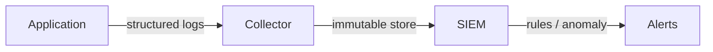

# Information Security 101 (9/10): Logging and Audit

> Information Security 101 series (9/10)

**Core question**: Some incidents cannot be prevented — so how do we notice them?

> Logs are the system's memory. A system without memory does not even know it was breached.

This is post 9 in the Information Security 101 series.


*information security 101 chapter 9 flow overview*
> Logging and audit are not post-incident analysis tools. They are real-time detection systems that catch anomalies as they happen and trigger immediate response.

## Questions to Keep in Mind

- What boundary should you inspect first when applying Logging and Audit?
- Which signal should the example or diagram make visible for Logging and Audit?
- What failure should be prevented first when Logging and Audit reaches a real system?

## What You Will Learn

- The difference between security logs and operational logs
- What to log and what never to log
- The immutability of audit logs
- The role of SIEM
- The connection to compliance (SOC2, ISO 27001)

## Why It Matters

Without detection there is no response. The mean time to detect a breach is over 200 days — good logging cuts that to hours.

> A breach noticed in 200 days is not an incident; it is a disaster.



Collect -> store -> analyze -> alert.

## Key Terms

- **Audit log**: who did what, when.
- **Structured logging**: machine-readable formats like JSON.
- **Immutability**: cannot be modified or deleted once written.
- **SIEM**: Security Information and Event Management.
- **Retention**: how long logs are kept — driven by compliance.

## Before/After

**Before — Plain text, free-form**

```text
"User did something at /api/x" -> not searchable, not aggregable
```

**After — Structured + immutable**

```json
{"ts":"2026-05-04T10:00Z","user":"alice","action":"read","resource":"reports/2026"}
```

Same event, different format — and only one can be analyzed.

## Hands-on Step by Step

### Step 1 — Structured Logging

```python
# 1_struct_log.py
import json, time, sys
def log(event, **fields):
    rec = {"ts": time.strftime("%FT%TZ"), "event": event, **fields}
    sys.stdout.write(json.dumps(rec) + "\n")

log("auth_login", user="alice", ip="10.0.0.1", ok=True)
```

Key-value rather than free-form strings.

### Step 2 — Never Log These

```python
# 2_no_log.py
# log("login", user=user, password=pw)        # forbidden
# log("token", token=jwt)                     # forbidden
# log("card", number="4111-...", cvv=cvv)     # forbidden
```

Passwords, tokens, and PII must be masked or never written.

### Step 3 — Separate Audit Log

```python
# 3_audit.py
def audit(actor, action, resource, result):
    rec = {"actor": actor, "action": action, "resource": resource, "result": result}
    write_to_immutable_store(rec)   # WORM (write-once-read-many)
```

Separating from operational logs preserves integrity.

### Step 4 — Log Integrity (HMAC Chain)

```python
# 4_chain.py
import hmac, hashlib, json
def append(prev_mac, record, key):
    payload = json.dumps(record, sort_keys=True).encode()
    return hmac.new(key, prev_mac + payload, hashlib.sha256).hexdigest()
```

Chaining signatures over previous records exposes tampering.

### Step 5 — SIEM Rule (Pseudo)

```text
# 5_rule.txt
RULE "brute force":
  WHEN count(auth_login WHERE ok=false) > 10 BY user, ip IN 5min
  THEN alert(severity=high)
```

Rules run on top of a stable data model.

## What to Notice in This Code

- Every log is structured.
- Secrets and PII never appear in plaintext.
- Audit logs use a separate store from operational logs.
- Integrity protections (signing, WORM) are applied.

## Five Common Mistakes

1. **Logging passwords or tokens.** The most common wide-blast leak.
2. **Free-form strings only.** Cannot be analyzed.
3. **Storing logs in the operational DB.** Tamperable.
4. **No defined retention.** Compliance violations or runaway cost.
5. **Alert fatigue.** When everything is critical, nothing is.

## How This Shows Up in Production

Kubernetes uses audit policy to record every API server call. AWS uses CloudTrail + GuardDuty + Security Hub. Large organizations centralize all security events in a SIEM (Splunk, Elastic SIEM, Chronicle), with a SOC monitoring 24/7.

## How a Senior Engineer Thinks

- Logs are a basic system output — hard to add later.
- Alert thresholds are set with data, not vibes.
- Operations cannot delete audit logs.
- Retention is set by legal and contractual requirements.
- "Undetected scenarios" are exercised in regular game days.

## Checklist

- [ ] Are all logs structured?
- [ ] Is there a masking rule for secrets and PII?
- [ ] Does the audit log live in an immutable store?
- [ ] Is retention defined?
- [ ] Can you state the alert thresholds for the top five rules?

## Practice Problems

1. Write an alert rule for "100 failed logins per minute".
2. Name two mechanisms that preserve audit log immutability.
3. Sketch pseudocode for a PII masking middleware.

## Wrap-up and Next Steps

Logs are how incidents become visible. The final episode covers what to do once you see one — incident response.

## Answering the Opening Questions

- **What boundary should you inspect first when applying Logging and Audit?**
  - The article treats Logging and Audit as a set of boundaries rather than one abstract idea, then separates input, processing, verification, and operational signals.
- **Which signal should the example or diagram make visible for Logging and Audit?**
  - The example and diagram should make visible what enters the system, where it changes, and which check decides pass or fail.
- **What failure should be prevented first when Logging and Audit reaches a real system?**
  - In production, keep that decision in checklists, logs, and tests so the same failure does not return after the next change.

<!-- toc:begin -->
## In this series

- [Information Security 101 (1/10): What Is Information Security?](./01-what-is-information-security.md)
- [Information Security 101 (2/10): Authentication and Authorization](./02-authentication-and-authorization.md)
- [Information Security 101 (3/10): Cryptography and Hashing](./03-cryptography-and-hash.md)
- [Information Security 101 (4/10): TLS and Certificates](./04-tls-and-certificates.md)
- [Information Security 101 (5/10): Web Security Basics](./05-web-security-basics.md)
- [Information Security 101 (6/10): SQL Injection and XSS](./06-sql-injection-and-xss.md)
- [Information Security 101 (7/10): Secret Management](./07-secret-management.md)
- [Information Security 101 (8/10): Least Privilege](./08-least-privilege.md)
- **Logging and Audit (current)**
- Incident Response (upcoming)

<!-- toc:end -->

## References

- [NIST SP 800-92 — Guide to Computer Security Log Management](https://csrc.nist.gov/publications/detail/sp/800-92/final)
- [OWASP — Logging Cheat Sheet](https://cheatsheetseries.owasp.org/cheatsheets/Logging_Cheat_Sheet.html)
- [Kubernetes — Auditing](https://kubernetes.io/docs/tasks/debug/debug-cluster/audit/)
- [Elastic — SIEM Documentation](https://www.elastic.co/guide/en/security/current/index.html)

Tags: Computer Science, Security, Logging, Audit, SIEM, Compliance
