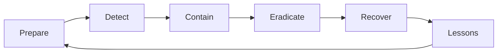

# Incident Response

> Information Security 101 series (10/10)

<!-- a-grade-intro:begin -->

**Core question**: When an incident hits, do we know what to do in the first minute?

> The quality of response is set in peacetime. Procedures invented during an incident are not procedures.

<!-- a-grade-intro:end -->

This is the final post in the Information Security 101 series.

## What You Will Learn

- The NIST IR cycle (Prepare, Detect, Contain, Eradicate, Recover, Lessons)
- Runbook structure and how to write one
- Balancing containment with evidence preservation
- Blameless postmortems
- Severity levels and communication

## Why It Matters

Incidents will happen. Good response shrinks loss; bad response amplifies it. A two-hour difference can save a company.

> "Prevention" does not aim at zero. "Response" is half of real security.

## Concept at a Glance



The NIST IR cycle is unbroken.

## Key Terms

- **IR (Incident Response)**: the entire response process.
- **Runbook**: step-by-step procedure for a specific incident type.
- **Containment**: stop further damage by isolating systems.
- **Eradication**: remove the root cause of compromise.
- **Postmortem**: review after the fact — blameless by principle.

## Before/After

**Before — Improvised response**

```text
Decide who does what on the fly -> lost time, destroyed evidence
```

**After — Runbook + Incident Commander (IC)**

```text
Roles assigned -> contained in 30 min -> evidence preserved -> recovery
```

Only prepared organizations learn from incidents.

## Hands-on Step by Step

### Step 1 — First Actions After Detection

```text
# 1_first_action.txt
1. Assign an Incident Commander (IC)
2. Open an incident channel (#inc-YYYY-MM-DD-N)
3. Start a timeline (record every action with time)
4. Write a hypothesis of impact scope
5. Hold external communication until PR/Legal joins
```

The first five minutes set the severity.

### Step 2 — Containment (Pseudocode)

```python
# 2_contain.py
def contain_compromised_account(user_id):
    revoke_all_sessions(user_id)
    rotate_credentials(user_id)
    block_ip_list(get_recent_ips(user_id))
    snapshot_logs(user_id, hours=24)   # preserve evidence first
```

Always capture evidence before containment when possible.

### Step 3 — Severity Levels

```text
# 3_severity.txt
SEV1: customer data exposed, full outage
SEV2: partial impact, potential data risk
SEV3: single user affected, workaround exists
```

Severity decides who is paged and what the SLA is.

### Step 4 — Blameless Postmortem Template

```text
# 4_postmortem.md
- What happened (timeline)
- Impact
- Root cause (5 Whys)
- What went well
- What to improve
- Action items (owner, due date)
```

Blame the system, not the person.

### Step 5 — Game Day (Practice)

```text
# 5_gameday.txt
Scenario: "S3 bucket made public"
Goal: detect -> contain -> communicate -> recover within 1 hour
Measure: MTTD, MTTR, accuracy of external comms
```

Procedures that are not practiced do not work in the real thing.

## What to Notice in This Code

- The Incident Commander is the decision-maker and single point of contact.
- Evidence preservation comes before containment when feasible.
- External communication flows through one unified channel.
- Every action is timestamped.

## Five Common Mistakes

1. **Killing systems immediately.** Evidence vanishes.
2. **Multiple people deciding in parallel.** Confusion and contradictions.
3. **Blaming people in postmortems.** The next incident hides its information.
4. **No SEV levels defined.** Small incidents grow; big ones get buried.
5. **Running the incident in DMs and email.** Timeline cannot be reconstructed.

## How This Shows Up in Production

PagerDuty/Opsgenie auto-assigns the IC. Slack workflows create the incident channel automatically. AWS wires GuardDuty findings into an IR workflow (EventBridge -> Lambda -> isolate). Postmortems are standardized in Notion or Confluence templates.

## How a Senior Engineer Thinks

- Write runbooks in peacetime; validate them with game days.
- Automate the first 30 minutes (isolation, alerts).
- Keep severity levels clear and the call tree current.
- Protect people in postmortems; fix systems.
- Action items have an owner and a due date.

## Checklist

- [ ] Is the Incident Commander role defined?
- [ ] Are runbooks written for the major incident types?
- [ ] Are SEV levels and the call tree current?
- [ ] Is there a blameless postmortem template?
- [ ] When was the last game day?

## Practice Problems

1. Write the first-five-minutes runbook for "S3 bucket exposed publicly".
2. Give two examples of rephrasing a person's mistake into a system problem.
3. Design call trees for SEV1 and SEV2.

## Wrap-up and Next Steps

Incident response is preparation made visible. This closes the Information Security 101 series — from CIA to incident response, the core arc covered. Next steps to consider: threat modeling, cloud security, and compliance frameworks (SOC2, ISO 27001).

<!-- toc:begin -->
- [What is Information Security?](./01-what-is-information-security.md)
- [Authentication and Authorization](./02-authentication-and-authorization.md)
- [Cryptography and Hashes](./03-cryptography-and-hash.md)
- [TLS and Certificates](./04-tls-and-certificates.md)
- [Web Security Basics](./05-web-security-basics.md)
- [SQL Injection and XSS](./06-sql-injection-and-xss.md)
- [Secret Management](./07-secret-management.md)
- [Least Privilege](./08-least-privilege.md)
- [Logging and Audit](./09-logging-and-audit.md)
- **Incident Response (current)**
<!-- toc:end -->

## References

- [NIST SP 800-61 — Computer Security Incident Handling Guide](https://csrc.nist.gov/publications/detail/sp/800-61/rev-2/final)
- [Google SRE Book — Managing Incidents](https://sre.google/sre-book/managing-incidents/)
- [PagerDuty — Incident Response Documentation](https://response.pagerduty.com/)
- [Etsy — Blameless Postmortems](https://www.etsy.com/codeascraft/blameless-postmortems/)

Tags: Computer Science, Security, IncidentResponse, Runbook, Postmortem, Forensics
