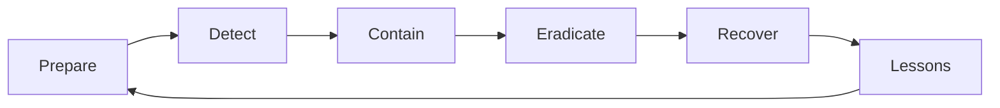

# Information Security 101 (10/10): Incident Response

> Information Security 101 series (10/10)

**Core question**: When an incident hits, do we know what to do in the first minute?

> The quality of response is set in peacetime. Procedures invented during an incident are not procedures.

This is the final post in the Information Security 101 series.


*information security 101 chapter 10 flow overview*
> Incident response is not just a playbook. It is the ability to detect fast, respond immediately, investigate thoroughly, recover completely, and never make the same mistake twice.

## Questions to Keep in Mind

- What boundary should you inspect first when applying Incident Response?
- Which signal should the example or diagram make visible for Incident Response?
- What failure should be prevented first when Incident Response reaches a real system?

## What You Will Learn

- The NIST IR cycle (Prepare, Detect, Contain, Eradicate, Recover, Lessons)
- Runbook structure and how to write one
- Balancing containment with evidence preservation
- Blameless postmortems
- Severity levels and communication

## Why It Matters

Incidents will happen. Good response shrinks loss; bad response amplifies it. A two-hour difference can save a company.

> "Prevention" does not aim at zero. "Response" is half of real security.


```mermaid
flowchart LR
    P["Prepare"] --> D["Detect"]
    D --> C["Contain"]
    C --> E["Eradicate"]
    E --> R["Recover"]
    R --> L["Lessons"]
    L --> P
```

The NIST IR cycle is unbroken.

## Key Terms

- **IR (Incident Response)**: the entire response process.
- **Runbook**: step-by-step procedure for a specific incident type.
- **Containment**: stop further damage by isolating systems.
- **Eradication**: remove the root cause of compromise.
- **Postmortem**: review after the fact — blameless by principle.

## Before/After

**Before — Improvised response**

```text
Decide who does what on the fly -> lost time, destroyed evidence
```

**After — Runbook + Incident Commander (IC)**

```text
Roles assigned -> contained in 30 min -> evidence preserved -> recovery
```

Only prepared organizations learn from incidents.

## Hands-on Step by Step

### Step 1 — First Actions After Detection

```text
# 1_first_action.txt
1. Assign an Incident Commander (IC)
2. Open an incident channel (#inc-YYYY-MM-DD-N)
3. Start a timeline (record every action with time)
4. Write a hypothesis of impact scope
5. Hold external communication until PR/Legal joins
```

The first five minutes set the severity.

### Step 2 — Containment (Pseudocode)

```python
# 2_contain.py
def contain_compromised_account(user_id):
    revoke_all_sessions(user_id)
    rotate_credentials(user_id)
    block_ip_list(get_recent_ips(user_id))
    snapshot_logs(user_id, hours=24)   # preserve evidence first
```

Always capture evidence before containment when possible.

### Step 3 — Severity Levels

```text
# 3_severity.txt
SEV1: customer data exposed, full outage
SEV2: partial impact, potential data risk
SEV3: single user affected, workaround exists
```

Severity decides who is paged and what the SLA is.

### Step 4 — Blameless Postmortem Template

```text
# 4_postmortem.md
- What happened (timeline)
- Impact
- Root cause (5 Whys)
- What went well
- What to improve
- Action items (owner, due date)
```

Blame the system, not the person.

### Step 5 — Game Day (Practice)

```text
# 5_gameday.txt
Scenario: "S3 bucket made public"
Goal: detect -> contain -> communicate -> recover within 1 hour
Measure: MTTD, MTTR, accuracy of external comms
```

Procedures that are not practiced do not work in the real thing.

## What to Notice in This Code

- The Incident Commander is the decision-maker and single point of contact.
- Evidence preservation comes before containment when feasible.
- External communication flows through one unified channel.
- Every action is timestamped.

## Five Common Mistakes

1. **Killing systems immediately.** Evidence vanishes.
2. **Multiple people deciding in parallel.** Confusion and contradictions.
3. **Blaming people in postmortems.** The next incident hides its information.
4. **No SEV levels defined.** Small incidents grow; big ones get buried.
5. **Running the incident in DMs and email.** Timeline cannot be reconstructed.

## How This Shows Up in Production

### Incident Response Maturity Model

| Level | Characteristics | Limitation | Next goal |
| --- | --- | --- | --- |
| 1 — Initial | Ad-hoc response, unclear ownership | Detection/response delays, evidence destroyed | Draft runbooks, assign IC |
| 2 — Managed | Runbooks for major scenarios, channel standardized | Lacks automation, depends on individuals | Partial alert-to-isolation automation |
| 3 — Defined | Severity framework, drills, retro loop established | Cross-team bottlenecks in complex incidents | Joint exercises, metric improvement |
| 4 — Optimized | Automation + learning loops + metric-driven improvement | Maintenance cost rises | Regular re-validation and simplification |

The model’s purpose is investment prioritization, not scoring. A Level 1 org needs channel standardization and timeline habits before advanced forensic tooling.

### Reporting Obligations

| Audience | Trigger | Deadline | Basis |
| --- | --- | --- | --- |
| Executive team | SEV1 incident | Immediate | Internal policy |
| Customers | Personal data breach | Within 72 hours | GDPR, local privacy law |
| Regulator | Financial data breach | Immediate–72 h | PCI-DSS, financial authority |
| Cyber center | Large-scale breach | Immediate | National cyber law |
| Partners/vendors | Supply-chain compromise | Per contract | SLA terms |

Obligations vary by industry and jurisdiction. External communication must go through legal review.

### Response Automation Example

```python
# incident_automation.py
from datetime import datetime, timezone

def start_incident(severity: str, summary: str) -> dict:
    inc_id = datetime.now(timezone.utc).strftime("INC-%Y%m%d-%H%M%S")
    return {
        "incident_id": inc_id,
        "severity": severity,
        "summary": summary,
        "channel": f"#inc-{inc_id.lower()}",
    }

def containment_actions(user_id: str) -> list[str]:
    return [
        f"revoke_sessions:{user_id}",
        f"rotate_credentials:{user_id}",
        f"snapshot_logs:{user_id}:24h",
    ]
```

Automation handles mechanical first-30-minute tasks so humans have time to think.

### Comprehensive IR Checklist (YAML)

```yaml
prepare:
  - incident_commander_assigned: true
  - severity_matrix_documented: true
  - runbooks_for_top5_scenarios: true
  - legal_pr_contact_on_call: true
detect:
  - critical_alerts_tested_weekly: true
  - mttd_slo_defined: true
contain:
  - session_revoke_automation: true
  - network_isolation_playbook: true
  - evidence_snapshot_procedure: true
eradicate_recover:
  - root_cause_template: true
  - credential_rotation_automation: true
  - mttr_slo_defined: true
lessons:
  - blameless_postmortem_template: true
  - action_items_with_owner_and_due: true
  - control_improvement_tracking: true
```

Review quarterly as Pass/Fail; Fail items become tickets with owners and deadlines.

### Key Metrics

- **MTTD** (Mean Time to Detect): anomaly onset → awareness
- **MTTA** (Mean Time to Acknowledge): awareness → command structure activated
- **MTTR** (Mean Time to Recover): containment → service restored
- **Recurrence rate**: same root cause repeating

Metrics are not report decoration — they’re input to next quarter’s control improvements.

## How a Senior Engineer Thinks

- Write runbooks in peacetime; validate with game days.
- Automate the first 30 minutes (isolation, credential rotation, log snapshot).
- Keep severity levels clear and the call tree current.
- Protect people in postmortems; fix systems.
- Action items always have an owner and a due date — no orphan findings.
- External comms flow through one channel with legal sign-off.

## Checklist

- [ ] Is the Incident Commander role defined?
- [ ] Are runbooks written for the major incident types?
- [ ] Are SEV levels and the call tree current?
- [ ] Is there a blameless postmortem template?
- [ ] When was the last game day?

## Practice Problems

1. Write the first-five-minutes runbook for "S3 bucket exposed publicly".
2. Give two examples of rephrasing a person's mistake into a system problem.
3. Design call trees for SEV1 and SEV2.

## Wrap-up and Next Steps

Incident response is preparation made visible. This closes the Information Security 101 series — from CIA to incident response, the core arc covered. Next steps to consider: threat modeling, cloud security, and compliance frameworks (SOC2, ISO 27001).

## Answering the Opening Questions

- **What should you do in the first minute after a security incident?**
  - Clarify responsibilities at each stage: alert fired → severity classification → initial response → investigation start → finding documentation → recovery plan → execution → postmortem.
- **What is the flow of the NIST IR cycle?**
  - Understanding the damage-scale difference between 1-hour vs. 24-hour response times for a compromise indicator lets you set response priorities.
- **How do you balance containment with evidence preservation?**
  - Define regular incident-response drills, runbook validation and updates, and follow-up tracking from postmortem findings.
<!-- toc:begin -->
## In this series

- [Information Security 101 (1/10): What Is Information Security?](./01-what-is-information-security.md)
- [Information Security 101 (2/10): Authentication and Authorization](./02-authentication-and-authorization.md)
- [Information Security 101 (3/10): Cryptography and Hashing](./03-cryptography-and-hash.md)
- [Information Security 101 (4/10): TLS and Certificates](./04-tls-and-certificates.md)
- [Information Security 101 (5/10): Web Security Basics](./05-web-security-basics.md)
- [Information Security 101 (6/10): SQL Injection and XSS](./06-sql-injection-and-xss.md)
- [Information Security 101 (7/10): Secret Management](./07-secret-management.md)
- [Information Security 101 (8/10): Least Privilege](./08-least-privilege.md)
- [Information Security 101 (9/10): Logging and Audit](./09-logging-and-audit.md)
- **Incident Response (current)**

<!-- toc:end -->

## References

- [NIST SP 800-61 — Computer Security Incident Handling Guide](https://csrc.nist.gov/publications/detail/sp/800-61/rev-2/final)
- [Google SRE Book — Managing Incidents](https://sre.google/sre-book/managing-incidents/)
- [PagerDuty — Incident Response Documentation](https://response.pagerduty.com/)
- [Etsy — Blameless Postmortems](https://www.etsy.com/codeascraft/blameless-postmortems/)

Tags: Computer Science, Security, IncidentResponse, Runbook, Postmortem, Forensics
