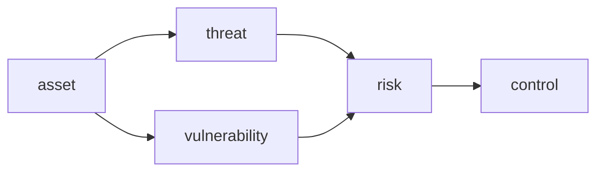

# 정보보안이란 무엇인가?

보안을 처음 배우면 방화벽, 암호화, 인증 같은 기술 이름이 먼저 눈에 들어옵니다. 그런데 실무에서 보안 사고를 돌아보면 문제의 출발점은 기술 부족보다 판단 부재인 경우가 많습니다. 무엇을 보호해야 하는지, 어떤 위험을 지금 줄여야 하는지, 무엇을 당장 막지 못해도 되는지 합의하지 않은 채 개발과 운영이 흘러가면 보안은 늘 일정 끝으로 밀립니다.

이 글은 Information Security 101 시리즈의 첫 번째 글입니다.

## 이 글에서 다룰 문제

정보보안을 기술 목록으로만 이해하면 우선순위를 세울 수 없습니다. 이 글의 출발점은 보안을 “위험을 0으로 만드는 일”이 아니라 “무엇을 보호하고 어떤 위험을 얼마나 감수할지 결정하는 일”로 보는 것입니다.

> 자산이 위협과 취약점을 만나면 위험이 생기고, 보안은 그 위험을 통제하는 일입니다.

- 정보보안은 정확히 무엇을 뜻할까요?
- CIA, 위협, 취약점, 위험은 어떻게 연결될까요?
- STRIDE는 왜 입문자에게도 유용한 체크리스트일까요?
- 통제는 어떻게 위협별로 매핑해야 할까요?
- 개발자가 보안에 가장 빠르게 기여하는 방법은 무엇일까요?

## 왜 중요한가

보안 사고는 거의 언제나 “기술이 없어서”가 아니라 “결정을 미뤄서” 발생합니다. 이 시리즈의 나머지 글이 인증, 암호화, TLS, 웹 보안 같은 구체 기술을 다룬다면, 이 글은 그 바닥에 깔리는 기준점을 정리합니다. 무엇이 자산이고, 무엇이 위협이며, 무엇이 위험인지 모르면 나중에 나오는 모든 통제도 제각각 흩어집니다.

정보보안을 배우는 첫 단계는 도구 이름을 외우는 일이 아닙니다. 팀이 어떤 위험을 받아들이고 어떤 위험을 먼저 줄일지 말할 수 있는 상태를 만드는 일입니다.

## 한눈에 보는 개념



자산이 위협과 취약점을 만나면 위험이 됩니다. 정보보안은 그 위험을 줄이거나, 이전하거나, 수용하거나, 제거하는 판단의 연속입니다.

## 핵심 용어

- 기밀성: 권한 있는 사람만 정보를 볼 수 있어야 합니다.
- 무결성: 데이터가 의도치 않게 바뀌지 않아야 합니다.
- 가용성: 필요할 때 시스템이 동작해야 합니다.
- **위협 / 취약점 / 위험**: 공격 의도 / 약점 / 둘이 만났을 때 생기는 실제 피해 가능성입니다.
- **STRIDE**: Spoofing, Tampering, Repudiation, Information disclosure, DoS, Elevation of privilege를 빠르게 점검하는 위협 분류 틀입니다.

## 전후 비교

### 이전 — 보안은 인프라 팀의 일

```text
last-minute review -> schedule slip -> partial workarounds
```

### 이후 — 설계 단계에서 위협 모델링

```text
one-page STRIDE in design review -> risk priority decided -> agreed controls
```

보안을 뒤로 미룰수록 비용이 커진다는 관찰은 업계 전반에서 일관됩니다. 일찍 판단하면 문서 한 장으로 끝날 수 있는 일이, 나중에는 배포 지연과 우회 구현으로 커집니다.

## 단계별 실습: 위협 모델 한 장 만들기

### 1단계 — 자산을 적습니다

```text
1_assets.md
- user passwords
- payment tokens
- admin session cookies
```

먼저 보호해야 할 대상을 적습니다. 자산 목록이 없으면 어떤 위협이 중요한지 말할 수 없습니다.

### 2단계 — STRIDE로 위협을 적습니다

```text
2_threats.md
- Spoofing: impersonate another user (bypass auth)
- Tampering: alter the payment amount
- Repudiation: deny the payment
- Information disclosure: DB dump exposed
- DoS: login flood stalls service
- Elevation: ordinary user gains admin
```

자산 하나마다 STRIDE를 한 줄씩만 적용해도 빠진 구멍이 금방 드러납니다. 완벽함보다 누락 방지가 더 중요합니다.

### 3단계 — 위험 우선순위를 매깁니다

```python
# 3_risk.py
def risk_score(likelihood, impact):
    return likelihood * impact   # 1-5 scale
print(risk_score(3, 5))   # 15
```

점수 자체가 정답은 아닙니다. 그래도 무엇을 지금 막고 무엇을 뒤로 미룰지 나누는 기준은 만들어 줍니다.

### 4단계 — 통제를 위협별로 연결합니다

```text
4_controls.md
- Spoofing -> MFA, password policy
- Tampering -> HMAC, audit log
- Information disclosure -> encryption, access control
```

막연한 “보안 강화”는 검증할 수 없습니다. 어떤 위협에 어떤 통제가 대응하는지 써야 팀이 같은 그림을 봅니다.

### 5단계 — 잔여 위험을 합의합니다

```text
5_residual.md
- DoS only weakly defended via CDN rate limit
- Incident response in episode 9
- Reassessed quarterly
```

모든 위험을 없앨 수는 없습니다. 남겨 둔 위험을 명시적으로 적고 주기적으로 다시 보는 태도가 성숙한 보안 운영의 출발점입니다.

## 이 코드와 예제에서 먼저 볼 점

- 위협 모델의 목적은 완벽한 문서가 아니라 팀의 공통 그림입니다.
- STRIDE는 빠뜨리기 쉬운 항목을 막아 주는 체크리스트입니다.
- 위험 점수는 절대값보다 상대 비교에 유용합니다.
- 잔여 위험을 문서로 남겨야 책임과 후속 작업이 또렷해집니다.

## 자주 하는 실수 다섯 가지

1. **자산 없이 위협만 적는 실수**: 무엇을 보호하는지 모르면 통제도 정할 수 없습니다.
2. **모든 위협을 같은 무게로 보는 실수**: 우선순위가 없는 보안은 실행되지 않습니다.
3. **보안을 마지막에 붙이는 실수**: 변경 비용이 급격히 커집니다.
4. **위험을 0으로 만들려는 실수**: 가용성과 개발 속도를 함께 해칩니다.
5. **사고 대응 없이 통제만 늘리는 실수**: 사고는 결국 발생하고, 대응 준비가 없으면 피해가 커집니다.

## 실무에서는 이렇게 나타납니다

OWASP 위협 모델링, ISO 27001과 SOC 2의 위험 평가, AWS Well-Architected Security Pillar, Microsoft SDL은 표현만 다를 뿐 같은 골격을 공유합니다. 자산, 위협, 위험, 통제를 한 장에 연결하고 그 위에서 우선순위를 정하는 방식입니다. 조직이 커질수록 이 한 장이 기술 토론보다 먼저 필요한 문서가 됩니다.

## 시니어 엔지니어는 이렇게 생각합니다

- 보안을 “막는 일”보다 “결정하는 일”로 봅니다.
- 설계 리뷰나 PR 템플릿에 한 페이지짜리 STRIDE를 넣습니다.
- 잔여 위험은 티켓으로 남기고 분기마다 다시 평가합니다.
- 더 강한 통제보다 먼저 사고 대응 체계를 준비합니다.
- 비용과 효과를 숫자로 말하려고 합니다.

## 체크리스트

- [ ] CIA를 한 줄로 설명할 수 있습니까?
- [ ] 자산 하나에 STRIDE 여섯 항목을 적용할 수 있습니까?
- [ ] 위협, 취약점, 위험의 차이를 구분할 수 있습니까?
- [ ] 잔여 위험이라는 표현이 자연스럽습니까?
- [ ] 위험 우선순위로 일을 정렬할 수 있습니까?

## 연습 문제

1. 여러분 서비스의 자산 다섯 개를 적고 각각에 STRIDE를 적용해 보세요.
2. 가능성과 영향도를 1~5로 매겨 가장 위험한 항목을 찾으세요.
3. 결과를 한 페이지 문서로 정리해 팀과 공유해 보세요.

## 정리와 다음 글

정보보안의 출발점은 통제 기술이 아니라 “무엇을 왜 보호하는가”라는 질문입니다. 이 질문에 답할 수 있어야 이후의 인증, 권한, 암호화, 로그, 사고 대응이 같은 방향으로 연결됩니다. 다음 글에서는 가장 자주 만나는 통제인 인증과 인가를 다룹니다.

<!-- toc:begin -->
- **정보보안이란 무엇인가? (현재 글)**
- 인증과 인가 (예정)
- 암호화와 해시 (예정)
- TLS와 인증서 (예정)
- Web 보안 기초 (예정)
- SQL Injection과 XSS (예정)
- secret 관리 (예정)
- 권한 최소화 (예정)
- 로그와 감사 (예정)
- 보안 사고 대응 (예정)
<!-- toc:end -->

## 참고 자료

- [OWASP Threat Modeling](https://owasp.org/www-community/Threat_Modeling)
- [Microsoft STRIDE](https://learn.microsoft.com/en-us/azure/security/develop/threat-modeling-tool-threats)
- [NIST SP 800-30 Risk Assessment](https://csrc.nist.gov/publications/detail/sp/800-30/rev-1/final)
- [AWS Well-Architected Security Pillar](https://docs.aws.amazon.com/wellarchitected/latest/security-pillar/welcome.html)

Tags: Computer Science, Security, CIA, ThreatModel, RiskAssessment, InfoSec
