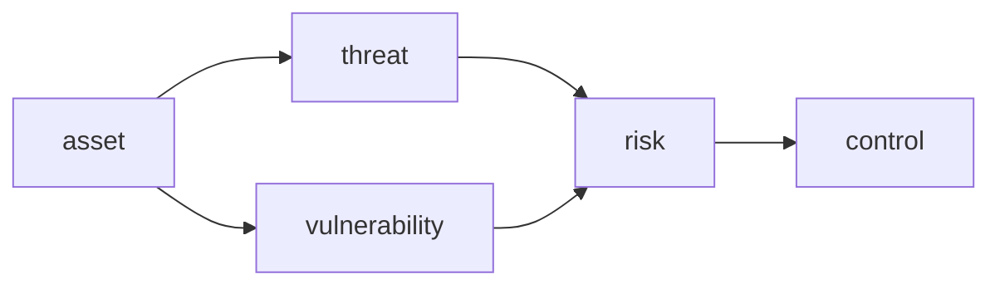
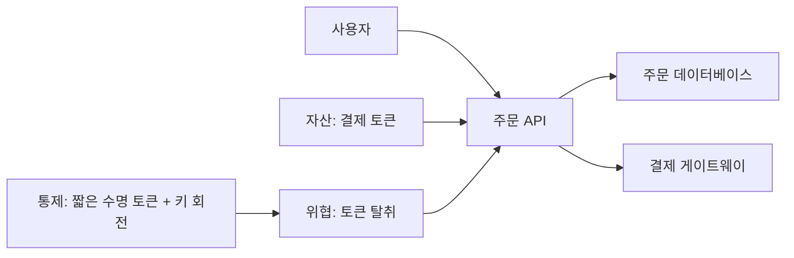

# Information Security 101 (1/10): 정보보안이란 무엇인가?

보안을 처음 배우면 방화벽, 암호화, 인증 같은 기술 이름이 먼저 눈에 들어옵니다. 그런데 실무에서 보안 사고를 돌아보면 문제의 출발점은 기술 부족보다 판단 부재인 경우가 많습니다. 무엇을 보호해야 하는지, 어떤 위험을 지금 줄여야 하는지, 무엇을 당장 막지 못해도 되는지 합의하지 않은 채 개발과 운영이 흘러가면 보안은 늘 일정 끝으로 밀립니다.

이 글은 Information Security 101 시리즈의 첫 번째 글입니다.


*Information Security 101 1장 흐름 개요*
> 정보보안은 기술 이름을 아는 것이 아니라 "무엇을 보호하고, 어떤 위협을 먼저 줄일지"를 명확히 말할 수 있는 상태를 만드는 것입니다.

## 먼저 던지는 질문

- 정보보안은 정확히 무엇을 뜻할까요?
- CIA, 위협, 취약점, 위험은 어떻게 연결될까요?
- STRIDE는 왜 입문자에게도 유용한 체크리스트일까요?

## 왜 중요한가

보안 사고는 거의 언제나 “기술이 없어서”가 아니라 “결정을 미뤄서” 발생합니다. 이 시리즈의 나머지 글이 인증, 암호화, TLS, 웹 보안 같은 구체 기술을 다룬다면, 이 글은 그 바닥에 깔리는 기준점을 정리합니다. 무엇이 자산이고, 무엇이 위협이며, 무엇이 위험인지 모르면 나중에 나오는 모든 통제도 제각각 흩어집니다.

정보보안을 배우는 첫 단계는 도구 이름을 외우는 일이 아닙니다. 팀이 어떤 위험을 받아들이고 어떤 위험을 먼저 줄일지 말할 수 있는 상태를 만드는 일입니다.

## 한눈에 보는 개념



자산이 위협과 취약점을 만나면 위험이 됩니다. 정보보안은 그 위험을 줄이거나, 이전하거나, 수용하거나, 제거하는 판단의 연속입니다.

## 핵심 용어

- 기밀성: 권한 있는 사람만 정보를 볼 수 있어야 합니다.
- 무결성: 데이터가 의도치 않게 바뀌지 않아야 합니다.
- 가용성: 필요할 때 시스템이 동작해야 합니다.
- **위협 / 취약점 / 위험**: 공격 의도 / 약점 / 둘이 만났을 때 생기는 실제 피해 가능성입니다.
- **STRIDE**: Spoofing, Tampering, Repudiation, Information disclosure, DoS, Elevation of privilege를 빠르게 점검하는 위협 분류 틀입니다.

## 전후 비교

### 이전 — 보안은 인프라 팀의 일

```text
last-minute review -> schedule slip -> partial workarounds
```

### 이후 — 설계 단계에서 위협 모델링

```text
one-page STRIDE in design review -> risk priority decided -> agreed controls
```

보안을 뒤로 미룰수록 비용이 커진다는 관찰은 업계 전반에서 일관됩니다. 일찍 판단하면 문서 한 장으로 끝날 수 있는 일이, 나중에는 배포 지연과 우회 구현으로 커집니다.

## 단계별 실습: 위협 모델 한 장 만들기

### 1단계 — 자산을 적습니다

```text
1_assets.md
- user passwords
- payment tokens
- admin session cookies
```

먼저 보호해야 할 대상을 적습니다. 자산 목록이 없으면 어떤 위협이 중요한지 말할 수 없습니다.

### 2단계 — STRIDE로 위협을 적습니다

```text
2_threats.md
- Spoofing: impersonate another user (bypass auth)
- Tampering: alter the payment amount
- Repudiation: deny the payment
- Information disclosure: DB dump exposed
- DoS: login flood stalls service
- Elevation: ordinary user gains admin
```

자산 하나마다 STRIDE를 한 줄씩만 적용해도 빠진 구멍이 금방 드러납니다. 완벽함보다 누락 방지가 더 중요합니다.

### 3단계 — 위험 우선순위를 매깁니다

```python
# 3_risk.py
def risk_score(likelihood, impact):
    return likelihood * impact   # 1-5 scale
print(risk_score(3, 5))   # 15
```

점수 자체가 정답은 아닙니다. 그래도 무엇을 지금 막고 무엇을 뒤로 미룰지 나누는 기준은 만들어 줍니다.

### 4단계 — 통제를 위협별로 연결합니다

```text
4_controls.md
- Spoofing -> MFA, password policy
- Tampering -> HMAC, audit log
- Information disclosure -> encryption, access control
```

막연한 “보안 강화”는 검증할 수 없습니다. 어떤 위협에 어떤 통제가 대응하는지 써야 팀이 같은 그림을 봅니다.

### 5단계 — 잔여 위험을 합의합니다

```text
5_residual.md
- DoS only weakly defended via CDN rate limit
- Incident response in episode 9
- Reassessed quarterly
```

모든 위험을 없앨 수는 없습니다. 남겨 둔 위험을 명시적으로 적고 주기적으로 다시 보는 태도가 성숙한 보안 운영의 출발점입니다.

## 이 코드와 예제에서 먼저 볼 점

- 위협 모델의 목적은 완벽한 문서가 아니라 팀의 공통 그림입니다.
- STRIDE는 빠뜨리기 쉬운 항목을 막아 주는 체크리스트입니다.
- 위험 점수는 절대값보다 상대 비교에 유용합니다.
- 잔여 위험을 문서로 남겨야 책임과 후속 작업이 또렷해집니다.

## 자주 하는 실수 다섯 가지

1. **자산 없이 위협만 적는 실수**: 무엇을 보호하는지 모르면 통제도 정할 수 없습니다.
2. **모든 위협을 같은 무게로 보는 실수**: 우선순위가 없는 보안은 실행되지 않습니다.
3. **보안을 마지막에 붙이는 실수**: 변경 비용이 급격히 커집니다.
4. **위험을 0으로 만들려는 실수**: 가용성과 개발 속도를 함께 해칩니다.
5. **사고 대응 없이 통제만 늘리는 실수**: 사고는 결국 발생하고, 대응 준비가 없으면 피해가 커집니다.

## 실무에서는 이렇게 나타납니다

OWASP 위협 모델링, ISO 27001과 SOC 2의 위험 평가, AWS Well-Architected Security Pillar, Microsoft SDL은 표현만 다를 뿐 같은 골격을 공유합니다. 자산, 위협, 위험, 통제를 한 장에 연결하고 그 위에서 우선순위를 정하는 방식입니다. 조직이 커질수록 이 한 장이 기술 토론보다 먼저 필요한 문서가 됩니다.

## 시니어 엔지니어는 이렇게 생각합니다

- 보안을 “막는 일”보다 “결정하는 일”로 봅니다.
- 설계 리뷰나 PR 템플릿에 한 페이지짜리 STRIDE를 넣습니다.
- 잔여 위험은 티켓으로 남기고 분기마다 다시 평가합니다.
- 더 강한 통제보다 먼저 사고 대응 체계를 준비합니다.
- 비용과 효과를 숫자로 말하려고 합니다.

## 체크리스트

- [ ] CIA를 한 줄로 설명할 수 있습니까?
- [ ] 자산 하나에 STRIDE 여섯 항목을 적용할 수 있습니까?
- [ ] 위협, 취약점, 위험의 차이를 구분할 수 있습니까?
- [ ] 잔여 위험이라는 표현이 자연스럽습니까?
- [ ] 위험 우선순위로 일을 정렬할 수 있습니까?

## 연습 문제

1. 여러분 서비스의 자산 다섯 개를 적고 각각에 STRIDE를 적용해 보세요.
2. 가능성과 영향도를 1~5로 매겨 가장 위험한 항목을 찾으세요.
3. 결과를 한 페이지 문서로 정리해 팀과 공유해 보세요.

## 정리와 다음 글

정보보안의 출발점은 통제 기술이 아니라 “무엇을 왜 보호하는가”라는 질문입니다. 이 질문에 답할 수 있어야 이후의 인증, 권한, 암호화, 로그, 사고 대응이 같은 방향으로 연결됩니다. 다음 글에서는 가장 자주 만나는 통제인 인증과 인가를 다룹니다.


## 위협 시나리오로 보는 CIA 삼각형

정보보안을 팀이 같은 언어로 다루려면 추상 개념을 실제 사건 시나리오로 연결해야 합니다. 아래 표는 같은 서비스라도 어떤 축이 깨지느냐에 따라 피해 양상이 얼마나 달라지는지 보여 줍니다.

| 시나리오 | 깨지는 축 | 초기 징후 | 사업 영향 | 우선 통제 |
| --- | --- | --- | --- | --- |
| 백업 스토리지 공개 버킷 | 기밀성 | 외부 스캐너의 접근 로그 증가 | 고객 데이터 노출, 규정 위반 | 버킷 정책 차단, 키 회전, 접근 감사 |
| 주문 금액 변조 요청 | 무결성 | 결제 금액과 장부 금액 불일치 | 정산 오류, 금전 손실 | 요청 서명(HMAC), 이중 검증, 감사 로그 |
| 로그인 API 대량 요청 | 가용성 | 오류율 급등, 지연 시간 증가 | 매출 저하, SLA 위반 | 레이트 리밋, WAF 규칙, 자동 확장 |
| 관리자 세션 탈취 | 기밀성+무결성 | 비정상 관리자 행동 패턴 | 권한 오남용, 설정 변조 | MFA 강제, 세션 재인증, 행위 기반 탐지 |

위협을 CIA 축으로 표현하면 “중요하다/안 중요하다” 같은 감각적 논쟁 대신, 어떤 축의 손실을 감수할 수 없는지부터 합의할 수 있습니다. 예를 들어 결제 서비스는 무결성과 가용성 우선순위가 높고, 의료 문서 저장소는 기밀성 우선순위가 더 높을 수 있습니다. 시스템마다 우선순위가 다르다는 사실을 문서화해야 설계 결정이 일관됩니다.

## 보안 프레임워크를 비교하는 실무 관점

입문 단계에서 가장 자주 만나는 프레임워크는 NIST CSF, ISO 27001, CIS Controls, SOC 2입니다. 이름이 달라 어렵게 느껴지지만, 실제 현장에서는 같은 질문을 다른 구조로 묻는 경우가 많습니다.

| 프레임워크 | 핵심 질문 | 강점 | 주의점 | 적용 시작점 |
| --- | --- | --- | --- | --- |
| NIST CSF 2.0 | 우리는 식별/보호/탐지/대응/복구를 균형 있게 하고 있는가 | 운영 중심의 언어, 기술팀 친화 | 증적 체계는 별도 설계 필요 | 현재 통제 맵핑과 갭 분석 |
| ISO 27001 | 관리 체계(ISMS)가 반복 가능하게 작동하는가 | 조직 단위 프로세스 정렬 | 문서 품질이 낮으면 형식화 위험 | 자산 목록/위험 평가/SoA |
| CIS Controls | 당장 효과가 큰 기본 통제를 우선할 수 있는가 | 실행 우선순위가 명확 | 조직 특성 반영 없으면 과잉/과소 통제 | IG1부터 단계적 도입 |
| SOC 2 | 고객에게 통제 신뢰를 어떻게 증명할 것인가 | 외부 신뢰 확보에 유리 | 감사 준비 부담 존재 | 서비스 경계와 책임 모델 정의 |

실무에서는 프레임워크 하나만 절대 기준으로 쓰기보다, 운영 개선은 NIST CSF와 CIS로, 대외 신뢰와 계약 대응은 ISO/SOC 2로 결합하는 경우가 많습니다. 중요한 것은 어떤 프레임워크를 썼는지가 아니라, 위험 우선순위와 통제 실행이 실제로 반복 가능한지입니다.

## 위험 평가를 숫자로 다루는 최소 모델

보안 팀이 “위험이 크다”고만 말하면 실행 우선순위가 흔들립니다. 아래처럼 단순한 5x5 모델만 있어도 의사결정 속도가 빨라집니다.

```python
# risk_register.py
from dataclasses import dataclass

@dataclass
class RiskItem:
    name: str
    likelihood: int   # 1..5
    impact: int       # 1..5

    @property
    def score(self) -> int:
        return self.likelihood * self.impact

items = [
    RiskItem("admin session hijack", 3, 5),
    RiskItem("public bucket exposure", 2, 5),
    RiskItem("login endpoint DoS", 4, 4),
]

for i in sorted(items, key=lambda x: x.score, reverse=True):
    print(i.name, i.score)
```

점수는 진실 그 자체가 아니라 합의 도구입니다. 팀이 같은 기준으로 우선순위를 정하고, 분기마다 재평가하는 흐름이 더 중요합니다.

## 설계 리뷰에 바로 붙일 질문 세트

- 이 기능이 다루는 자산은 무엇입니까?
- 해당 자산에 대해 CIA 중 어떤 축이 가장 중요합니까?
- STRIDE 중 어떤 위협이 가장 가능성과 영향이 큽니까?
- 현재 통제로 완화되지 않는 잔여 위험은 무엇입니까?
- 잔여 위험은 누가 수용 승인하며 언제 재검토합니까?

이 다섯 질문만 설계 리뷰 템플릿에 포함해도, 보안은 일정 끝의 체크박스가 아니라 개발 흐름 안의 의사결정으로 자리 잡습니다.


## 운영 점검 루프와 문서화 기준

보안 글에서 가장 자주 빠지는 부분은 "그래서 운영에서는 무엇을 주기적으로 확인할 것인가"입니다. 아래 루프를 기준으로 문서화하면 개념이 실무로 연결됩니다.

| 주기 | 점검 항목 | 산출물 |
| --- | --- | --- |
| 매일 | 고위험 경보, 인증 실패 급증, 권한 거부 급증 | 일일 보안 브리핑 |
| 매주 | 신규 배포 변경점의 보안 영향 | 변경 검토 노트 |
| 매월 | 키/토큰/인증서 만료 예정, 미사용 권한, 미사용 시크릿 | 월간 정리 리포트 |
| 분기 | 위협 모델 재평가, 런북 훈련, 통제 효과 검토 | 분기 보안 회고 |

실행 가능한 문서의 조건도 분명해야 합니다.

- 담당자(owner)와 대체 담당자가 명시되어야 합니다.
- 실패 조건과 에스컬레이션 기준이 수치로 정의되어야 합니다.
- 점검 결과가 티켓이나 액션 아이템으로 추적되어야 합니다.
- 예외 승인에는 만료일이 반드시 있어야 합니다.

보안은 단발성 프로젝트가 아니라 운영 루프입니다. 같은 점검을 반복해도 기준이 유지될 때 품질이 올라갑니다.


## 위협 모델 다이어그램으로 보는 설계 대화

다음 다이어그램은 전자상거래 주문 API를 기준으로 자산, 위협, 통제의 연결을 한 장으로 정리한 예시입니다.



다이어그램의 목적은 예쁜 그림이 아니라 의사결정 단축입니다. 설계 리뷰에서 이 그림을 기준으로 "이번 분기에는 어떤 통제를 먼저 넣을지"를 결정하면 보안 요구사항이 일정 끝으로 밀리지 않습니다.

## 위험 등록부 예시

| 위험 ID | 시나리오 | 가능성(1-5) | 영향(1-5) | 점수 | 처리 전략 |
| --- | --- | --- | --- | --- | --- |
| R-01 | 관리자 세션 탈취 | 3 | 5 | 15 | MFA 강제, 세션 재인증 |
| R-02 | 공개 버킷 노출 | 2 | 5 | 10 | 퍼블릭 차단 정책, 주기 점검 |
| R-03 | 로그인 API 과부하 | 4 | 4 | 16 | 레이트 리밋, WAF, 자동 확장 |

위험 등록부는 보안팀 문서가 아니라 제품팀 실행 백로그와 연결되어야 합니다. 점수만 남기고 티켓이 없으면 실제 위험은 줄지 않습니다.


## 설계 리뷰에 바로 붙이는 보안 질문지

아래 질문지는 기능 설계 문서에 바로 복사해 사용할 수 있는 형태입니다.

| 질문 | 기대 답변 형태 | 누락 시 위험 |
| --- | --- | --- |
| 이 기능의 핵심 자산은 무엇입니까? | 데이터 항목/식별자 목록 | 보호 대상 모호, 통제 우선순위 실패 |
| 가장 현실적인 공격 경로는 무엇입니까? | 진입점-이동-영향 3단계 | 비현실적 통제에 리소스 낭비 |
| 실패했을 때 사업 영향은 무엇입니까? | 매출/규정/신뢰 영향 | 위험 수용 기준 부재 |
| 완화하지 못한 잔여 위험은 무엇입니까? | 기간/소유자 포함 | 미해결 위험 방치 |

질문지는 길수록 좋은 문서가 아닙니다. 팀이 20분 안에 답하고, 티켓으로 전환할 수 있어야 의미가 있습니다. 실제로는 매 릴리스마다 같은 질문을 반복해 답변 품질이 올라가는 구조를 만드는 것이 핵심입니다.

## 보안 요구사항을 제품 요구사항으로 바꾸는 방법

보안 요구사항이 추상 문장으로 남으면 실행되지 않습니다. 예를 들어 "계정 탈취를 줄인다"는 목표는 아래처럼 구현 항목으로 쪼개야 합니다.

1. 로그인 실패 10회 이상 시 계정 보호 모드 진입.
2. 보호 모드 진입 시 MFA 재검증 강제.
3. 보호 모드 이벤트를 보안 채널로 즉시 전송.
4. 월간 회고에서 오탐/미탐 비율 리뷰.

이렇게 바꾸면 보안이 기능 개발과 분리되지 않습니다. 제품 백로그, QA 시나리오, 운영 경보 규칙이 한 줄로 이어집니다.


## 실무 워크숍 진행안: 90분 위협 모델 세션

다음 진행안은 신규 기능 킥오프에서 바로 쓸 수 있는 워크숍 템플릿입니다.

| 시간 | 활동 | 산출물 |
| --- | --- | --- |
| 0-10분 | 기능 범위와 자산 정의 | 자산 목록 초안 |
| 10-30분 | STRIDE 브레인스토밍 | 위협 후보 목록 |
| 30-50분 | 가능성/영향도 점수화 | 위험 우선순위 표 |
| 50-70분 | 통제 전략 선택 | 통제-위협 매핑 |
| 70-90분 | 잔여 위험 합의 및 티켓화 | 실행 백로그 |

워크숍 품질은 참석자 구성에 좌우됩니다. 개발, 운영, 제품, 보안이 함께 참여해야 현실적인 위협이 나옵니다. 한 직군만 참여하면 기술적으로는 맞지만 운영에서 실패하는 통제가 선택되기 쉽습니다.

## 위협 모델 리뷰 체크포인트

- 자산 정의가 데이터 흐름과 연결되어 있는가
- 위협 항목이 STRIDE 여섯 축을 모두 커버하는가
- 통제 항목이 "누가 언제 구현"까지 명시되어 있는가
- 잔여 위험에 수용 책임자와 재검토 날짜가 있는가

이 체크포인트는 단순 점검표가 아니라 품질 게이트입니다. 네 항목 중 하나라도 빠지면 설계 리뷰 승인 대신 보완 작업을 먼저 수행해야 합니다.

## 위험 수용 문서 예시

```text
Risk ID: R-2026-014
Scenario: 파트너 API의 제한된 로깅으로 비정상 호출 탐지 지연 가능성
Business Impact: 중간(운영 비용 증가), 데이터 유출 가능성 낮음
Accepted By: 플랫폼 책임자
Expiry: 2026-09-30
Mitigation Plan: 3분기 내 파트너 호출 감사 로그 확장
Review Cycle: 월 1회
```

잔여 위험을 문서화하면 "모르는 위험"이 "관리되는 위험"으로 바뀝니다. 보안의 목표는 모든 위험 제거가 아니라, 위험이 조직 의사결정 안에서 관리되도록 만드는 것입니다.


## 부록: 팀 보안 리뷰 워크시트

다음 워크시트는 기능 배포 전 보안 리뷰에서 반복적으로 확인하는 항목을 표준화한 것입니다.

### 1) 자산과 경계 정의

| 항목 | 기록 예시 |
| --- | --- |
| 보호 대상 데이터 | 사용자 이메일, 결제 토큰, 내부 리포트 |
| 진입 경로 | 웹 폼, 모바일 API, 관리자 콘솔 |
| 신뢰 경계 | 인터넷-엣지, 엣지-앱, 앱-DB |
| 외부 의존성 | 결제 API, 메시지 큐, 파일 저장소 |

### 2) 통제 매핑

| 위협 | 예방 통제 | 탐지 통제 | 대응 통제 |
| --- | --- | --- | --- |
| 계정 탈취 | MFA, 비밀번호 정책 | 로그인 이상 징후 경보 | 세션 강제 종료, 자격 재설정 |
| 데이터 변조 | 입력 검증, 무결성 서명 | 감사 로그 무결성 검증 | 롤백, 포렌식 조사 |
| 서비스 과부하 | 레이트 리밋, WAF | 오류율/지연 경보 | 트래픽 차단, 임시 확장 |

### 3) 운영 점검 질문

- 이번 변경으로 새로 열리는 네트워크 포트가 있는가
- 권한 범위가 기존보다 넓어지는가
- 로그 스키마 변경이 탐지 규칙에 영향을 주는가
- 비밀 정보 또는 토큰 수명 정책이 달라지는가
- 장애 시 롤백 절차가 검증되어 있는가

### 4) 배포 전 검증 항목

| 항목 | 통과 기준 |
| --- | --- |
| 보안 테스트 | 고위험 실패 없음 |
| 설정 검증 | 디버그/임시 설정 제거 |
| 감사 로그 | 주요 이벤트 필드 누락 없음 |
| 문서 최신화 | 런북과 운영 가이드 업데이트 완료 |

워크시트의 목적은 문서를 늘리는 것이 아니라 의사결정 속도를 높이는 것입니다. 보안 검토가 반복될수록 질문과 답변이 짧아지고, 같은 사고가 재발할 가능성이 줄어듭니다.


## 처음 질문으로 돌아가기

- **정보보안은 정확히 무엇을 뜻할까요?**
  - 그림에서 보는 자산-위협-위험-통제의 흐름이 모든 보안 의사결정의 기반입니다. 각 단계에서 "무엇을", "왜", "언제까지"를 결정해야 합니다.
- **CIA, 위협, 취약점, 위험은 어떻게 연결될까요?**
  - 단계별 실습(1~5단계)은 한 페이지짜리 STRIDE 위협 모델을 실제로 만들면서 이 흐름을 손으로 경험하는 것입니다.
- **STRIDE는 왜 입문자에게도 유용한 체크리스트일까요?**
  - 완벽한 보안을 목표로 삼지 않고, 팀이 동의한 위험 우선순위와 각 위협에 대응하는 통제를 문서로 남기는 것이 중요합니다.

<!-- toc:begin -->
## 시리즈 목차

- **정보보안이란 무엇인가? (현재 글)**
- 인증과 인가 (예정)
- 암호화와 해시 (예정)
- TLS와 인증서 (예정)
- 웹 보안 기초 (예정)
- SQL 인젝션과 XSS (예정)
- 비밀 정보 관리 (예정)
- 권한 최소화 (예정)
- 로그와 감사 (예정)
- 보안 사고 대응 (예정)

<!-- toc:end -->

## 참고 자료

- [OWASP Threat Modeling](https://owasp.org/www-community/Threat_Modeling)
- [Microsoft STRIDE](https://learn.microsoft.com/en-us/azure/security/develop/threat-modeling-tool-threats)
- [NIST SP 800-30 Risk Assessment](https://csrc.nist.gov/publications/detail/sp/800-30/rev-1/final)
- [AWS Well-Architected Security Pillar](https://docs.aws.amazon.com/wellarchitected/latest/security-pillar/welcome.html)

- [이 글의 예제 코드 (book-examples)](https://github.com/yeongseon-books/book-examples/tree/main/information-security-101/ko)

Tags: Computer Science, Security, CIA, ThreatModel, RiskAssessment, InfoSec
