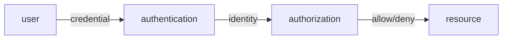

# Information Security 101 (2/10): 인증과 인가

대부분의 침해 사고는 훔친 자격 증명이나 과한 권한 남용에서 시작합니다. 그래서 보안을 실제로 강화하려면 “누구인가”를 확인하는 과정과 “무엇을 해도 되는가”를 판단하는 과정을 분리해서 봐야 합니다. 둘을 한 덩어리로 다루면 로그인은 되는데 권한이 비정상적으로 열려 있거나, 반대로 권한 모델은 멀쩡한데 인증이 약해 전체가 무너지는 일이 생깁니다.

이 글은 Information Security 101 시리즈의 2번째 글입니다.

## 먼저 던지는 질문

- 인증과 인가의 정확한 차이는 무엇일까요?
- 비밀번호, MFA, 생체 인증은 어떤 보안 모델 위에 있을까요?
- 세션과 토큰, 특히 JWT는 무엇이 다를까요?

## 큰 그림


*Information Security 101 2장 흐름 개요*

그림은 사용자 신원 → 인증 확인 → 권한 결정 → 리소스 접근 과정의 네 단계를 보여줍니다. 각 단계에서 남길 증거와 실패 시 기록할 신호를 명확히 설정하는 것이 중요합니다.

> 인증과 인가는 신원만 확인하는 것이 아니라 '사용자 X가 시간 Y에 장소 Z에서 권한 W로 작업을 수행했다'는 증거를 로그로 남기는 데 중점입니다.

## 왜 중요한가

대형 침해 사고의 상당수는 도난된 계정이나 과도한 권한에서 시작합니다. 인증과 인가를 분리해서 설계하면 보안의 가장 큰 두 문을 동시에 좁힐 수 있습니다. 반대로 둘을 섞어 두면 로그인, 세션 관리, 권한 부여, 토큰 갱신이 한 덩어리로 얽혀 운영도 디버깅도 어려워집니다.

신원을 확인하는 책임과 권한을 판단하는 책임은 다릅니다. 이 분리가 명확할수록 시스템을 교체하거나 확장할 때도 흔들림이 적습니다.

## 한눈에 보는 개념



먼저 신원을 확인하고, 그다음 그 신원에 연결된 권한을 검사합니다. 이 두 단계는 시간상으로도, 코드 구조상으로도 분리되어야 합니다.

## 핵심 용어

- 인증: 사용자가 주장하는 신원이 맞는지 확인합니다.
- 인가: 그 신원이 특정 자원에 접근해도 되는지 결정합니다.
- **MFA**: 지식, 소유, 생체 요소 중 두 가지 이상을 조합하는 방식입니다.
- **세션과 토큰**: 서버가 상태를 들고 있는 방식과 토큰이 스스로 증거가 되는 방식을 가리킵니다.
- **RBAC / ABAC**: 역할 기반과 속성 기반 권한 모델입니다.

## 전후 비교

### 이전 — 비밀번호만 사용

```text
once leaked, permanent intrusion
```

### 이후 — 비밀번호 + MFA + 토큰 만료 + RBAC

```text
multi-factor, time-limited, permission-split -> one weak link does not break everything
```

방어는 한 가지가 아니라 여러 층으로 쌓입니다. 한 요소가 무너져도 전체가 바로 뚫리지 않게 만드는 것이 핵심입니다.

## 단계별 실습: 짧은 코드로 보는 인증과 인가

### 1단계 — 비밀번호를 안전하게 저장합니다

```python
# 1_password.py
import bcrypt
def hash_pw(pw): return bcrypt.hashpw(pw.encode(), bcrypt.gensalt(12))
def check_pw(pw, h): return bcrypt.checkpw(pw.encode(), h)
```

bcrypt, argon2, scrypt처럼 의도적으로 느린 해시를 써야 합니다. SHA-256은 비밀번호 해시 함수가 아닙니다.

### 2단계 — TOTP 기반 MFA를 붙입니다

```python
# 2_totp.py
import pyotp
totp = pyotp.TOTP("JBSWY3DPEHPK3PXP")
print(totp.now())                   # 6-digit code
print(totp.verify("123456"))        # bool
```

휴대전화 안의 시드처럼 소유 요소가 추가되면 한 요소가 깨져도 바로 계정이 넘어가지 않습니다.

### 3단계 — 세션과 JWT를 비교합니다

```python
# 3_session_vs_jwt.py
# session: server stores sid -> user (easy to revoke, stateful)
# jwt:    token carries user/exp/sig (hard to revoke, stateless)
import jwt
t = jwt.encode({"sub": "u1", "exp": 9999999999}, "secret", algorithm="HS256")
print(jwt.decode(t, "secret", algorithms=["HS256"]))
```

세션은 폐기가 쉽고 상태를 들고 갑니다. JWT는 마이크로서비스 간 무상태 호출에 편리하지만, 비밀키가 새면 전체 위조가 가능해집니다.

### 4단계 — OAuth 2.0 인가 코드 흐름을 봅니다

```text
4_oauth.txt
client -> auth server: GET /authorize?response_type=code
user logs in & consents
auth server -> client: redirect with ?code=...
client -> auth server: POST /token (code + secret) -> access_token
client -> resource server: GET /api with Bearer access_token
```

OAuth의 핵심은 제3자 애플리케이션에 비밀번호를 넘기지 않는 데 있습니다.

### 5단계 — RBAC로 권한을 판단합니다

```python
# 5_rbac.py
ROLE_PERMS = {"admin": {"read","write","delete"}, "user": {"read"}}
def can(role, action): return action in ROLE_PERMS.get(role, set())
print(can("user", "delete"))   # False
```

작은 시스템에서는 역할에 권한 집합을 묶는 방식만으로도 충분히 명확한 인가 모델을 만들 수 있습니다.

## 이 코드와 예제에서 먼저 볼 점

- 비밀번호는 빠른 해시로 저장하지 않습니다. 일부러 느려야 합니다.
- MFA의 약속은 “하나가 깨져도 끝나지 않는다”는 데 있습니다.
- JWT 보안의 핵심은 키 관리입니다. 비밀키 유출은 전체 토큰 위조로 이어집니다.
- 액세스 토큰은 짧게, 리프레시 토큰은 더 엄격하게 다뤄야 합니다.

## 자주 하는 실수 다섯 가지

1. **MD5나 SHA로 비밀번호를 해시하는 실수**: GPU로 대량 시도가 가능합니다.
2. **JWT 수명을 너무 길게 잡는 실수**: 탈취 뒤에 대응할 수단이 거의 없어집니다.
3. **클라이언트에서만 인가를 검사하는 실수**: 서버 검사가 없으면 방어가 없습니다.
4. **모든 권한을 한 역할에 몰아넣는 실수**: 최소 권한 원칙을 깨뜨립니다.
5. **로그인 오류를 지나치게 자세히 보여 주는 실수**: 사용자 열거 공격을 돕습니다.

## 실무에서는 이렇게 나타납니다

대부분의 웹과 모바일 서비스는 OAuth 위에 OIDC를 올려 SSO를 구현합니다. 클라우드 IAM은 RBAC와 ABAC를 함께 사용하고, 큰 조직일수록 SSO, MFA, 짧은 토큰 수명, 감사 로그를 표준 조합으로 굳힙니다. 인증은 외부 IdP에 맡기고, 인가는 정책 엔진이나 중앙 권한 서비스로 분리하는 흐름도 점점 일반적입니다.

## 시니어 엔지니어는 이렇게 생각합니다

- 인증을 직접 구현하지 않고 검증된 제품이나 서비스를 씁니다.
- 인가 규칙은 코드에서 분리해 정책 엔진으로 옮깁니다.
- MFA를 예외가 아니라 기본값으로 봅니다.
- 토큰은 빠르게 만료시키고, 갱신 흐름은 별도로 관리합니다.
- 권한 변경 기록은 반드시 감사 로그에 남깁니다.

## 체크리스트

- [ ] 인증과 인가의 차이를 한 줄로 말할 수 있습니까?
- [ ] 비밀번호 해시 함수가 갖춰야 할 조건을 설명할 수 있습니까?
- [ ] 세션과 JWT의 트레이드오프를 설명할 수 있습니까?
- [ ] OAuth 인가 코드 흐름을 그릴 수 있습니까?
- [ ] RBAC와 ABAC 중 무엇이 맞는지 판단할 수 있습니까?

## 연습 문제

1. 여러분 서비스의 로그인 흐름을 세션과 토큰 관점에서 도식화해 보세요.
2. 길이, 복잡도, 잠금 정책을 포함한 비밀번호 정책 한 장을 작성해 보세요.
3. 가장 위험한 권한 하나를 골라 그 권한 중심으로 RBAC 매트릭스를 설계해 보세요.

## 정리와 다음 글

인증과 인가는 보안에서 가장 큰 두 문입니다. 신원을 확인하는 일과 권한을 판단하는 일을 분리해 두어야 나중에 시스템이 커져도 흔들리지 않습니다. 다음 글에서는 데이터를 보호하는 바닥 기술인 암호화와 해시를 다룹니다.


## 인증 방식 비교: 비밀번호, MFA, SSO

인증 설계를 논의할 때 가장 흔한 실패는 기술 이름만 나열하고 공격 모델을 빼먹는 것입니다. 아래 표는 서로 다른 인증 방식이 어떤 공격에 강하고 약한지 요약합니다.

| 방식 | 장점 | 약점 | 권장 적용 |
| --- | --- | --- | --- |
| 비밀번호 단독 | 구현 단순, 비용 낮음 | 피싱/재사용/유출에 취약 | 개발 환경, 저위험 내부 도구에만 제한 |
| 비밀번호 + MFA(TOTP/WebAuthn) | 계정 탈취 난이도 상승 | 복구 절차가 약하면 우회 가능 | 기본 사용자 인증 표준으로 권장 |
| SSO(OIDC/SAML) | 중앙 통제, 감사 일원화 | IdP 장애 시 광범위 영향 | 다수 서비스 운영 조직의 기본 선택 |

MFA는 사용성 비용이 있지만, 계정 탈취의 성공 확률을 가장 직접적으로 낮춥니다. SSO는 보안 기능이 아니라 운영 모델이라는 관점으로 접근해야 합니다. 즉, 로그인 UX가 아니라 계정 수명주기, 비활성화 전파, 감사 추적을 함께 설계해야 효과가 납니다.

## Python으로 보는 비밀번호 저장 최소 기준

다음 예시는 bcrypt를 사용해 비밀번호를 저장하고 검증하는 최소 패턴입니다. 핵심은 해시 결과만 저장하고 평문 비밀번호를 어디에도 남기지 않는 것입니다.

```python
# auth_password_store.py
import bcrypt
from typing import Final

COST: Final[int] = 12

def hash_password(raw_password: str) -> str:
    hashed = bcrypt.hashpw(raw_password.encode("utf-8"), bcrypt.gensalt(rounds=COST))
    return hashed.decode("utf-8")

def verify_password(raw_password: str, hashed_password: str) -> bool:
    return bcrypt.checkpw(raw_password.encode("utf-8"), hashed_password.encode("utf-8"))

# 예시
stored = hash_password("CorrectHorseBatteryStaple!")
print(verify_password("CorrectHorseBatteryStaple!", stored))  # True
print(verify_password("wrong-password", stored))               # False
```

이 코드에서 놓치기 쉬운 운영 포인트가 있습니다.

- 비용 계수(rounds)는 하드웨어 성능 변화에 맞춰 주기적으로 상향 검토해야 합니다.
- 로그인 실패 횟수 제한과 지연(backoff)이 없으면 온라인 추측 공격에 취약합니다.
- 해시 업그레이드(예: rounds 10 -> 12)는 로그인 성공 시점에 점진 재해시 방식으로 이행할 수 있습니다.

## SSO 도입 시 체크해야 할 경계

SSO를 붙이면 서비스별 로그인 구현을 줄일 수 있지만, 인가 경계를 자동으로 해결해 주지는 않습니다. 다음 항목을 분리해야 합니다.

| 영역 | SSO가 담당하는 것 | 애플리케이션이 담당하는 것 |
| --- | --- | --- |
| 신원 증명 | 사용자 인증, MFA, 계정 잠금 | 토큰 검증 결과 소비 |
| 권한 판단 | 기본 클레임 발급(groups/roles) | 리소스 단위 인가 정책 |
| 감사 | 로그인 이벤트 | 도메인 행위 이벤트(예: 송금 승인) |

즉, “SSO를 도입했으니 권한도 안전하다”는 결론은 성립하지 않습니다. 신원과 권한은 끝까지 분리해서 다뤄야 합니다.

## 인가 누수를 줄이는 권한 매트릭스

인증이 잘 되어도 인가가 느슨하면 데이터 노출은 그대로 발생합니다. 최소한 아래 형태의 권한 매트릭스는 유지해야 합니다.

| 리소스/행위 | viewer | editor | admin |
| --- | --- | --- | --- |
| 보고서 조회 | allow | allow | allow |
| 보고서 수정 | deny | allow | allow |
| 사용자 권한 변경 | deny | deny | allow |
| 결제 환불 승인 | deny | deny | allow |

권한 매트릭스는 문서로 끝나면 안 되고, API 테스트로 검증되어야 합니다. 예를 들어 `viewer`가 수정 API를 호출하면 403이 나와야 한다는 규칙을 CI에서 검사해야 합니다.


## 운영 점검 루프와 문서화 기준

보안 글에서 가장 자주 빠지는 부분은 "그래서 운영에서는 무엇을 주기적으로 확인할 것인가"입니다. 아래 루프를 기준으로 문서화하면 개념이 실무로 연결됩니다.

| 주기 | 점검 항목 | 산출물 |
| --- | --- | --- |
| 매일 | 고위험 경보, 인증 실패 급증, 권한 거부 급증 | 일일 보안 브리핑 |
| 매주 | 신규 배포 변경점의 보안 영향 | 변경 검토 노트 |
| 매월 | 키/토큰/인증서 만료 예정, 미사용 권한, 미사용 시크릿 | 월간 정리 리포트 |
| 분기 | 위협 모델 재평가, 런북 훈련, 통제 효과 검토 | 분기 보안 회고 |

실행 가능한 문서의 조건도 분명해야 합니다.

- 담당자(owner)와 대체 담당자가 명시되어야 합니다.
- 실패 조건과 에스컬레이션 기준이 수치로 정의되어야 합니다.
- 점검 결과가 티켓이나 액션 아이템으로 추적되어야 합니다.
- 예외 승인에는 만료일이 반드시 있어야 합니다.

보안은 단발성 프로젝트가 아니라 운영 루프입니다. 같은 점검을 반복해도 기준이 유지될 때 품질이 올라갑니다.


## 처음 질문으로 돌아가기

- **인증과 인가의 정확한 차이는 무엇일까요?**
  - 비밀번호 저장, 로그인 검증, 세션 생성, 권한 확인 각 단계에서 어떤 로그가 남고 언제 실패 처리되는지 명확히 합니다.
- **비밀번호, MFA, 생체 인증은 어떤 보안 모델 위에 있을까요?**
  - bcrypt 해싱, TOTP 생성, JWT 토큰, RBAC 정책이 각각 어느 경계에서 처리되고, 실패는 어디서 로그되는지를 추적하면 보안 구조가 명확해집니다.
- **세션과 토큰, 특히 JWT는 무엇이 다를까요?**
  - 로그인 실패 임계값, 토큰 갱신 정책, 권한 변경 감시 규칙을 정의하고, 권한 누수가 없는지 정기적으로 감사합니다.

<!-- toc:begin -->
## 시리즈 목차

- [Information Security 101 (1/10): 정보보안이란 무엇인가?](./01-what-is-information-security.md)
- **인증과 인가 (현재 글)**
- 암호화와 해시 (예정)
- TLS와 인증서 (예정)
- 웹 보안 기초 (예정)
- SQL 인젝션과 XSS (예정)
- 비밀 정보 관리 (예정)
- 권한 최소화 (예정)
- 로그와 감사 (예정)
- 보안 사고 대응 (예정)

<!-- toc:end -->

## 참고 자료

- [OWASP Authentication Cheat Sheet](https://cheatsheetseries.owasp.org/cheatsheets/Authentication_Cheat_Sheet.html)
- [OAuth 2.0 RFC 6749](https://datatracker.ietf.org/doc/html/rfc6749)
- [OpenID Connect Core](https://openid.net/specs/openid-connect-core-1_0.html)
- [NIST SP 800-63B Digital Identity](https://pages.nist.gov/800-63-3/sp800-63b.html)

Tags: Computer Science, Security, Authentication, Authorization, OAuth, RBAC
