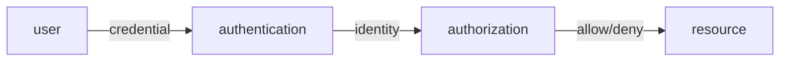

# 인증과 인가

대부분의 침해 사고는 훔친 자격 증명이나 과한 권한 남용에서 시작합니다. 그래서 보안을 실제로 강화하려면 “누구인가”를 확인하는 과정과 “무엇을 해도 되는가”를 판단하는 과정을 분리해서 봐야 합니다. 둘을 한 덩어리로 다루면 로그인은 되는데 권한이 비정상적으로 열려 있거나, 반대로 권한 모델은 멀쩡한데 인증이 약해 전체가 무너지는 일이 생깁니다.

이 글은 Information Security 101 시리즈의 2번째 글입니다.

## 이 글에서 다룰 문제

인증과 인가는 늘 함께 등장하지만 같은 질문이 아닙니다. 먼저 신원을 확인하고, 그다음 그 신원이 어떤 자원에 접근할 수 있는지 판단해야 현대 애플리케이션의 보안 경계가 또렷해집니다.

> 인증은 신원을 확인하는 일이고, 인가는 그 신원이 무엇을 할 수 있는지 결정하는 일입니다.

- 인증과 인가의 정확한 차이는 무엇일까요?
- 비밀번호, MFA, 생체 인증은 어떤 보안 모델 위에 있을까요?
- 세션과 토큰, 특히 JWT는 무엇이 다를까요?
- OAuth 2.0과 OIDC는 어디서 쓰일까요?
- RBAC와 ABAC 중 무엇을 언제 선택해야 할까요?

## 왜 중요한가

대형 침해 사고의 상당수는 도난된 계정이나 과도한 권한에서 시작합니다. 인증과 인가를 분리해서 설계하면 보안의 가장 큰 두 문을 동시에 좁힐 수 있습니다. 반대로 둘을 섞어 두면 로그인, 세션 관리, 권한 부여, 토큰 갱신이 한 덩어리로 얽혀 운영도 디버깅도 어려워집니다.

신원을 확인하는 책임과 권한을 판단하는 책임은 다릅니다. 이 분리가 명확할수록 시스템을 교체하거나 확장할 때도 흔들림이 적습니다.

## 한눈에 보는 개념



먼저 신원을 확인하고, 그다음 그 신원에 연결된 권한을 검사합니다. 이 두 단계는 시간상으로도, 코드 구조상으로도 분리되어야 합니다.

## 핵심 용어

- 인증: 사용자가 주장하는 신원이 맞는지 확인합니다.
- 인가: 그 신원이 특정 자원에 접근해도 되는지 결정합니다.
- **MFA**: 지식, 소유, 생체 요소 중 두 가지 이상을 조합하는 방식입니다.
- **세션과 토큰**: 서버가 상태를 들고 있는 방식과 토큰이 스스로 증거가 되는 방식을 가리킵니다.
- **RBAC / ABAC**: 역할 기반과 속성 기반 권한 모델입니다.

## 전후 비교

### 이전 — 비밀번호만 사용

```text
once leaked, permanent intrusion
```

### 이후 — 비밀번호 + MFA + 토큰 만료 + RBAC

```text
multi-factor, time-limited, permission-split -> one weak link does not break everything
```

방어는 한 가지가 아니라 여러 층으로 쌓입니다. 한 요소가 무너져도 전체가 바로 뚫리지 않게 만드는 것이 핵심입니다.

## 단계별 실습: 짧은 코드로 보는 인증과 인가

### 1단계 — 비밀번호를 안전하게 저장합니다

```python
# 1_password.py
import bcrypt
def hash_pw(pw): return bcrypt.hashpw(pw.encode(), bcrypt.gensalt(12))
def check_pw(pw, h): return bcrypt.checkpw(pw.encode(), h)
```

bcrypt, argon2, scrypt처럼 의도적으로 느린 해시를 써야 합니다. SHA-256은 비밀번호 해시 함수가 아닙니다.

### 2단계 — TOTP 기반 MFA를 붙입니다

```python
# 2_totp.py
import pyotp
totp = pyotp.TOTP("JBSWY3DPEHPK3PXP")
print(totp.now())                   # 6-digit code
print(totp.verify("123456"))        # bool
```

휴대전화 안의 시드처럼 소유 요소가 추가되면 한 요소가 깨져도 바로 계정이 넘어가지 않습니다.

### 3단계 — 세션과 JWT를 비교합니다

```python
# 3_session_vs_jwt.py
# session: server stores sid -> user (easy to revoke, stateful)
# jwt:    token carries user/exp/sig (hard to revoke, stateless)
import jwt
t = jwt.encode({"sub": "u1", "exp": 9999999999}, "secret", algorithm="HS256")
print(jwt.decode(t, "secret", algorithms=["HS256"]))
```

세션은 폐기가 쉽고 상태를 들고 갑니다. JWT는 마이크로서비스 간 무상태 호출에 편리하지만, 비밀키가 새면 전체 위조가 가능해집니다.

### 4단계 — OAuth 2.0 인가 코드 흐름을 봅니다

```text
4_oauth.txt
client -> auth server: GET /authorize?response_type=code
user logs in & consents
auth server -> client: redirect with ?code=...
client -> auth server: POST /token (code + secret) -> access_token
client -> resource server: GET /api with Bearer access_token
```

OAuth의 핵심은 제3자 애플리케이션에 비밀번호를 넘기지 않는 데 있습니다.

### 5단계 — RBAC로 권한을 판단합니다

```python
# 5_rbac.py
ROLE_PERMS = {"admin": {"read","write","delete"}, "user": {"read"}}
def can(role, action): return action in ROLE_PERMS.get(role, set())
print(can("user", "delete"))   # False
```

작은 시스템에서는 역할에 권한 집합을 묶는 방식만으로도 충분히 명확한 인가 모델을 만들 수 있습니다.

## 이 코드와 예제에서 먼저 볼 점

- 비밀번호는 빠른 해시로 저장하지 않습니다. 일부러 느려야 합니다.
- MFA의 약속은 “하나가 깨져도 끝나지 않는다”는 데 있습니다.
- JWT 보안의 핵심은 키 관리입니다. 비밀키 유출은 전체 토큰 위조로 이어집니다.
- 액세스 토큰은 짧게, 리프레시 토큰은 더 엄격하게 다뤄야 합니다.

## 자주 하는 실수 다섯 가지

1. **MD5나 SHA로 비밀번호를 해시하는 실수**: GPU로 대량 시도가 가능합니다.
2. **JWT 수명을 너무 길게 잡는 실수**: 탈취 뒤에 대응할 수단이 거의 없어집니다.
3. **클라이언트에서만 인가를 검사하는 실수**: 서버 검사가 없으면 방어가 없습니다.
4. **모든 권한을 한 역할에 몰아넣는 실수**: 최소 권한 원칙을 깨뜨립니다.
5. **로그인 오류를 지나치게 자세히 보여 주는 실수**: 사용자 열거 공격을 돕습니다.

## 실무에서는 이렇게 나타납니다

대부분의 웹과 모바일 서비스는 OAuth 위에 OIDC를 올려 SSO를 구현합니다. 클라우드 IAM은 RBAC와 ABAC를 함께 사용하고, 큰 조직일수록 SSO, MFA, 짧은 토큰 수명, 감사 로그를 표준 조합으로 굳힙니다. 인증은 외부 IdP에 맡기고, 인가는 정책 엔진이나 중앙 권한 서비스로 분리하는 흐름도 점점 일반적입니다.

## 시니어 엔지니어는 이렇게 생각합니다

- 인증을 직접 구현하지 않고 검증된 제품이나 서비스를 씁니다.
- 인가 규칙은 코드에서 분리해 정책 엔진으로 옮깁니다.
- MFA를 예외가 아니라 기본값으로 봅니다.
- 토큰은 빠르게 만료시키고, 갱신 흐름은 별도로 관리합니다.
- 권한 변경 기록은 반드시 감사 로그에 남깁니다.

## 체크리스트

- [ ] 인증과 인가의 차이를 한 줄로 말할 수 있습니까?
- [ ] 비밀번호 해시 함수가 갖춰야 할 조건을 설명할 수 있습니까?
- [ ] 세션과 JWT의 트레이드오프를 설명할 수 있습니까?
- [ ] OAuth 인가 코드 흐름을 그릴 수 있습니까?
- [ ] RBAC와 ABAC 중 무엇이 맞는지 판단할 수 있습니까?

## 연습 문제

1. 여러분 서비스의 로그인 흐름을 세션과 토큰 관점에서 도식화해 보세요.
2. 길이, 복잡도, 잠금 정책을 포함한 비밀번호 정책 한 장을 작성해 보세요.
3. 가장 위험한 권한 하나를 골라 그 권한 중심으로 RBAC 매트릭스를 설계해 보세요.

## 정리와 다음 글

인증과 인가는 보안에서 가장 큰 두 문입니다. 신원을 확인하는 일과 권한을 판단하는 일을 분리해 두어야 나중에 시스템이 커져도 흔들리지 않습니다. 다음 글에서는 데이터를 보호하는 바닥 기술인 암호화와 해시를 다룹니다.

<!-- toc:begin -->
- [정보보안이란 무엇인가?](./01-what-is-information-security.md)
- **인증과 인가 (현재 글)**
- 암호화와 해시 (예정)
- TLS와 인증서 (예정)
- Web 보안 기초 (예정)
- SQL Injection과 XSS (예정)
- secret 관리 (예정)
- 권한 최소화 (예정)
- 로그와 감사 (예정)
- 보안 사고 대응 (예정)
<!-- toc:end -->

## 참고 자료

- [OWASP Authentication Cheat Sheet](https://cheatsheetseries.owasp.org/cheatsheets/Authentication_Cheat_Sheet.html)
- [OAuth 2.0 RFC 6749](https://datatracker.ietf.org/doc/html/rfc6749)
- [OpenID Connect Core](https://openid.net/specs/openid-connect-core-1_0.html)
- [NIST SP 800-63B Digital Identity](https://pages.nist.gov/800-63-3/sp800-63b.html)

Tags: Computer Science, Security, Authentication, Authorization, OAuth, RBAC
