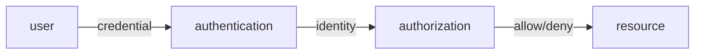

# 인증과 인가

> Information Security 101 시리즈 (2/10)


## 이 글에서 다룰 문제

대부분의 침해 사고는 자격 증명 탈취 또는 권한 오용에서 시작합니다. 인증과 인가의 분리, 그리고 각각의 적절한 패턴을 이해하면 사고의 큰 문 두 개를 닫을 수 있습니다.

> "누구"를 확인하는 것과 "무엇을"을 결정하는 것은 다른 책임입니다.

## 전체 흐름


먼저 신원을 확인하고, 그 신원에 대해 권한을 확인합니다. 두 단계는 시간적으로도 코드적으로도 분리됩니다.

## Before/After

**Before — password만으로 끝**

```text
한 번 유출되면 영구 침투
```

**After — password + MFA + 토큰 만료 + RBAC**

```text
다단계, 시간 제한, 권한 분리 -> 한 약점이 전체를 깨지 않음
```

방어는 한 겹이 아니라 여러 겹입니다.

## 인증과 인가 짧은 코드

### 1단계 — 안전한 password 저장

```python
# 예시 파일: 1_password.py
import bcrypt
def hash_pw(pw): return bcrypt.hashpw(pw.encode(), bcrypt.gensalt(12))
def check_pw(pw, h): return bcrypt.checkpw(pw.encode(), h)
```

bcrypt/argon2/scrypt — 의도적으로 느린 해시. SHA-256은 password용이 아닙니다.

### 2단계 — TOTP MFA

```python
# 예시 파일: 2_totp.py
import pyotp
totp = pyotp.TOTP("JBSWY3DPEHPK3PXP")
print(totp.now())                   # 6자리 숫자
print(totp.verify("123456"))        # bool
```

possession 요소(휴대폰의 시드)를 추가해 한 단계가 깨져도 안전합니다.

### 3단계 — 세션 vs JWT

```python
# 예시 파일: 3_session_vs_jwt.py
# session: 서버가 sid -> user를 저장 (폐기 쉬움, 상태 필요)
# jwt:    토큰에 user/exp/sig를 담음 (폐기 어려움, 상태 없음)
import jwt
t = jwt.encode({"sub": "u1", "exp": 9999999999}, "secret", algorithm="HS256")
print(jwt.decode(t, "secret", algorithms=["HS256"]))
```

revoke가 자주 필요하면 세션, 마이크로서비스 간 stateless 호출이면 JWT.

### 4단계 — OAuth 2.0 authorization code (의사코드)

```text
4_oauth.txt
client -> auth server: GET /authorize?response_type=code
user logs in & consents
auth server -> client: redirect with ?code=...
client -> auth server: POST /token (code + secret) -> access_token
client -> resource server: GET /api with Bearer access_token
```

password를 third-party에 절대 주지 않는 것이 OAuth의 본질입니다.

### 5단계 — RBAC 결정

```python
# 예시 파일: 5_rbac.py
ROLE_PERMS = {"admin": {"read","write","delete"}, "user": {"read"}}
def can(role, action): return action in ROLE_PERMS.get(role, set())
print(can("user", "delete"))   # False
```

역할에 권한 집합을 묶는 가장 단순한 인가. 작은 시스템엔 이걸로 충분합니다.

## 이 코드에서 주목할 점

- password는 빠른 해시로 저장하지 않습니다 — 의도적으로 느리게.
- MFA는 "한 요소가 깨져도"의 약속입니다.
- JWT는 sign 키 관리가 본질, secret 노출은 모든 토큰을 위조 가능하게 만듭니다.
- OAuth의 access_token은 짧게, refresh_token은 안전한 곳에.

## 자주 하는 실수 5가지

1. **MD5/SHA로 password를 해시.** GPU로 분당 수십억 회 시도 가능.
2. **JWT를 long-lived로 사용.** revoke 불가, 탈취 시 대응 불가.
3. **인가 검사를 클라이언트에 둔다.** 서버 검사 없으면 결국 무방비.
4. **role 하나에 모든 권한 묶기.** 권한 최소화 원칙 위반.
5. **로그인 실패에 자세한 메시지.** 사용자 enumeration 가능.

## 실무에서는 이렇게 쓰입니다

웹/모바일 앱 거의 모두가 OIDC(OAuth 위의 ID 표준)와 SSO를 사용합니다. 클라우드는 IAM이 RBAC + ABAC 혼합. 큰 조직은 SSO + MFA + 짧은 토큰 + 감사 로그를 표준 조합으로 둡니다.

## 체크리스트

- [ ] 인증과 인가의 차이를 한 줄로 말할 수 있는가?
- [ ] password 해시 함수의 조건을 답할 수 있는가?
- [ ] 세션과 JWT의 트레이드오프를 설명할 수 있는가?
- [ ] OAuth authorization code 흐름을 그릴 수 있는가?
- [ ] RBAC와 ABAC를 언제 쓸지 판단할 수 있는가?

## 정리 및 다음 단계

인증과 인가는 보안의 가장 큰 문 두 개입니다. 다음 글에서는 데이터 보호의 기본기 — 암호화와 해시 — 를 다룹니다.

<!-- toc:begin -->
- [정보보안이란 무엇인가?](./01-what-is-information-security.md)
- **인증과 인가 (현재 글)**
- 암호화와 해시 (예정)
- TLS와 인증서 (예정)
- Web 보안 기초 (예정)
- SQL Injection과 XSS (예정)
- secret 관리 (예정)
- 권한 최소화 (예정)
- 로그와 감사 (예정)
- 보안 사고 대응 (예정)
<!-- toc:end -->

## 참고 자료

- [OWASP Authentication Cheat Sheet](https://cheatsheetseries.owasp.org/cheatsheets/Authentication_Cheat_Sheet.html)
- [OAuth 2.0 RFC 6749](https://datatracker.ietf.org/doc/html/rfc6749)
- [OpenID Connect Core](https://openid.net/specs/openid-connect-core-1_0.html)
- [NIST SP 800-63B Digital Identity](https://pages.nist.gov/800-63-3/sp800-63b.html)

Tags: Computer Science, Security, Authentication, Authorization, OAuth, RBAC
