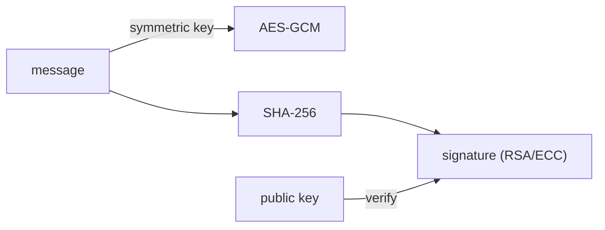

# Information Security 101 (3/10): 암호화와 해시

암호화 이야기를 처음 들으면 “일단 암호화하면 안전하다”는 식으로 받아들이기 쉽습니다. 하지만 실제 사고는 약한 알고리즘보다 잘못된 조합에서 더 자주 나옵니다. 기밀성을 지키려는 도구와 무결성을 검증하려는 도구를 섞어 쓰거나, 강한 알고리즘을 잘못된 방식으로 운용하면 오히려 더 위험해집니다.

이 글은 Information Security 101 시리즈의 3번째 글입니다.

## 먼저 던지는 질문

- 대칭키와 공개키 암호화는 어떻게 다를까요?
- 해시와 HMAC은 어디서 갈릴까요?
- 왜 단순 암호화만으로는 충분하지 않고 AEAD가 필요할까요?

## 큰 그림


*Information Security 101 3장 흐름 개요*

그림은 평문 데이터 → 암호 또는 해시로 변환 → 저장 또는 검증 → 운영 중 감시의 흐름을 보여줍니다. 암호화는 역계산 가능, 해시는 일방향이라는 차이가 어디서 생기는지 추적하는 것이 중요합니다.

> 암호화와 해시는 데이터를 숨기는 것이 아니라 '이 데이터는 변조되지 않았다' 또는 '이 데이터는 인가된 사람만 볼 수 있다'를 증명하는 메커니즘입니다.

## 왜 중요한가

암호 관련 사고의 대부분은 약한 알고리즘이 아니라 틀린 조합에서 시작합니다. 무엇이 기밀성을 보장하고 무엇이 무결성을 보장하는지 모르면, 안전해 보이는 구현도 한순간에 깨집니다. 예를 들어 암호화만 하고 인증을 하지 않으면 복호화 과정에서 변조를 놓칠 수 있고, 해시만 써 놓고 출처까지 확인된다고 착각하면 공격 표면이 남습니다.

알고리즘은 도구일 뿐입니다. 안전성은 도구를 고르는 감각과 운용 방식에서 결정됩니다.

## 한눈에 보는 개념



암호화는 비밀을 지키고, 해시는 무결성을 확인하고, 전자서명은 누가 만들었는지까지 증명합니다. 이름은 비슷해 보여도 역할은 다릅니다.

## 핵심 용어

- **대칭키 암호화**: 같은 키로 암호화와 복호화를 합니다. 대표적으로 AES가 있습니다.
- **공개키 암호화**: 공개키와 개인키 쌍을 사용합니다. RSA와 ECC가 여기에 들어갑니다.
- 해시: 임의 길이 입력을 고정 길이 출력으로 바꾸는 단방향 함수입니다.
- **HMAC**: 키와 해시를 조합해 변조를 막는 방식입니다.
- **AEAD**: 암호화와 인증을 한 번에 처리합니다. AES-GCM, ChaCha20-Poly1305가 대표적입니다.

## 전후 비교

### 이전 — AES-CBC만 사용

```text
attacker tampers ciphertext -> wrong plaintext on decrypt -> exploited
```

### 이후 — AES-GCM 사용

```text
tampered ciphertext is rejected at decryption -> authenticated secrecy
```

현대 암호화에서 중요한 기준은 “암호화했다”가 아니라 “인증된 암호화까지 했는가”입니다.

## 단계별 실습: 코드로 보는 차이

### 1단계 — AES-GCM으로 대칭키 암호화를 합니다

```python
# 1_aes_gcm.py
from cryptography.hazmat.primitives.ciphers.aead import AESGCM
import os
key = AESGCM.generate_key(bit_length=256)
aes = AESGCM(key)
nonce = os.urandom(12)
ct = aes.encrypt(nonce, b"hello", None)
print(aes.decrypt(nonce, ct, None))   # b'hello'
```

같은 키에서 nonce를 재사용하면 GCM의 안전성이 무너집니다. 강한 알고리즘도 운용 규칙을 어기면 의미가 없습니다.

### 2단계 — SHA-256과 HMAC을 비교합니다

```python
# 2_hash_hmac.py
import hashlib, hmac
print(hashlib.sha256(b"hello").hexdigest())
print(hmac.new(b"secret", b"hello", hashlib.sha256).hexdigest())
```

SHA만으로는 누가 그 다이제스트를 만들었는지 알 수 없습니다. HMAC은 키 소유자만 만들 수 있다는 보장을 더합니다.

### 3단계 — RSA 서명과 검증을 봅니다

```python
# 3_rsa.py
from cryptography.hazmat.primitives.asymmetric import rsa, padding
from cryptography.hazmat.primitives import hashes
priv = rsa.generate_private_key(public_exponent=65537, key_size=2048)
pub = priv.public_key()
msg = b"hello"
sig = priv.sign(msg, padding.PSS(mgf=padding.MGF1(hashes.SHA256()), salt_length=32), hashes.SHA256())
pub.verify(sig, msg, padding.PSS(mgf=padding.MGF1(hashes.SHA256()), salt_length=32), hashes.SHA256())
```

전자서명은 무결성과 출처 검증을 함께 해결합니다. 누가 만들었는지와 중간에 바뀌지 않았는지를 동시에 말할 수 있습니다.

### 4단계 — 안전한 난수를 사용합니다

```python
# 4_random.py
import secrets
print(secrets.token_bytes(16))
print(secrets.token_urlsafe(32))
```

키, nonce, 토큰은 `random.random()`이 아니라 `secrets`로 생성해야 합니다. 운영체제 엔트로피를 쓰는 안전한 난수가 필요합니다.

### 5단계 — 잘못된 패턴을 같이 봅니다

```python
# 5_bad.py
# import md5      # collisions found -> integrity not assured
# AES-ECB         # identical plaintext blocks -> identical ciphertext
# reused nonce    # GCM safety destroyed
```

무엇을 쓰면 안 되는지 아는 것도 절반의 방어입니다. 실제 장애와 취약점은 금지 패턴을 모른 채 반복해서 들어오는 경우가 많습니다.

## 이 코드와 예제에서 먼저 볼 점

- AES-GCM은 nonce 재사용에 특히 약합니다.
- HMAC 키는 절대 새면 안 됩니다.
- 전자서명은 출처와 무결성을 함께 보장합니다.
- 안전한 난수는 운영체제 엔트로피에서 나와야 합니다.

## 자주 하는 실수 다섯 가지

1. **MD5나 SHA1을 무결성 검증에 쓰는 실수**: 충돌 공격이 이미 알려져 있습니다.
2. **AES-ECB를 쓰는 실수**: 평문 패턴이 그대로 드러납니다.
3. **GCM nonce를 재사용하는 실수**: 키 복구까지 가능해질 수 있습니다.
4. **`random.random()`으로 키나 토큰을 만드는 실수**: 예측 가능합니다.
5. **자체 알고리즘을 만드는 실수**: 공개 검증 없는 암호는 신뢰할 수 없습니다.

## 실무에서는 이렇게 나타납니다

TLS는 공개키와 대칭키를 함께 사용합니다. 모바일 보안 저장소인 iOS Keychain, Android Keystore, 클라우드 KMS는 결국 키 관리 문제를 안전하게 처리하기 위한 계층입니다. 데이터베이스 투명 암호화도 내부에서는 대개 AES-GCM 같은 현대 알고리즘 위에서 돌아갑니다.

## 시니어 엔지니어는 이렇게 생각합니다

- 새 시스템에서는 AES-GCM이나 ChaCha20-Poly1305만 후보로 봅니다.
- 키는 코드가 아니라 KMS에 둡니다.
- 알고리즘 선택보다 키 회전 전략을 먼저 정합니다.
- 직접 암호를 구현하지 않고 검증된 라이브러리를 씁니다.
- 난수의 출처를 명시적으로 확인합니다.

## 체크리스트

- [ ] 왜 AEAD가 필요한지 설명할 수 있습니까?
- [ ] HMAC과 일반 해시의 차이를 한 줄로 말할 수 있습니까?
- [ ] 키별 nonce와 IV를 어떻게 관리하는지 설명할 수 있습니까?
- [ ] 안전한 난수의 출처를 알고 있습니까?
- [ ] 서명과 암호화를 분명히 구분할 수 있습니까?

## 연습 문제

1. AES-CBC와 AES-GCM의 차이를 한 단락으로 설명해 보세요.
2. HMAC으로 웹훅 서명을 검증하는 의사코드를 적어 보세요.
3. 주기, 저장 위치, 폐기 절차를 포함한 키 회전 정책 한 장을 작성해 보세요.

## 정리와 다음 글

암호화와 해시는 비슷한 말처럼 들리지만 맡는 일이 다릅니다. 어떤 보장을 원하는지 먼저 정한 뒤 도구를 골라야 합니다. 다음 글에서는 이 도구들이 네트워크 위에서 어떻게 결합되는지, TLS와 인증서를 다룹니다.


## 키 접근 제어 관점의 RBAC와 ABAC

암호화 자체가 강해도 키 접근 제어가 약하면 전체 보호가 무너집니다. 이때 자주 쓰는 모델이 RBAC와 ABAC입니다.

| 모델 | 판단 기준 | 장점 | 한계 | 적합한 환경 |
| --- | --- | --- | --- | --- |
| RBAC | 사용자/서비스 역할 | 이해와 운영이 단순 | 세밀한 예외 처리 어려움 | 팀 구조가 안정적인 조직 |
| ABAC | 태그, 시간, 환경 속성 | 세밀한 정책 가능 | 정책 복잡도 상승 | 멀티테넌트/대규모 클라우드 |

예를 들어 KMS 키 접근을 RBAC로만 구성하면 빠르게 시작할 수 있습니다. 하지만 "운영망에서만 복호화 허용", "근무 시간 외 관리자 복호화 금지" 같은 조건이 필요해지면 ABAC 요소를 도입해야 합니다. 결국 실무는 RBAC를 기본으로 두고 ABAC 조건을 점진적으로 겹치는 하이브리드가 많습니다.

## 암호화 알고리즘 비교: 대칭/비대칭/해시

| 구분 | 입력/출력 | 키 필요 여부 | 대표 사용처 | 대표 알고리즘 |
| --- | --- | --- | --- | --- |
| 대칭키 암호화 | 평문 <-> 암호문 | 같은 비밀키 필요 | 대용량 데이터 암호화 | AES-GCM, ChaCha20-Poly1305 |
| 비대칭키 암호화 | 평문 <-> 암호문 | 공개키/개인키 쌍 | 키 교환, 소량 데이터 보호 | RSA-OAEP, ECIES |
| 해시 | 입력 -> 고정 길이 다이제스트 | 키 없음(일반 해시) | 무결성 체크, 중복 식별 | SHA-256, SHA-3 |
| HMAC | 입력 + 비밀키 -> MAC | 비밀키 필요 | API 서명, 메시지 인증 | HMAC-SHA256 |

한 문장으로 정리하면 다음과 같습니다. 대칭키는 빠르고, 비대칭키는 배포와 신뢰 교환에 유리하며, 해시는 역복호화가 불가능한 무결성 도구입니다.

## Python cryptography 예시: AEAD와 서명 검증

```python
# crypto_patterns.py
import os
from cryptography.hazmat.primitives.ciphers.aead import AESGCM
from cryptography.hazmat.primitives import hashes
from cryptography.hazmat.primitives.asymmetric import ed25519

# 1) AEAD 암호화
key = AESGCM.generate_key(bit_length=256)
aes = AESGCM(key)
nonce = os.urandom(12)
aad = b"order-id:2026-0001"
plaintext = b"amount=12900&currency=KRW"
ciphertext = aes.encrypt(nonce, plaintext, aad)
restored = aes.decrypt(nonce, ciphertext, aad)
print(restored)

# 2) 서명/검증
private_key = ed25519.Ed25519PrivateKey.generate()
public_key = private_key.public_key()
message = b"deploy-artifact-sha256:abc123"
signature = private_key.sign(message)
public_key.verify(signature, message)
print("signature verified")
```

이 예시는 두 가지 중요한 운영 메시지를 줍니다.

- 무결성까지 보장하려면 AEAD 모드를 기본값으로 삼아야 합니다.
- 서명 검증은 배포 산출물, 웹훅, 설정 파일 같은 공급망 경계에서 특히 중요합니다.

## 키 권한 매트릭스 예시

암호 시스템 운영은 결국 “누가 어떤 키를 어떤 용도로 쓸 수 있는가”의 문제입니다.

| 키 유형 | 서비스 읽기 | 서비스 쓰기/암호화 | 관리자 복호화 | 비고 |
| --- | --- | --- | --- | --- |
| 결제 데이터 키 | allow | allow | deny(기본) | break-glass만 예외 |
| 로그 서명 키 | deny | allow | deny | 서명 전용 키 |
| 백업 복구 키 | deny | deny | allow(승인 기반) | 2인 승인, 시간 제한 |

권한 매트릭스를 코드와 함께 관리하면 감사 대응이 쉬워지고, 신규 서비스 추가 시 과권한 부여를 줄일 수 있습니다.


## 운영 점검 루프와 문서화 기준

보안 글에서 가장 자주 빠지는 부분은 "그래서 운영에서는 무엇을 주기적으로 확인할 것인가"입니다. 아래 루프를 기준으로 문서화하면 개념이 실무로 연결됩니다.

| 주기 | 점검 항목 | 산출물 |
| --- | --- | --- |
| 매일 | 고위험 경보, 인증 실패 급증, 권한 거부 급증 | 일일 보안 브리핑 |
| 매주 | 신규 배포 변경점의 보안 영향 | 변경 검토 노트 |
| 매월 | 키/토큰/인증서 만료 예정, 미사용 권한, 미사용 시크릿 | 월간 정리 리포트 |
| 분기 | 위협 모델 재평가, 런북 훈련, 통제 효과 검토 | 분기 보안 회고 |

실행 가능한 문서의 조건도 분명해야 합니다.

- 담당자(owner)와 대체 담당자가 명시되어야 합니다.
- 실패 조건과 에스컬레이션 기준이 수치로 정의되어야 합니다.
- 점검 결과가 티켓이나 액션 아이템으로 추적되어야 합니다.
- 예외 승인에는 만료일이 반드시 있어야 합니다.

보안은 단발성 프로젝트가 아니라 운영 루프입니다. 같은 점검을 반복해도 기준이 유지될 때 품질이 올라갑니다.


## 암호화 코드 샘플: 파일 암호화와 무결성 검증

데이터 저장 시에는 암호화와 무결성 검증을 분리하지 말아야 합니다. 아래 예시는 파일 데이터를 AES-GCM으로 암호화하고, 메타데이터를 함께 보존하는 최소 패턴입니다.

```python
from cryptography.hazmat.primitives.ciphers.aead import AESGCM
import os

key = AESGCM.generate_key(bit_length=256)
aesgcm = AESGCM(key)
nonce = os.urandom(12)
aad = b"content-type:application/octet-stream"
plaintext = b"confidential-backup"

ciphertext = aesgcm.encrypt(nonce, plaintext, aad)
restored = aesgcm.decrypt(nonce, ciphertext, aad)
print(restored)
```

이 패턴에서 가장 흔한 실수는 nonce 재사용입니다. 같은 키와 nonce 조합이 반복되면 공격자가 평문 관계를 추정할 수 있으므로 키 수명 정책과 nonce 생성 정책을 함께 문서화해야 합니다.

## 키 수명 정책 표

| 키 종류 | 권장 수명 | 보관 위치 | 회전 트리거 |
| --- | --- | --- | --- |
| 데이터 암호화 키(DEK) | 30-90일 | KMS로 암호화 저장 | 정기 회전, 침해 의심 |
| 키 암호화 키(KEK) | 180-365일 | HSM/KMS | 규정 준수, 권한 변경 |
| 서명 키 | 90-180일 | 전용 서명 인프라 | 배포 체인 변경 |


## 공급망 무결성을 위한 서명 검증 절차

암호화가 데이터 기밀성을 지킨다면, 서명 검증은 배포 신뢰를 지킵니다. 특히 배포 아티팩트와 의존성 패키지는 출처 검증이 필수입니다.

| 단계 | 확인 항목 | 실패 시 대응 |
| --- | --- | --- |
| 다운로드 | 발행자 서명 키 식별 | 신뢰 저장소 재검증 |
| 검증 | 서명값/해시값 일치 여부 | 배포 중단 |
| 배포 | 검증 성공 아티팩트만 배포 | 예외 금지 |
| 기록 | 검증 로그 보관 | 감사 증적 유지 |

## 해시 충돌과 선택 기준

입문 단계에서는 "SHA-256이면 다 안전하다"고 오해하기 쉽습니다. 해시는 목적에 맞게 고르는 것이 중요합니다.

- 비밀번호 저장: 단순 SHA 계열이 아니라 `bcrypt`/`argon2`를 사용합니다.
- 메시지 인증: 일반 해시가 아니라 `HMAC`을 사용합니다.
- 대용량 파일 무결성: SHA-256 또는 SHA-3 기반 체크섬과 서명 검증을 함께 사용합니다.

핵심은 알고리즘 이름이 아니라 위협 모델입니다. 공격자가 계산 자원, 키 접근, 전송 경로 중 어디를 가질 수 있는지를 먼저 정리하고 선택해야 합니다.


## 데이터 흐름별 암호화 적용 지도

| 데이터 상태 | 위협 | 권장 통제 |
| --- | --- | --- |
| 저장 중(at rest) | 디스크 유출, 백업 노출 | 스토리지 암호화 + 키 분리 |
| 전송 중(in transit) | 중간자 공격 | TLS 1.2+ 및 인증서 검증 |
| 처리 중(in use) | 메모리 덤프, 로그 유출 | 최소 로깅, 민감값 마스킹 |

암호화는 한 지점에서만 적용하면 충분하지 않습니다. 동일 데이터가 이동하는 모든 경계에서 보호 전략이 연결되어야 합니다.

## 해시 기반 무결성 점검 파이프라인

```text
빌드 산출물 생성
-> SHA-256 체크섬 생성
-> 서명 키로 체크섬 서명
-> 배포 전 검증
-> 검증 로그를 감사 저장소에 보관
```

이 파이프라인이 없으면 공급망 공격을 탐지하기 어렵습니다. "파일이 바뀌지 않았다"는 사실은 계산이 아니라 검증 절차로 증명해야 합니다.

## 키 유출 대응 런북 요약

- 유출 키와 의존 시스템 목록을 즉시 식별합니다.
- 신규 키 발급 후 기존 키를 단계적으로 폐기합니다.
- 서비스 재기동/재배포로 메모리 캐시 키를 갱신합니다.
- 유출 기간 동안의 접근 로그를 별도 분석합니다.
- 재발 방지를 위해 키 접근 정책과 모니터링 규칙을 보강합니다.

키 유출 대응에서 중요한 것은 속도와 순서입니다. 교체 전에 영향 범위를 모르면 장애를 만들고, 분석 없이 교체만 하면 재발을 놓칩니다.


## 부록: 팀 보안 리뷰 워크시트

다음 워크시트는 기능 배포 전 보안 리뷰에서 반복적으로 확인하는 항목을 표준화한 것입니다.

### 1) 자산과 경계 정의

| 항목 | 기록 예시 |
| --- | --- |
| 보호 대상 데이터 | 사용자 이메일, 결제 토큰, 내부 리포트 |
| 진입 경로 | 웹 폼, 모바일 API, 관리자 콘솔 |
| 신뢰 경계 | 인터넷-엣지, 엣지-앱, 앱-DB |
| 외부 의존성 | 결제 API, 메시지 큐, 파일 저장소 |

### 2) 통제 매핑

| 위협 | 예방 통제 | 탐지 통제 | 대응 통제 |
| --- | --- | --- | --- |
| 계정 탈취 | MFA, 비밀번호 정책 | 로그인 이상 징후 경보 | 세션 강제 종료, 자격 재설정 |
| 데이터 변조 | 입력 검증, 무결성 서명 | 감사 로그 무결성 검증 | 롤백, 포렌식 조사 |
| 서비스 과부하 | 레이트 리밋, WAF | 오류율/지연 경보 | 트래픽 차단, 임시 확장 |

### 3) 운영 점검 질문

- 이번 변경으로 새로 열리는 네트워크 포트가 있는가
- 권한 범위가 기존보다 넓어지는가
- 로그 스키마 변경이 탐지 규칙에 영향을 주는가
- 비밀 정보 또는 토큰 수명 정책이 달라지는가
- 장애 시 롤백 절차가 검증되어 있는가

### 4) 배포 전 검증 항목

| 항목 | 통과 기준 |
| --- | --- |
| 보안 테스트 | 고위험 실패 없음 |
| 설정 검증 | 디버그/임시 설정 제거 |
| 감사 로그 | 주요 이벤트 필드 누락 없음 |
| 문서 최신화 | 런북과 운영 가이드 업데이트 완료 |

워크시트의 목적은 문서를 늘리는 것이 아니라 의사결정 속도를 높이는 것입니다. 보안 검토가 반복될수록 질문과 답변이 짧아지고, 같은 사고가 재발할 가능성이 줄어듭니다.


## 부록: 암호 구현 리뷰 체크리스트

- 키 생성이 안전한 난수(`secrets` 또는 OS CSPRNG)를 사용하는가
- 키/nonce 재사용 가능성이 코드 경로상 없는가
- 복호화 실패를 무시하지 않고 즉시 오류 처리하는가
- 암호화와 무결성 검증을 분리하지 않고 AEAD를 기본으로 사용하는가
- 평문 민감값이 로그/예외에 남지 않는가

체크리스트는 단순 형식이 아니라 사고 예방 도구입니다. 특히 코드 리뷰에서 "동작한다"와 "안전하다"를 분리해 판단하는 습관이 중요합니다.


## 포스트 양자 암호를 바라보는 시선


양자 컴퓨터가 실용화되면 현재의 RSA와 ECC는 깨질 수 있습니다. 이에 대비하는 PQC(Post-Quantum Cryptography) 표준화가 NIST 주도로 진행되고 있습니다.


| 항목 | 현재 표준 | PQC 대안 |

| --- | --- | --- |

| 키 교환 | ECDH, DH | ML-KEM(Kyber) |

| 전자서명 | RSA, ECDSA | ML-DSA(Dilithium), SLH-DSA |

| 해시 | SHA-256 | SHA-256(양자 내성 충분) |


당장 전환할 필요는 없지만, 새 시스템을 설계할 때는 알고리즘 교체가 가능한 구조(코드에서 알고리즘을 설정으로 분리)를 염두에 두는 것이 좋습니다. 이를 "암호 민첩성(crypto agility)"이라고 합니다.


```python

# crypto_agility_example.py

# 알고리즘을 설정으로 분리하는 최소 패턴

from typing import Protocol


class Signer(Protocol):

    def sign(self, data: bytes) -> bytes: ...

    def verify(self, data: bytes, signature: bytes) -> bool: ...


# 현재: Ed25519 사용

# 미래: ML-DSA로 교체 시 Signer 구현체만 교체

ALGORITHM_CONFIG = {

    "signer": "ed25519",  # 나중에 "ml-dsa-65"로 변경

}

```


이 패턴을 따르면 알고리즘 교체가 필요할 때 애플리케이션 코드 전체를 수정하지 않고 설정과 구현체만 교체하면 됩니다.


## 암호화 운영 기준선 요약


| 사용처 | 권장 알고리즘 | 금지 항목 |

| --- | --- | --- |

| 데이터 암호화 | AES-256-GCM | AES-ECB, DES |

| 메시지 인증 | HMAC-SHA256 | 키 없는 단순 해시 |

| 전자서명 | Ed25519, ECDSA P-256 | RSA-1024 |

| 비밀번호 해싱 | Argon2id, bcrypt(cost>=12) | SHA-256, MD5 |

| 난수 생성 | `secrets` / OS CSPRNG | `random.random()` |


이 기준선을 팀 내부 문서로 공유하면 매번 알고리즘 선택을 재토론하는 비용을 줄일 수 있습니다. 신규 코드 리뷰에서도 "기준선 역행"으로 빠르게 식별할 수 있습니다.

암호 운영 기준선은 고정된 규칙이 아니라 주기적으로 갱신되어야 합니다. NIST SP 800-131A 개정판이 나올 때마다 기준선을 리뷰하고, 신규 취약점 공지(예: SHA-1 충돌 사례)가 나오면 즉시 해당 알고리즘을 퇴출 후보로 표시합니다.


## 처음 질문으로 돌아가기

- **대칭키와 공개키 암호화는 어떻게 다를까요?**
  - SHA-256 해시, bcrypt 비밀번호 저장, AES-256 암호화를 각각 어디서 적용하고, 어디서 검증하고, 실패는 어디서 기록하는지 분명히 합니다.
- **해시와 HMAC은 어디서 갈릴까요?**
  - 같은 입력은 같은 해시, 살짝 다른 입력은 완전 다른 해시를 만들고, 암호는 키가 있어야 복호되며, 키 없으면 계산 비용이 높아야 합니다.
- **왜 단순 암호화만으로는 충분하지 않고 AEAD가 필요할까요?**
  - 해시 알고리즘 변경 시 기존 해시 마이그레이션 방법, 암호 키 로테이션 절차, 민감 데이터 감시 규칙을 정의하고 실행합니다.

<!-- toc:begin -->
## 시리즈 목차

- [Information Security 101 (1/10): 정보보안이란 무엇인가?](./01-what-is-information-security.md)
- [Information Security 101 (2/10): 인증과 인가](./02-authentication-and-authorization.md)
- **암호화와 해시 (현재 글)**
- TLS와 인증서 (예정)
- 웹 보안 기초 (예정)
- SQL 인젝션과 XSS (예정)
- 비밀 정보 관리 (예정)
- 권한 최소화 (예정)
- 로그와 감사 (예정)
- 보안 사고 대응 (예정)

<!-- toc:end -->

## 참고 자료

- [Cryptography 101 — Khan Academy](https://www.khanacademy.org/computing/computer-science/cryptography)
- [NIST Cryptographic Standards](https://csrc.nist.gov/projects/cryptographic-standards-and-guidelines)
- [Cryptographic Right Answers — Latacora](https://www.latacora.com/blog/2018/04/03/cryptographic-right-answers/)
- [Python cryptography library](https://cryptography.io/)

- [이 글의 예제 코드 (book-examples)](https://github.com/yeongseon-books/book-examples/tree/main/information-security-101/ko)

Tags: Computer Science, Security, Cryptography, Hash, SymmetricEncryption, PublicKey
