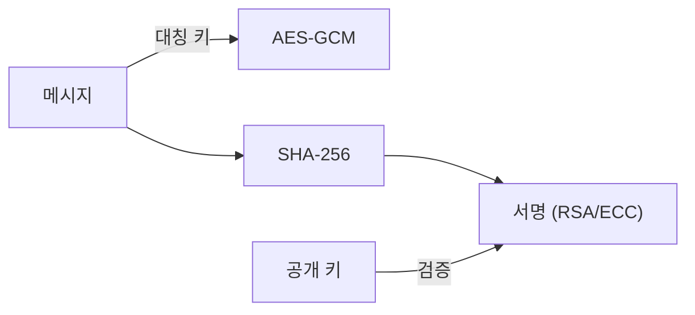

# 암호화와 해시

> Information Security 101 시리즈 (3/10)


## 이 글에서 다룰 문제

대부분의 암호 사고는 알고리즘이 약해서가 아니라 잘못 조합해서 일어납니다. 무엇이 무엇을 보장하는지 분명히 알면 사고의 큰 줄기를 막을 수 있습니다.

> 알고리즘은 도구, 안전은 조합과 운용입니다.

## 전체 흐름


암호화는 비밀을, 해시는 무결성을, 서명은 출처를 보장합니다. 셋은 다른 도구입니다.

## Before/After

**Before — AES-CBC만 사용 (인증 없음)**

```text
공격자가 ciphertext 변조 -> 복호화 시 잘못된 평문 -> 침해
```

**After — AES-GCM (AEAD)**

```text
변조된 ciphertext는 복호화 단계에서 거부 -> 인증된 비밀
```

암호화만으로는 충분하지 않다 — AEAD가 현대 표준인 이유입니다.

## 짧은 코드로 차이 보기

### 1단계 — AES-GCM (대칭, AEAD)

```python
# 예시 파일: 1_aes_gcm.py
from cryptography.hazmat.primitives.ciphers.aead import AESGCM
import os
key = AESGCM.generate_key(bit_length=256)
aes = AESGCM(key)
nonce = os.urandom(12)
ct = aes.encrypt(nonce, b"hello", None)
print(aes.decrypt(nonce, ct, None))   # b'hello'
```

nonce는 키당 절대 재사용하지 않습니다. 재사용은 GCM의 안전성을 무너뜨립니다.

### 2단계 — SHA-256과 HMAC

```python
# 예시 파일: 2_hash_hmac.py
import hashlib, hmac
print(hashlib.sha256(b"hello").hexdigest())
print(hmac.new(b"secret", b"hello", hashlib.sha256).hexdigest())
```

SHA만으로는 누가 만든 해시인지 알 수 없습니다. HMAC은 키를 가진 사람만 만들 수 있습니다.

### 3단계 — RSA로 서명/검증

```python
# 예시 파일: 3_rsa.py
from cryptography.hazmat.primitives.asymmetric import rsa, padding
from cryptography.hazmat.primitives import hashes
priv = rsa.generate_private_key(public_exponent=65537, key_size=2048)
pub = priv.public_key()
msg = b"hello"
sig = priv.sign(msg, padding.PSS(mgf=padding.MGF1(hashes.SHA256()), salt_length=32), hashes.SHA256())
pub.verify(sig, msg, padding.PSS(mgf=padding.MGF1(hashes.SHA256()), salt_length=32), hashes.SHA256())
```

서명은 무결성 + 출처를 동시에 보장합니다.

### 4단계 — 안전한 random

```python
# 예시 파일: 4_random.py
import secrets
print(secrets.token_bytes(16))
print(secrets.token_urlsafe(32))
```

키, nonce, 토큰은 `random.random()`이 아니라 `secrets`로 생성합니다.

### 5단계 — 잘못된 패턴 (반례)

```python
# 예시 파일: 5_bad.py
# md5 import 예시  # 충돌이 발견되어 무결성을 보장할 수 없음
# AES-ECB 사용     # 같은 평문 블록이 같은 암호문이 되어 패턴이 드러남
# 같은 nonce 반복  # GCM 안전성이 무너짐
```

흔한 실수를 알아두는 것이 절반의 방어입니다.

## 이 코드에서 주목할 점

- AES-GCM은 nonce 재사용에 매우 취약합니다.
- HMAC의 비밀 키는 절대 노출되지 않아야 합니다.
- 서명은 출처(누가)와 무결성(변조 없음)을 동시에 답합니다.
- 안전한 random은 OS 엔트로피로부터 옵니다.

## 자주 하는 실수 5가지

1. **MD5/SHA1을 무결성에 사용.** 충돌 공격 가능.
2. **AES-ECB.** 평문 패턴이 그대로 보입니다.
3. **GCM nonce 재사용.** 키 복원 가능성.
4. **`random.random()`으로 키/토큰 생성.** 예측 가능.
5. **자체 알고리즘 발명.** 공개 검증을 받지 않은 암호는 안전하지 않습니다.

## 실무에서는 이렇게 쓰입니다

TLS는 비대칭(키 교환) + 대칭(데이터)의 조합. 모바일 앱의 secure storage(iOS Keychain, Android Keystore), 클라우드 KMS(AWS KMS, GCP KMS)는 키 관리 전담. 데이터베이스의 transparent encryption은 대부분 AES-GCM 기반입니다.

## 체크리스트

- [ ] AEAD가 필요한 이유를 답할 수 있는가?
- [ ] HMAC과 해시의 차이를 한 줄로 말할 수 있는가?
- [ ] nonce/IV를 키마다 어떻게 관리할지 답할 수 있는가?
- [ ] random 함수의 안전한 출처를 알고 있는가?
- [ ] 서명과 암호화의 차이를 명확히 구분할 수 있는가?

## 정리 및 다음 단계

암호화와 해시는 다른 일을 합니다. 다음 글에서는 이 도구들이 네트워크 위에서 어떻게 결합되는지 — TLS와 인증서 — 를 봅니다.

<!-- toc:begin -->
- [정보보안이란 무엇인가?](./01-what-is-information-security.md)
- [인증과 인가](./02-authentication-and-authorization.md)
- **암호화와 해시 (현재 글)**
- TLS와 인증서 (예정)
- Web 보안 기초 (예정)
- SQL Injection과 XSS (예정)
- secret 관리 (예정)
- 권한 최소화 (예정)
- 로그와 감사 (예정)
- 보안 사고 대응 (예정)
<!-- toc:end -->

## 참고 자료

- [Cryptography 101 — Khan Academy](https://www.khanacademy.org/computing/computer-science/cryptography)
- [NIST Cryptographic Standards](https://csrc.nist.gov/projects/cryptographic-standards-and-guidelines)
- [Cryptographic Right Answers — Latacora](https://www.latacora.com/blog/2018/04/03/cryptographic-right-answers/)
- [Python cryptography library](https://cryptography.io/)

Tags: Computer Science, Security, Cryptography, Hash, SymmetricEncryption, PublicKey
