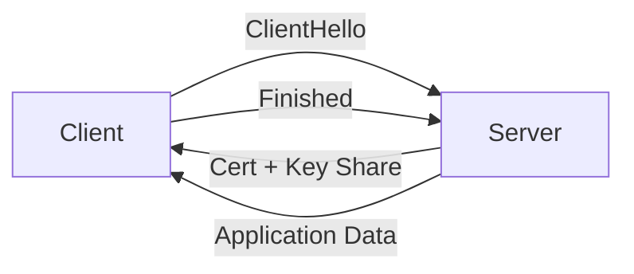

# Information Security 101 (4/10): TLS와 인증서

브라우저 주소창의 자물쇠 아이콘은 너무 익숙해서 오히려 의미를 잊기 쉽습니다. 그냥 HTTPS라고만 생각하고 넘어가면 인증서 만료, 약한 암호군 허용, 검증 비활성화 같은 사고가 반복됩니다. 자물쇠는 마법이 아니라 매우 구체적인 절차의 결과입니다.

이 글은 Information Security 101 시리즈의 4번째 글입니다.

## 먼저 던지는 질문

- 브라우저 자물쇠는 정확히 무엇을 보장할까요?
- TLS 1.3 핸드셰이크는 어떤 단계로 진행될까요?
- X.509 인증서 체인은 어떻게 검증될까요?

## 큰 그림


*Information Security 101 4장 흐름 개요*

그림은 클라이언트와 서버가 CA 인증서로 서로를 검증하고, 공개 키 교환을 거쳐 세션 키를 공유한 뒤 암호화 통신하는 흐름을 보여줍니다. 각 단계에서 누가 누를 검증하고 어떤 증명서를 남기는지가 중요합니다.

> TLS는 단순 암호화가 아니라 '이 서버가 정말 example.com인가'를 인증서로 증명하고, 중간자가 개입할 수 없도록 핸드셰이크를 설계하는 것입니다.

## 왜 중요한가

서비스 간 트래픽의 큰 비중이 TLS로 보호됩니다. 그런데 내부 동작을 이해하지 못하면 인증서 만료를 놓치거나, 약한 암호군을 켜 둔 채 운영하거나, 편의상 검증을 꺼 버리는 식의 사고가 생깁니다. TLS는 켜기만 하면 끝나는 기능이 아니라, 계속 관리해야 하는 운영 절차에 가깝습니다.

자물쇠 아이콘은 신비한 보호막이 아닙니다. 정해진 검증 과정이 모두 통과됐다는 표시일 뿐입니다.

## 한눈에 보는 개념



TLS 1.3은 한 번의 왕복 안에서 키 합의와 서버 인증을 끝냅니다. 그 짧은 과정 안에 꽤 많은 보안 판단이 들어 있습니다.

## 핵심 용어

- **TLS**: TCP 위에서 동작하는 암호화 프로토콜입니다.
- **X.509**: 인증서 형식의 표준입니다.
- **CA**: 인증서를 발급하는 기관입니다.
- 체인: 서버 인증서에서 중간 CA를 거쳐 루트 CA로 이어지는 신뢰 경로입니다.
- **mTLS**: 서버뿐 아니라 클라이언트도 인증서를 제시하는 방식입니다.

## 전후 비교

### 이전 — 평문 HTTP

```text
A middlebox can read and modify packets -> credentials leaked
```

### 이후 — TLS 1.3

```text
Key agreement + server auth + AEAD -> secrecy, integrity, origin
```

평문에서 TLS로 넘어가는 변화는 현대 서비스 보안의 최소선입니다. 여기서부터가 출발점입니다.

## 단계별 실습

### 1단계 — 인증서를 직접 봅니다

```bash
# 1_view_cert.sh
openssl s_client -connect example.com:443 -servername example.com </dev/null 2>/dev/null \
  | openssl x509 -noout -subject -issuer -dates
```

주체, 발급자, 유효기간을 한 번에 볼 수 있습니다. 운영에서는 이 기본 정보만 빨리 읽어도 만료나 체인 문제를 상당수 좁힐 수 있습니다.

### 2단계 — 파이썬에서 TLS 연결을 엽니다

```python
# 2_tls_client.py
import ssl, socket
ctx = ssl.create_default_context()
with socket.create_connection(("example.com", 443)) as sock:
    with ctx.wrap_socket(sock, server_hostname="example.com") as s:
        print(s.version())          # TLSv1.3
        print(s.cipher())
```

`create_default_context()`는 검증 활성화와 현대적인 암호군 같은 안전한 기본값을 함께 제공합니다.

### 3단계 — 자체 서명 인증서를 만듭니다

```bash
# 3_selfsigned.sh
openssl req -x509 -newkey rsa:2048 -keyout key.pem -out cert.pem \
  -days 365 -nodes -subj "/CN=localhost"
```

개발 환경에서는 쓸 수 있지만 운영 환경에서는 안 됩니다. 신뢰 체인이 없기 때문입니다.

### 4단계 — 인증서 체인을 검증합니다

```bash
# 4_verify_chain.sh
openssl verify -CAfile chain.pem server.pem
```

체인이 깨지면 브라우저 경고가 뜹니다. 많은 장애가 여기서 시작합니다.

### 5단계 — mTLS 서버를 구성합니다

```python
# 5_mtls.py
import ssl
ctx = ssl.create_default_context(ssl.Purpose.CLIENT_AUTH)
ctx.verify_mode = ssl.CERT_REQUIRED
ctx.load_cert_chain("server.pem", "server.key")
ctx.load_verify_locations("client_ca.pem")
# server.serve_forever() ...
```

서비스 간 통신처럼 상대 클라이언트도 식별해야 할 때는 서버뿐 아니라 클라이언트 인증서까지 검증합니다.

## 이 코드와 예제에서 먼저 볼 점

- 호스트명 검증은 절대 꺼 두면 안 됩니다.
- TLS 1.2 이상만 허용하고 1.0, 1.1은 꺼야 합니다.
- RC4, 3DES 같은 약한 암호군은 비활성화해야 합니다.
- 인증서 갱신은 수동 작업이 아니라 자동화 파이프라인이어야 합니다.

## 자주 하는 실수 다섯 가지

1. **인증서 검증을 끄는 실수**: 운영 환경에서 `verify=False`는 금지입니다.
2. **만료 모니터링이 없는 실수**: 만료된 인증서로 예고 없는 장애가 납니다.
3. **약한 암호군을 허용하는 실수**: 다운그레이드 공격 위험을 키웁니다.
4. **운영 환경에서 자체 서명 인증서를 쓰는 실수**: 신뢰 체인이 없습니다.
5. **mTLS 키 회전이 없는 실수**: 한 번 유출되면 장기 노출이 됩니다.

## 실무에서는 이렇게 나타납니다

Kubernetes에서는 cert-manager와 Let's Encrypt가 90일 인증서를 자동 갱신합니다. 서비스 메시인 Istio나 Linkerd는 mTLS 인증서를 눈에 띄지 않게 발급하고 교체합니다. AWS ACM, GCP Certificate Manager도 로드 밸런서와 결합해 인증서 운영을 자동화합니다. 결국 핵심은 암호화 자체보다 신뢰와 갱신을 얼마나 자동화했는가에 있습니다.

## 시니어 엔지니어는 이렇게 생각합니다

- 인증서 만료는 경보 문제가 아니라 자동화 문제로 봅니다.
- 신뢰 저장소 변경은 변경 관리 절차를 거칩니다.
- 서비스 간 통신은 기본적으로 mTLS를 검토합니다.
- TLS 종료 지점을 명시적으로 결정합니다.
- 약한 알고리즘 허용 여부를 주기적으로 재검토합니다.

## 체크리스트

- [ ] TLS 1.3 핸드셰이크 단계를 설명할 수 있습니까?
- [ ] 인증서 체인 검증 과정을 설명할 수 있습니까?
- [ ] 단방향 TLS와 mTLS의 차이를 말할 수 있습니까?
- [ ] 인증서가 자동 갱신되고 있습니까?
- [ ] 약한 암호군을 식별할 수 있습니까?

## 연습 문제

1. TLS 1.2와 1.3의 큰 차이 두 가지를 적어 보세요.
2. mTLS가 잘 맞는 시나리오 두 가지를 설명해 보세요.
3. 인증서 만료 30일 전에 알림을 보내는 의사코드를 적어 보세요.

## 정리와 다음 글

TLS는 비밀성, 무결성, 출처 검증을 한 번에 묶는 프로토콜입니다. 인증서는 그 약속을 신뢰할 수 있게 만드는 장치입니다. 다음 글에서는 이 보호된 웹 위에서 동작하는 브라우저 보안의 기본, 웹 보안 기초를 다룹니다.


## TLS 핸드셰이크를 단계별로 추적하기

TLS 1.3은 왕복 횟수를 줄였지만 내부 판단은 오히려 더 정교해졌습니다. 운영 관점에서는 다음 다섯 단계를 분리해 이해하는 것이 중요합니다.

1. ClientHello: 지원 버전, 암호군, key share를 제시합니다.
2. ServerHello: 서버가 선택한 암호군과 key share를 반환합니다.
3. Certificate: 서버 인증서 체인을 제공합니다.
4. CertificateVerify + Finished: 서버가 개인키 소유를 증명하고 핸드셰이크 무결성을 확정합니다.
5. Client Finished: 클라이언트도 동일한 트랜스크립트로 완료를 확인합니다.

이 흐름에서 장애가 가장 많이 나는 지점은 3번(인증서 체인)과 1/2번(호환 암호군/버전)입니다. 따라서 트래픽 장애 시 애플리케이션 코드보다 먼저 TLS 협상 로그를 보는 습관이 필요합니다.

## 인증서 체인 검증 체크리스트

| 검증 항목 | 실패 시 증상 | 확인 방법 |
| --- | --- | --- |
| SAN에 요청 도메인 포함 | 브라우저 이름 불일치 경고 | `openssl x509 -text` |
| Not Before/Not After 유효기간 | 갑작스런 접속 실패 | 만료 모니터링/알림 |
| 중간 인증서 누락 | 특정 클라이언트만 실패 | fullchain 배포 확인 |
| 루트 신뢰 저장소 불일치 | 일부 환경에서만 오류 | OS/런타임 trust store 점검 |
| 폐기(Revocation) 상태 | 보안 경고 또는 차단 | OCSP/CRL 정책 점검 |

인증서 체인을 이해하면 "내 로컬에서는 되는데 운영에서는 안 된다" 같은 문제를 빠르게 좁힐 수 있습니다.

## Python으로 TLS 인증서 정보 점검

```python
# tls_probe.py
import socket
import ssl
from datetime import datetime


def probe(host: str, port: int = 443) -> None:
    ctx = ssl.create_default_context()
    with socket.create_connection((host, port), timeout=5) as raw:
        with ctx.wrap_socket(raw, server_hostname=host) as tls:
            cert = tls.getpeercert()
            print("version:", tls.version())
            print("cipher:", tls.cipher())
            print("subject:", cert.get("subject"))
            print("issuer:", cert.get("issuer"))
            print("notAfter:", cert.get("notAfter"))
            if cert.get("notAfter"):
                exp = datetime.strptime(cert["notAfter"], "%b %d %H:%M:%S %Y %Z")
                print("days_left:", (exp - datetime.utcnow()).days)

probe("example.com")
```

서비스 상태 점검에 이 코드를 주기적으로 실행하면 만료 임박, 버전 하향, 예기치 않은 인증서 변경을 조기에 감지할 수 있습니다.

## mTLS 도입 시 운영 포인트

mTLS는 서버뿐 아니라 클라이언트도 인증서를 제시하므로 내부 서비스 식별 강도가 크게 올라갑니다. 대신 운영 복잡도가 늘어납니다.

| 항목 | 단방향 TLS | mTLS |
| --- | --- | --- |
| 서버 신원 검증 | 필수 | 필수 |
| 클라이언트 신원 검증 | 보통 없음 | 필수 |
| 인증서 발급/회전 수 | 상대적으로 적음 | 서비스 수만큼 증가 |
| 사고 시 영향 범위 | 서버 키 유출 중심 | 서버/클라이언트 모두 관리 필요 |

mTLS를 도입할 때는 인증서 자동 발급/회전(예: service mesh, cert-manager)을 먼저 준비해야 합니다. 수동 운영은 장기적으로 실패 확률이 높습니다.


## 운영 점검 루프와 문서화 기준

보안 글에서 가장 자주 빠지는 부분은 "그래서 운영에서는 무엇을 주기적으로 확인할 것인가"입니다. 아래 루프를 기준으로 문서화하면 개념이 실무로 연결됩니다.

| 주기 | 점검 항목 | 산출물 |
| --- | --- | --- |
| 매일 | 고위험 경보, 인증 실패 급증, 권한 거부 급증 | 일일 보안 브리핑 |
| 매주 | 신규 배포 변경점의 보안 영향 | 변경 검토 노트 |
| 매월 | 키/토큰/인증서 만료 예정, 미사용 권한, 미사용 시크릿 | 월간 정리 리포트 |
| 분기 | 위협 모델 재평가, 런북 훈련, 통제 효과 검토 | 분기 보안 회고 |

실행 가능한 문서의 조건도 분명해야 합니다.

- 담당자(owner)와 대체 담당자가 명시되어야 합니다.
- 실패 조건과 에스컬레이션 기준이 수치로 정의되어야 합니다.
- 점검 결과가 티켓이나 액션 아이템으로 추적되어야 합니다.
- 예외 승인에는 만료일이 반드시 있어야 합니다.

보안은 단발성 프로젝트가 아니라 운영 루프입니다. 같은 점검을 반복해도 기준이 유지될 때 품질이 올라갑니다.


## 운영 점검 루프와 문서화 기준

보안 글에서 가장 자주 빠지는 부분은 "그래서 운영에서는 무엇을 주기적으로 확인할 것인가"입니다. 아래 루프를 기준으로 문서화하면 개념이 실무로 연결됩니다.

| 주기 | 점검 항목 | 산출물 |
| --- | --- | --- |
| 매일 | 고위험 경보, 인증 실패 급증, 권한 거부 급증 | 일일 보안 브리핑 |
| 매주 | 신규 배포 변경점의 보안 영향 | 변경 검토 노트 |
| 매월 | 키/토큰/인증서 만료 예정, 미사용 권한, 미사용 시크릿 | 월간 정리 리포트 |
| 분기 | 위협 모델 재평가, 런북 훈련, 통제 효과 검토 | 분기 보안 회고 |

실행 가능한 문서의 조건도 분명해야 합니다.

- 담당자(owner)와 대체 담당자가 명시되어야 합니다.
- 실패 조건과 에스컬레이션 기준이 수치로 정의되어야 합니다.
- 점검 결과가 티켓이나 액션 아이템으로 추적되어야 합니다.
- 예외 승인에는 만료일이 반드시 있어야 합니다.

보안은 단발성 프로젝트가 아니라 운영 루프입니다. 같은 점검을 반복해도 기준이 유지될 때 품질이 올라갑니다.


## 처음 질문으로 돌아가기

- **브라우저 자물쇠는 정확히 무엇을 보장할까요?**
  - HTTPS 요청이 들어왔을 때 서버 인증서를 읽고, 클라이언트가 CA 체인으로 검증하고, 공개 키 핸드셰이크를 거쳐 세션이 맺어지는 각 단계를 이해하면 인증서 오류를 대응할 수 있습니다.
- **TLS 1.3 핸드셰이크는 어떤 단계로 진행될까요?**
  - Self-signed 인증서와 CA 서명 인증서의 차이, 와일드카드와 SAN 인증서의 검증 차이를 구분하면 배포 장애를 줄일 수 있습니다.
- **X.509 인증서 체인은 어떻게 검증될까요?**
  - 인증서 만료일 모니터링, 갱신 스크립트 검증, 인증서 핀징 정책을 정의하고, 인증서 오류 발생 시 로그 규칙을 정합니다.

<!-- toc:begin -->
## 시리즈 목차

- [Information Security 101 (1/10): 정보보안이란 무엇인가?](./01-what-is-information-security.md)
- [Information Security 101 (2/10): 인증과 인가](./02-authentication-and-authorization.md)
- [Information Security 101 (3/10): 암호화와 해시](./03-cryptography-and-hash.md)
- **TLS와 인증서 (현재 글)**
- 웹 보안 기초 (예정)
- SQL 인젝션과 XSS (예정)
- 비밀 정보 관리 (예정)
- 권한 최소화 (예정)
- 로그와 감사 (예정)
- 보안 사고 대응 (예정)

<!-- toc:end -->

## 참고 자료

- [RFC 8446 — TLS 1.3](https://datatracker.ietf.org/doc/html/rfc8446)
- [Mozilla SSL Configuration Generator](https://ssl-config.mozilla.org/)
- [Let's Encrypt — How It Works](https://letsencrypt.org/how-it-works/)
- [BetterTLS — Test Suite](https://bettertls.com/)

Tags: Computer Science, Security, TLS, Certificate, PKI, mTLS
