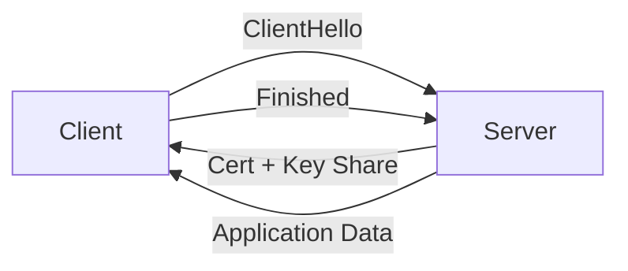

# TLS와 인증서

> Information Security 101 시리즈 (4/10)


## 이 글에서 다룰 문제

서비스 간 통신의 절반 이상이 TLS로 보호됩니다. TLS를 모르고 운영하면 인증서 만료, 약한 암호 모음, 잘못된 검증으로 사고가 납니다.

> 자물쇠 아이콘 뒤에는 정확한 절차가 있습니다.

## 개념 한눈에 보기



TLS 1.3은 1-RTT로 키 합의와 서버 인증을 끝냅니다.

## Before/After

**Before — HTTP 평문**

```text
중간자가 패킷을 보고 수정 가능 -> 비밀번호 노출
```

**After — TLS 1.3**

```text
키 합의 + 서버 인증 + AEAD -> 비밀, 무결성, 출처
```

평문에서 TLS로의 전환은 보안의 기본선입니다.

## 실습: 인증서와 TLS 다루기

### 1단계 — 인증서 정보 보기

```bash
# 1_view_cert.sh
openssl s_client -connect example.com:443 -servername example.com </dev/null 2>/dev/null \
  | openssl x509 -noout -subject -issuer -dates
```

서브젝트, 발급자, 유효 기간을 한눈에 확인합니다.

### 2단계 — Python으로 TLS 연결

```python
# 2_tls_client.py
import ssl, socket
ctx = ssl.create_default_context()
with socket.create_connection(("example.com", 443)) as sock:
    with ctx.wrap_socket(sock, server_hostname="example.com") as s:
        print(s.version())          # TLSv1.3
        print(s.cipher())
```

`create_default_context()`는 안전한 기본값(검증 + 최신 암호 모음)을 제공합니다.

### 3단계 — 자체 서명 인증서 만들기 (개발용)

```bash
# 3_selfsigned.sh
openssl req -x509 -newkey rsa:2048 -keyout key.pem -out cert.pem \
  -days 365 -nodes -subj "/CN=localhost"
```

운영에는 절대 쓰지 않습니다 — 신뢰 체인이 없습니다.

### 4단계 — 인증서 체인 검증

```bash
# 4_verify_chain.sh
openssl verify -CAfile chain.pem server.pem
```

체인이 깨지면 브라우저는 경고를 띄웁니다.

### 5단계 — mTLS 서버 (Python)

```python
# 5_mtls.py
import ssl
ctx = ssl.create_default_context(ssl.Purpose.CLIENT_AUTH)
ctx.verify_mode = ssl.CERT_REQUIRED
ctx.load_cert_chain("server.pem", "server.key")
ctx.load_verify_locations("client_ca.pem")
# server.serve_forever() ...
```

서비스 간 통신에서 클라이언트도 검증합니다.

## 이 코드에서 주목할 점

- 호스트 이름 검증을 끄지 않습니다.
- TLS 1.2 이상만 허용하고 1.0/1.1은 비활성화합니다.
- 약한 암호 모음(RC4, 3DES)은 끕니다.
- 인증서는 자동 갱신 파이프라인을 갖춥니다.

## 자주 하는 실수 5가지

1. **인증서 검증 비활성화.** `verify=False`는 운영에 절대 금지.
2. **만료 모니터링 부재.** 갑작스런 만료로 서비스 중단.
3. **약한 암호 모음 허용.** 다운그레이드 공격 가능.
4. **자체 서명 인증서를 운영에 사용.** 신뢰 체인 없음.
5. **mTLS의 키 회전 부재.** 유출되면 영구적 노출.

## 실무에서는 이렇게 쓰입니다

Let's Encrypt + cert-manager로 Kubernetes에서 90일 인증서를 자동 갱신합니다. 서비스 메시(Istio, Linkerd)는 mTLS를 자동으로 발급/회전합니다. AWS ACM, GCP Certificate Manager는 클라우드 LB에 통합된 인증서 관리입니다.

## 체크리스트

- [ ] TLS 1.3의 핸드셰이크 단계를 설명할 수 있는가?
- [ ] 인증서 체인 검증 절차를 답할 수 있는가?
- [ ] mTLS와 단방향 TLS의 차이를 한 줄로 말할 수 있는가?
- [ ] 인증서 자동 갱신 파이프라인이 있는가?
- [ ] 약한 암호 모음을 식별할 수 있는가?

## 정리 및 다음 단계

TLS는 비밀, 무결성, 출처를 한 묶음으로 제공합니다. 다음 글에서는 이 보호를 받는 웹 위에서의 보안 — Web 보안 기초 — 를 봅니다.

<!-- toc:begin -->
- [정보보안이란 무엇인가?](./01-what-is-information-security.md)
- [인증과 인가](./02-authentication-and-authorization.md)
- [암호화와 해시](./03-cryptography-and-hash.md)
- **TLS와 인증서 (현재 글)**
- Web 보안 기초 (예정)
- SQL Injection과 XSS (예정)
- secret 관리 (예정)
- 권한 최소화 (예정)
- 로그와 감사 (예정)
- 보안 사고 대응 (예정)
<!-- toc:end -->

## 참고 자료

- [RFC 8446 — TLS 1.3](https://datatracker.ietf.org/doc/html/rfc8446)
- [Mozilla SSL Configuration Generator](https://ssl-config.mozilla.org/)
- [Let's Encrypt — How It Works](https://letsencrypt.org/how-it-works/)
- [BetterTLS — Test Suite](https://bettertls.com/)

Tags: Computer Science, Security, TLS, Certificate, PKI, mTLS
