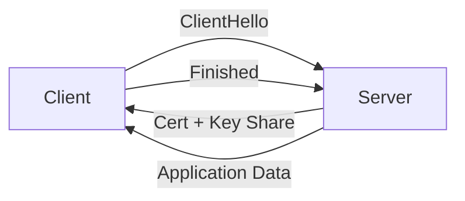

# TLS와 인증서

브라우저 주소창의 자물쇠 아이콘은 너무 익숙해서 오히려 의미를 잊기 쉽습니다. 그냥 HTTPS라고만 생각하고 넘어가면 인증서 만료, 약한 암호군 허용, 검증 비활성화 같은 사고가 반복됩니다. 자물쇠는 마법이 아니라 매우 구체적인 절차의 결과입니다.

이 글은 Information Security 101 시리즈의 4번째 글입니다.

## 이 글에서 다룰 문제

TLS를 제대로 이해하려면 암호화만 보는 것으로는 부족합니다. 서버가 누구인지 확인하고, 통신이 중간에 바뀌지 않았음을 검증하고, 신뢰 체인이 어디서 시작되는지까지 함께 봐야 합니다.

> TLS는 비밀성, 무결성, 출처 검증을 함께 묶는 절차이며, 인증서는 그 절차의 신뢰 근거입니다.

- 브라우저 자물쇠는 정확히 무엇을 보장할까요?
- TLS 1.3 핸드셰이크는 어떤 단계로 진행될까요?
- X.509 인증서 체인은 어떻게 검증될까요?
- 루트 CA와 중간 CA, 신뢰 저장소는 어떤 관계일까요?
- mTLS는 언제 써야 할까요?

## 왜 중요한가

서비스 간 트래픽의 큰 비중이 TLS로 보호됩니다. 그런데 내부 동작을 이해하지 못하면 인증서 만료를 놓치거나, 약한 암호군을 켜 둔 채 운영하거나, 편의상 검증을 꺼 버리는 식의 사고가 생깁니다. TLS는 켜기만 하면 끝나는 기능이 아니라, 계속 관리해야 하는 운영 절차에 가깝습니다.

자물쇠 아이콘은 신비한 보호막이 아닙니다. 정해진 검증 과정이 모두 통과됐다는 표시일 뿐입니다.

## 한눈에 보는 개념



TLS 1.3은 한 번의 왕복 안에서 키 합의와 서버 인증을 끝냅니다. 그 짧은 과정 안에 꽤 많은 보안 판단이 들어 있습니다.

## 핵심 용어

- **TLS**: TCP 위에서 동작하는 암호화 프로토콜입니다.
- **X.509**: 인증서 형식의 표준입니다.
- **CA**: 인증서를 발급하는 기관입니다.
- 체인: 서버 인증서에서 중간 CA를 거쳐 루트 CA로 이어지는 신뢰 경로입니다.
- **mTLS**: 서버뿐 아니라 클라이언트도 인증서를 제시하는 방식입니다.

## 전후 비교

### 이전 — 평문 HTTP

```text
A middlebox can read and modify packets -> credentials leaked
```

### 이후 — TLS 1.3

```text
Key agreement + server auth + AEAD -> secrecy, integrity, origin
```

평문에서 TLS로 넘어가는 변화는 현대 서비스 보안의 최소선입니다. 여기서부터가 출발점입니다.

## 단계별 실습

### 1단계 — 인증서를 직접 봅니다

```bash
# 1_view_cert.sh
openssl s_client -connect example.com:443 -servername example.com </dev/null 2>/dev/null \
  | openssl x509 -noout -subject -issuer -dates
```

주체, 발급자, 유효기간을 한 번에 볼 수 있습니다. 운영에서는 이 기본 정보만 빨리 읽어도 만료나 체인 문제를 상당수 좁힐 수 있습니다.

### 2단계 — 파이썬에서 TLS 연결을 엽니다

```python
# 2_tls_client.py
import ssl, socket
ctx = ssl.create_default_context()
with socket.create_connection(("example.com", 443)) as sock:
    with ctx.wrap_socket(sock, server_hostname="example.com") as s:
        print(s.version())          # TLSv1.3
        print(s.cipher())
```

`create_default_context()`는 검증 활성화와 현대적인 암호군 같은 안전한 기본값을 함께 제공합니다.

### 3단계 — 자체 서명 인증서를 만듭니다

```bash
# 3_selfsigned.sh
openssl req -x509 -newkey rsa:2048 -keyout key.pem -out cert.pem \
  -days 365 -nodes -subj "/CN=localhost"
```

개발 환경에서는 쓸 수 있지만 운영 환경에서는 안 됩니다. 신뢰 체인이 없기 때문입니다.

### 4단계 — 인증서 체인을 검증합니다

```bash
# 4_verify_chain.sh
openssl verify -CAfile chain.pem server.pem
```

체인이 깨지면 브라우저 경고가 뜹니다. 많은 장애가 여기서 시작합니다.

### 5단계 — mTLS 서버를 구성합니다

```python
# 5_mtls.py
import ssl
ctx = ssl.create_default_context(ssl.Purpose.CLIENT_AUTH)
ctx.verify_mode = ssl.CERT_REQUIRED
ctx.load_cert_chain("server.pem", "server.key")
ctx.load_verify_locations("client_ca.pem")
# server.serve_forever() ...
```

서비스 간 통신처럼 상대 클라이언트도 식별해야 할 때는 서버뿐 아니라 클라이언트 인증서까지 검증합니다.

## 이 코드와 예제에서 먼저 볼 점

- 호스트명 검증은 절대 꺼 두면 안 됩니다.
- TLS 1.2 이상만 허용하고 1.0, 1.1은 꺼야 합니다.
- RC4, 3DES 같은 약한 암호군은 비활성화해야 합니다.
- 인증서 갱신은 수동 작업이 아니라 자동화 파이프라인이어야 합니다.

## 자주 하는 실수 다섯 가지

1. **인증서 검증을 끄는 실수**: 운영 환경에서 `verify=False`는 금지입니다.
2. **만료 모니터링이 없는 실수**: 만료된 인증서로 예고 없는 장애가 납니다.
3. **약한 암호군을 허용하는 실수**: 다운그레이드 공격 위험을 키웁니다.
4. **운영 환경에서 자체 서명 인증서를 쓰는 실수**: 신뢰 체인이 없습니다.
5. **mTLS 키 회전이 없는 실수**: 한 번 유출되면 장기 노출이 됩니다.

## 실무에서는 이렇게 나타납니다

Kubernetes에서는 cert-manager와 Let's Encrypt가 90일 인증서를 자동 갱신합니다. 서비스 메시인 Istio나 Linkerd는 mTLS 인증서를 눈에 띄지 않게 발급하고 교체합니다. AWS ACM, GCP Certificate Manager도 로드 밸런서와 결합해 인증서 운영을 자동화합니다. 결국 핵심은 암호화 자체보다 신뢰와 갱신을 얼마나 자동화했는가에 있습니다.

## 시니어 엔지니어는 이렇게 생각합니다

- 인증서 만료는 경보 문제가 아니라 자동화 문제로 봅니다.
- 신뢰 저장소 변경은 변경 관리 절차를 거칩니다.
- 서비스 간 통신은 기본적으로 mTLS를 검토합니다.
- TLS 종료 지점을 명시적으로 결정합니다.
- 약한 알고리즘 허용 여부를 주기적으로 재검토합니다.

## 체크리스트

- [ ] TLS 1.3 핸드셰이크 단계를 설명할 수 있습니까?
- [ ] 인증서 체인 검증 과정을 설명할 수 있습니까?
- [ ] 단방향 TLS와 mTLS의 차이를 말할 수 있습니까?
- [ ] 인증서가 자동 갱신되고 있습니까?
- [ ] 약한 암호군을 식별할 수 있습니까?

## 연습 문제

1. TLS 1.2와 1.3의 큰 차이 두 가지를 적어 보세요.
2. mTLS가 잘 맞는 시나리오 두 가지를 설명해 보세요.
3. 인증서 만료 30일 전에 알림을 보내는 의사코드를 적어 보세요.

## 정리와 다음 글

TLS는 비밀성, 무결성, 출처 검증을 한 번에 묶는 프로토콜입니다. 인증서는 그 약속을 신뢰할 수 있게 만드는 장치입니다. 다음 글에서는 이 보호된 웹 위에서 동작하는 브라우저 보안의 기본, 웹 보안 기초를 다룹니다.

<!-- toc:begin -->
- [정보보안이란 무엇인가?](./01-what-is-information-security.md)
- [인증과 인가](./02-authentication-and-authorization.md)
- [암호화와 해시](./03-cryptography-and-hash.md)
- **TLS와 인증서 (현재 글)**
- 웹 보안 기초 (예정)
- SQL 인젝션과 XSS (예정)
- 비밀 정보 관리 (예정)
- 권한 최소화 (예정)
- 로그와 감사 (예정)
- 보안 사고 대응 (예정)
<!-- toc:end -->

## 참고 자료

- [RFC 8446 — TLS 1.3](https://datatracker.ietf.org/doc/html/rfc8446)
- [Mozilla SSL Configuration Generator](https://ssl-config.mozilla.org/)
- [Let's Encrypt — How It Works](https://letsencrypt.org/how-it-works/)
- [BetterTLS — Test Suite](https://bettertls.com/)

Tags: Computer Science, Security, TLS, Certificate, PKI, mTLS
