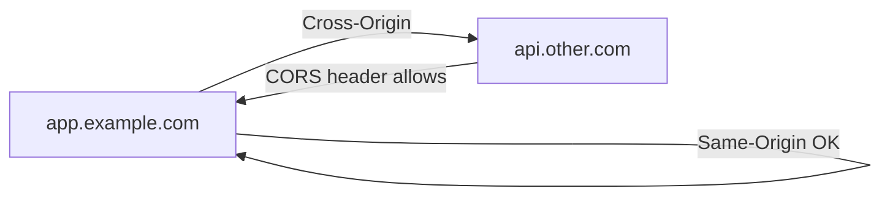

# Information Security 101 (5/10): 웹 보안 기초

웹 보안을 처음 공부할 때는 CORS, CSP, 쿠키, CSRF, XSS가 서로 다른 주제처럼 보입니다. 하지만 브라우저 관점에서 보면 대부분은 같은 질문으로 모입니다. “이 요청과 이 스크립트는 어느 출처에서 왔는가?” 출처 개념이 머릿속에 잡히면 그 뒤의 규칙들이 한 줄로 이어집니다.

이 글은 Information Security 101 시리즈의 5번째 글입니다.

## 먼저 던지는 질문

- 동일 출처 정책은 정확히 무엇을 뜻할까요?
- CORS는 무엇을 허용하고 무엇을 허용하지 않을까요?
- CSP는 왜 XSS 피해를 줄이는 데 중요할까요?

## 큰 그림


*Information Security 101 5장 흐름 개요*

그림은 브라우저 입력 → HTTP 통신 → 애플리케이션 라우팅 및 인증 → 데이터 저장 또는 렌더링 → 응답 전달의 흐름에서, 각 층에서 어디서 검증되고 로그되는지를 보여줍니다. 책임 경계가 명확할 때 공격 표면을 줄일 수 있습니다.

> 웹 보안의 기초는 HTTPS만으로는 부족합니다. 입력 검증, 세션 토큰, 쿠키 설정(HttpOnly/Secure/SameSite), 에러 메시지가 정보를 새지 않게 하는 것이 얼마나 일관되는지가 전부입니다.

## 왜 중요한가

웹 보안의 큰 줄기는 몇 가지 개념이 반복되는 구조입니다. 출처와 쿠키를 이해하면 CSRF와 XSS 노출의 상당 부분을 줄일 수 있습니다. 반대로 CORS를 “보안 기능”으로 오해하거나, SameSite를 제대로 이해하지 못하거나, CSP를 형식적으로만 추가하면 브라우저가 주는 기본 보호를 오히려 약하게 만드는 일이 생깁니다.

브라우저 보안은 복잡한 마법이 아니라 기본 경계와 예외 규칙의 조합입니다.

## 한눈에 보는 개념



같은 출처 요청은 기본적으로 허용됩니다. 다른 출처 요청은 서버가 명시적으로 허용해야 합니다.

## 핵심 용어

- 출처: 스킴, 호스트, 포트의 조합입니다.
- **CORS**: 다른 출처 요청을 서버가 허용하는 방식입니다.
- **CSP**: 어떤 출처의 리소스를 불러올 수 있는지 제한하는 헤더입니다.
- **CSRF**: 로그인된 사용자의 세션을 악용해 위조 요청을 보내는 공격입니다.
- **SameSite 쿠키**: 교차 사이트 요청에 쿠키를 붙일지 제한하는 정책입니다.

## 전후 비교

### 이전 — 교차 사이트 요청에도 쿠키가 모두 전송

```text
Malicious site triggers a request with the victim's session cookie -> CSRF
```

### 이후 — SameSite=Lax 기본값 사용

```text
Cross-site POST omits the cookie -> CSRF blocked
```

브라우저 기본값이 강해졌다고 해도, 운영자가 정책을 정확히 이해하고 맞춰야 효과가 납니다.

## 단계별 실습

### 1단계 — Flask에서 CORS를 설정합니다

```python
# 1_cors.py
from flask import Flask, jsonify
from flask_cors import CORS
app = Flask(__name__)
CORS(app, resources={r"/api/*": {"origins": "https://app.example.com"}})

@app.get("/api/me")
def me(): return jsonify(user="alice")
```

자격 증명이 포함되는 요청에 와일드카드 `*`를 쓰는 것은 허용되지 않습니다. 허용할 출처를 구체적으로 적어야 합니다.

### 2단계 — CSP 헤더를 추가합니다

```python
# 2_csp.py
@app.after_request
def csp(resp):
    resp.headers["Content-Security-Policy"] = (
        "default-src 'self'; script-src 'self'; img-src 'self' data:"
    )
    return resp
```

`unsafe-inline`를 피하는 것만으로도 XSS 피해 범위를 크게 줄일 수 있습니다.

### 3단계 — 안전한 쿠키를 설정합니다

```python
# 3_cookie.py
@app.get("/login")
def login():
    resp = app.make_response("ok")
    resp.set_cookie("sid", "xyz", secure=True, httponly=True, samesite="Lax")
    return resp
```

Secure, HttpOnly, SameSite는 따로 놀지 않습니다. 세 플래그를 한 세트로 보는 습관이 중요합니다.

### 4단계 — CSRF 토큰을 검사합니다

```python
# 4_csrf.py
def verify_csrf(req):
    if req.method in ("POST", "PUT", "DELETE"):
        if req.headers.get("X-CSRF") != session["csrf"]:
            raise PermissionError
```

double-submit 패턴이든 synchronizer 패턴이든 하나를 분명히 골라 끝까지 일관되게 적용해야 합니다.

### 5단계 — 자동 이스케이프로 XSS를 막습니다

```python
# 5_xss.py
from markupsafe import escape
def render(name):
    return f"<h1>Hello {escape(name)}</h1>"
```

템플릿 엔진의 자동 이스케이프를 신뢰하되, HTML, 자바스크립트, URL처럼 출력 문맥이 다르면 그 문맥에 맞게 인코딩해야 합니다.

## 이 코드와 예제에서 먼저 볼 점

- CORS는 보호 장치가 아니라 허용 목록입니다. 인증과 함께 가야 합니다.
- CSP는 Report-Only에서 시작해 Enforce로 옮기는 점진적 적용이 좋습니다.
- 쿠키 플래그는 세트로 관리해야 합니다.
- CSRF 방어는 토큰이든 SameSite든 반쯤이 아니라 끝까지 일관돼야 합니다.

## 자주 하는 실수 다섯 가지

1. **자격 증명이 있는 요청에 CORS `*`를 쓰는 실수**: 명세상 허용되지 않습니다.
2. **CSP에 `unsafe-inline`를 남겨 두는 실수**: 보호 효과가 크게 떨어집니다.
3. **쿠키에 Secure나 HttpOnly가 없는 실수**: XSS가 세션 탈취로 이어지기 쉽습니다.
4. **상태 변경을 GET으로 처리하는 실수**: 캐시, 링크, CSRF에 취약해집니다.
5. **출처 헤더 없이 리퍼러만 믿는 실수**: 환경에 따라 쉽게 흔들릴 수 있습니다.

## 실무에서는 이렇게 나타납니다

CSP는 nonce나 hash 기반으로 점진적으로 도입합니다. 인증된 API는 CORS 허용 목록, SameSite=Strict 또는 Lax 쿠키, CSRF 토큰을 함께 씁니다. CloudFront Functions 같은 에지 계층에서 보안 헤더를 중앙 관리하는 패턴도 흔합니다. 핵심은 정책을 서비스마다 따로 만들지 않고 한곳에서 일관되게 유지하는 데 있습니다.

## 시니어 엔지니어는 이렇게 생각합니다

- 보안 헤더는 미들웨어나 에지 계층 한곳에서 관리합니다.
- CSP는 Report-Only로 데이터를 모은 뒤 Enforce로 전환합니다.
- 쿠키 정책 변경에는 배포 계획과 모니터링이 함께 따라갑니다.
- CSRF와 XSS 방어는 하나의 기준 문서로 묶어 둡니다.
- 출처 정책은 변경 이력까지 문서화합니다.

## 체크리스트

- [ ] 동일 출처의 정의를 정확히 말할 수 있습니까?
- [ ] CORS 허용 목록의 소유자가 분명합니까?
- [ ] CSP가 실제로 적용되고 있습니까?
- [ ] 세션 쿠키에 세 가지 플래그가 모두 붙어 있습니까?
- [ ] CSRF 방어 방식이 문서화되어 있습니까?

## 연습 문제

1. `https://app.example.com`과 `https://app.example.com:8443`은 같은 출처인지 설명해 보세요.
2. `default-src 'self'`만으로 막지 못하는 공격 하나를 적어 보세요.
3. SameSite=Strict를 사용할 때 생길 수 있는 사용자 경험 영향 두 가지를 적어 보세요.

## 정리와 다음 글

웹 보안의 큰 축은 출처와 쿠키입니다. 브라우저가 어디를 경계로 삼는지 이해하면 CORS, CSP, CSRF 방어가 한 흐름으로 정리됩니다. 다음 글에서는 코드 수준에서 가장 유명한 두 취약점인 SQL 인젝션과 XSS를 다룹니다.


## 브라우저 경계에서 TLS와 세션을 함께 보기

웹 보안은 CORS/CSP 같은 브라우저 정책과 TLS 같은 전송 계층 보안이 함께 작동할 때 완성됩니다. HTTPS가 없으면 쿠키 `Secure` 플래그도 의미가 사라지고, HSTS도 적용할 수 없습니다. 즉, 웹 보안의 출발선은 "모든 트래픽 TLS"입니다.

| 계층 | 핵심 통제 | 대표 실패 | 즉시 점검 |
| --- | --- | --- | --- |
| 전송 계층 | TLS 1.2+ / HSTS | 중간자 공격, 쿠키 노출 | 리다이렉트/헤더 확인 |
| 브라우저 정책 | SOP/CORS/CSP | 교차 출처 오남용, XSS 확장 | 허용 목록 최소화 |
| 세션 계층 | HttpOnly/Secure/SameSite | CSRF/세션 탈취 | 쿠키 플래그 점검 |

## 보안 헤더 기준선

실무에서 빠르게 효과를 내는 방법은 보안 헤더 기준선을 공통 미들웨어로 강제하는 것입니다.

```python
# security_headers.py
from flask import Flask

app = Flask(__name__)

@app.after_request
def add_security_headers(resp):
    resp.headers["Strict-Transport-Security"] = "max-age=31536000; includeSubDomains; preload"
    resp.headers["X-Content-Type-Options"] = "nosniff"
    resp.headers["X-Frame-Options"] = "DENY"
    resp.headers["Referrer-Policy"] = "strict-origin-when-cross-origin"
    resp.headers["Content-Security-Policy"] = "default-src 'self'; script-src 'self'; object-src 'none'"
    return resp
```

헤더를 기능별 코드에 흩뿌리면 누락이 생깁니다. 공통 계층에서 중앙 관리하고, 회귀 테스트로 누락을 탐지해야 합니다.

## CORS 정책 설계 원칙

| 질문 | 잘못된 접근 | 권장 접근 |
| --- | --- | --- |
| 어떤 출처를 허용할 것인가 | `*` 허용 | 명시적 허용 목록 |
| 자격 증명 쿠키를 보낼 것인가 | 무조건 허용 | 필요한 API만 제한 허용 |
| preflight 실패 대응 | 임시 우회 | 원인별 정책 정리 |
| 운영/스테이징 분리 | 동일 정책 사용 | 환경별 출처 분리 |

CORS는 공격을 막는 도구가 아니라 브라우저가 요청을 허용할지 결정하는 계약입니다. 따라서 서버 인가 검사를 대체하지 못합니다.

## 인증서 체인 문제와 웹 장애의 연결

웹 팀에서 자주 놓치는 포인트는 인증서 장애가 곧 애플리케이션 장애로 보인다는 점입니다.

- 인증서 만료: 사용자 입장에서는 "사이트가 갑자기 안 열린다"로 보입니다.
- 중간 인증서 누락: 특정 브라우저/OS 조합에서만 실패해 원인 파악이 늦어집니다.
- 도메인/SAN 불일치: 신규 서브도메인 배포 때 자주 발생합니다.

따라서 웹 보안 체크리스트에는 CORS/CSP뿐 아니라 인증서 만료 모니터링, 자동 갱신 검증, 체인 점검이 반드시 함께 있어야 합니다.


## 운영 점검 루프와 문서화 기준

보안 글에서 가장 자주 빠지는 부분은 "그래서 운영에서는 무엇을 주기적으로 확인할 것인가"입니다. 아래 루프를 기준으로 문서화하면 개념이 실무로 연결됩니다.

| 주기 | 점검 항목 | 산출물 |
| --- | --- | --- |
| 매일 | 고위험 경보, 인증 실패 급증, 권한 거부 급증 | 일일 보안 브리핑 |
| 매주 | 신규 배포 변경점의 보안 영향 | 변경 검토 노트 |
| 매월 | 키/토큰/인증서 만료 예정, 미사용 권한, 미사용 시크릿 | 월간 정리 리포트 |
| 분기 | 위협 모델 재평가, 런북 훈련, 통제 효과 검토 | 분기 보안 회고 |

실행 가능한 문서의 조건도 분명해야 합니다.

- 담당자(owner)와 대체 담당자가 명시되어야 합니다.
- 실패 조건과 에스컬레이션 기준이 수치로 정의되어야 합니다.
- 점검 결과가 티켓이나 액션 아이템으로 추적되어야 합니다.
- 예외 승인에는 만료일이 반드시 있어야 합니다.

보안은 단발성 프로젝트가 아니라 운영 루프입니다. 같은 점검을 반복해도 기준이 유지될 때 품질이 올라갑니다.


## 운영 점검 루프와 문서화 기준

보안 글에서 가장 자주 빠지는 부분은 "그래서 운영에서는 무엇을 주기적으로 확인할 것인가"입니다. 아래 루프를 기준으로 문서화하면 개념이 실무로 연결됩니다.

| 주기 | 점검 항목 | 산출물 |
| --- | --- | --- |
| 매일 | 고위험 경보, 인증 실패 급증, 권한 거부 급증 | 일일 보안 브리핑 |
| 매주 | 신규 배포 변경점의 보안 영향 | 변경 검토 노트 |
| 매월 | 키/토큰/인증서 만료 예정, 미사용 권한, 미사용 시크릿 | 월간 정리 리포트 |
| 분기 | 위협 모델 재평가, 런북 훈련, 통제 효과 검토 | 분기 보안 회고 |

실행 가능한 문서의 조건도 분명해야 합니다.

- 담당자(owner)와 대체 담당자가 명시되어야 합니다.
- 실패 조건과 에스컬레이션 기준이 수치로 정의되어야 합니다.
- 점검 결과가 티켓이나 액션 아이템으로 추적되어야 합니다.
- 예외 승인에는 만료일이 반드시 있어야 합니다.

보안은 단발성 프로젝트가 아니라 운영 루프입니다. 같은 점검을 반복해도 기준이 유지될 때 품질이 올라갑니다.


## 처음 질문으로 돌아가기

- **동일 출처 정책은 정확히 무엇을 뜻할까요?**
  - 폼 제출 → 경로 라우팅 → 쿼리 구성 → 응답 생성 → 쿠키 설정의 각 단계에서 어디서 검증이 일어나고 어디서 로그가 남는지 명확히 합니다.
- **CORS는 무엇을 허용하고 무엇을 허용하지 않을까요?**
  - GET vs POST 쿠키 전송, CORS preflight 요청의 필요성, CSP 헤더의 XSS 방어 원리를 이해하면 배포 후 혼란이 줄어듭니다.
- **CSP는 왜 XSS 피해를 줄이는 데 중요할까요?**
  - 보안 헤더(HSTS/X-Frame-Options/X-Content-Type-Options) 설정, 쿠키 속성 감사, 입력 검증 규칙 변경 시 회귀 테스트를 정의합니다.

<!-- toc:begin -->
## 시리즈 목차

- [Information Security 101 (1/10): 정보보안이란 무엇인가?](./01-what-is-information-security.md)
- [Information Security 101 (2/10): 인증과 인가](./02-authentication-and-authorization.md)
- [Information Security 101 (3/10): 암호화와 해시](./03-cryptography-and-hash.md)
- [Information Security 101 (4/10): TLS와 인증서](./04-tls-and-certificates.md)
- **웹 보안 기초 (현재 글)**
- SQL 인젝션과 XSS (예정)
- 비밀 정보 관리 (예정)
- 권한 최소화 (예정)
- 로그와 감사 (예정)
- 보안 사고 대응 (예정)

<!-- toc:end -->

## 참고 자료

- [OWASP — Web Security Testing Guide](https://owasp.org/www-project-web-security-testing-guide/)
- [MDN — Same-origin policy](https://developer.mozilla.org/en-US/docs/Web/Security/Same-origin_policy)
- [MDN — Content Security Policy](https://developer.mozilla.org/en-US/docs/Web/HTTP/CSP)
- [web.dev — SameSite cookies explained](https://web.dev/articles/samesite-cookies-explained)

Tags: Computer Science, Security, WebSecurity, CORS, CSP, SameOrigin
