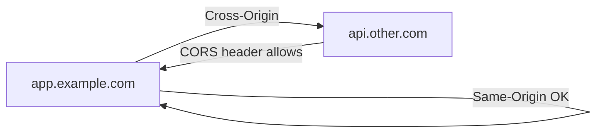

# Web 보안 기초

> Information Security 101 시리즈 (5/10)


## 이 글에서 다룰 문제

웹 보안의 80%는 같은 개념의 반복입니다. 출처와 쿠키를 정확히 이해하면 CSRF, XSS의 큰 줄기를 막을 수 있습니다.

> 출처가 보안 경계입니다.

## 개념 한눈에 보기



같은 출처는 자유, 다른 출처는 명시적 허용.

## Before/After

**Before — 모든 쿠키가 cross-site에서 전송**

```text
악성 사이트가 victim의 세션 쿠키로 요청 -> CSRF
```

**After — SameSite=Lax 기본**

```text
cross-site POST에 쿠키 미첨부 -> CSRF 차단
```

브라우저 기본값이 강해진 만큼 운영 책임도 분명해졌습니다.

## 실습: 헤더와 쿠키 다루기

### 1단계 — Flask로 CORS 허용

```python
# 1_cors.py
from flask import Flask, jsonify
from flask_cors import CORS
app = Flask(__name__)
CORS(app, resources={r"/api/*": {"origins": "https://app.example.com"}})

@app.get("/api/me")
def me(): return jsonify(user="alice")
```

와일드카드(`*`)는 인증된 요청에 쓰지 않습니다.

### 2단계 — CSP 헤더 추가

```python
# 2_csp.py
@app.after_request
def csp(resp):
    resp.headers["Content-Security-Policy"] = (
        "default-src 'self'; script-src 'self'; img-src 'self' data:"
    )
    return resp
```

`unsafe-inline`을 피하면 XSS의 영향을 크게 줄입니다.

### 3단계 — 안전한 쿠키 설정

```python
# 3_cookie.py
@app.get("/login")
def login():
    resp = app.make_response("ok")
    resp.set_cookie("sid", "xyz", secure=True, httponly=True, samesite="Lax")
    return resp
```

세 플래그(Secure, HttpOnly, SameSite)는 묶어서 사용합니다.

### 4단계 — CSRF 토큰 검증 (의사코드)

```python
# 4_csrf.py
def verify_csrf(req):
    if req.method in ("POST", "PUT", "DELETE"):
        if req.headers.get("X-CSRF") != session["csrf"]:
            raise PermissionError
```

double-submit 또는 synchronizer pattern을 선택합니다.

### 5단계 — XSS 방지: 자동 escape

```python
# 5_xss.py
from markupsafe import escape
def render(name):
    return f"<h1>Hello {escape(name)}</h1>"
```

서버 템플릿 엔진의 자동 escape를 신뢰하되, 컨텍스트(HTML/JS/URL)별 escape를 구분합니다.

## 이 코드에서 주목할 점

- CORS는 "허용"이지 "보호"가 아닙니다 — 인증과 함께 설계합니다.
- CSP는 단계적으로 도입(Report-Only -> Enforce)합니다.
- 쿠키 세 플래그는 함께 다닙니다.
- CSRF 방어는 토큰 또는 SameSite로 일관되게.

## 자주 하는 실수 5가지

1. **CORS에 `*` + credentials 동시 사용.** 표준상 금지.
2. **CSP에 `unsafe-inline`.** XSS 방어가 무력화.
3. **쿠키에 Secure/HttpOnly 누락.** XSS로 세션 탈취.
4. **GET으로 상태 변경.** 캐시/링크/CSRF에 취약.
5. **Origin 검증 없이 referrer만 신뢰.** 위조 가능.

## 실무에서는 이렇게 쓰입니다

CSP는 nonce/hash로 점진적으로 적용합니다. 인증된 API는 CORS 화이트리스트와 SameSite=Strict 쿠키, CSRF 토큰을 함께 사용합니다. CDN 앞단에서 보안 헤더를 일괄 추가하는 패턴(예: CloudFront Functions)이 흔합니다.

## 체크리스트

- [ ] Same-origin의 정의를 한 줄로 답할 수 있는가?
- [ ] CORS 허용 정책을 누가/어디서 관리하는가?
- [ ] CSP 정책이 적용되어 있는가?
- [ ] 모든 세션 쿠키에 세 플래그가 켜져 있는가?
- [ ] CSRF 방어 메커니즘이 명시되어 있는가?

## 정리 및 다음 단계

웹 보안의 큰 줄기는 출처와 쿠키입니다. 다음 글에서는 코드 단의 두 대표 취약점 — SQL Injection과 XSS — 를 봅니다.

<!-- toc:begin -->
- [정보보안이란 무엇인가?](./01-what-is-information-security.md)
- [인증과 인가](./02-authentication-and-authorization.md)
- [암호화와 해시](./03-cryptography-and-hash.md)
- [TLS와 인증서](./04-tls-and-certificates.md)
- **Web 보안 기초 (현재 글)**
- SQL Injection과 XSS (예정)
- secret 관리 (예정)
- 권한 최소화 (예정)
- 로그와 감사 (예정)
- 보안 사고 대응 (예정)
<!-- toc:end -->

## 참고 자료

- [OWASP — Web Security Testing Guide](https://owasp.org/www-project-web-security-testing-guide/)
- [MDN — Same-origin policy](https://developer.mozilla.org/en-US/docs/Web/Security/Same-origin_policy)
- [MDN — Content Security Policy](https://developer.mozilla.org/en-US/docs/Web/HTTP/CSP)
- [web.dev — SameSite cookies explained](https://web.dev/articles/samesite-cookies-explained)

Tags: Computer Science, Security, WebSecurity, CORS, CSP, SameOrigin
