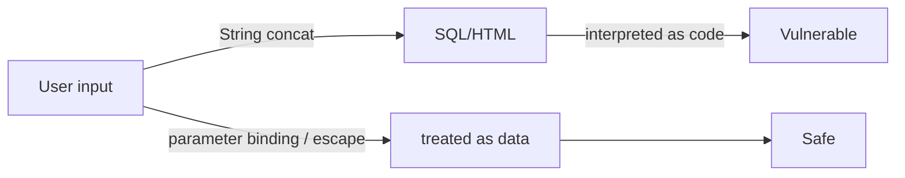

# Information Security 101 (6/10): SQL 인젝션과 XSS

보안 입문자가 가장 먼저 듣는 취약점 이름 두 개를 고르라면 아마 SQL 인젝션과 XSS일 것입니다. 오래된 취약점인데도 계속 반복되는 이유는 단순합니다. 새 프레임워크가 나와도 뿌리는 거의 같기 때문입니다. 입력값이 데이터로 남아야 할 자리에 코드처럼 해석되는 순간 문제가 시작됩니다.

이 글은 Information Security 101 시리즈의 6번째 글입니다.

## 먼저 던지는 질문

- SQL 인젝션은 정확히 어떤 메커니즘으로 발생할까요?
- ORM을 쓰면 정말 안전해질까요?
- Reflected, Stored, DOM 기반 XSS는 어디서 갈릴까요?

## 큰 그림


*Information Security 101 6장 흐름 개요*

그림은 사용자 입력 → 파라미터 검증 → 쿼리 구성 또는 DOM 렌더링 → 저장 또는 브라우저 렌더링의 흐름에서, 신뢰할 수 없는 데이터가 어디서 탈출되고 기록되는지를 보여줍니다. SQL과 HTML 컨텍스트는 다른 탈출 규칙을 따릅니다.

> SQL 인젝션과 XSS 모두 신뢰할 수 없는 입력을 그 컨텍스트의 명령어로 해석하게 만드는 공격입니다. 방어는 입력 필터가 아니라 준비된 문과 컨텍스트 기반 이스케이핑입니다.

## 왜 중요한가

이 두 취약점은 여러 해 동안 OWASP Top 10에 반복해서 등장했습니다. 한 번 원리를 이해하면 언어와 프레임워크가 바뀌어도 같은 방식으로 방어할 수 있습니다. 반대로 특정 라이브러리나 특정 프레임워크의 “자동 보호”만 믿으면 예외 경로에서 그대로 무너집니다.

결국 중요한 것은 입력이 코드가 되지 않게 막는 일과, 출력이 해석되는 문맥을 분명히 구분하는 일입니다.

## 한눈에 보는 개념



같은 입력도 다루는 방식에 따라 결과가 완전히 달라집니다. 문자열 결합은 취약점으로 이어지고, 바인딩과 인코딩은 데이터를 데이터로 남깁니다.

## 핵심 용어

- **SQL 인젝션**: 입력이 SQL 문법 일부로 해석되는 취약점입니다.
- **매개변수 바인딩**: 입력을 SQL과 분리해 데이터로 전달하는 방식입니다.
- **반사형 XSS**: 입력이 응답에 바로 반영되는 형태입니다.
- **저장형 XSS**: 입력이 저장된 뒤 다른 사용자에게 다시 제공되는 형태입니다.
- **출력 인코딩**: HTML, 자바스크립트, URL처럼 출력 문맥에 맞게 이스케이프하는 방식입니다.

## 전후 비교

### 이전 — 문자열 결합으로 쿼리 작성

```python
cur.execute(f"SELECT * FROM users WHERE name='{name}'")
# name = "' OR 1=1 --"  -> returns every row
```

### 이후 — 매개변수 바인딩 사용

```python
cur.execute("SELECT * FROM users WHERE name=%s", (name,))
```

## 주입 공격 유형 비교

| 공격 유형 | 동작 원리 | 예시 | 주요 방어 방법 |
|---|---|---|---|
| **SQL Injection** | 입력이 SQL 구문의 일부로 해석됨 | `' OR 1=1 --` | 매개변수 바인딩, ORM, Prepared Statement |
| **XSS** | 입력이 HTML/JS로 실행됨 | `<script>alert(1)</script>` | 출력 인코딩, CSP, 프레임워크 기본 이스케이핑 |
| **CSRF** | 사용자 브라우저가 위조 요청을 보냄 | 이미지 태그로 POST 트리거 | CSRF 토큰, SameSite 쿠키, Referer 검증 |
| **Command Injection** | 입력이 셸 명령어로 해석됨 | `; rm -rf /` | 인수 배열 전달, 셸 호출 금지, 샌드박싱 |

모든 주입 공격의 뿌리는 같습니다. 신뢰할 수 없는 데이터가 코드로 해석될 수 있는 경계를 넘는 순간 발생합니다. 방어의 핵심은 데이터를 데이터로만 다루는 API를 사용하는 것입니다.
한 줄 차이지만 사고와 안전을 가르는 차이입니다.

## 단계별 실습

### 1단계 — 안전한 SQL을 작성합니다

```python
# 1_sql_safe.py
import sqlite3
con = sqlite3.connect(":memory:")
con.execute("CREATE TABLE u (id int, name text)")
con.execute("INSERT INTO u VALUES (?, ?)", (1, "alice"))
print(con.execute("SELECT * FROM u WHERE name=?", ("alice",)).fetchall())
```

`?`나 `%s` 자리에 입력값을 직접 끼워 넣으면 안 됩니다. 그 자리는 언제나 바인딩용 자리로 남겨 두어야 합니다.

### 2단계 — ORM도 예외 통로가 있다는 점을 봅니다

```python
# 2_orm_dynamic.py
# SQLAlchemy raw escape hatches stay risky
# session.execute(text(f"SELECT * FROM u WHERE name='{name}'"))  # do not do this
```

ORM은 많은 위험을 줄여 주지만, 원시 SQL이나 `text` 같은 탈출구를 쓰는 순간 같은 문제가 다시 들어옵니다.

### 3단계 — 반사형 XSS를 막습니다

```python
# 3_xss_reflect.py
from markupsafe import escape
def search(q):
    return f"<p>Query: {escape(q)}</p>"
```

서버에서 렌더링하기 전에 반드시 이스케이프해야 합니다. 사용자 입력을 그대로 HTML에 넣으면 바로 실행 표면이 됩니다.

### 4단계 — 저장형 XSS를 막습니다

```python
# 4_xss_stored.py
def render_comment(html):
    # store the original; encode at output time
    return f"<div>{escape(html)}</div>"
```

원문을 저장하고 출력 시점에 인코딩하는 규칙을 일관되게 지키는 것이 중요합니다.

### 5단계 — DOM 기반 XSS를 피합니다

```javascript
// 5_dom_xss.js
// document.body.innerHTML = location.hash;   // dangerous
const text = decodeURIComponent(location.hash.slice(1));
const node = document.createTextNode(text);   // safe
document.body.appendChild(node);
```

브라우저에서 DOM을 직접 다룰 때는 `innerHTML`보다 텍스트 노드 API를 먼저 떠올리는 편이 안전합니다.

### 6단계 — 안전한 쿼리와 취약한 쿼리를 비교합니다

```python
# 6_safe_vs_unsafe.py
import sqlite3

# 취약한 방식 — 절대 사용하지 마세요
def unsafe_query(name):
    con = sqlite3.connect(":memory:")
    con.execute("CREATE TABLE users (id int, name text)")
    con.execute("INSERT INTO users VALUES (1, 'alice')")
    # 공격: name = "' OR '1'='1"
    cursor = con.execute(f"SELECT * FROM users WHERE name='{name}'")
    return cursor.fetchall()

# 안전한 방식 — 항상 이렇게 작성하세요
def safe_query(name):
    con = sqlite3.connect(":memory:")
    con.execute("CREATE TABLE users (id int, name text)")
    con.execute("INSERT INTO users VALUES (1, 'alice')")
    cursor = con.execute("SELECT * FROM users WHERE name=?",(name,))
    return cursor.fetchall()

# 테스트
attack_payload = "' OR '1'='1"
print("Unsafe:", unsafe_query(attack_payload))  # 모든 행 반환
print("Safe:", safe_query(attack_payload))      # 빈 결과
```

취약한 쿼리는 공격 페이로드를 SQL 구문으로 해석합니다. 안전한 쿼리는 같은 값을 단순 문자열 데이터로 취급합니다. 이 한 줄 차이가 전체 데이터베이스 유출과 안전한 운영을 가릅니다.

## 이 코드와 예제에서 먼저 볼 점

- 모든 SQL은 매개변수 바인딩을 거쳐야 합니다.
- 출력 인코딩은 HTML 본문, 속성, URL, 자바스크립트처럼 문맥별로 달라집니다.
- DOM 조작에서는 `innerHTML`를 피하는 편이 안전합니다.
- 입력 검증은 보조 방어일 뿐, 주 방어는 아닙니다.

## 입력 검증 전략

입력 검증은 보조 방어층입니다. 주 방어는 매개변수 바인딩과 출력 인코딩입니다. 그럼에도 입력 검증은 공격 표면을 줄이는 데 도움이 됩니다.

### 허용 목록 방식

```python
# allow_list.py
ALLOWED_SORT_COLUMNS = {"name", "created_at", "id"}

def get_users(sort_by: str):
    if sort_by not in ALLOWED_SORT_COLUMNS:
        raise ValueError(f"Invalid sort column: {sort_by}")
    # 여기서는 직접 삽입 가능 (허용 목록 검증 완료)
    return f"SELECT * FROM users ORDER BY {sort_by}"
```

허용 목록은 예측 가능한 값의 집합이 작을 때 가장 안전합니다. 컬럼 이름, 정렬 방향, 테이블 이름처럼 미리 정의된 값에 적합합니다.

### 거부 목록의 한계

```python
# deny_list.py — 권장하지 않음
FORBIDDEN_PATTERNS = ["--", ";", "'", '"', "OR", "DROP"]

def unsafe_filter(user_input: str):
    for pattern in FORBIDDEN_PATTERNS:
        if pattern.lower() in user_input.lower():
            raise ValueError("Forbidden pattern detected")
    return user_input

# 우회 가능:
# 1. 대소문자: oR, Or
# 2. 인코딩: %4F%52 (OR의 URL 인코딩)
# 3. 주석: /**/ 사이에 공백 삽입
# 4. Unicode: fullwidth 문자 사용
```

거부 목록은 우회 방법이 무한합니다. 가능하면 허용 목록과 매개변수 바인딩을 함께 사용하는 것이 훨씬 안전합니다.

### 타입 기반 검증

```python
# type_validation.py
from pydantic import BaseModel, validator

class UserQuery(BaseModel):
    user_id: int
    sort: str

    @validator("sort")
    def validate_sort(cls, v):
        allowed = {"name", "created_at"}
        if v not in allowed:
            raise ValueError(f"Sort must be one of {allowed}")
        return v

# FastAPI 엔드포인트
# @app.get("/users")
# def list_users(q: UserQuery):
#     return db.execute(
#         f"SELECT * FROM users WHERE id > ? ORDER BY {q.sort}",
#         (q.user_id,)
#     )
```

프레임워크 수준에서 타입과 값을 먼저 검증하면 잘못된 입력이 핸들러까지 도달하지 못합니다. 이 방식은 API 계약 검증과 보안 검증을 하나로 통합합니다.

## 자주 하는 실수 다섯 가지

1. **f-string으로 SQL을 만드는 실수**: 가장 흔한 인젝션 경로입니다.
2. **HTML 입력을 저장한 뒤 정제 없이 다시 렌더링하는 실수**: 저장형 XSS로 이어집니다.
3. **자바스크립트 문맥에 HTML 이스케이프만 적용하는 실수**: 잘못된 인코더입니다.
4. **사용자 입력을 `innerHTML`에 넣는 실수**: DOM 기반 XSS가 생깁니다.
5. **블랙리스트 필터만 믿는 실수**: 우회가 쉽습니다. 허용 목록이 더 안전합니다.

## 실무에서는 이렇게 나타납니다

큰 시스템은 ORM으로만 타입이 정해진 쿼리를 허용하고, 원시 SQL은 코드 리뷰를 강제합니다. 프런트엔드는 프레임워크의 기본 텍스트 보간을 신뢰하되 `dangerouslySetInnerHTML` 같은 직접 HTML 주입 경로는 승인 절차를 따로 둡니다. 웹 방화벽은 보조층일 뿐, 주 방어가 아닙니다.

## 시니어 엔지니어는 이렇게 생각합니다

- 입력은 데이터로, 출력은 문맥에 맞게 인코딩한다는 두 줄 규칙을 팀 표준으로 둡니다.
- 정적 분석과 린트로 원시 SQL을 막습니다.
- HTML 정제기는 하나를 정해 전역에서 같이 씁니다.
- DOM 기반 XSS는 코드 리뷰와 정적 분석으로 잡습니다.
- 새 입력 경로가 생기면 위협 모델을 갱신합니다.

## 체크리스트

- [ ] 모든 SQL이 매개변수 바인딩을 사용합니까?
- [ ] 출력 인코딩이 문맥별로 적용되고 있습니까?
- [ ] `innerHTML` 사용 지점을 점검했습니까?
- [ ] HTML 정제기가 표준화되어 있습니까?
- [ ] 웹 방화벽 외에도 코드 수준 방어가 있습니까?

## 연습 문제

1. `name=' OR '1'='1`을 막는 한 줄 수정 코드를 적어 보세요.
2. 반사형 XSS와 저장형 XSS의 운영 차이 두 가지를 적어 보세요.
3. DOM 기반 XSS를 막는 React 패턴 하나를 설명해 보세요.

## 정리와 다음 글

SQL 인젝션과 XSS는 모두 입력 처리 일관성이 무너질 때 생깁니다. 입력을 코드로 해석시키지 않는 원칙만 분명해도 새로운 프레임워크에서도 같은 방식으로 방어할 수 있습니다. 다음 글에서는 코드 밖의 설정 영역으로 넘어가 비밀 정보 관리를 다룹니다.


## OWASP Top 10과 SQLi/XSS의 위치

SQL 인젝션과 XSS는 이름은 오래됐지만, OWASP Top 10 관점에서는 여전히 중심 축입니다. 특히 다음 항목과 강하게 연결됩니다.

| OWASP Top 10 항목 | SQLi/XSS와의 연결 | 예방 핵심 |
| --- | --- | --- |
| A03 Injection | SQL/NoSQL/OS 명령 주입 | 매개변수화, 입력 경계 검증 |
| A03 Injection (XSS 포함) | 브라우저에서 스크립트 실행 | 컨텍스트 인코딩, CSP |
| A01 Broken Access Control | 주입 이후 권한 우회 확장 | 서버 인가 재검증 |
| A09 Security Logging and Monitoring Failures | 탐지 지연 | 공격 시그널 로깅/경보 |

입력 취약점은 단독 이슈가 아니라 권한, 로깅, 배포 파이프라인과 함께 증폭됩니다.

## 취약점별 방어 코드 패턴

```python
# vuln_defense_patterns.py
import sqlite3
from markupsafe import escape

con = sqlite3.connect(":memory:")
con.execute("CREATE TABLE users (id INTEGER, name TEXT)")


def safe_lookup(name: str):
    # SQL 인젝션 방어: 바인딩 사용
    return con.execute("SELECT id, name FROM users WHERE name = ?", (name,)).fetchall()


def safe_html(name: str) -> str:
    # XSS 방어: 출력 시점 이스케이프
    return f"<p>{escape(name)}</p>"


def validate_limit(limit: int) -> int:
    # 입력 검증: 허용 범위 강제
    if not 1 <= limit <= 100:
        raise ValueError("limit out of range")
    return limit
```

이 코드에서 중요한 점은 방어 레이어가 다르다는 것입니다.

- SQL 방어: 쿼리 작성 단계
- XSS 방어: 렌더링 단계
- 입력 검증: 비즈니스 규칙 단계

한 레이어만으로 전체를 해결할 수 없습니다.

## 테스트 케이스를 먼저 고정하기

보안 회귀를 줄이려면 취약점 재현 문자열을 테스트 자산으로 유지해야 합니다.

| 테스트 대상 | 악성 입력 예시 | 기대 결과 |
| --- | --- | --- |
| 사용자 조회 API | `' OR 1=1 --` | 400 또는 빈 결과 |
| 댓글 렌더링 | `<script>alert(1)</script>` | 스크립트 미실행, 이스케이프 출력 |
| 검색 정렬 파라미터 | `name; DROP TABLE users` | 허용 목록 외 값 거부 |

정적 분석(SAST)과 동적 테스트(DAST)를 결합하면 코드와 런타임 양쪽에서 누수를 줄일 수 있습니다.

## 운영에서 반드시 남길 탐지 신호

- 짧은 시간 내 반복되는 SQL 문법 오류
- 특정 사용자/아이피의 비정상적으로 긴 쿼리 파라미터
- HTML/JS 특수 문자 포함 입력 급증
- WAF 차단 이벤트와 애플리케이션 오류 로그 상관관계

탐지 신호가 없으면 "막았는지"를 알 수 없습니다. 방어와 탐지는 같이 설계해야 합니다.

## 처음 질문으로 돌아가기

- **SQL 인젝션은 정확히 어떤 메커니즘으로 발생할까요?**
  - SELECT * FROM users WHERE id = ? 쿼리의 준비된 문 구성 방식과 HTML 템플릿의 자동 이스케이핑 메커니즘을 구분하면 구현이 명확해집니다.
- **ORM을 쓰면 정말 안전해질까요?**
  - 페이로드가 어떻게 파싱되고, 어느 단계에서 기각되거나 실행되는지를 단계별로 따라가면 대응 기준이 명확해집니다.
- **Reflected, Stored, DOM 기반 XSS는 어디서 갈릴까요?**
  - 쿼리 로그에서 의심스러운 문법 검사, XSS 시뮬레이션 테스트, 외부 라이브러리 업데이트 시 이스케이핑 규칙 변경 모니터링을 정의합니다.

<!-- toc:begin -->
## 시리즈 목차

- [Information Security 101 (1/10): 정보보안이란 무엇인가?](./01-what-is-information-security.md)
- [Information Security 101 (2/10): 인증과 인가](./02-authentication-and-authorization.md)
- [Information Security 101 (3/10): 암호화와 해시](./03-cryptography-and-hash.md)
- [Information Security 101 (4/10): TLS와 인증서](./04-tls-and-certificates.md)
- [Information Security 101 (5/10): 웹 보안 기초](./05-web-security-basics.md)
- **SQL 인젝션과 XSS (현재 글)**
- 비밀 정보 관리 (예정)
- 권한 최소화 (예정)
- 로그와 감사 (예정)
- 보안 사고 대응 (예정)

<!-- toc:end -->

## 참고 자료

- [OWASP — SQL Injection](https://owasp.org/www-community/attacks/SQL_Injection)
- [OWASP — XSS](https://owasp.org/www-community/attacks/xss/)
- [OWASP Cheat Sheet — XSS Prevention](https://cheatsheetseries.owasp.org/cheatsheets/Cross_Site_Scripting_Prevention_Cheat_Sheet.html)
- [PortSwigger Web Security Academy](https://portswigger.net/web-security)

Tags: Computer Science, Security, SQLInjection, XSS, InputValidation, OutputEncoding
