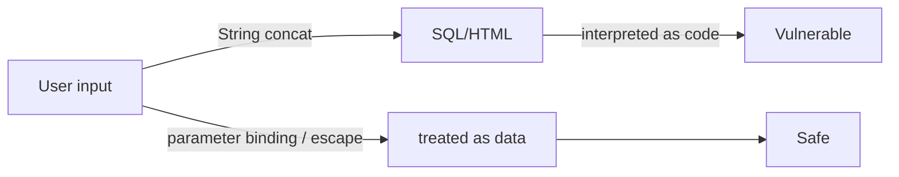

# SQL 인젝션과 XSS

보안 입문자가 가장 먼저 듣는 취약점 이름 두 개를 고르라면 아마 SQL 인젝션과 XSS일 것입니다. 오래된 취약점인데도 계속 반복되는 이유는 단순합니다. 새 프레임워크가 나와도 뿌리는 거의 같기 때문입니다. 입력값이 데이터로 남아야 할 자리에 코드처럼 해석되는 순간 문제가 시작됩니다.

이 글은 Information Security 101 시리즈의 6번째 글입니다.

## 이 글에서 다룰 문제

SQL 인젝션과 XSS는 서로 다른 계층에서 발생하지만 핵심 원리는 같습니다. 사용자 입력을 코드처럼 실행되게 두지 않고, 입력은 데이터로, 출력은 문맥에 맞게 처리해야 합니다.

> 입력은 데이터로 다루고, 출력은 렌더링되는 문맥에 맞게 인코딩해야 합니다.

- SQL 인젝션은 정확히 어떤 메커니즘으로 발생할까요?
- ORM을 쓰면 정말 안전해질까요?
- Reflected, Stored, DOM 기반 XSS는 어디서 갈릴까요?
- 출력 인코딩은 왜 문맥별로 달라져야 할까요?
- 입력 검증과 출력 인코딩 중 무엇이 우선일까요?

## 왜 중요한가

이 두 취약점은 여러 해 동안 OWASP Top 10에 반복해서 등장했습니다. 한 번 원리를 이해하면 언어와 프레임워크가 바뀌어도 같은 방식으로 방어할 수 있습니다. 반대로 특정 라이브러리나 특정 프레임워크의 “자동 보호”만 믿으면 예외 경로에서 그대로 무너집니다.

결국 중요한 것은 입력이 코드가 되지 않게 막는 일과, 출력이 해석되는 문맥을 분명히 구분하는 일입니다.

## 한눈에 보는 개념



같은 입력도 다루는 방식에 따라 결과가 완전히 달라집니다. 문자열 결합은 취약점으로 이어지고, 바인딩과 인코딩은 데이터를 데이터로 남깁니다.

## 핵심 용어

- **SQL 인젝션**: 입력이 SQL 문법 일부로 해석되는 취약점입니다.
- **매개변수 바인딩**: 입력을 SQL과 분리해 데이터로 전달하는 방식입니다.
- **반사형 XSS**: 입력이 응답에 바로 반영되는 형태입니다.
- **저장형 XSS**: 입력이 저장된 뒤 다른 사용자에게 다시 제공되는 형태입니다.
- **출력 인코딩**: HTML, 자바스크립트, URL처럼 출력 문맥에 맞게 이스케이프하는 방식입니다.

## 전후 비교

### 이전 — 문자열 결합으로 쿼리 작성

```python
cur.execute(f"SELECT * FROM users WHERE name='{name}'")
# name = "' OR 1=1 --"  -> returns every row
```

### 이후 — 매개변수 바인딩 사용

```python
cur.execute("SELECT * FROM users WHERE name=%s", (name,))
```

한 줄 차이지만 사고와 안전을 가르는 차이입니다.

## 단계별 실습

### 1단계 — 안전한 SQL을 작성합니다

```python
# 1_sql_safe.py
import sqlite3
con = sqlite3.connect(":memory:")
con.execute("CREATE TABLE u (id int, name text)")
con.execute("INSERT INTO u VALUES (?, ?)", (1, "alice"))
print(con.execute("SELECT * FROM u WHERE name=?", ("alice",)).fetchall())
```

`?`나 `%s` 자리에 입력값을 직접 끼워 넣으면 안 됩니다. 그 자리는 언제나 바인딩용 자리로 남겨 두어야 합니다.

### 2단계 — ORM도 예외 통로가 있다는 점을 봅니다

```python
# 2_orm_dynamic.py
# SQLAlchemy raw escape hatches stay risky
# session.execute(text(f"SELECT * FROM u WHERE name='{name}'"))  # do not do this
```

ORM은 많은 위험을 줄여 주지만, 원시 SQL이나 `text` 같은 탈출구를 쓰는 순간 같은 문제가 다시 들어옵니다.

### 3단계 — 반사형 XSS를 막습니다

```python
# 3_xss_reflect.py
from markupsafe import escape
def search(q):
    return f"<p>Query: {escape(q)}</p>"
```

서버에서 렌더링하기 전에 반드시 이스케이프해야 합니다. 사용자 입력을 그대로 HTML에 넣으면 바로 실행 표면이 됩니다.

### 4단계 — 저장형 XSS를 막습니다

```python
# 4_xss_stored.py
def render_comment(html):
    # store the original; encode at output time
    return f"<div>{escape(html)}</div>"
```

원문을 저장하고 출력 시점에 인코딩하는 규칙을 일관되게 지키는 것이 중요합니다.

### 5단계 — DOM 기반 XSS를 피합니다

```javascript
// 5_dom_xss.js
// document.body.innerHTML = location.hash;   // dangerous
const text = decodeURIComponent(location.hash.slice(1));
const node = document.createTextNode(text);   // safe
document.body.appendChild(node);
```

브라우저에서 DOM을 직접 다룰 때는 `innerHTML`보다 텍스트 노드 API를 먼저 떠올리는 편이 안전합니다.

## 이 코드와 예제에서 먼저 볼 점

- 모든 SQL은 매개변수 바인딩을 거쳐야 합니다.
- 출력 인코딩은 HTML 본문, 속성, URL, 자바스크립트처럼 문맥별로 달라집니다.
- DOM 조작에서는 `innerHTML`를 피하는 편이 안전합니다.
- 입력 검증은 보조 방어일 뿐, 주 방어는 아닙니다.

## 자주 하는 실수 다섯 가지

1. **f-string으로 SQL을 만드는 실수**: 가장 흔한 인젝션 경로입니다.
2. **HTML 입력을 저장한 뒤 정제 없이 다시 렌더링하는 실수**: 저장형 XSS로 이어집니다.
3. **자바스크립트 문맥에 HTML 이스케이프만 적용하는 실수**: 잘못된 인코더입니다.
4. **사용자 입력을 `innerHTML`에 넣는 실수**: DOM 기반 XSS가 생깁니다.
5. **블랙리스트 필터만 믿는 실수**: 우회가 쉽습니다. 허용 목록이 더 안전합니다.

## 실무에서는 이렇게 나타납니다

큰 시스템은 ORM으로만 타입이 정해진 쿼리를 허용하고, 원시 SQL은 코드 리뷰를 강제합니다. 프런트엔드는 프레임워크의 기본 텍스트 보간을 신뢰하되 `dangerouslySetInnerHTML` 같은 직접 HTML 주입 경로는 승인 절차를 따로 둡니다. 웹 방화벽은 보조층일 뿐, 주 방어가 아닙니다.

## 시니어 엔지니어는 이렇게 생각합니다

- 입력은 데이터로, 출력은 문맥에 맞게 인코딩한다는 두 줄 규칙을 팀 표준으로 둡니다.
- 정적 분석과 린트로 원시 SQL을 막습니다.
- HTML 정제기는 하나를 정해 전역에서 같이 씁니다.
- DOM 기반 XSS는 코드 리뷰와 정적 분석으로 잡습니다.
- 새 입력 경로가 생기면 위협 모델을 갱신합니다.

## 체크리스트

- [ ] 모든 SQL이 매개변수 바인딩을 사용합니까?
- [ ] 출력 인코딩이 문맥별로 적용되고 있습니까?
- [ ] `innerHTML` 사용 지점을 점검했습니까?
- [ ] HTML 정제기가 표준화되어 있습니까?
- [ ] 웹 방화벽 외에도 코드 수준 방어가 있습니까?

## 연습 문제

1. `name=' OR '1'='1`을 막는 한 줄 수정 코드를 적어 보세요.
2. 반사형 XSS와 저장형 XSS의 운영 차이 두 가지를 적어 보세요.
3. DOM 기반 XSS를 막는 React 패턴 하나를 설명해 보세요.

## 정리와 다음 글

SQL 인젝션과 XSS는 모두 입력 처리 일관성이 무너질 때 생깁니다. 입력을 코드로 해석시키지 않는 원칙만 분명해도 새로운 프레임워크에서도 같은 방식으로 방어할 수 있습니다. 다음 글에서는 코드 밖의 설정 영역으로 넘어가 비밀 정보 관리를 다룹니다.

<!-- toc:begin -->
- [정보보안이란 무엇인가?](./01-what-is-information-security.md)
- [인증과 인가](./02-authentication-and-authorization.md)
- [암호화와 해시](./03-cryptography-and-hash.md)
- [TLS와 인증서](./04-tls-and-certificates.md)
- [웹 보안 기초](./05-web-security-basics.md)
- **SQL 인젝션과 XSS (현재 글)**
- 비밀 정보 관리 (예정)
- 권한 최소화 (예정)
- 로그와 감사 (예정)
- 보안 사고 대응 (예정)
<!-- toc:end -->

## 참고 자료

- [OWASP — SQL Injection](https://owasp.org/www-community/attacks/SQL_Injection)
- [OWASP — XSS](https://owasp.org/www-community/attacks/xss/)
- [OWASP Cheat Sheet — XSS Prevention](https://cheatsheetseries.owasp.org/cheatsheets/Cross_Site_Scripting_Prevention_Cheat_Sheet.html)
- [PortSwigger Web Security Academy](https://portswigger.net/web-security)

Tags: Computer Science, Security, SQLInjection, XSS, InputValidation, OutputEncoding
