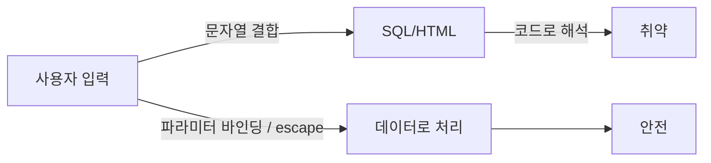

# SQL Injection과 XSS

> Information Security 101 시리즈 (6/10)


## 이 글에서 다룰 문제

OWASP Top 10에 수년간 머무르는 두 취약점입니다. 원리를 정확히 이해하면 새 프레임워크/언어에서도 같은 방식으로 방어할 수 있습니다.

> 입력은 데이터로 받고, 출력은 컨텍스트에 맞게 인코딩.

## 개념 한눈에 보기



같은 입력, 다른 처리 — 결과는 정반대.

## Before/After

**Before — 문자열 결합**

```python
cur.execute(f"SELECT * FROM users WHERE name='{name}'")
# name = "' OR 1=1 --"  -> 모든 행 반환
```

**After — 파라미터 바인딩**

```python
cur.execute("SELECT * FROM users WHERE name=%s", (name,))
```

같은 코드 한 줄 차이가 사고와 안전을 가릅니다.

## 실습: 코드로 보는 차이

### 1단계 — 안전한 SQL

```python
# 1_sql_safe.py
import sqlite3
con = sqlite3.connect(":memory:")
con.execute("CREATE TABLE u (id int, name text)")
con.execute("INSERT INTO u VALUES (?, ?)", (1, "alice"))
print(con.execute("SELECT * FROM u WHERE name=?", ("alice",)).fetchall())
```

`?` 또는 `%s` 자리에 입력을 직접 넣지 않습니다.

### 2단계 — ORM도 만능이 아님

```python
# 2_orm_dynamic.py
# SQLAlchemy raw 영역은 여전히 위험
# session.execute(text(f"SELECT * FROM u WHERE name='{name}'"))  # 금지
```

ORM의 `raw` / `text` 영역은 다시 파라미터 바인딩이 필요합니다.

### 3단계 — Reflected XSS 방어

```python
# 3_xss_reflect.py
from markupsafe import escape
def search(q):
    return f"<p>검색어: {escape(q)}</p>"
```

서버에서 항상 escape 후 출력합니다.

### 4단계 — Stored XSS 방어

```python
# 4_xss_stored.py
def render_comment(html):
    # 입력은 그대로 저장하되, 출력 시 escape
    return f"<div>{escape(html)}</div>"
```

저장은 원본, 출력은 인코딩 — 일관된 원칙.

### 5단계 — DOM-based XSS

```javascript
// 5_dom_xss.js
// document.body.innerHTML = location.hash;   // 위험
const text = decodeURIComponent(location.hash.slice(1));
const node = document.createTextNode(text);   // 안전
document.body.appendChild(node);
```

`innerHTML` 대신 텍스트 노드 API를 사용합니다.

## 이 코드에서 주목할 점

- 모든 SQL은 파라미터 바인딩으로 작성합니다.
- 출력 인코딩은 컨텍스트(HTML 본문/속성/URL/JS)별로 다릅니다.
- DOM 조작은 `innerHTML`을 피합니다.
- 입력 검증은 보조 방어선이지 주된 방어선이 아닙니다.

## 자주 하는 실수 5가지

1. **f-string으로 SQL 조립.** 가장 흔한 인젝션 통로.
2. **HTML 입력을 sanitize 없이 저장 후 출력.** Stored XSS.
3. **JS 컨텍스트에 HTML escape만 적용.** 컨텍스트 불일치.
4. **`innerHTML`로 사용자 입력 렌더링.** DOM XSS.
5. **블랙리스트 기반 필터.** 우회가 쉽습니다 — 화이트리스트로.

## 실무에서는 이렇게 쓰입니다

대형 시스템은 ORM의 typed query만 허용하고 raw SQL은 코드 리뷰 필수. 프론트엔드는 React/Vue의 텍스트 보간을 신뢰하되 `dangerouslySetInnerHTML`은 별도 승인. WAF는 추가 방어선이지 주된 방어가 아닙니다.

## 체크리스트

- [ ] 모든 SQL이 파라미터 바인딩을 쓰는가?
- [ ] 출력 인코딩이 컨텍스트별로 적용되는가?
- [ ] `innerHTML` 사용처를 점검했는가?
- [ ] HTML sanitizer가 통일되어 있는가?
- [ ] WAF에 의존하지 않는 코드 단 방어가 있는가?

## 정리 및 다음 단계

두 취약점 모두 입력 처리의 일관성 문제입니다. 다음 글에서는 코드보다 설정 — secret 관리 — 를 봅니다.

<!-- toc:begin -->
- [정보보안이란 무엇인가?](./01-what-is-information-security.md)
- [인증과 인가](./02-authentication-and-authorization.md)
- [암호화와 해시](./03-cryptography-and-hash.md)
- [TLS와 인증서](./04-tls-and-certificates.md)
- [Web 보안 기초](./05-web-security-basics.md)
- **SQL Injection과 XSS (현재 글)**
- secret 관리 (예정)
- 권한 최소화 (예정)
- 로그와 감사 (예정)
- 보안 사고 대응 (예정)
<!-- toc:end -->

## 참고 자료

- [OWASP — SQL Injection](https://owasp.org/www-community/attacks/SQL_Injection)
- [OWASP — XSS](https://owasp.org/www-community/attacks/xss/)
- [OWASP Cheat Sheet — XSS Prevention](https://cheatsheetseries.owasp.org/cheatsheets/Cross_Site_Scripting_Prevention_Cheat_Sheet.html)
- [PortSwigger Web Security Academy](https://portswigger.net/web-security)

Tags: Computer Science, Security, SQLInjection, XSS, InputValidation, OutputEncoding
