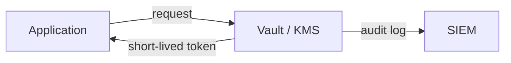

# Information Security 101 (7/10): 비밀 정보 관리

비밀번호, API 키, 데이터베이스 자격 증명은 애플리케이션을 움직이게 하지만 동시에 가장 민감한 약점이기도 합니다. 많은 팀이 비밀 정보를 “어디에 둘까”라는 저장 위치 문제로만 생각합니다. 그러나 실무에서 더 중요한 질문은 “새면 얼마나 빨리 바꿀 수 있는가”입니다. 회전이 안 되는 비밀 정보는 언젠가 영구 위험이 됩니다.

이 글은 Information Security 101 시리즈의 7번째 글입니다.


*Information Security 101 7장 흐름 개요*
> 비밀을 암호화하고 저장하는 것은 절반입니다. '누가, 언제, 어느 환경에서' 비밀을 사용했는지 기록하고, 비밀 유출 흔적을 감시하는 것이 나머지 절반입니다.

## 먼저 던지는 질문

- 정적 비밀 정보와 동적 비밀 정보는 어떻게 다를까요?
- 환경 변수는 어디까지 유효할까요?
- Vault와 KMS는 각각 어떤 역할을 맡을까요?

## 왜 중요한가

큰 사고의 절반 이상은 유출된 비밀 정보에서 시작합니다. 비밀 정보가 한 번 새고도 계속 유효하다면 그 자체로 장기 노출입니다. 반대로 짧은 수명과 자동 회전이 갖춰져 있으면 유출이 발생해도 피해 범위를 크게 줄일 수 있습니다.

비밀 정보는 자산이 아니라 부채에 가깝습니다. 오래 살아 있을수록 더 위험해집니다.

## 한눈에 보는 개념



애플리케이션은 비밀 자체를 들고 있기보다, 비밀을 가져올 권한만 갖는 편이 더 안전합니다. 접근은 짧게, 기록은 오래 남겨야 합니다.

## 핵심 용어

- **정적 비밀 정보**: 사람이 설정해 두고 오래 유지하는 키나 비밀번호입니다.
- **동적 비밀 정보**: 요청 시점에 짧은 수명으로 발급되는 자격 증명입니다.
- **Vault**: HashiCorp Vault 같은 비밀 정보 관리 시스템입니다.
- **KMS**: AWS KMS, GCP KMS 같은 키 관리 서비스입니다.
- 회전: 일정 주기나 사고 대응 시 비밀 정보를 새 값으로 교체하는 일입니다.

## 전후 비교

### 이전 — 평문 `.env`

```text
Accidentally committed -> permanent leak -> rotate every environment
```

### 이후 — Vault에서 짧은 수명 토큰 발급

```text
App requests a token at boot -> auto-rotates on expiry
```

비밀 정보를 어디에 적었는가보다, 얼마나 오래 살아 있는가가 실제 위험을 결정합니다.

## 시크릿 관리 도구 비교

| 도구 | 보안 수준 | 운영 비용 | 주요 기능 | 적합한 상황 |
|---|---|---|---|---|
| **HashiCorp Vault** | 높음 | 중간 | 동적 비밀, 암호화, 감사 로그, 회전 | 클라우드/온프레미스 모두 가능, 복잡한 회전 필요 |
| **AWS Secrets Manager** | 높음 | 낮음 | 자동 회전, RDS/Lambda 통합 | AWS 생태계, 관리형 서비스 선호 |
| **SOPS** | 중간 | 낮음 | 파일 단위 암호화, KMS 통합 | 설정 파일을 git에 저장, 소규모 팀 |
| **dotenv (.env)** | 낮음 | 매우 낮음 | 로컬 개발용 환경 변수 | 개발 단계, 프로덕션 사용 금지 |

Vault는 중앙 비밀 저장소로서 가장 강력하지만 운영 비용이 있습니다. AWS Secrets Manager는 관리형 서비스로 편리하지만 AWS에 종속됩니다. SOPS는 가볍고 git 친화적이지만 동적 비밀 발급은 못 합니다. dotenv는 로컬 개발에만 쓰고 프로덕션에는 적합하지 않습니다.
## 단계별 실습

### 1단계 — 환경 변수를 최소 기준으로 씁니다

```python
# 1_env.py
import os
db_url = os.environ["DATABASE_URL"]
# 절대 하드코딩하지 마세요: db_url = "postgres://user:pw@..."
```

환경 변수는 시작점일 뿐 최종 해법이 아닙니다. 최소한 `.env` 파일은 git에 올라가지 않게 해야 합니다.

### 2단계 — Vault에서 비밀 정보를 가져옵니다

```python
# 2_vault.py
import hvac
client = hvac.Client(url="http://vault:8200", token=os.environ["VAULT_TOKEN"])
data = client.secrets.kv.read_secret_version(path="myapp/db")
db_pw = data["data"]["data"]["password"]
```

Vault 토큰도 다시 짧은 수명이어야 합니다. AppRole, Kubernetes 서비스 계정 같은 신원 기반 발급과 함께 가야 합니다.

### 3단계 — KMS로 데이터 키를 다룹니다

```python
# 3_kms.py
import boto3
kms = boto3.client("kms")
resp = kms.generate_data_key(KeyId="alias/app", KeySpec="AES_256")
plaintext = resp["Plaintext"]      # in-memory only
ciphertext = resp["CiphertextBlob"] # store in DB
```

평문 데이터 키는 메모리 안에만 잠깐 머물고, 저장되는 것은 암호화된 형태여야 합니다.

### 4단계 — 시크릿 스캐너로 예방합니다

```bash
# 4_scan.sh
# pre-commit hook: trufflehog scans before commit
trufflehog filesystem . --only-verified
```

git 기록은 한 번 남으면 오래 갑니다. 유출을 복구하는 것보다 커밋 전에 막는 편이 훨씬 낫습니다.

### 5단계 — 회전 절차를 자동화합니다

```python
# 5_rotation.py
def rotate_db_password():
    new_pw = generate_strong_password()
    db.execute(f"ALTER USER app WITH PASSWORD %s", (new_pw,))
    vault.put("myapp/db", {"password": new_pw})
    notify_apps_to_reload()
```

회전은 문서 속 절차로 끝나면 안 됩니다. 자동화되어야 실제 사고에서 의미가 있습니다.

### 6단계 — Vault 클라이언트로 비밀을 가져옵니다

```python
# 6_vault_example.py
import hvac
import os

# Vault 서버에 연결
client = hvac.Client(
    url=os.environ.get("VAULT_ADDR", "http://127.0.0.1:8200"),
    token=os.environ["VAULT_TOKEN"]  # 이 토큰도 짧은 수명이어야 함
)

# KV v2 시크릿 읽기
secret = client.secrets.kv.v2.read_secret_version(path="myapp/prod/db")
db_password = secret["data"]["data"]["password"]
db_username = secret["data"]["data"]["username"]

print(f"Username: {db_username}")
# password는 메모리에만 보관하고 로그에 기록하지 않음

# Vault에서 동적 DB 자격 증명 발급 예시
# creds = client.secrets.database.generate_credentials(name="my-role")
# temp_user = creds["data"]["username"] # 짧은 생활 (TTL 1시간)
```

Vault 토큰 자체도 짧은 수명으로 관리해야 합니다. AppRole, Kubernetes Auth, AWS IAM 같은 신원 기반 인증을 사용하면 정적 토큰을 없애 수 있습니다.

## 이 코드와 예제에서 먼저 볼 점

- 비밀 정보 수명은 가능한 한 짧아야 합니다.
- 평문 비밀 정보는 메모리에서만 잠깐 살아야 합니다.
- 모든 접근은 감사 기록으로 남겨야 합니다.
- 회전은 런북 단계가 아니라 자동화 단계여야 합니다.

## 시크릿 로테이션 전략

비밀 정보를 저장하는 것만으로는 충분하지 않습니다. 유출을 가정하고 얼마나 빨리 교체할 수 있는지가 실제 보안 수준을 결정합니다.

### 자동 로테이션

```python
# rotation_example.py
import secrets
import string
import hvac

def generate_strong_password(length=32):
    alphabet = string.ascii_letters + string.digits + string.punctuation
    return ''.join(secrets.choice(alphabet) for _ in range(length))

def rotate_database_password(vault_client, db_connection, secret_path):
    # 1. 새 비밀번호 생성
    new_password = generate_strong_password()

    # 2. 데이터베이스에 새 비밀번호 설정
    db_connection.execute(
        "ALTER USER app_user WITH PASSWORD %s",
        (new_password,)
    )

    # 3. Vault에 새 비밀번호 저장
    vault_client.secrets.kv.v2.create_or_update_secret(
        path=secret_path,
        secret={"password": new_password, "rotated_at": "2026-05-21T10:00:00Z"},
    )

    # 4. 애플리케이션에 재시작 신호 보냄 (또는 grace period 동안 두 비밀번호 모두 허용)
    notify_applications_to_reload()

def notify_applications_to_reload():
    # Kubernetes라면 롤링 재시작
    # Lambda라면 환경 변수 업데이트
    pass
```

자동 로테이션은 운영 런북에 남아 있으면 안 됩니다. 코드로 자동화되어야 실제 사고에서 의미가 있습니다.

### 로테이션 주기 전략

| 비밀 유형 | 권장 로테이션 주기 | 이유 |
|---|---|---|
| API 키 | 90일 | 유출 시 피해 범위가 큼 |
| 데이터베이스 비밀번호 | 30일 | 핵심 자산 접근 권한 |
| TLS 인증서 | 90일 (Let's Encrypt 기본값) | 자동 갱신 기대 |
| SSH 키 | 180일 또는 사용할 때마다 | 인프라 접근 경로 |
| OAuth Refresh Token | 7일 | 사용자 세션 유지 vs 보안 균형 |

로테이션 주기는 비밀의 민감도, 유출 피해 범위, 로테이션 비용의 균형에서 결정됩니다. 짧을수록 안전하지만 운영 부담도 커집니다.

### 비밀 유출 감시

```python
# secret_leak_monitor.py
import re

def scan_for_leaked_secrets(log_line: str) -> bool:
    """AWS 키, JWT, 비밀번호 패턴 감지"""
    patterns = [
        r"AKIA[0-9A-Z]{16}",  # AWS Access Key
        r"eyJ[A-Za-z0-9_-]{10,}\.[A-Za-z0-9_-]{10,}\.[A-Za-z0-9_-]{10,}",  # JWT
        r"password\s*[:=]\s*['\"][^'\"]{8,}",  # password= pattern
    ]
    for pattern in patterns:
        if re.search(pattern, log_line, re.IGNORECASE):
            return True
    return False

# 사용 예시
if scan_for_leaked_secrets("DEBUG: token=eyJhbGci..."):
    alert_security_team("Potential secret in logs")
```

비밀 정보가 로그, Slack, 깃 커밋, 예외 추적에 노출되는 것을 자동으로 감지해야 합니다. truffleHog, git-secrets, detect-secrets 같은 도구를 CI/CD와 pre-commit hook에 통합하는 것이 좋습니다.

## 자주 하는 실수 다섯 가지

1. **`.env`를 커밋하는 실수**: 가장 흔한 유출 사고입니다.
2. **모든 것에 마스터 키 하나를 쓰는 실수**: 회전이 사실상 불가능해집니다.
3. **오류 로그나 애플리케이션 로그에 비밀 정보를 남기는 실수**: SIEM까지 넓게 퍼집니다.
4. **회전 정책이 없는 실수**: 유출이 장기 노출이 됩니다.
5. **슬랙이나 이메일로 비밀 정보를 공유하는 실수**: 검색 가능한 비밀 정보는 이미 비밀이 아닙니다.

## 실무에서는 이렇게 나타납니다

Kubernetes는 외부 비밀 저장소와 동기화 계층을 조합해 값을 주입합니다. CI/CD는 OIDC 연동으로 짧은 수명 자격 증명을 발급받고 정적 키를 없애는 방향으로 갑니다. AWS도 인스턴스 단위 단기 자격 증명을 발급하는 식으로 상시 키를 줄입니다. 좋은 시스템일수록 “코드에 박아 둔 비밀 정보”가 아니라 “신원이 비밀 정보를 요청하는 구조”로 바뀝니다.

## 시니어 엔지니어는 이렇게 생각합니다

- 모든 비밀 정보에는 만료 시점이 있어야 한다고 봅니다.
- 비밀 정보 관리는 IAM 설계와 함께 봅니다.
- `.env`는 로컬 개발용으로만 제한합니다.
- 사고 뒤 비밀 정보를 얼마나 빨리 회전할 수 있는지를 SLO로 둡니다.
- 시크릿 스캐너를 pre-commit과 CI 양쪽에서 돌립니다.

## 체크리스트

- [ ] 모든 비밀 정보에 회전 주기가 정의되어 있습니까?
- [ ] `.env`가 `.gitignore`에 포함되어 있습니까?
- [ ] 비밀 정보 접근이 감사 로그로 남습니까?
- [ ] 회전 런북이 문서화되어 있습니까?
- [ ] CI/CD에서 정적 자격 증명이 제거되어 있습니까?

## 연습 문제

1. 환경 변수와 Vault의 차이를 한 단락으로 설명해 보세요.
2. 회전 SLO를 어떻게 측정할지 정의해 보세요.
3. git에 비밀 정보가 실수로 올라갔을 때 안전한 대응 절차를 적어 보세요.

## 정리와 다음 글

비밀 정보 관리는 저장 위치보다 수명과 회전의 문제입니다. 짧은 수명, 자동 회전, 접근 기록이 갖춰질수록 유출의 피해 범위는 작아집니다. 다음 글에서는 비밀 정보를 가진 주체가 어디까지 할 수 있어야 하는지, 권한 최소화를 다룹니다.


## Secret 관리 도구 비교: Vault와 AWS Secrets Manager

비밀 정보 관리 도구를 고를 때는 기능 목록보다 운영 모델을 먼저 봐야 합니다.

| 항목 | HashiCorp Vault | AWS Secrets Manager |
| --- | --- | --- |
| 배포 형태 | 자체 운영/매니지드(HCP) | AWS 완전관리형 |
| 강점 | 동적 시크릿, 세밀한 정책, 멀티클라우드 | AWS 서비스 통합, 회전 자동화 간편 |
| 운영 부담 | 클러스터 운영/백업/업그레이드 필요 | 상대적으로 낮음 |
| 적합한 환경 | 클라우드 혼합, 고급 정책 요구 | AWS 중심 워크로드 |

정답은 조직의 운영 역량과 클라우드 전략에 따라 달라집니다. "어떤 도구가 더 안전한가"보다 "어떤 도구를 우리 팀이 일관되게 운영할 수 있는가"가 실무에서는 더 중요합니다.

## 설정 예시 1: Vault 정책과 AppRole

```yaml
# vault-policy-and-approle.yaml
vault:
  policy_name: app-read-db
  policy_hcl: |
    path "kv/data/myapp/db" {
      capabilities = ["read"]
    }
  approle:
    role_name: myapp
    token_ttl: "30m"
    token_max_ttl: "2h"
    secret_id_ttl: "24h"
```

정책은 리소스 경로 단위로 최소 권한을 부여하고, 토큰은 짧은 수명으로 발급하는 것이 기본입니다.

## 설정 예시 2: AWS Secrets Manager 회전

```yaml
# aws-secret-rotation.yaml
secret:
  name: prod/myapp/db
  kms_key_id: alias/prod-secrets
  rotation:
    enabled: true
    interval_days: 30
    lambda_arn: arn:aws:lambda:ap-northeast-2:123456789012:function:rotate-db-credential
  access:
    iam_role: arn:aws:iam::123456789012:role/myapp-runtime-role
```

회전 주기만 설정하고 실제 회전 함수 검증을 생략하면 장애가 납니다. 회전은 항상 스테이징 리허설과 롤백 절차를 함께 가져가야 합니다.

## 애플리케이션 로딩 패턴

```python
# secret_loader.py
import os
import json


def load_db_credential() -> dict:
    raw = os.environ.get("DB_SECRET_JSON")
    if not raw:
        raise RuntimeError("missing DB_SECRET_JSON")
    data = json.loads(raw)
    # 로그 금지: password, token 같은 민감값 출력 금지
    return {
        "username": data["username"],
        "password": data["password"],
        "host": data["host"],
        "port": data["port"],
    }
```

실무에서는 애플리케이션이 비밀 값을 장시간 캐시하지 않도록 TTL 기반 재조회 또는 sidecar 갱신 패턴을 씁니다.

## 운영 점검 항목

- 모든 시크릿에 소유자(owner)와 회전 주기 필드가 있는가
- 미사용 시크릿을 자동 탐지하고 폐기하는가
- 시크릿 접근 이벤트가 SIEM으로 전송되는가
- 개발/스테이징/운영 시크릿이 완전히 분리되는가
- 비상 회전(runbook)이 문서가 아니라 자동화로 검증되는가


## 운영 점검 루프와 문서화 기준

보안 글에서 가장 자주 빠지는 부분은 "그래서 운영에서는 무엇을 주기적으로 확인할 것인가"입니다. 아래 루프를 기준으로 문서화하면 개념이 실무로 연결됩니다.

| 주기 | 점검 항목 | 산출물 |
| --- | --- | --- |
| 매일 | 고위험 경보, 인증 실패 급증, 권한 거부 급증 | 일일 보안 브리핑 |
| 매주 | 신규 배포 변경점의 보안 영향 | 변경 검토 노트 |
| 매월 | 키/토큰/인증서 만료 예정, 미사용 권한, 미사용 시크릿 | 월간 정리 리포트 |
| 분기 | 위협 모델 재평가, 런북 훈련, 통제 효과 검토 | 분기 보안 회고 |

실행 가능한 문서의 조건도 분명해야 합니다.

- 담당자(owner)와 대체 담당자가 명시되어야 합니다.
- 실패 조건과 에스컬레이션 기준이 수치로 정의되어야 합니다.
- 점검 결과가 티켓이나 액션 아이템으로 추적되어야 합니다.
- 예외 승인에는 만료일이 반드시 있어야 합니다.

보안은 단발성 프로젝트가 아니라 운영 루프입니다. 같은 점검을 반복해도 기준이 유지될 때 품질이 올라갑니다.


## 운영 점검 루프와 문서화 기준

보안 글에서 가장 자주 빠지는 부분은 "그래서 운영에서는 무엇을 주기적으로 확인할 것인가"입니다. 아래 루프를 기준으로 문서화하면 개념이 실무로 연결됩니다.

| 주기 | 점검 항목 | 산출물 |
| --- | --- | --- |
| 매일 | 고위험 경보, 인증 실패 급증, 권한 거부 급증 | 일일 보안 브리핑 |
| 매주 | 신규 배포 변경점의 보안 영향 | 변경 검토 노트 |
| 매월 | 키/토큰/인증서 만료 예정, 미사용 권한, 미사용 시크릿 | 월간 정리 리포트 |
| 분기 | 위협 모델 재평가, 런북 훈련, 통제 효과 검토 | 분기 보안 회고 |

실행 가능한 문서의 조건도 분명해야 합니다.

- 담당자(owner)와 대체 담당자가 명시되어야 합니다.
- 실패 조건과 에스컬레이션 기준이 수치로 정의되어야 합니다.
- 점검 결과가 티켓이나 액션 아이템으로 추적되어야 합니다.
- 예외 승인에는 만료일이 반드시 있어야 합니다.

보안은 단발성 프로젝트가 아니라 운영 루프입니다. 같은 점검을 반복해도 기준이 유지될 때 품질이 올라갑니다.


## 시크릿 유출 사고 플레이북

비밀 정보 유출이 의심되면 기술 대응과 커뮤니케이션을 동시에 시작해야 합니다.

1. 유출 경로(커밋, 로그, 채팅, 티켓)를 즉시 확인합니다.
2. 노출된 시크릿을 식별하고 영향 범위를 분류합니다.
3. 우선순위가 높은 시크릿부터 회전 자동화를 실행합니다.
4. 관련 세션/토큰을 강제 무효화합니다.
5. 재발 방지를 위해 스캐너 규칙과 리뷰 체크리스트를 강화합니다.

## 시크릿 분류 매트릭스

| 등급 | 예시 | 최대 허용 수명 | 보관 방식 |
| --- | --- | --- | --- |
| S1 치명 | 결제/고객 데이터 접근 키 | 24시간-30일 | Vault/KMS + 강제 회전 |
| S2 중요 | 내부 API 키, 서비스 계정 토큰 | 30-90일 | 중앙 시크릿 저장소 |
| S3 보통 | 비운영 테스트 자격 | 90-180일 | 환경 분리 저장 |

분류 체계가 있어야 사고 중 회전 우선순위를 빠르게 정할 수 있습니다. 모든 시크릿을 같은 속도로 처리하면 핵심 위험 대응이 늦어집니다.


## 시크릿 운영 대시보드 지표

시크릿 관리는 "잘 되고 있다"는 느낌이 아니라 지표로 관리해야 합니다.

| 지표 | 목표 | 의미 |
| --- | --- | --- |
| 만료 임박 시크릿 비율 | 0% | 회전 누락 방지 |
| 정적 장기 시크릿 비율 | 지속 감소 | 동적 발급 전환률 |
| 유출 탐지 후 회전 완료 시간 | 1시간 이내(고위험) | 대응 준비도 |
| 미사용 시크릿 수 | 월별 감소 | 계정 정리 성숙도 |

## 환경 분리 원칙

개발/스테이징/운영 시크릿은 물리적 또는 논리적으로 분리해야 합니다. 특히 운영 시크릿을 개발자 로컬에서 사용 가능하게 두면 내부자 위험이 크게 증가합니다. 환경 분리는 번거로운 절차가 아니라 유출 범위를 제한하는 안전장치입니다.


## 비상 회전 절차 검증 시나리오

| 단계 | 검증 항목 |
| --- | --- |
| 감지 | 시크릿 유출 알림이 5분 내 보안 채널 도달 |
| 회전 | 고위험 시크릿 1시간 내 교체 완료 |
| 전파 | 애플리케이션 재로딩 후 인증 성공 확인 |
| 정리 | 기존 시크릿 폐기 및 접근 차단 확인 |

비상 회전 훈련이 없으면 실제 사고에서 절차가 지연됩니다. 분기마다 최소 1회 모의 훈련을 수행하는 것이 좋습니다.


## 부록: 운영 리뷰 메모

운영 회고에서 다음 네 가지를 매번 확인합니다.

1. 이번 분기 가장 큰 위험이 무엇이었는가.
2. 통제가 실제로 작동했는가.
3. 탐지와 대응 시간이 목표를 충족했는가.
4. 다음 분기 우선 개선 항목은 무엇인가.

짧은 메모라도 반복해서 남기면 보안 품질의 추세를 읽을 수 있습니다.


## 부록: 시크릿 접근 권한 검토 질문

- 이 시크릿에 접근 가능한 주체가 최소화되어 있는가
- 접근 이벤트가 감사 로그로 남는가
- 회전 실패 시 롤백 절차가 있는가
- 만료 시 애플리케이션 복구 절차가 검증되었는가

짧은 질문이지만 분기 리뷰에서 반복하면 과권한과 장기 시크릿을 줄이는 데 효과적입니다.


시크릿 관리 성숙도를 높이는 핵심은 자동화입니다. 수동 점검에 의존하면 팀 규모가 커질수록 누락이 발생합니다. 시크릿 스캐너, 자동 로테이션, 접근 감사를 파이프라인에 내장하면 인적 실수를 구조적으로 차단할 수 있습니다.

## 처음 질문으로 돌아가기

- **정적 비밀 정보와 동적 비밀 정보는 어떻게 다를까요?**
  - API 키, DB 비밀번호, OAuth 토큰이 각각 어디에 저장되고, 누가 읽을 수 있으며, 읽을 때 어떤 로그가 남는지를 명확히 합니다.
- **환경 변수는 어디까지 유효할까요?**
  - Vault에서 비밀 갱신 시 기존 비밀의 유효 기간, 새 비밀의 시작 시점, 롤링 방법을 이해하면 배포 장애를 줄입니다.
- **Vault와 KMS는 각각 어떤 역할을 맡을까요?**
  - 비밀 접근 로그 분석, 비밀 로테이션 스크립트 감사, 유출 비밀 스캔 자동화(git-secrets/truffleHog)를 정의합니다.

<!-- toc:begin -->
## 시리즈 목차

- [Information Security 101 (1/10): 정보보안이란 무엇인가?](./01-what-is-information-security.md)
- [Information Security 101 (2/10): 인증과 인가](./02-authentication-and-authorization.md)
- [Information Security 101 (3/10): 암호화와 해시](./03-cryptography-and-hash.md)
- [Information Security 101 (4/10): TLS와 인증서](./04-tls-and-certificates.md)
- [Information Security 101 (5/10): 웹 보안 기초](./05-web-security-basics.md)
- [Information Security 101 (6/10): SQL 인젝션과 XSS](./06-sql-injection-and-xss.md)
- **비밀 정보 관리 (현재 글)**
- 권한 최소화 (예정)
- 로그와 감사 (예정)
- 보안 사고 대응 (예정)

<!-- toc:end -->

## 참고 자료

- [HashiCorp Vault — Documentation](https://developer.hashicorp.com/vault/docs)
- [AWS KMS — Best Practices](https://docs.aws.amazon.com/kms/latest/developerguide/best-practices.html)
- [OWASP — Secrets Management Cheat Sheet](https://cheatsheetseries.owasp.org/cheatsheets/Secrets_Management_Cheat_Sheet.html)
- [trufflehog — Find Leaked Credentials](https://github.com/trufflesecurity/trufflehog)

- [이 글의 예제 코드 (book-examples)](https://github.com/yeongseon-books/book-examples/tree/main/information-security-101/ko)

Tags: Computer Science, Security, Secrets, Vault, KMS, Rotation
