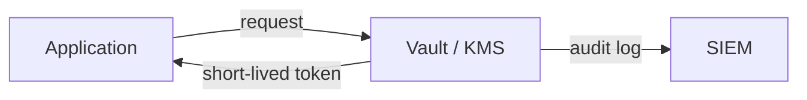

# Information Security 101 (7/10): 비밀 정보 관리

비밀번호, API 키, 데이터베이스 자격 증명은 애플리케이션을 움직이게 하지만 동시에 가장 민감한 약점이기도 합니다. 많은 팀이 비밀 정보를 “어디에 둘까”라는 저장 위치 문제로만 생각합니다. 그러나 실무에서 더 중요한 질문은 “새면 얼마나 빨리 바꿀 수 있는가”입니다. 회전이 안 되는 비밀 정보는 언젠가 영구 위험이 됩니다.

이 글은 Information Security 101 시리즈의 7번째 글입니다.

## 먼저 던지는 질문

- 정적 비밀 정보와 동적 비밀 정보는 어떻게 다를까요?
- 환경 변수는 어디까지 유효할까요?
- Vault와 KMS는 각각 어떤 역할을 맡을까요?

## 큰 그림


*Information Security 101 7장 흐름 개요*

이 그림에서는 비밀 정보 관리를 운영 흐름 안에서 어디에 배치해야 하는지 봅니다. 핵심은 개념을 따로 외우는 것이 아니라 입력, 처리, 검증, 운영 신호가 어떤 경계로 이어지는지 확인하는 데 있습니다.

> 비밀 정보 관리의 핵심은 기능 이름이 아니라, 어떤 경계에서 무엇을 검증하고 어떤 신호를 남길지 정하는 데 있습니다.

## 왜 중요한가

큰 사고의 절반 이상은 유출된 비밀 정보에서 시작합니다. 비밀 정보가 한 번 새고도 계속 유효하다면 그 자체로 장기 노출입니다. 반대로 짧은 수명과 자동 회전이 갖춰져 있으면 유출이 발생해도 피해 범위를 크게 줄일 수 있습니다.

비밀 정보는 자산이 아니라 부채에 가깝습니다. 오래 살아 있을수록 더 위험해집니다.

## 한눈에 보는 개념



애플리케이션은 비밀 자체를 들고 있기보다, 비밀을 가져올 권한만 갖는 편이 더 안전합니다. 접근은 짧게, 기록은 오래 남겨야 합니다.

## 핵심 용어

- **정적 비밀 정보**: 사람이 설정해 두고 오래 유지하는 키나 비밀번호입니다.
- **동적 비밀 정보**: 요청 시점에 짧은 수명으로 발급되는 자격 증명입니다.
- **Vault**: HashiCorp Vault 같은 비밀 정보 관리 시스템입니다.
- **KMS**: AWS KMS, GCP KMS 같은 키 관리 서비스입니다.
- 회전: 일정 주기나 사고 대응 시 비밀 정보를 새 값으로 교체하는 일입니다.

## 전후 비교

### 이전 — 평문 `.env`

```text
Accidentally committed -> permanent leak -> rotate every environment
```

### 이후 — Vault에서 짧은 수명 토큰 발급

```text
App requests a token at boot -> auto-rotates on expiry
```

비밀 정보를 어디에 적었는가보다, 얼마나 오래 살아 있는가가 실제 위험을 결정합니다.

## 단계별 실습

### 1단계 — 환경 변수를 최소 기준으로 씁니다

```python
# 1_env.py
import os
db_url = os.environ["DATABASE_URL"]
# Never hard-code: db_url = "postgres://user:pw@..."
```

환경 변수는 시작점일 뿐 최종 해법이 아닙니다. 최소한 `.env` 파일은 git에 올라가지 않게 해야 합니다.

### 2단계 — Vault에서 비밀 정보를 가져옵니다

```python
# 2_vault.py
import hvac
client = hvac.Client(url="http://vault:8200", token=os.environ["VAULT_TOKEN"])
data = client.secrets.kv.read_secret_version(path="myapp/db")
db_pw = data["data"]["data"]["password"]
```

Vault 토큰도 다시 짧은 수명이어야 합니다. AppRole, Kubernetes 서비스 계정 같은 신원 기반 발급과 함께 가야 합니다.

### 3단계 — KMS로 데이터 키를 다룹니다

```python
# 3_kms.py
import boto3
kms = boto3.client("kms")
resp = kms.generate_data_key(KeyId="alias/app", KeySpec="AES_256")
plaintext = resp["Plaintext"]      # in-memory only
ciphertext = resp["CiphertextBlob"] # store in DB
```

평문 데이터 키는 메모리 안에만 잠깐 머물고, 저장되는 것은 암호화된 형태여야 합니다.

### 4단계 — 시크릿 스캐너로 예방합니다

```bash
# 4_scan.sh
# pre-commit hook: trufflehog scans before commit
trufflehog filesystem . --only-verified
```

git 기록은 한 번 남으면 오래 갑니다. 유출을 복구하는 것보다 커밋 전에 막는 편이 훨씬 낫습니다.

### 5단계 — 회전 절차를 자동화합니다

```python
# 5_rotation.py
def rotate_db_password():
    new_pw = generate_strong_password()
    db.execute(f"ALTER USER app WITH PASSWORD %s", (new_pw,))
    vault.put("myapp/db", {"password": new_pw})
    notify_apps_to_reload()
```

회전은 문서 속 절차로 끝나면 안 됩니다. 자동화되어야 실제 사고에서 의미가 있습니다.

## 이 코드와 예제에서 먼저 볼 점

- 비밀 정보 수명은 가능한 한 짧아야 합니다.
- 평문 비밀 정보는 메모리에서만 잠깐 살아야 합니다.
- 모든 접근은 감사 기록으로 남겨야 합니다.
- 회전은 런북 단계가 아니라 자동화 단계여야 합니다.

## 자주 하는 실수 다섯 가지

1. **`.env`를 커밋하는 실수**: 가장 흔한 유출 사고입니다.
2. **모든 것에 마스터 키 하나를 쓰는 실수**: 회전이 사실상 불가능해집니다.
3. **오류 로그나 애플리케이션 로그에 비밀 정보를 남기는 실수**: SIEM까지 넓게 퍼집니다.
4. **회전 정책이 없는 실수**: 유출이 장기 노출이 됩니다.
5. **슬랙이나 이메일로 비밀 정보를 공유하는 실수**: 검색 가능한 비밀 정보는 이미 비밀이 아닙니다.

## 실무에서는 이렇게 나타납니다

Kubernetes는 외부 비밀 저장소와 동기화 계층을 조합해 값을 주입합니다. CI/CD는 OIDC 연동으로 짧은 수명 자격 증명을 발급받고 정적 키를 없애는 방향으로 갑니다. AWS도 인스턴스 단위 단기 자격 증명을 발급하는 식으로 상시 키를 줄입니다. 좋은 시스템일수록 “코드에 박아 둔 비밀 정보”가 아니라 “신원이 비밀 정보를 요청하는 구조”로 바뀝니다.

## 시니어 엔지니어는 이렇게 생각합니다

- 모든 비밀 정보에는 만료 시점이 있어야 한다고 봅니다.
- 비밀 정보 관리는 IAM 설계와 함께 봅니다.
- `.env`는 로컬 개발용으로만 제한합니다.
- 사고 뒤 비밀 정보를 얼마나 빨리 회전할 수 있는지를 SLO로 둡니다.
- 시크릿 스캐너를 pre-commit과 CI 양쪽에서 돌립니다.

## 체크리스트

- [ ] 모든 비밀 정보에 회전 주기가 정의되어 있습니까?
- [ ] `.env`가 `.gitignore`에 포함되어 있습니까?
- [ ] 비밀 정보 접근이 감사 로그로 남습니까?
- [ ] 회전 런북이 문서화되어 있습니까?
- [ ] CI/CD에서 정적 자격 증명이 제거되어 있습니까?

## 연습 문제

1. 환경 변수와 Vault의 차이를 한 단락으로 설명해 보세요.
2. 회전 SLO를 어떻게 측정할지 정의해 보세요.
3. git에 비밀 정보가 실수로 올라갔을 때 안전한 대응 절차를 적어 보세요.

## 정리와 다음 글

비밀 정보 관리는 저장 위치보다 수명과 회전의 문제입니다. 짧은 수명, 자동 회전, 접근 기록이 갖춰질수록 유출의 피해 범위는 작아집니다. 다음 글에서는 비밀 정보를 가진 주체가 어디까지 할 수 있어야 하는지, 권한 최소화를 다룹니다.

## 처음 질문으로 돌아가기

- **정적 비밀 정보와 동적 비밀 정보는 어떻게 다를까요?**
  - 본문의 기준은 비밀 정보 관리를 한 덩어리 개념으로 보지 않고 입력, 처리, 검증, 운영 신호가 만나는 경계로 나누어 확인하는 것입니다.
- **환경 변수는 어디까지 유효할까요?**
  - 예제와 그림에서는 어떤 값이 들어오고, 어느 단계에서 바뀌며, 어떤 기준으로 통과 또는 실패하는지를 먼저 확인해야 합니다.
- **Vault와 KMS는 각각 어떤 역할을 맡을까요?**
  - 운영에서는 이 판단을 체크리스트, 로그, 테스트로 남겨 다음 변경에서도 같은 실패가 반복되지 않게 막아야 합니다.

<!-- toc:begin -->
## 시리즈 목차

- [Information Security 101 (1/10): 정보보안이란 무엇인가?](./01-what-is-information-security.md)
- [Information Security 101 (2/10): 인증과 인가](./02-authentication-and-authorization.md)
- [Information Security 101 (3/10): 암호화와 해시](./03-cryptography-and-hash.md)
- [Information Security 101 (4/10): TLS와 인증서](./04-tls-and-certificates.md)
- [Information Security 101 (5/10): 웹 보안 기초](./05-web-security-basics.md)
- [Information Security 101 (6/10): SQL 인젝션과 XSS](./06-sql-injection-and-xss.md)
- **비밀 정보 관리 (현재 글)**
- 권한 최소화 (예정)
- 로그와 감사 (예정)
- 보안 사고 대응 (예정)

<!-- toc:end -->

## 참고 자료

- [HashiCorp Vault — Documentation](https://developer.hashicorp.com/vault/docs)
- [AWS KMS — Best Practices](https://docs.aws.amazon.com/kms/latest/developerguide/best-practices.html)
- [OWASP — Secrets Management Cheat Sheet](https://cheatsheetseries.owasp.org/cheatsheets/Secrets_Management_Cheat_Sheet.html)
- [trufflehog — Find Leaked Credentials](https://github.com/trufflesecurity/trufflehog)

Tags: Computer Science, Security, Secrets, Vault, KMS, Rotation
