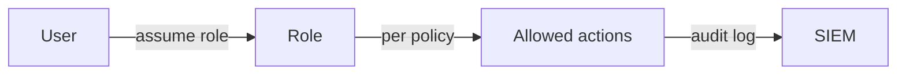

# Information Security 101 (8/10): 권한 최소화

보안 사고를 완전히 막을 수는 없습니다. 대신 사고가 났을 때 얼마나 멀리 번지는지는 설계로 줄일 수 있습니다. 그 중심에 있는 원칙이 권한 최소화입니다. 편하다는 이유로 과한 권한을 열어 두면 평소에는 아무 일도 없어 보이지만, 침해가 발생하는 순간 그 편의가 그대로 폭발 반경이 됩니다.

이 글은 Information Security 101 시리즈의 8번째 글입니다.


*Information Security 101 8장 흐름 개요*
> 권한 최소화는 권한을 적게 주는 것이 아니라 '이 사용자/서비스가 정말 이 작업을 지금 이 환경에서 해야 하는가'를 매 요청마다 확인하는 메커니즘입니다.

## 먼저 던지는 질문

- 권한 최소화 원칙은 정확히 무엇을 뜻할까요?
- IAM 정책에서 허용과 거부는 어떻게 설계해야 할까요?
- RBAC, ABAC, ReBAC는 언제 갈릴까요?

## 왜 중요한가

침해 자체를 항상 막을 수는 없어도, 사고 범위를 줄이는 일은 언제나 가능합니다. 권한 최소화는 바로 그 비용을 결정합니다. 서비스 하나가 뚫렸을 때 전체 클러스터가 넘어갈지, 해당 서비스 자원만 영향을 받을지는 권한 설계에서 갈립니다.

권한은 많을수록 좋은 것이 아니라, 필요한 만큼만 열려 있을수록 안전합니다.

## 한눈에 보는 개념



모든 권한은 명시적으로 부여되고 추적 가능해야 합니다. 누가 어떤 역할을 맡았고 무엇을 할 수 있는지 기록으로 남아야 합니다.

## 핵심 용어

- **권한 최소화 원칙**: 일을 하는 데 필요한 만큼만 권한을 주는 원칙입니다.
- **RBAC**: 역할 기반 접근 제어입니다.
- **ABAC**: 태그, 시간, 위치 같은 속성 기반 접근 제어입니다.
- **제로 트러스트**: 네트워크 위치와 무관하게 매번 검증하는 접근 방식입니다.
- **권한 상승**: 더 높은 권한으로 올라가는 경로이며 어디서나 막아야 합니다.

## 전후 비교

### 이전 — 모든 서비스가 관리자 권한으로 실행

```text
One service compromised -> full cluster control lost
```

### 이후 — 서비스별 최소 권한 적용

```text
One service compromised -> only that service's resources affected
```

사고의 심각도는 종종 최초 침해보다 폭발 반경에서 결정됩니다.

## 최소 권한 적용 계층

| 계층 | 구현 방법 | 도구 예시 | 확인 방법 |
|---|---|---|---|
| **네트워크** | Security Group, Network Policy, Firewall 규칙 | AWS SG, K8s NetworkPolicy, iptables | `aws ec2 describe-security-groups`, `kubectl get netpol` |
| **OS** | 사용자 계정, 파일 권한, sudo 정책 | Linux user/group, sudoers, SELinux | `ls -l`, `groups`, `sudo -l` |
| **애플리케이션** | RBAC, 미들웨어 권한 검사 | Flask decorator, FastAPI Depends | 단위 테스트, 통합 테스트 |
| **데이터베이스** | 역할별 권한, Row-Level Security | PostgreSQL GRANT/REVOKE, RLS | `\du`, `\dp` (psql) |
| **클라우드** | IAM 정책, Service Account, SCP | AWS IAM, GCP IAM, Azure RBAC | `aws iam get-policy-version`, `gcloud projects get-iam-policy` |

각 계층은 독립적으로 권한을 제한합니다. 한 계층이 뚫리더라도 다른 계층이 2차 방어선이 됩니다. 권한 최소화는 단일 기술이 아니라 여러 층의 통제를 겹쳐 쓰는 운영 방식입니다.
## 단계별 실습

### 1단계 — AWS IAM 최소 권한 정책을 씁니다

```json
{
  "Version": "2012-10-17",
  "Statement": [{
    "Effect": "Allow",
    "Action": ["s3:GetObject"],
    "Resource": "arn:aws:s3:::my-bucket/reports/*"
  }]
}
```

`Action: "*"`와 `Resource: "*"`는 거의 항상 경고 신호입니다. 편의는 높지만 통제는 사라집니다.

### 2단계 — Kubernetes RBAC를 좁게 잡습니다

```yaml
# 2_role.yaml
kind: Role
apiVersion: rbac.authorization.k8s.io/v1
metadata: { namespace: app, name: pod-reader }
rules:
- apiGroups: [""]
  resources: ["pods"]
  verbs: ["get", "list"]
```

하나의 네임스페이스, 하나의 리소스, 읽기 전용처럼 범위를 최대한 좁히는 것이 기본입니다.

### 3단계 — 서비스 계정을 분리합니다

```yaml
# 3_sa.yaml
kind: ServiceAccount
apiVersion: v1
metadata: { name: reports-reader, namespace: app }
```

워크로드마다 전용 서비스 계정을 주면 권한 추적과 회수가 쉬워집니다.

### 4단계 — 임시 권한을 발급합니다

```python
# 4_temp_grant.py
def assume_emergency_role():
    # break-glass: 30-minute expiry, alerting, audit log
    issue_short_lived_credential(role="incident-responder", ttl_min=30)
```

상시 고권한 대신 필요할 때만 짧게 발급하는 패턴이 안전합니다.

### 5단계 — 정책을 정적으로 검사합니다

```bash
# 5_check.sh
# Detect wildcards in IAM policies
grep -r '"\*"' iam/ && echo "WARNING: wildcard in IAM"
```

정책도 코드처럼 다뤄야 합니다. 린트와 리뷰가 없으면 편의를 위한 와일드카드가 금방 쌓입니다.

### 6단계 — Flask 데코레이터로 권한을 검사합니다

```python
# 6_flask_rbac.py
from functools import wraps
from flask import request, abort, g

def require_role(*allowed_roles):
    """RBAC decorator for Flask routes"""
    def decorator(f):
        @wraps(f)
        def wrapped(*args, **kwargs):
            user = g.get("current_user")
            if not user or user.role not in allowed_roles:
                abort(403, "Insufficient permissions")
            return f(*args, **kwargs)
        return wrapped
    return decorator

# 사용 예시
# @app.route("/admin/users")
# @require_role("admin")
# def list_all_users():
#     return {"users": [...]}

# @app.route("/reports")
# @require_role("admin", "analyst")
# def view_reports():
#     return {"reports": [...]}
```

애플리케이션 수준에서 권한을 명시적으로 검사하면 엔드포인트보다 권한이 먼저 들어오는 흔한 실수를 막을 수 있습니다. 각 기능에 필요한 권한을 선언적으로 표현하면 코드 리뷰와 테스트에서도 확인하기 쉽습니다.

## 이 코드와 예제에서 먼저 볼 점

- 와일드카드는 린트 단계에서 바로 경고해야 합니다.
- 권한에는 시간 제한이 붙을 수 있어야 합니다.
- 사람 권한과 시스템 권한은 분리되어야 합니다.
- 비상 권한은 경보와 감사가 항상 따라와야 합니다.

## 권한 감사 전략

권한은 한 번 설정하고 끝나는 것이 아닙니다. 시간이 지나면 누구나 과도한 권한을 가지게 됩니다. 정기적인 감사와 정리가 필수입니다.

### 미사용 권한 감지

```python
# unused_permissions.py
from datetime import datetime, timedelta

def find_unused_permissions(user_id: str, days: int = 90):
    """Find permissions not used in the last N days"""
    cutoff = datetime.now() - timedelta(days=days)

    # 사용자가 가진 모든 권한
    granted = get_user_permissions(user_id)

    # 실제 사용한 권한 (감사 로그에서 추출)
    used = get_audit_log_permissions(user_id, since=cutoff)

    # 차집합
    unused = granted - used
    return unused

# 사용 예시
unused = find_unused_permissions("alice", days=90)
if unused:
    notify_admin(f"User alice has unused permissions: {unused}")
```

90일 동안 사용하지 않은 권한은 제거를 검토해야 합니다. 감사 로그가 없으면 이 분석은 불가능합니다.

### 권한 승인 워크플로

```python
# permission_request.py
from enum import Enum

class PermissionStatus(Enum):
    PENDING = "pending"
    APPROVED = "approved"
    REJECTED = "rejected"

def request_permission(requester: str, resource: str, action: str, justification: str):
    """Request temporary elevated permission"""
    request = {
        "requester": requester,
        "resource": resource,
        "action": action,
        "justification": justification,
        "status": PermissionStatus.PENDING,
        "requested_at": datetime.now(),
        "expires_at": datetime.now() + timedelta(hours=4),  # 기본 4시간
    }
    save_permission_request(request)
    notify_approvers(request)
    return request

def approve_permission_request(request_id: str, approver: str):
    request = get_request(request_id)
    request["status"] = PermissionStatus.APPROVED
    request["approved_by"] = approver
    request["approved_at"] = datetime.now()
    grant_temporary_permission(request)
    audit_log("permission_granted", request)
```

상시 권한 대신 일시 권한을 요청하고 승인받는 흐름을 구축하면 권한의 축적을 막을 수 있습니다. 모든 요청과 승인은 감사 로그로 남아야 합니다.

### 권한 만료 자동화

```python
# permission_expiry.py
import schedule

def revoke_expired_permissions():
    """Revoke permissions past their expiry time"""
    now = datetime.now()
    expired = get_permissions_expiring_before(now)

    for perm in expired:
        revoke_permission(perm["user_id"], perm["resource"], perm["action"])
        audit_log("permission_expired", perm)
        notify_user(perm["user_id"], f"Permission {perm['action']} on {perm['resource']} has expired")

# 매 10분마다 실행
schedule.every(10).minutes.do(revoke_expired_permissions)
```

권한에 명시적인 만료 시간을 부여하고 자동으로 회수하는 메커니즘이 있으면 권한이 영구히 남는 문제를 차단합니다.

## 자주 하는 실수 다섯 가지

1. **모든 곳에 관리자 권한을 주는 실수**: 폭발 반경이 최대가 됩니다.
2. **임시 권한이 만료되지 않는 실수**: 권한이 계속 쌓입니다.
3. **범위가 너무 넓은 RBAC 역할을 만드는 실수**: 사실상 관리자와 다르지 않습니다.
4. **비상 권한 사용에 경보가 없는 실수**: 예외 절차가 일상화됩니다.
5. **주기적 권한 검토가 없는 실수**: 시간이 지나면 모두가 관리자에 가까워집니다.

## 실무에서는 이렇게 나타납니다

AWS는 SCP, IAM, 리소스 정책, Permission Boundary를 겹겹이 씁니다. Kubernetes는 네임스페이스, RBAC, NetworkPolicy, PodSecurityAdmission을 함께 씁니다. 사람 권한은 Okta 같은 IdP에서 Just-In-Time 발급으로 바꾸고, 상시 권한을 없애는 방향으로 움직입니다. 권한 최소화는 개별 기능이 아니라 여러 통제를 겹쳐 폭발 반경을 줄이는 운영 방식입니다.

## 시니어 엔지니어는 이렇게 생각합니다

- 권한은 정기적으로 검토합니다.
- 새 권한에는 만료 시점을 함께 둡니다.
- 정책은 git에 두고 PR로 변경합니다.
- 사고 회고 때마다 폭발 반경을 다시 봅니다.
- “임시” 권한도 공식 절차 밖에서는 허용하지 않습니다.

## 체크리스트

- [ ] 모든 서비스 계정에 전용 신원이 있습니까?
- [ ] IAM 정책에 와일드카드가 없습니까?
- [ ] 접근 권한 검토 주기가 정의되어 있습니까?
- [ ] 비상 권한 사용에 경보가 붙습니까?
- [ ] 사람 권한이 JIT 방식으로 발급됩니까?

## 연습 문제

1. RBAC와 ABAC의 차이를 한 단락으로 설명해 보세요.
2. 비상 권한 사용 시 반드시 발생해야 할 경보 두 가지를 적어 보세요.
3. 서비스 하나가 침해됐을 때 폭발 반경을 줄이는 아키텍처 선택 두 가지를 설명해 보세요.

## 정리와 다음 글

권한 최소화는 사고의 비용을 줄이는 가장 현실적인 원칙입니다. 침해를 완전히 막지 못해도 어디까지 번질지는 설계로 줄일 수 있습니다. 다음 글에서는 그 사고를 어떻게 감지할 것인지, 로그와 감사를 다룹니다.


## RBAC와 ABAC를 권한 모델 관점에서 비교

권한 최소화를 실행할 때 가장 먼저 부딪히는 선택이 RBAC와 ABAC입니다. 정답은 하나가 아니라 서비스 성격에 따른 조합입니다.

| 항목 | RBAC | ABAC |
| --- | --- | --- |
| 정책 표현 | 역할 중심(`admin`, `viewer`) | 속성 중심(부서, 지역, 시간, 리소스 태그) |
| 이해 난이도 | 낮음 | 중간~높음 |
| 예외 처리 | 역할 증가로 복잡해짐 | 조건식으로 유연하게 처리 |
| 감사 추적 | 역할 단위로 명확 | 조건 평가 로그 필요 |

초기에는 RBAC로 시작해도 충분합니다. 다만 조직이 커지면 역할 폭발(role explosion)이 일어날 수 있으므로, 특정 영역부터 ABAC 조건을 도입하는 전략이 실용적입니다.

## 권한 매트릭스 예시

| API | guest | user | analyst | admin |
| --- | --- | --- | --- | --- |
| GET /reports | deny | allow(own) | allow(team) | allow(all) |
| POST /reports | deny | deny | allow(team) | allow(all) |
| POST /users/{id}/role | deny | deny | deny | allow |
| DELETE /reports/{id} | deny | deny | deny | allow |

이 매트릭스는 문서로만 두지 말고 인가 테스트 케이스로 연결해야 합니다. 특히 `allow(own)` 같은 조건은 리소스 소유자 검증 로직과 함께 유지되어야 합니다.

## 정책 코드 예시

```python
# authz_policy.py
from dataclasses import dataclass

@dataclass
class Context:
    role: str
    action: str
    owner_id: str
    requester_id: str


def can_access(ctx: Context) -> bool:
    if ctx.role == "admin":
        return True
    if ctx.action == "read_report" and ctx.requester_id == ctx.owner_id:
        return True
    if ctx.role == "analyst" and ctx.action in {"read_team_report", "write_team_report"}:
        return True
    return False
```

실무에서는 이 로직을 서비스 곳곳에 흩어 두지 않고 중앙 정책 엔진 또는 공통 라이브러리로 모으는 편이 유지보수에 유리합니다.

## 권한 변경 감사 필드

권한 모델이 성숙하려면 변경 이력이 명확해야 합니다.

- `actor_id`: 누가 변경했는가
- `target_id`: 누구 권한을 바꿨는가
- `before_role`/`after_role`: 무엇이 바뀌었는가
- `reason`: 왜 바꿨는가
- `approved_by`: 승인자는 누구인가
- `expires_at`: 임시 권한이면 언제 만료되는가

이 필드가 없으면 사고 후 원인 분석에서 "누가 왜 열었는지"를 복원하기 어렵습니다.


## 운영 점검 루프와 문서화 기준

보안 글에서 가장 자주 빠지는 부분은 "그래서 운영에서는 무엇을 주기적으로 확인할 것인가"입니다. 아래 루프를 기준으로 문서화하면 개념이 실무로 연결됩니다.

| 주기 | 점검 항목 | 산출물 |
| --- | --- | --- |
| 매일 | 고위험 경보, 인증 실패 급증, 권한 거부 급증 | 일일 보안 브리핑 |
| 매주 | 신규 배포 변경점의 보안 영향 | 변경 검토 노트 |
| 매월 | 키/토큰/인증서 만료 예정, 미사용 권한, 미사용 시크릿 | 월간 정리 리포트 |
| 분기 | 위협 모델 재평가, 런북 훈련, 통제 효과 검토 | 분기 보안 회고 |

실행 가능한 문서의 조건도 분명해야 합니다.

- 담당자(owner)와 대체 담당자가 명시되어야 합니다.
- 실패 조건과 에스컬레이션 기준이 수치로 정의되어야 합니다.
- 점검 결과가 티켓이나 액션 아이템으로 추적되어야 합니다.
- 예외 승인에는 만료일이 반드시 있어야 합니다.

보안은 단발성 프로젝트가 아니라 운영 루프입니다. 같은 점검을 반복해도 기준이 유지될 때 품질이 올라갑니다.


## 운영 점검 루프와 문서화 기준

보안 글에서 가장 자주 빠지는 부분은 "그래서 운영에서는 무엇을 주기적으로 확인할 것인가"입니다. 아래 루프를 기준으로 문서화하면 개념이 실무로 연결됩니다.

| 주기 | 점검 항목 | 산출물 |
| --- | --- | --- |
| 매일 | 고위험 경보, 인증 실패 급증, 권한 거부 급증 | 일일 보안 브리핑 |
| 매주 | 신규 배포 변경점의 보안 영향 | 변경 검토 노트 |
| 매월 | 키/토큰/인증서 만료 예정, 미사용 권한, 미사용 시크릿 | 월간 정리 리포트 |
| 분기 | 위협 모델 재평가, 런북 훈련, 통제 효과 검토 | 분기 보안 회고 |

실행 가능한 문서의 조건도 분명해야 합니다.

- 담당자(owner)와 대체 담당자가 명시되어야 합니다.
- 실패 조건과 에스컬레이션 기준이 수치로 정의되어야 합니다.
- 점검 결과가 티켓이나 액션 아이템으로 추적되어야 합니다.
- 예외 승인에는 만료일이 반드시 있어야 합니다.

보안은 단발성 프로젝트가 아니라 운영 루프입니다. 같은 점검을 반복해도 기준이 유지될 때 품질이 올라갑니다.


## 운영 점검 루프와 문서화 기준

보안 글에서 가장 자주 빠지는 부분은 "그래서 운영에서는 무엇을 주기적으로 확인할 것인가"입니다. 아래 루프를 기준으로 문서화하면 개념이 실무로 연결됩니다.

| 주기 | 점검 항목 | 산출물 |
| --- | --- | --- |
| 매일 | 고위험 경보, 인증 실패 급증, 권한 거부 급증 | 일일 보안 브리핑 |
| 매주 | 신규 배포 변경점의 보안 영향 | 변경 검토 노트 |
| 매월 | 키/토큰/인증서 만료 예정, 미사용 권한, 미사용 시크릿 | 월간 정리 리포트 |
| 분기 | 위협 모델 재평가, 런북 훈련, 통제 효과 검토 | 분기 보안 회고 |

실행 가능한 문서의 조건도 분명해야 합니다.

- 담당자(owner)와 대체 담당자가 명시되어야 합니다.
- 실패 조건과 에스컬레이션 기준이 수치로 정의되어야 합니다.
- 점검 결과가 티켓이나 액션 아이템으로 추적되어야 합니다.
- 예외 승인에는 만료일이 반드시 있어야 합니다.

보안은 단발성 프로젝트가 아니라 운영 루프입니다. 같은 점검을 반복해도 기준이 유지될 때 품질이 올라갑니다.


## 접근 제어 매트릭스와 승인 체계

권한 최소화는 정책 파일보다 승인 프로세스에서 자주 무너집니다. 아래 매트릭스처럼 요청-승인-만료를 함께 설계해야 합니다.

| 권한 유형 | 요청자 | 승인자 | 기본 만료 | 감사 이벤트 |
| --- | --- | --- | --- | --- |
| 운영 조회 권한 | 개발자 | 팀 리더 | 30일 | `permission_granted` |
| 운영 변경 권한 | 운영 담당 | 보안 관리자 | 4시간 | `breakglass_granted` |
| 데이터 내보내기 권한 | 데이터 분석가 | DPO/보안 | 1회성 | `sensitive_export` |

권한 부여 행위 자체가 보안 이벤트입니다. 따라서 단순 승인 기록이 아니라 사유, 만료, 재검토 시점을 함께 남겨야 합니다.

## 네트워크 방화벽 최소 권한 예시

```text
allow app-subnet -> db-subnet tcp/5432
allow bastion -> app-subnet tcp/22 (JIT only)
deny any -> db-subnet any
```

애플리케이션 인가가 잘 되어도 네트워크 경계가 열려 있으면 측면 이동이 쉬워집니다. 계층별 최소 권한을 같이 적용해야 폭발 반경이 줄어듭니다.


## 권한 최소화 도입 로드맵

권한 최소화는 한 번에 완성되지 않습니다. 단계적 도입이 현실적입니다.

1. 현황 수집: 현재 역할, 정책, 사용 이력을 시각화합니다.
2. 과권한 제거: 사용되지 않은 권한부터 제거합니다.
3. 임시 권한화: 상시 관리자 권한을 만료형 권한으로 전환합니다.
4. 자동 회수: 만료 이벤트 기반 회수와 경보를 자동화합니다.
5. 분기 회고: 재발 패턴을 정책 템플릿으로 반영합니다.

## 접근 제어 실패 패턴

- 팀 확장 시 역할 템플릿 없이 개별 예외만 누적.
- 프로젝트 종료 후 서비스 계정 폐기 누락.
- 비상 권한 사용 후 회수 확인 생략.
- 승인 사유 없는 자동 부여 스크립트 확장.

이 패턴을 정기 점검 항목에 넣으면 권한 부채를 빠르게 줄일 수 있습니다.


## 접근 제어 운영 지표

- 미사용 권한 제거율(월간)
- 임시 권한 만료 준수율
- 권한 요청 승인 리드타임
- 비상 권한 사용 건수와 사유 분포

지표가 있어야 권한 최소화가 선언이 아니라 운영 활동이 됩니다.


## 부록: 운영 리뷰 메모

운영 회고에서 다음 네 가지를 매번 확인합니다.

1. 이번 분기 가장 큰 위험이 무엇이었는가.
2. 통제가 실제로 작동했는가.
3. 탐지와 대응 시간이 목표를 충족했는가.
4. 다음 분기 우선 개선 항목은 무엇인가.

짧은 메모라도 반복해서 남기면 보안 품질의 추세를 읽을 수 있습니다.


## 부록: 권한 리뷰 원칙

권한 리뷰는 사용자 단위가 아니라 역할 단위로 시작하고, 예외 권한은 만료일을 기준으로 별도 트래킹합니다. 이 원칙만 지켜도 권한 부채 증가 속도를 크게 늦출 수 있습니다.


## 처음 질문으로 돌아가기

- **권한 최소화 원칙은 정확히 무엇을 뜻할까요?**
  - USER 역할이 어느 API 엔드포인트는 접근할 수 있고 어느 것은 못하는지, 그 차이가 어디서 적용되는지를 명확히 합니다.
- **IAM 정책에서 허용과 거부는 어떻게 설계해야 할까요?**
  - 마이크로서비스에서 서비스 A가 B의 데이터를 읽을 수 있고 C는 쓸 수 없는 이유를 정책으로 문서화하면 권한 오류를 대응할 수 있습니다.
- **RBAC, ABAC, ReBAC는 언제 갈릴까요?**
  - 역할 및 권한 감사 로그, 권한 요청 승인 프로세스, 미사용 권한 정기 정리 규칙을 정의합니다.

<!-- toc:begin -->
## 시리즈 목차

- [Information Security 101 (1/10): 정보보안이란 무엇인가?](./01-what-is-information-security.md)
- [Information Security 101 (2/10): 인증과 인가](./02-authentication-and-authorization.md)
- [Information Security 101 (3/10): 암호화와 해시](./03-cryptography-and-hash.md)
- [Information Security 101 (4/10): TLS와 인증서](./04-tls-and-certificates.md)
- [Information Security 101 (5/10): 웹 보안 기초](./05-web-security-basics.md)
- [Information Security 101 (6/10): SQL 인젝션과 XSS](./06-sql-injection-and-xss.md)
- [Information Security 101 (7/10): 비밀 정보 관리](./07-secret-management.md)
- **권한 최소화 (현재 글)**
- 로그와 감사 (예정)
- 보안 사고 대응 (예정)

<!-- toc:end -->

## 참고 자료

- [NIST — Principle of Least Privilege](https://csrc.nist.gov/glossary/term/least_privilege)
- [AWS — IAM Best Practices](https://docs.aws.amazon.com/IAM/latest/UserGuide/best-practices.html)
- [Kubernetes — RBAC Authorization](https://kubernetes.io/docs/reference/access-authn-authz/rbac/)
- [Google — BeyondCorp Zero Trust](https://cloud.google.com/beyondcorp)

- [이 글의 예제 코드 (book-examples)](https://github.com/yeongseon-books/book-examples/tree/main/information-security-101/ko)

Tags: Computer Science, Security, LeastPrivilege, IAM, AccessControl, ZeroTrust
