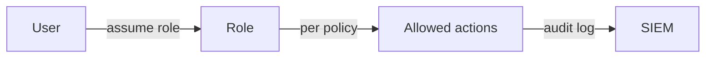

# 권한 최소화

보안 사고를 완전히 막을 수는 없습니다. 대신 사고가 났을 때 얼마나 멀리 번지는지는 설계로 줄일 수 있습니다. 그 중심에 있는 원칙이 권한 최소화입니다. 편하다는 이유로 과한 권한을 열어 두면 평소에는 아무 일도 없어 보이지만, 침해가 발생하는 순간 그 편의가 그대로 폭발 반경이 됩니다.

이 글은 Information Security 101 시리즈의 8번째 글입니다.

## 이 글에서 다룰 문제

권한 최소화는 “권한을 적게 주자”는 구호가 아닙니다. 누가 어떤 작업을 위해 얼마 동안 어떤 자원에 접근할 수 있는지 명시적으로 제한하는 설계 원칙입니다.

> 권한은 영구 지급되는 자산이 아니라, 일을 위해 잠깐 빌려 주는 권리입니다.

- 권한 최소화 원칙은 정확히 무엇을 뜻할까요?
- IAM 정책에서 허용과 거부는 어떻게 설계해야 할까요?
- RBAC, ABAC, ReBAC는 언제 갈릴까요?
- 제로 트러스트는 실무에서 어떤 운영 습관으로 나타날까요?
- 사람 권한과 시스템 권한은 왜 분리해야 할까요?

## 왜 중요한가

침해 자체를 항상 막을 수는 없어도, 사고 범위를 줄이는 일은 언제나 가능합니다. 권한 최소화는 바로 그 비용을 결정합니다. 서비스 하나가 뚫렸을 때 전체 클러스터가 넘어갈지, 해당 서비스 자원만 영향을 받을지는 권한 설계에서 갈립니다.

권한은 많을수록 좋은 것이 아니라, 필요한 만큼만 열려 있을수록 안전합니다.

## 한눈에 보는 개념



모든 권한은 명시적으로 부여되고 추적 가능해야 합니다. 누가 어떤 역할을 맡았고 무엇을 할 수 있는지 기록으로 남아야 합니다.

## 핵심 용어

- **권한 최소화 원칙**: 일을 하는 데 필요한 만큼만 권한을 주는 원칙입니다.
- **RBAC**: 역할 기반 접근 제어입니다.
- **ABAC**: 태그, 시간, 위치 같은 속성 기반 접근 제어입니다.
- **제로 트러스트**: 네트워크 위치와 무관하게 매번 검증하는 접근 방식입니다.
- **권한 상승**: 더 높은 권한으로 올라가는 경로이며 어디서나 막아야 합니다.

## 전후 비교

### 이전 — 모든 서비스가 관리자 권한으로 실행

```text
One service compromised -> full cluster control lost
```

### 이후 — 서비스별 최소 권한 적용

```text
One service compromised -> only that service's resources affected
```

사고의 심각도는 종종 최초 침해보다 폭발 반경에서 결정됩니다.

## 단계별 실습

### 1단계 — AWS IAM 최소 권한 정책을 씁니다

```json
{
  "Version": "2012-10-17",
  "Statement": [{
    "Effect": "Allow",
    "Action": ["s3:GetObject"],
    "Resource": "arn:aws:s3:::my-bucket/reports/*"
  }]
}
```

`Action: "*"`와 `Resource: "*"`는 거의 항상 경고 신호입니다. 편의는 높지만 통제는 사라집니다.

### 2단계 — Kubernetes RBAC를 좁게 잡습니다

```yaml
# 2_role.yaml
kind: Role
apiVersion: rbac.authorization.k8s.io/v1
metadata: { namespace: app, name: pod-reader }
rules:
- apiGroups: [""]
  resources: ["pods"]
  verbs: ["get", "list"]
```

하나의 네임스페이스, 하나의 리소스, 읽기 전용처럼 범위를 최대한 좁히는 것이 기본입니다.

### 3단계 — 서비스 계정을 분리합니다

```yaml
# 3_sa.yaml
kind: ServiceAccount
apiVersion: v1
metadata: { name: reports-reader, namespace: app }
```

워크로드마다 전용 서비스 계정을 주면 권한 추적과 회수가 쉬워집니다.

### 4단계 — 임시 권한을 발급합니다

```python
# 4_temp_grant.py
def assume_emergency_role():
    # break-glass: 30-minute expiry, alerting, audit log
    issue_short_lived_credential(role="incident-responder", ttl_min=30)
```

상시 고권한 대신 필요할 때만 짧게 발급하는 패턴이 안전합니다.

### 5단계 — 정책을 정적으로 검사합니다

```bash
# 5_check.sh
# Detect wildcards in IAM policies
grep -r '"\*"' iam/ && echo "WARNING: wildcard in IAM"
```

정책도 코드처럼 다뤄야 합니다. 린트와 리뷰가 없으면 편의를 위한 와일드카드가 금방 쌓입니다.

## 이 코드와 예제에서 먼저 볼 점

- 와일드카드는 린트 단계에서 바로 경고해야 합니다.
- 권한에는 시간 제한이 붙을 수 있어야 합니다.
- 사람 권한과 시스템 권한은 분리되어야 합니다.
- 비상 권한은 경보와 감사가 항상 따라와야 합니다.

## 자주 하는 실수 다섯 가지

1. **모든 곳에 관리자 권한을 주는 실수**: 폭발 반경이 최대가 됩니다.
2. **임시 권한이 만료되지 않는 실수**: 권한이 계속 쌓입니다.
3. **범위가 너무 넓은 RBAC 역할을 만드는 실수**: 사실상 관리자와 다르지 않습니다.
4. **비상 권한 사용에 경보가 없는 실수**: 예외 절차가 일상화됩니다.
5. **주기적 권한 검토가 없는 실수**: 시간이 지나면 모두가 관리자에 가까워집니다.

## 실무에서는 이렇게 나타납니다

AWS는 SCP, IAM, 리소스 정책, Permission Boundary를 겹겹이 씁니다. Kubernetes는 네임스페이스, RBAC, NetworkPolicy, PodSecurityAdmission을 함께 씁니다. 사람 권한은 Okta 같은 IdP에서 Just-In-Time 발급으로 바꾸고, 상시 권한을 없애는 방향으로 움직입니다. 권한 최소화는 개별 기능이 아니라 여러 통제를 겹쳐 폭발 반경을 줄이는 운영 방식입니다.

## 시니어 엔지니어는 이렇게 생각합니다

- 권한은 정기적으로 검토합니다.
- 새 권한에는 만료 시점을 함께 둡니다.
- 정책은 git에 두고 PR로 변경합니다.
- 사고 회고 때마다 폭발 반경을 다시 봅니다.
- “임시” 권한도 공식 절차 밖에서는 허용하지 않습니다.

## 체크리스트

- [ ] 모든 서비스 계정에 전용 신원이 있습니까?
- [ ] IAM 정책에 와일드카드가 없습니까?
- [ ] 접근 권한 검토 주기가 정의되어 있습니까?
- [ ] 비상 권한 사용에 경보가 붙습니까?
- [ ] 사람 권한이 JIT 방식으로 발급됩니까?

## 연습 문제

1. RBAC와 ABAC의 차이를 한 단락으로 설명해 보세요.
2. 비상 권한 사용 시 반드시 발생해야 할 경보 두 가지를 적어 보세요.
3. 서비스 하나가 침해됐을 때 폭발 반경을 줄이는 아키텍처 선택 두 가지를 설명해 보세요.

## 정리와 다음 글

권한 최소화는 사고의 비용을 줄이는 가장 현실적인 원칙입니다. 침해를 완전히 막지 못해도 어디까지 번질지는 설계로 줄일 수 있습니다. 다음 글에서는 그 사고를 어떻게 감지할 것인지, 로그와 감사를 다룹니다.

<!-- toc:begin -->
- [정보보안이란 무엇인가?](./01-what-is-information-security.md)
- [인증과 인가](./02-authentication-and-authorization.md)
- [암호화와 해시](./03-cryptography-and-hash.md)
- [TLS와 인증서](./04-tls-and-certificates.md)
- [웹 보안 기초](./05-web-security-basics.md)
- [SQL 인젝션과 XSS](./06-sql-injection-and-xss.md)
- [비밀 정보 관리](./07-secret-management.md)
- **권한 최소화 (현재 글)**
- 로그와 감사 (예정)
- 보안 사고 대응 (예정)
<!-- toc:end -->

## 참고 자료

- [NIST — Principle of Least Privilege](https://csrc.nist.gov/glossary/term/least_privilege)
- [AWS — IAM Best Practices](https://docs.aws.amazon.com/IAM/latest/UserGuide/best-practices.html)
- [Kubernetes — RBAC Authorization](https://kubernetes.io/docs/reference/access-authn-authz/rbac/)
- [Google — BeyondCorp Zero Trust](https://cloud.google.com/beyondcorp)

Tags: Computer Science, Security, LeastPrivilege, IAM, AccessControl, ZeroTrust
