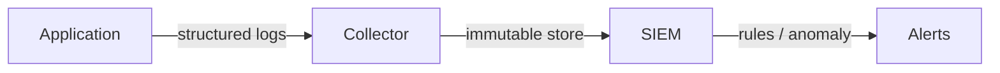

# Information Security 101 (9/10): 로그와 감사

모든 사고를 예방할 수는 없습니다. 그래서 중요한 것은 “무슨 일이 일어났는지 언제 알 수 있는가”입니다. 로그가 없거나 형식이 제각각이면 시스템은 침해를 당하고도 그 사실을 모를 수 있습니다. 운영 로그와 보안 로그, 감사 로그를 구분하고, 무엇을 절대 남기면 안 되는지 정리하는 일은 보안 대응의 출발점입니다.

이 글은 Information Security 101 시리즈의 9번째 글입니다.

## 먼저 던지는 질문

- 운영 로그와 보안 로그는 어떻게 다를까요?
- 무엇을 기록해야 하고 무엇은 절대 기록하면 안 될까요?
- 감사 로그는 왜 따로 둔 저장소와 불변성이 필요할까요?

## 큰 그림


*Information Security 101 9장 흐름 개요*

이 그림에서는 로그와 감사를 운영 흐름 안에서 어디에 배치해야 하는지 봅니다. 핵심은 개념을 따로 외우는 것이 아니라 입력, 처리, 검증, 운영 신호가 어떤 경계로 이어지는지 확인하는 데 있습니다.

> 로그와 감사의 핵심은 기능 이름이 아니라, 어떤 경계에서 무엇을 검증하고 어떤 신호를 남길지 정하는 데 있습니다.

## 왜 중요한가

탐지가 없으면 대응도 없습니다. 침해를 알아차리는 데 수백 일이 걸리면 그것은 사고라기보다 재난에 가깝습니다. 구조화된 로그, 분리된 감사 로그, 명확한 경보 규칙은 탐지 시간을 몇 시간 단위로 줄여 줍니다.

보안 로그는 나중에 추가하기 어렵습니다. 처음부터 출력 모델의 일부로 설계해야 합니다.

## 한눈에 보는 개념



수집하고, 저장하고, 분석하고, 경보를 보내는 흐름이 끊기지 않아야 합니다. 어느 한 단계라도 무너지면 탐지 품질이 급격히 떨어집니다.

## 핵심 용어

- 감사 로그: 누가 언제 무엇을 했는지를 남기는 기록입니다.
- 구조화 로그: JSON처럼 기계가 읽기 쉬운 형식입니다.
- 불변성: 한 번 기록되면 수정하거나 삭제할 수 없는 성질입니다.
- **SIEM**: 보안 이벤트를 모아 분석하고 경보를 만드는 시스템입니다.
- **보존 기간**: 로그를 얼마나 오래 유지할지 정하는 기준이며 규정 준수와 직접 연결됩니다.

## 전후 비교

### 이전 — 자유 형식 평문 로그

```text
"User did something at /api/x" -> not searchable, not aggregable
```

### 이후 — 구조화 로그와 불변 저장소

```json
{"ts":"2026-05-04T10:00Z","user":"alice","action":"read","resource":"reports/2026"}
```

같은 사건이라도 형식이 달라지면 분석 가능성이 완전히 달라집니다.

## 단계별 실습

### 1단계 — 구조화 로그를 남깁니다

```python
# 1_struct_log.py
import json, time, sys
def log(event, **fields):
    rec = {"ts": time.strftime("%FT%TZ"), "event": event, **fields}
    sys.stdout.write(json.dumps(rec) + "\n")

log("auth_login", user="alice", ip="10.0.0.1", ok=True)
```

자유 형식 문장보다 키-값 구조가 훨씬 중요합니다. 그래야 검색, 집계, 규칙 적용이 가능합니다.

### 2단계 — 남기면 안 되는 값을 구분합니다

```python
# 2_no_log.py
# log("login", user=user, password=pw)        # forbidden
# log("token", token=jwt)                     # forbidden
# log("card", number="4111-...", cvv=cvv)     # forbidden
```

비밀번호, 토큰, 개인정보는 마스킹하거나 애초에 기록하지 않아야 합니다. 편의를 위해 남긴 로그가 더 큰 사고를 만들 수 있습니다.

### 3단계 — 감사 로그를 분리합니다

```python
# 3_audit.py
def audit(actor, action, resource, result):
    rec = {"actor": actor, "action": action, "resource": resource, "result": result}
    write_to_immutable_store(rec)   # WORM (write-once-read-many)
```

운영 로그와 감사 로그를 분리해야 무결성과 신뢰성이 올라갑니다. 운영 데이터베이스 안에 같이 두면 조작 가능성이 커집니다.

### 4단계 — 로그 무결성을 보호합니다

```python
# 4_chain.py
import hmac, hashlib, json
def append(prev_mac, record, key):
    payload = json.dumps(record, sort_keys=True).encode()
    return hmac.new(key, prev_mac + payload, hashlib.sha256).hexdigest()
```

이전 기록을 포함해 HMAC 체인을 만들면 중간 변조를 드러낼 수 있습니다.

### 5단계 — SIEM 규칙을 정의합니다

```text
# 5_rule.txt
RULE "brute force":
  WHEN count(auth_login WHERE ok=false) > 10 BY user, ip IN 5min
  THEN alert(severity=high)
```

좋은 규칙은 안정적인 데이터 모델 위에서만 동작합니다. 로그 형식이 흔들리면 경보 품질도 함께 흔들립니다.

## 이 코드와 예제에서 먼저 볼 점

- 모든 로그는 구조화되어야 합니다.
- 비밀 정보와 개인정보는 평문으로 남기면 안 됩니다.
- 감사 로그는 운영 로그와 분리된 저장소에 둬야 합니다.
- 서명이나 WORM 저장소 같은 무결성 보호가 필요합니다.

## 자주 하는 실수 다섯 가지

1. **비밀번호나 토큰을 로그에 남기는 실수**: 가장 흔한 대형 유출 경로입니다.
2. **자유 형식 문자열만 남기는 실수**: 분석이 거의 불가능합니다.
3. **운영 데이터베이스에 로그를 저장하는 실수**: 변조에 취약합니다.
4. **보존 기간이 없는 실수**: 규정 위반이나 비용 폭증으로 이어집니다.
5. **모든 경보를 중요로 올리는 실수**: 경보 피로가 쌓여 진짜 사고를 놓칩니다.

## 실무에서는 이렇게 나타납니다

Kubernetes는 audit policy로 API 서버 호출을 기록합니다. AWS는 CloudTrail, GuardDuty, Security Hub를 결합합니다. 큰 조직은 Splunk, Elastic SIEM, Chronicle 같은 중앙 SIEM으로 보안 이벤트를 모으고 SOC가 24시간 감시합니다. 핵심은 로그를 많이 남기는 것이 아니라, 탐지 가능한 형식과 신뢰 가능한 저장 방식으로 남기는 데 있습니다.

## 시니어 엔지니어는 이렇게 생각합니다

- 로그를 시스템의 기본 출력으로 봅니다.
- 경보 임계값은 감이 아니라 데이터로 정합니다.
- 운영자는 감사 로그를 삭제할 수 없어야 한다고 봅니다.
- 보존 기간은 법률과 계약 요구사항으로 결정합니다.
- 감지되지 않는 시나리오를 게임데이로 점검합니다.

## 체크리스트

- [ ] 모든 로그가 구조화되어 있습니까?
- [ ] 비밀 정보와 개인정보 마스킹 규칙이 있습니까?
- [ ] 감사 로그가 불변 저장소에 있습니까?
- [ ] 보존 기간이 정의되어 있습니까?
- [ ] 상위 다섯 개 경보 규칙의 임계값을 말할 수 있습니까?

## 연습 문제

1. “분당 로그인 실패 100회”를 탐지하는 경보 규칙을 적어 보세요.
2. 감사 로그 불변성을 지키는 메커니즘 두 가지를 적어 보세요.
3. 개인정보를 마스킹하는 미들웨어 의사코드를 스케치해 보세요.

## 정리와 다음 글

로그는 사고를 눈에 보이게 만드는 장치입니다. 구조화, 불변성, 경보 규칙이 갖춰져야 탐지가 대응으로 이어집니다. 마지막 글에서는 사고를 실제로 목격했을 때 무엇을 해야 하는지, 보안 사고 대응을 다룹니다.

## 처음 질문으로 돌아가기

- **운영 로그와 보안 로그는 어떻게 다를까요?**
  - 본문의 기준은 로그와 감사를 한 덩어리 개념으로 보지 않고 입력, 처리, 검증, 운영 신호가 만나는 경계로 나누어 확인하는 것입니다.
- **무엇을 기록해야 하고 무엇은 절대 기록하면 안 될까요?**
  - 예제와 그림에서는 어떤 값이 들어오고, 어느 단계에서 바뀌며, 어떤 기준으로 통과 또는 실패하는지를 먼저 확인해야 합니다.
- **감사 로그는 왜 따로 둔 저장소와 불변성이 필요할까요?**
  - 운영에서는 이 판단을 체크리스트, 로그, 테스트로 남겨 다음 변경에서도 같은 실패가 반복되지 않게 막아야 합니다.

<!-- toc:begin -->
## 시리즈 목차

- [Information Security 101 (1/10): 정보보안이란 무엇인가?](./01-what-is-information-security.md)
- [Information Security 101 (2/10): 인증과 인가](./02-authentication-and-authorization.md)
- [Information Security 101 (3/10): 암호화와 해시](./03-cryptography-and-hash.md)
- [Information Security 101 (4/10): TLS와 인증서](./04-tls-and-certificates.md)
- [Information Security 101 (5/10): 웹 보안 기초](./05-web-security-basics.md)
- [Information Security 101 (6/10): SQL 인젝션과 XSS](./06-sql-injection-and-xss.md)
- [Information Security 101 (7/10): 비밀 정보 관리](./07-secret-management.md)
- [Information Security 101 (8/10): 권한 최소화](./08-least-privilege.md)
- **로그와 감사 (현재 글)**
- 보안 사고 대응 (예정)

<!-- toc:end -->

## 참고 자료

- [NIST SP 800-92 — Guide to Computer Security Log Management](https://csrc.nist.gov/publications/detail/sp/800-92/final)
- [OWASP — Logging Cheat Sheet](https://cheatsheetseries.owasp.org/cheatsheets/Logging_Cheat_Sheet.html)
- [Kubernetes — Auditing](https://kubernetes.io/docs/tasks/debug/debug-cluster/audit/)
- [Elastic — SIEM Documentation](https://www.elastic.co/guide/en/security/current/index.html)

Tags: Computer Science, Security, Logging, Audit, SIEM, Compliance
