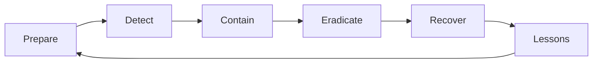

# Information Security 101 (10/10): 보안 사고 대응

사고는 결국 일어납니다. 좋은 대응은 손실을 줄이고, 나쁜 대응은 같은 사고를 더 크게 키웁니다. 첫 5분에 누가 결정을 내리는지, 어떤 기록을 남기는지, 증거를 어떻게 보존하는지가 그 뒤 몇 시간의 품질을 거의 결정합니다. 평온한 시기에 준비하지 않은 절차는 사고 순간에 절차가 되지 못합니다.

이 글은 Information Security 101 시리즈의 마지막 글입니다.

## 먼저 던지는 질문

- 사고가 발생하면 첫 1분에 무엇을 해야 할까요?
- NIST IR 사이클은 어떤 흐름으로 이어질까요?
- 격리와 증거 보존은 어떻게 균형을 잡아야 할까요?

## 큰 그림


*Information Security 101 10장 흐름 개요*

그림은 감지 → 대응 → 조사 → 복구 → 학습의 주기를 보여줍니다. 각 단계마다 책임자, 커뮤니케이션 채널, 시간 목표가 정해져 있을 때 사고는 통제된 상태로 진행됩니다.

> 보안 사고는 '일어나지 않게 막는' 것도 중요하지만, '일어나는 중에' 신속하게 발견하고, '일어난 후에' 빠르게 복구하고, '그 다음에' 같은 실수를 반복하지 않게 만드는 것이 성숙한 대응입니다.

## 왜 중요한가

사고는 피할 수 없지만 손실 규모는 줄일 수 있습니다. 두 시간의 차이가 회사를 구하기도 합니다. 반대로 누가 어떤 결정을 해야 하는지 정해져 있지 않으면, 기술적으로는 해결 가능한 사고도 혼선과 증거 훼손 때문에 훨씬 크게 번집니다.

예방만으로 보안이 끝나지 않습니다. 대응은 실제 보안의 절반입니다.

## 한눈에 보는 개념



NIST IR 사이클은 일회성 절차가 아니라 순환 구조입니다. 한 번의 사고에서 얻은 교훈이 다음 준비 단계로 돌아가야 조직이 강해집니다.

## 핵심 용어

- **사고 대응**: 사고에 대응하는 전체 프로세스입니다.
- 런북: 특정 사고 유형에 맞춘 단계별 절차입니다.
- 격리: 추가 피해를 막기 위해 시스템을 분리하는 단계입니다.
- 제거: 침해의 근본 원인을 없애는 단계입니다.
- **사후 회고**: 사고 이후 원인과 개선점을 정리하는 검토이며, 원칙은 무비난입니다.

## 전후 비교

### 이전 — 즉흥 대응

```text
Decide who does what on the fly -> lost time, destroyed evidence
```

### 이후 — 런북과 사고 지휘관 지정

```text
Roles assigned -> contained in 30 min -> evidence preserved -> recovery
```

준비된 조직만 사고를 통제하고 다음 번을 더 잘 준비할 수 있습니다.

## 보안 인시던트 대응 단계

| 단계 | 주요 활동 | 도구 예시 | 관찰 지표 |
|---|---|---|---|
| **준비 (Preparation)** | 런북 작성, 도구 설치, 팜 훈련 | Incident 테플릿, PagerDuty, 게임데이 | 마지막 게임데이 날짜, 런북 커버리지 |
| **탐지 (Detection)** | 경보 확인, 심각도 판단, IC 지정 | SIEM, GuardDuty, CloudTrail | MTTD (Mean Time To Detect) |
| **격리 (Containment)** | 침해 범위 차단, 증거 보존 | Security Group 차단, 계정 비활성화 | 격리 시간 (분 단위) |
| **제거 (Eradication)** | 근본 원인 제거, 취약점 패치 | 비밀번호 로테이션, 보안 패치 | 패치 적용 완료 시간 |
| **복구 (Recovery)** | 정상 운영 복원, 모니터링 강화 | 백업 복원, 검증 테스트 | MTTR (Mean Time To Restore) |
| **교훈 (Lessons)** | 포스트모텀, 액션 아이템 추적 | Postmortem 테플릿, Jira | 액션 아이템 완료율 |

각 단계는 명확한 책임자, 시간 목표, 성공 기준을 가져야 합니다. NIST IR 사이클은 순환 구조입니다. 한 번의 사고에서 얻은 교훈은 다음 준비 단계로 돌아가야 조직이 강해집니다.
## 단계별 실습

### 1단계 — 탐지 직후 첫 행동을 정합니다

```text
# 1_first_action.txt
1. Assign an Incident Commander (IC)
2. Open an incident channel (#inc-YYYY-MM-DD-N)
3. Start a timeline (record every action with time)
4. Write a hypothesis of impact scope
5. Hold external communication until PR/Legal joins
```

처음 5분이 사고 등급과 대응 품질을 좌우합니다. 특히 의사결정 창구를 하나로 모으는 일이 중요합니다.

### 2단계 — 격리 절차를 코드로 봅니다

```python
# 2_contain.py
def contain_compromised_account(user_id):
    revoke_all_sessions(user_id)
    rotate_credentials(user_id)
    block_ip_list(get_recent_ips(user_id))
    snapshot_logs(user_id, hours=24)   # preserve evidence first
```

가능하다면 격리 전에 먼저 증거를 보존해야 합니다. 시스템을 급히 꺼 버리면 중요한 단서가 함께 사라질 수 있습니다.

### 3단계 — 심각도 체계를 정합니다

```text
# 3_severity.txt
SEV1: customer data exposed, full outage
SEV2: partial impact, potential data risk
SEV3: single user affected, workaround exists
```

심각도는 누가 호출되는지와 어느 수준으로 대응해야 하는지를 정합니다. 정의가 모호하면 작은 사고는 커지고 큰 사고는 묻힙니다.

### 4단계 — 무비난 회고 템플릿을 준비합니다

```text
# 4_postmortem.md
- What happened (timeline)
- Impact
- Root cause (5 Whys)
- What went well
- What to improve
- Action items (owner, due date)
```

사람을 탓하면 다음 사고에서는 정보가 숨겨집니다. 시스템을 고쳐야 다음 대응이 나아집니다.

### 5단계 — 게임데이로 연습합니다

```text
# 5_gameday.txt
Scenario: "S3 bucket made public"
Goal: detect -> contain -> communicate -> recover within 1 hour
Measure: MTTD, MTTR, accuracy of external comms
```

연습하지 않은 절차는 실제 사고에서 제대로 작동하지 않습니다. 게임데이는 런북의 빈칸을 미리 드러내는 가장 좋은 방법입니다.

### 6단계 — IOC 스캔너로 취약점을 감지합니다

```python
# 6_ioc_scanner.py
import re
from typing import List, Dict

class IOCScanner:
    """Indicator of Compromise scanner"""

    def __init__(self):
        self.known_malicious_ips = [
            "192.0.2.1",  # 예시 IP
            "198.51.100.0",
        ]
        self.suspicious_patterns = [
            r"/etc/passwd",
            r"\.\./\.\./",  # path traversal
            r"<script>",   # XSS
        ]

    def scan_log_line(self, log_line: str) -> List[Dict]:
        findings = []

        # IP 검사
        for ip in self.known_malicious_ips:
            if ip in log_line:
                findings.append({
                    "type": "malicious_ip",
                    "value": ip,
                    "severity": "high",
                })

        # 패턴 검사
        for pattern in self.suspicious_patterns:
            if re.search(pattern, log_line):
                findings.append({
                    "type": "suspicious_pattern",
                    "pattern": pattern,
                    "severity": "medium",
                })

        return findings

# 사용 예시
scanner = IOCScanner()
log = "GET /../../etc/passwd HTTP/1.1 from 192.0.2.1"
findings = scanner.scan_log_line(log)
if findings:
    alert_security_team("IOC detected", findings)
```

IOC(Indicator of Compromise) 스캔너는 알려진 악성 IP, 파일 해시, URL, 패턴을 감지합니다. 정기적으로 IOC 목록을 업데이트하고 로그와 네트워크 트래픽에 적용하면 조기 탐지율을 크게 높일 수 있습니다.

## 이 코드와 예제에서 먼저 볼 점

- 사고 지휘관은 단일 의사결정 창구입니다.
- 가능하면 격리보다 증거 보존이 먼저여야 합니다.
- 외부 커뮤니케이션은 하나의 채널로 통일되어야 합니다.
- 모든 행동은 시간과 함께 기록되어야 합니다.

## 보안 사고 보고 의무

보안 사고가 발생하면 누구에게 언제 보고해야 하는지를 명확히 해야 합니다. 법적 요구사항, 계약 상 의무, 내부 정책이 모두 다릅니다.

### 보고 의무 종류

| 보고 대상 | 트리거 조건 | 보고 기한 | 근거 |
|---|---|---|---|
| **경영진** | SEV1 사고 | 즉시 | 내부 정책 |
| **고객** | 개인정보 유출 | 72시간 이내 | 개인정보보호법, GDPR |
| **규제 기관** | 금융 데이터 침해 | 즉시 ~ 72시간 | PCI-DSS, 금융위 |
| **사이버보안센터** | 대규모 침해 | 즉시 | 정보통신망 보안 |
| **파트너/공급사** | 공급망 침해 | 계약상 조건 | SLA 규정 |

보고 의무는 산업과 지역에 따라 다릅니다. 한국의 개인정보보호법은 개인정보 유출 시 72시간 이내 신고를 요구합니다. GDPR도 72시간 규칙을 따릅니다. PCI-DSS는 결제 데이터 유출 시 즉각 보고를 요구합니다.

### 보고 템플릿

```python
# incident_report.py
from dataclasses import dataclass
from datetime import datetime
from enum import Enum

class Severity(Enum):
    SEV1 = "critical"
    SEV2 = "high"
    SEV3 = "medium"

@dataclass
class IncidentReport:
    incident_id: str
    title: str
    severity: Severity
    detected_at: datetime
    affected_systems: list
    affected_users: int
    data_exposed: bool
    root_cause: str
    mitigation_steps: list
    reporter: str

def generate_incident_report(incident) -> IncidentReport:
    return IncidentReport(
        incident_id=incident.id,
        title=incident.title,
        severity=incident.severity,
        detected_at=incident.detected_at,
        affected_systems=incident.systems,
        affected_users=count_affected_users(incident),
        data_exposed=check_data_exposure(incident),
        root_cause=analyze_root_cause(incident),
        mitigation_steps=incident.actions_taken,
        reporter=incident.incident_commander,
    )

# 사용 예시
report = generate_incident_report(current_incident)
if report.data_exposed:
    notify_customers_within_72h(report)
    notify_regulatory_bodies(report)
```

보고 템플릿을 표준화하면 사고 중에 빠뜨릴 수 있는 필수 항목을 줄일 수 있습니다. 개인정보 유출 여부, 영향 받은 사용자 수, 근본 원인은 모든 보고서에 포함되어야 합니다.

### 사고 커뮤니케이션 표준

```python
# incident_comms.py

def draft_incident_message(severity: str, status: str, eta: str = None) -> str:
    """Draft standardized incident communication"""
    templates = {
        "initial": (
            "서비스 일부에 문제가 발생했습니다. 현재 조사 중이며 {eta}에 다음 업데이트를 제공하겠습니다."
        ),
        "investigating": (
            "근본 원인을 파악 중입니다. 영향 범위는 {scope}입니다."
        ),
        "resolved": (
            "문제가 해결되었습니다. 상세한 포스트모텀은 24시간 내에 공유하겠습니다."
        ),
    }
    return templates.get(status, "알 수 없는 상태").format(eta=eta, scope="확인 중")

# 사용 예시
msg = draft_incident_message("SEV1", "initial", eta="30분 후")
post_to_status_page(msg)
notify_slack_channel("#incidents", msg)
```

사고 커뮤니케이션은 하나의 채널로 통일해야 합니다. 상태 페이지, 이메일, 슬랙 모두에 같은 메시지를 보내야 혼선을 줄일 수 있습니다. 외부 커뮤니케이션은 법무팀 검토를 거쳐야 합니다.

## 자주 하는 실수 다섯 가지

1. **시스템을 즉시 꺼 버리는 실수**: 증거가 사라집니다.
2. **여러 사람이 동시에 따로 결정하는 실수**: 모순과 혼선이 커집니다.
3. **회고에서 사람을 비난하는 실수**: 다음 사고에서 정보가 숨겨집니다.
4. **심각도 체계가 없는 실수**: 대응 우선순위가 무너집니다.
5. **사고를 DM과 이메일로만 처리하는 실수**: 타임라인을 복원할 수 없습니다.

## 실무에서는 이렇게 나타납니다

PagerDuty나 Opsgenie가 사고 지휘관을 자동 지정하고, 슬랙 워크플로가 사고 채널을 만듭니다. AWS는 GuardDuty 탐지를 EventBridge와 Lambda를 거쳐 격리 워크플로로 연결하기도 합니다. 회고 문서는 Notion이나 Confluence 템플릿으로 표준화합니다. 좋은 조직은 첫 30분을 자동화하고, 나머지 판단은 명확한 역할 아래에서 수행합니다.

## 시니어 엔지니어는 이렇게 생각합니다

- 런북은 사고 중이 아니라 평시에 작성합니다.
- 첫 30분 대응은 최대한 자동화합니다.
- 심각도 정의와 호출 체계를 항상 최신으로 유지합니다.
- 회고에서는 사람을 보호하고 시스템을 고칩니다.
- 액션 아이템에는 담당자와 마감일이 반드시 있어야 합니다.

## 체크리스트

- [ ] 사고 지휘관 역할이 정의되어 있습니까?
- [ ] 주요 사고 유형별 런북이 작성되어 있습니까?
- [ ] 심각도와 호출 체계가 최신입니까?
- [ ] 무비난 회고 템플릿이 있습니까?
- [ ] 마지막 게임데이는 언제였습니까?

## 연습 문제

1. “S3 버킷이 공개로 열림” 상황의 첫 5분 런북을 작성해 보세요.
2. 사람의 실수를 시스템 문제로 다시 표현하는 예 두 가지를 적어 보세요.
3. SEV1과 SEV2에 대한 호출 체계를 설계해 보세요.

## 정리와 다음 글

보안 사고 대응은 준비가 눈에 보이는 형태로 드러나는 순간입니다. 이 글로 Information Security 101 시리즈를 마무리합니다. CIA에서 시작해 인증, 암호화, 웹 보안, 비밀 정보, 권한, 로그, 사고 대응까지 이어지는 기본 축을 한 번 훑었습니다. 다음 학습 주제로는 위협 모델링 심화, 클라우드 보안, SOC 2와 ISO 27001 같은 규정 프레임워크를 이어서 보면 좋습니다.


## 보안 성숙도 모델로 보는 사고 대응 수준

사고 대응 체계는 문서 유무보다 반복 가능성으로 평가해야 합니다. 아래는 실무에서 자주 쓰는 4단계 성숙도 모델입니다.

| 단계 | 특징 | 한계 | 다음 목표 |
| --- | --- | --- | --- |
| Level 1 초기 | 사고 시 즉흥 대응, 담당자 불명확 | 탐지/대응 지연, 증거 훼손 | 런북 초안과 지휘관 지정 |
| Level 2 관리 | 주요 사고 유형 런북 존재, 채널 표준화 | 자동화 부족, 개인 역량 의존 | 경보-격리 자동화 일부 도입 |
| Level 3 정의 | 심각도 체계, 훈련, 회고 루프 정착 | 복잡 사고에서 부서 간 병목 | 교차팀 합동 훈련과 지표 개선 |
| Level 4 최적화 | 자동화+학습 루프+지표 기반 개선 | 유지 비용 증가 | 정기 재검증과 단순화 |

성숙도 모델의 목적은 점수화가 아니라 투자 우선순위 정렬입니다. 예를 들어 Level 1 조직이 고급 포렌식 도구보다 먼저 해야 할 일은 탐지 채널 표준화와 타임라인 기록 습관입니다.

## 사고 대응 종합 체크리스트

```yaml
# incident-response-checklist.yaml
prepare:
  - incident_commander_assigned: true
  - severity_matrix_documented: true
  - runbooks_for_top5_scenarios: true
  - legal_pr_contact_on_call: true

detect:
  - critical_alerts_tested_weekly: true
  - mttd_slo_defined: true

contain:
  - account_session_revoke_automation: true
  - network_isolation_playbook: true
  - evidence_snapshot_procedure: true

eradicate_recover:
  - root_cause_template: true
  - credential_rotation_automation: true
  - mttr_slo_defined: true

lessons:
  - blameless_postmortem_template: true
  - action_item_owner_and_due_date: true
  - control_improvement_tracking: true
```

이 체크리스트는 분기마다 Pass/Fail로 점검하고, Fail 항목에 담당자와 마감일을 연결해야 실질적인 개선이 됩니다.

## 대응 자동화 코드 예시

```python
# incident_automation.py
from datetime import datetime, timezone


def start_incident(severity: str, summary: str) -> dict:
    incident_id = datetime.now(timezone.utc).strftime("INC-%Y%m%d-%H%M%S")
    return {
        "incident_id": incident_id,
        "severity": severity,
        "summary": summary,
        "channel": f"#inc-{incident_id.lower()}",
        "timeline_started": True,
    }


def containment_actions(user_id: str) -> list[str]:
    actions = [
        f"revoke_sessions:{user_id}",
        f"rotate_credentials:{user_id}",
        f"snapshot_logs:{user_id}:24h",
    ]
    return actions

inc = start_incident("SEV2", "suspicious admin activity detected")
print(inc)
print(containment_actions("admin-42"))
```

자동화의 목적은 사람을 대체하는 것이 아니라, 사고 초기에 반복되는 기계적 작업을 빠르게 실행해 판단 시간을 확보하는 데 있습니다.

## 운영 지표 예시

- MTTD(탐지 시간): 이상 징후 발생부터 인지까지
- MTTA(초기 대응 착수 시간): 인지부터 지휘 체계 가동까지
- MTTR(복구 시간): 격리부터 서비스 정상화까지
- 재발률: 동일 원인 사고의 반복 비율

지표는 보고서용 숫자가 아니라, 다음 분기 통제 개선의 입력이어야 합니다.


## 운영 점검 루프와 문서화 기준

보안 글에서 가장 자주 빠지는 부분은 "그래서 운영에서는 무엇을 주기적으로 확인할 것인가"입니다. 아래 루프를 기준으로 문서화하면 개념이 실무로 연결됩니다.

| 주기 | 점검 항목 | 산출물 |
| --- | --- | --- |
| 매일 | 고위험 경보, 인증 실패 급증, 권한 거부 급증 | 일일 보안 브리핑 |
| 매주 | 신규 배포 변경점의 보안 영향 | 변경 검토 노트 |
| 매월 | 키/토큰/인증서 만료 예정, 미사용 권한, 미사용 시크릿 | 월간 정리 리포트 |
| 분기 | 위협 모델 재평가, 런북 훈련, 통제 효과 검토 | 분기 보안 회고 |

실행 가능한 문서의 조건도 분명해야 합니다.

- 담당자(owner)와 대체 담당자가 명시되어야 합니다.
- 실패 조건과 에스컬레이션 기준이 수치로 정의되어야 합니다.
- 점검 결과가 티켓이나 액션 아이템으로 추적되어야 합니다.
- 예외 승인에는 만료일이 반드시 있어야 합니다.

보안은 단발성 프로젝트가 아니라 운영 루프입니다. 같은 점검을 반복해도 기준이 유지될 때 품질이 올라갑니다.


## 처음 질문으로 돌아가기

- **사고가 발생하면 첫 1분에 무엇을 해야 할까요?**
  - 경고 발생 → 심각도 분류 → 초기 대응 → 조사 개시 → 발견 기록 → 복구 계획 → 실행 → 사후 분석의 각 단계 책임을 명확히 합니다.
- **NIST IR 사이클은 어떤 흐름으로 이어질까요?**
  - 침해 의심 신호에 1시간 vs 24시간 응답 시간의 피해 규모 차이를 이해하면 대응 우선순위를 정할 수 있습니다.
- **격리와 증거 보존은 어떻게 균형을 잡아야 할까요?**
  - 사고 대응 계획 정기 훈련, 런북 검증 및 업데이트, 사후 분석 결과의 후속 작업 추적을 정의합니다.

<!-- toc:begin -->
## 시리즈 목차

- [Information Security 101 (1/10): 정보보안이란 무엇인가?](./01-what-is-information-security.md)
- [Information Security 101 (2/10): 인증과 인가](./02-authentication-and-authorization.md)
- [Information Security 101 (3/10): 암호화와 해시](./03-cryptography-and-hash.md)
- [Information Security 101 (4/10): TLS와 인증서](./04-tls-and-certificates.md)
- [Information Security 101 (5/10): 웹 보안 기초](./05-web-security-basics.md)
- [Information Security 101 (6/10): SQL 인젝션과 XSS](./06-sql-injection-and-xss.md)
- [Information Security 101 (7/10): 비밀 정보 관리](./07-secret-management.md)
- [Information Security 101 (8/10): 권한 최소화](./08-least-privilege.md)
- [Information Security 101 (9/10): 로그와 감사](./09-logging-and-audit.md)
- **보안 사고 대응 (현재 글)**

<!-- toc:end -->

## 참고 자료

- [NIST SP 800-61 — Computer Security Incident Handling Guide](https://csrc.nist.gov/publications/detail/sp/800-61/rev-2/final)
- [Google SRE Book — Managing Incidents](https://sre.google/sre-book/managing-incidents/)
- [PagerDuty — Incident Response Documentation](https://response.pagerduty.com/)
- [Etsy — Blameless Postmortems](https://www.etsy.com/codeascraft/blameless-postmortems/)

Tags: Computer Science, Security, IncidentResponse, Runbook, Postmortem, Forensics
