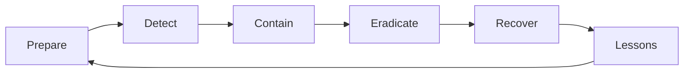

# 보안 사고 대응

사고는 결국 일어납니다. 좋은 대응은 손실을 줄이고, 나쁜 대응은 같은 사고를 더 크게 키웁니다. 첫 5분에 누가 결정을 내리는지, 어떤 기록을 남기는지, 증거를 어떻게 보존하는지가 그 뒤 몇 시간의 품질을 거의 결정합니다. 평온한 시기에 준비하지 않은 절차는 사고 순간에 절차가 되지 못합니다.

이 글은 Information Security 101 시리즈의 마지막 글입니다.

## 이 글에서 다룰 문제

사고 대응은 침해 이후에 즉흥적으로 떠올리는 행동 목록이 아닙니다. 준비, 탐지, 격리, 제거, 복구, 교훈 정리까지 이어지는 순환 구조로 봐야 실제 조직 운영에 들어맞습니다.

> 대응의 품질은 사고 순간이 아니라 평상시에 준비한 절차로 결정됩니다.

- 사고가 발생하면 첫 1분에 무엇을 해야 할까요?
- NIST IR 사이클은 어떤 흐름으로 이어질까요?
- 격리와 증거 보존은 어떻게 균형을 잡아야 할까요?
- 무비난 회고는 왜 중요한가요?
- 심각도와 커뮤니케이션 체계는 어떻게 정해야 할까요?

## 왜 중요한가

사고는 피할 수 없지만 손실 규모는 줄일 수 있습니다. 두 시간의 차이가 회사를 구하기도 합니다. 반대로 누가 어떤 결정을 해야 하는지 정해져 있지 않으면, 기술적으로는 해결 가능한 사고도 혼선과 증거 훼손 때문에 훨씬 크게 번집니다.

예방만으로 보안이 끝나지 않습니다. 대응은 실제 보안의 절반입니다.

## 한눈에 보는 개념



NIST IR 사이클은 일회성 절차가 아니라 순환 구조입니다. 한 번의 사고에서 얻은 교훈이 다음 준비 단계로 돌아가야 조직이 강해집니다.

## 핵심 용어

- **사고 대응**: 사고에 대응하는 전체 프로세스입니다.
- 런북: 특정 사고 유형에 맞춘 단계별 절차입니다.
- 격리: 추가 피해를 막기 위해 시스템을 분리하는 단계입니다.
- 제거: 침해의 근본 원인을 없애는 단계입니다.
- **사후 회고**: 사고 이후 원인과 개선점을 정리하는 검토이며, 원칙은 무비난입니다.

## 전후 비교

### 이전 — 즉흥 대응

```text
Decide who does what on the fly -> lost time, destroyed evidence
```

### 이후 — 런북과 사고 지휘관 지정

```text
Roles assigned -> contained in 30 min -> evidence preserved -> recovery
```

준비된 조직만 사고를 통제하고 다음 번을 더 잘 준비할 수 있습니다.

## 단계별 실습

### 1단계 — 탐지 직후 첫 행동을 정합니다

```text
# 1_first_action.txt
1. Assign an Incident Commander (IC)
2. Open an incident channel (#inc-YYYY-MM-DD-N)
3. Start a timeline (record every action with time)
4. Write a hypothesis of impact scope
5. Hold external communication until PR/Legal joins
```

처음 5분이 사고 등급과 대응 품질을 좌우합니다. 특히 의사결정 창구를 하나로 모으는 일이 중요합니다.

### 2단계 — 격리 절차를 코드로 봅니다

```python
# 2_contain.py
def contain_compromised_account(user_id):
    revoke_all_sessions(user_id)
    rotate_credentials(user_id)
    block_ip_list(get_recent_ips(user_id))
    snapshot_logs(user_id, hours=24)   # preserve evidence first
```

가능하다면 격리 전에 먼저 증거를 보존해야 합니다. 시스템을 급히 꺼 버리면 중요한 단서가 함께 사라질 수 있습니다.

### 3단계 — 심각도 체계를 정합니다

```text
# 3_severity.txt
SEV1: customer data exposed, full outage
SEV2: partial impact, potential data risk
SEV3: single user affected, workaround exists
```

심각도는 누가 호출되는지와 어느 수준으로 대응해야 하는지를 정합니다. 정의가 모호하면 작은 사고는 커지고 큰 사고는 묻힙니다.

### 4단계 — 무비난 회고 템플릿을 준비합니다

```text
# 4_postmortem.md
- What happened (timeline)
- Impact
- Root cause (5 Whys)
- What went well
- What to improve
- Action items (owner, due date)
```

사람을 탓하면 다음 사고에서는 정보가 숨겨집니다. 시스템을 고쳐야 다음 대응이 나아집니다.

### 5단계 — 게임데이로 연습합니다

```text
# 5_gameday.txt
Scenario: "S3 bucket made public"
Goal: detect -> contain -> communicate -> recover within 1 hour
Measure: MTTD, MTTR, accuracy of external comms
```

연습하지 않은 절차는 실제 사고에서 제대로 작동하지 않습니다. 게임데이는 런북의 빈칸을 미리 드러내는 가장 좋은 방법입니다.

## 이 코드와 예제에서 먼저 볼 점

- 사고 지휘관은 단일 의사결정 창구입니다.
- 가능하면 격리보다 증거 보존이 먼저여야 합니다.
- 외부 커뮤니케이션은 하나의 채널로 통일되어야 합니다.
- 모든 행동은 시간과 함께 기록되어야 합니다.

## 자주 하는 실수 다섯 가지

1. **시스템을 즉시 꺼 버리는 실수**: 증거가 사라집니다.
2. **여러 사람이 동시에 따로 결정하는 실수**: 모순과 혼선이 커집니다.
3. **회고에서 사람을 비난하는 실수**: 다음 사고에서 정보가 숨겨집니다.
4. **심각도 체계가 없는 실수**: 대응 우선순위가 무너집니다.
5. **사고를 DM과 이메일로만 처리하는 실수**: 타임라인을 복원할 수 없습니다.

## 실무에서는 이렇게 나타납니다

PagerDuty나 Opsgenie가 사고 지휘관을 자동 지정하고, 슬랙 워크플로가 사고 채널을 만듭니다. AWS는 GuardDuty 탐지를 EventBridge와 Lambda를 거쳐 격리 워크플로로 연결하기도 합니다. 회고 문서는 Notion이나 Confluence 템플릿으로 표준화합니다. 좋은 조직은 첫 30분을 자동화하고, 나머지 판단은 명확한 역할 아래에서 수행합니다.

## 시니어 엔지니어는 이렇게 생각합니다

- 런북은 사고 중이 아니라 평시에 작성합니다.
- 첫 30분 대응은 최대한 자동화합니다.
- 심각도 정의와 호출 체계를 항상 최신으로 유지합니다.
- 회고에서는 사람을 보호하고 시스템을 고칩니다.
- 액션 아이템에는 담당자와 마감일이 반드시 있어야 합니다.

## 체크리스트

- [ ] 사고 지휘관 역할이 정의되어 있습니까?
- [ ] 주요 사고 유형별 런북이 작성되어 있습니까?
- [ ] 심각도와 호출 체계가 최신입니까?
- [ ] 무비난 회고 템플릿이 있습니까?
- [ ] 마지막 게임데이는 언제였습니까?

## 연습 문제

1. “S3 버킷이 공개로 열림” 상황의 첫 5분 런북을 작성해 보세요.
2. 사람의 실수를 시스템 문제로 다시 표현하는 예 두 가지를 적어 보세요.
3. SEV1과 SEV2에 대한 호출 체계를 설계해 보세요.

## 정리와 다음 글

보안 사고 대응은 준비가 눈에 보이는 형태로 드러나는 순간입니다. 이 글로 Information Security 101 시리즈를 마무리합니다. CIA에서 시작해 인증, 암호화, 웹 보안, 비밀 정보, 권한, 로그, 사고 대응까지 이어지는 기본 축을 한 번 훑었습니다. 다음 학습 주제로는 위협 모델링 심화, 클라우드 보안, SOC 2와 ISO 27001 같은 규정 프레임워크를 이어서 보면 좋습니다.

<!-- toc:begin -->
- [정보보안이란 무엇인가?](./01-what-is-information-security.md)
- [인증과 인가](./02-authentication-and-authorization.md)
- [암호화와 해시](./03-cryptography-and-hash.md)
- [TLS와 인증서](./04-tls-and-certificates.md)
- [웹 보안 기초](./05-web-security-basics.md)
- [SQL 인젝션과 XSS](./06-sql-injection-and-xss.md)
- [비밀 정보 관리](./07-secret-management.md)
- [권한 최소화](./08-least-privilege.md)
- [로그와 감사](./09-logging-and-audit.md)
- **보안 사고 대응 (현재 글)**
<!-- toc:end -->

## 참고 자료

- [NIST SP 800-61 — Computer Security Incident Handling Guide](https://csrc.nist.gov/publications/detail/sp/800-61/rev-2/final)
- [Google SRE Book — Managing Incidents](https://sre.google/sre-book/managing-incidents/)
- [PagerDuty — Incident Response Documentation](https://response.pagerduty.com/)
- [Etsy — Blameless Postmortems](https://www.etsy.com/codeascraft/blameless-postmortems/)

Tags: Computer Science, Security, IncidentResponse, Runbook, Postmortem, Forensics
