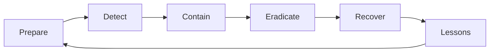

# 보안 사고 대응

> Information Security 101 시리즈 (10/10)

<!-- a-grade-intro:begin -->

**핵심 질문**: 사고가 났을 때, 1분 안에 무엇을 해야 하는지 우리는 알고 있나요?

> 사고 대응의 품질은 평소의 준비도에서 결정됩니다. 사고 중에 만드는 절차는 절차가 아닙니다.

<!-- a-grade-intro:end -->

## 이 글에서 배울 것

- NIST IR 사이클 (Prepare, Detect, Contain, Eradicate, Recover, Lessons)
- 런북(runbook)의 구성과 작성법
- 격리(containment)와 증거 보존의 균형
- 무비난(blameless) 회고
- 사고 등급(severity)과 커뮤니케이션

## 왜 중요한가

사고는 일어납니다. 좋은 대응은 손실을 최소화하고, 나쁜 대응은 손실을 키웁니다. 두 시간의 차이가 회사를 구합니다.

> "예방"은 0을 목표로 하지 않습니다. "대응"이 진짜 보안의 절반입니다.

## 개념 한눈에 보기



NIST IR 사이클은 끊기지 않는 순환입니다.

## 핵심 용어 정리

- **IR (Incident Response)**: 사고 대응 프로세스 전체.
- **Runbook**: 특정 사고 유형에 대한 단계별 절차.
- **Containment**: 추가 피해를 막는 격리.
- **Eradication**: 침해 원인 제거.
- **Postmortem**: 사고 후 회고 — 무비난 원칙.

## Before/After

**Before — 사고 시 즉흥 대응**

```text
누가 무엇을 할지 즉석에서 결정 -> 시간 손실, 증거 훼손
```

**After — 런북 + 사고 사령관(IC) 지정**

```text
역할 분담 -> 격리 30분 내 -> 증거 보존 -> 회복
```

준비된 조직만 사고에서 학습합니다.

## 실습: IR 절차 적용

### 1단계 — 사고 탐지 후 첫 행동

```text
# 1_first_action.txt
1. 사고 사령관(IC) 지정
2. 사고 채널 (#inc-YYYY-MM-DD-N) 생성
3. 타임라인 기록 시작 (모든 행동을 시간과 함께)
4. 영향 범위 가설 작성
5. 외부 통신 보류 (PR/법무 합류 전까지)
```

처음 5분이 사고의 등급을 결정합니다.

### 2단계 — 격리 (의사코드)

```python
# 2_contain.py
def contain_compromised_account(user_id):
    revoke_all_sessions(user_id)
    rotate_credentials(user_id)
    block_ip_list(get_recent_ips(user_id))
    snapshot_logs(user_id, hours=24)   # 증거 보존 먼저
```

격리 전에 항상 증거를 캡처합니다.

### 3단계 — 사고 등급 (severity)

```text
# 3_severity.txt
SEV1: 고객 데이터 노출, 서비스 전면 중단
SEV2: 일부 기능 영향, 잠재적 데이터 위험
SEV3: 단일 사용자 영향, 우회 가능
```

등급은 호출 대상과 SLA를 결정합니다.

### 4단계 — 무비난 회고 템플릿

```text
# 4_postmortem.md
- 무엇이 일어났나 (타임라인)
- 영향
- 근본 원인 (5 Whys)
- 잘된 점
- 개선할 점
- 액션 아이템 (담당자, 마감일)
```

사람을 비난하지 않고 시스템을 고칩니다.

### 5단계 — 게임데이 (사전 훈련)

```text
# 5_gameday.txt
시나리오: "S3 버킷이 public으로 공개됨"
목표: 탐지 -> 격리 -> 통신 -> 회복까지 1시간 내
측정: MTTD, MTTR, 외부 통신 정확도
```

훈련하지 않은 절차는 실전에서 작동하지 않습니다.

## 이 코드에서 주목할 점

- 사고 사령관(IC)은 의사 결정자, 단일 연락 창구.
- 증거 보존은 격리보다 먼저(가능하다면).
- 외부 통신은 통합 채널로만.
- 모든 행동은 타임스탬프와 함께 기록.

## 자주 하는 실수 5가지

1. **즉시 시스템을 끄는 것.** 증거가 사라집니다.
2. **여러 사람이 동시에 결정.** 혼선과 모순.
3. **회고에서 사람을 비난.** 다음 사고에 정보가 숨겨집니다.
4. **SEV 등급 미정의.** 작은 사고가 커지거나, 큰 사고가 묻힙니다.
5. **사고 채널 없이 DM/이메일로 진행.** 타임라인 재구성 불가.

## 실무에서는 이렇게 쓰입니다

PagerDuty/Opsgenie로 IC 자동 지정. Slack 워크플로우로 사고 채널 자동 생성. AWS는 GuardDuty findings를 IR 워크플로우(EventBridge -> Lambda -> 격리)로 연결. 회고는 Notion/Confluence 템플릿으로 표준화.

## 시니어 엔지니어는 이렇게 생각합니다

- 평시에 런북을 쓰고 게임데이로 검증합니다.
- 첫 30분의 행동은 자동화합니다 (격리, 알림).
- 사고 등급을 명확히 하고 호출 트리를 갱신합니다.
- 회고에서 사람을 보호하고 시스템을 고칩니다.
- 액션 아이템은 마감일과 담당자가 있어야 합니다.

## 체크리스트

- [ ] 사고 사령관(IC) 역할이 정의되어 있는가?
- [ ] 주요 사고 유형별 런북이 있는가?
- [ ] SEV 등급과 호출 트리가 최신인가?
- [ ] 무비난 회고 템플릿이 있는가?
- [ ] 마지막 게임데이는 언제였는가?

## 연습 문제

1. "S3 버킷 public 노출"의 첫 5분 런북을 작성해 보세요.
2. 무비난 회고에서 사람 대신 시스템 문제로 바꾸는 예 두 가지를 적어 보세요.
3. SEV1과 SEV2의 호출 트리를 설계해 보세요.

## 정리 및 다음 단계

보안 사고 대응은 평소의 준비도가 전부입니다. 이로써 정보보안 101 시리즈를 마칩니다 — CIA에서 시작해 사고 대응까지, 핵심 줄기를 한 번 훑었습니다. 다음 단계로는 위협 모델링, 클라우드 보안, 컴플라이언스(SOC2/ISO 27001)를 추천합니다.

<!-- toc:begin -->
- [정보보안이란 무엇인가?](./01-what-is-information-security.md)
- [인증과 인가](./02-authentication-and-authorization.md)
- [암호화와 해시](./03-cryptography-and-hash.md)
- [TLS와 인증서](./04-tls-and-certificates.md)
- [Web 보안 기초](./05-web-security-basics.md)
- [SQL Injection과 XSS](./06-sql-injection-and-xss.md)
- [secret 관리](./07-secret-management.md)
- [권한 최소화](./08-least-privilege.md)
- [로그와 감사](./09-logging-and-audit.md)
- **보안 사고 대응 (현재 글)**
<!-- toc:end -->

## 참고 자료

- [NIST SP 800-61 — Computer Security Incident Handling Guide](https://csrc.nist.gov/publications/detail/sp/800-61/rev-2/final)
- [Google SRE Book — Managing Incidents](https://sre.google/sre-book/managing-incidents/)
- [PagerDuty — Incident Response Documentation](https://response.pagerduty.com/)
- [Etsy — Blameless Postmortems](https://www.etsy.com/codeascraft/blameless-postmortems/)

Tags: Computer Science, Security, IncidentResponse, Runbook, Postmortem, Forensics
