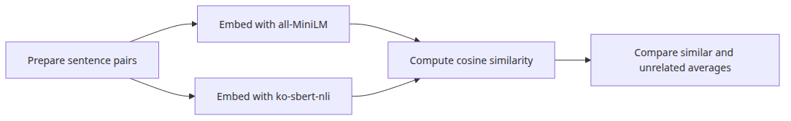
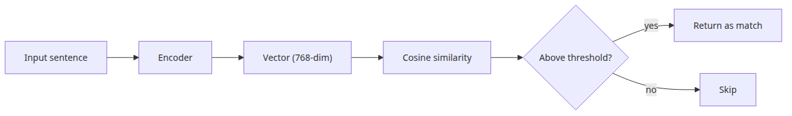
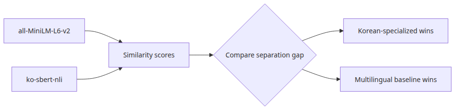
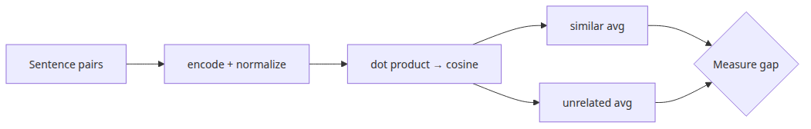
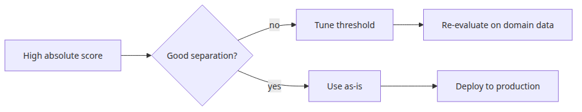

# Korean embedding models compared — KoSimCSE, BGE-M3, Solar

## Questions this post answers

- Where do English-first embedding models usually fail on Korean-heavy data?
- Why is a separation gap between similar and unrelated pairs more useful than one pretty cosine score?
- What should you test first when Korean text regularly mixes with English technical terms?
- How does a reproducible baseline help you choose between a general multilingual model and a Korean-oriented one?

> Comparing embedding models is less about headline scores and more about how consistently they pull similar sentences together while pushing unrelated ones apart.

> Korean AI Stack 101 (1/6)

Example code: [github.com/yeongseon-books/korean-ai-stack-101](https://github.com/yeongseon-books/korean-ai-stack-101/tree/main/en/01-korean-embedding-models)

This post starts with a comparison frame you can rerun locally. The title mentions KoSimCSE, BGE-M3, and Solar because they define the landscape of Korean embedding choices, but the runnable example compares `all-MiniLM-L6-v2` with `jhgan/ko-sbert-nli`. That decision is deliberate: if readers cannot run `python main.py` immediately, the comparison stays abstract.

In practice, the real question is not "which model wins the benchmark?" It is "which model fails less often on our data?" Korean-only FAQ traffic, Korean sentences with English product names, and threshold-based retrieval all stress models differently. So the first post focuses on a repeatable comparison setup before moving deeper into Korean-first retrieval.

---

## Core flow



*Core flow*
---

## Why start with a reproducible comparison



*Why start with a reproducible comparison*
A model comparison is only useful if readers can reproduce the trend on their own machine. API-only models and private evaluation sets may look authoritative, but they do not help you build intuition the next morning.

This example highlights two practical observations. First, `ko-sbert-nli` tends to create a wider gap between similar Korean sentences and unrelated ones. Second, `all-MiniLM-L6-v2` remains a useful baseline when Korean text mixes with English, even if its Korean-only separation is narrower. That framing gives you a stable lens for the next posts, where we move from comparison into retrieval.

---

## Minimal runnable example



*Minimal runnable example*
The example below runs the same sentence pairs through both models and compares the average score of `similar` pairs with the average score of `unrelated` pairs. The full version lives in `main.py`.

```python
import numpy as np
from sentence_transformers import SentenceTransformer

MODEL_NAMES = {
    'all-MiniLM-L6-v2': 'sentence-transformers/all-MiniLM-L6-v2',
    'ko-sbert-nli': 'jhgan/ko-sbert-nli',
}

SENTENCE_PAIRS = [
    ('나는 오늘 점심으로 비빔밥을 먹었다.', '오늘 점심은 비빔밥이었다.', 'similar'),
    ('서울시청 앞에서 회의를 했다.', '회의는 서울 시청 앞에서 열렸다.', 'similar'),
    ('비가 와서 우산을 챙겼다.', 'GPU 메모리가 부족해 학습이 중단됐다.', 'unrelated'),
]

for label, name in MODEL_NAMES.items():
    model = SentenceTransformer(name)
    scores = []
    for sent_a, sent_b, expected in SENTENCE_PAIRS:
        emb = model.encode([sent_a, sent_b], normalize_embeddings=True)
        score = float(np.dot(emb[0], emb[1]))
        scores.append((expected, score))
    print(label, scores)
```

---

## What to notice in this code



*What to notice in this code*
- Both models see the **same sentence pairs**. That keeps the comparison about the model, not about a hidden data change.
- `normalize_embeddings=True` turns inner product into cosine similarity and makes the same vectors easy to reuse in FAISS.
- The useful signal is not one high score. It is the gap between the average `similar` score and the average `unrelated` score.
- One cross-lingual pair is included on purpose because Korean production data often includes English UI strings, product names, and logs.

---

## Where engineers get confused



*Where engineers get confused*
- A Korean-specific model does not automatically win every multilingual workload. If your corpus mixes Korean and English heavily, a multilingual model may still be the safer baseline.
- A cosine score like 0.8 is not an absolute definition of quality. Each model has its own score distribution.
- Public benchmark rankings do not always match operational quality. Korean spacing errors, typos, and short user queries often matter more than leaderboard order.

---

## Checklist

- [ ] Write down whether your corpus is Korean-only or Korean-plus-English.
- [ ] Include both similar and unrelated pairs in the comparison.
- [ ] Inspect each model's score distribution before setting thresholds.
- [ ] Confirm the vectors can feed the next retrieval step without extra glue code.

---

## Summary

The first post is really about comparison discipline, not model fandom. Once you can measure separation on your own data, the later design choices become easier. The next post moves from comparison into an actual sentence similarity search flow with KoSimCSE.

<!-- toc:begin -->
## In this series

- **Korean embedding models compared — KoSimCSE, BGE-M3, Solar (current)**
- Building sentence similarity search with KoSimCSE (upcoming)
- BGE-M3 multilingual embedding in practice (upcoming)
- Document text extraction with CLOVA OCR API (upcoming)
- Using HyperCLOVA X and Solar API (upcoming)
- Assembling a Korean RAG pipeline (upcoming)

<!-- toc:end -->

---

## References

- [SentenceTransformers documentation](https://www.sbert.net/)
- [jhgan/ko-sbert-nli](https://huggingface.co/jhgan/ko-sbert-nli)
- [sentence-transformers/all-MiniLM-L6-v2](https://huggingface.co/sentence-transformers/all-MiniLM-L6-v2)

Tags: Korean NLP, LLM, Embeddings, OCR
