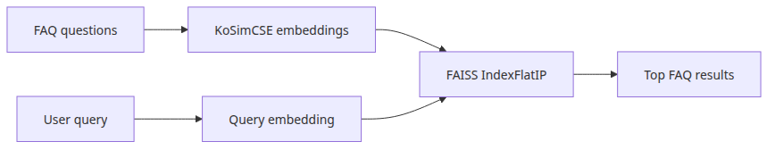
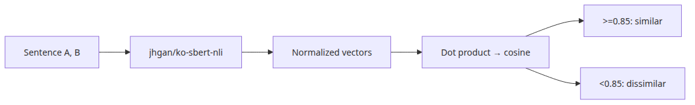
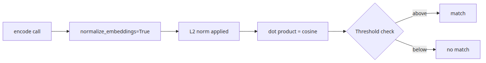
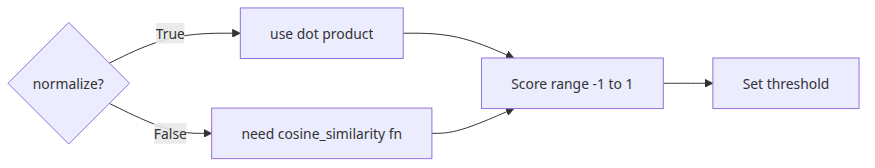

# Building sentence similarity search with KoSimCSE

## Questions this post answers

- Where does KoSimCSE usually pay off first in Korean retrieval work?
- Why is indexing FAQ questions alone a clean first version of search?
- Why do normalized embeddings pair so well with `IndexFlatIP`?
- How can a high similarity score still return the wrong result?

> The first useful sentence-similarity system comes from clean embeddings plus a transparent index, not from a complicated orchestration layer.

> Korean AI Stack 101 (2/6)

Example code: [github.com/yeongseon-books/korean-ai-stack-101](https://github.com/yeongseon-books/korean-ai-stack-101/tree/main/en/02-kosimcse-similarity)

## Why this matters

This post moves from model comparison into an actual Korean retrieval loop. The task is intentionally narrow: encode FAQ questions, index them with FAISS, and retrieve the closest match for a new Korean query.

Sentence similarity deserves its own stage because many Korean RAG systems collapse at this very step. If embedding quality, normalization, or index choice is wrong, no amount of LLM polish will recover the wrong document. Practicing the smallest retrieval loop with a proven model like KoSimCSE gives you a reference point for everything that follows — BGE-M3, multi-vector search, hybrid retrieval.

## Mental Model

Sentence similarity search decomposes into four steps.

```
[corpus]                         [query]
   |                                |
   v                                v
[encode -> vector]            [encode -> vector]
   |                                |
   v                                v
[FAISS index] <----- search -----+
   |
   v
[top-k results]
```

Two things matter most:

- **Encode with the same model**: the corpus and the query must share the model and the normalization scheme. Mixing models destroys distance semantics.
- **Match the distance and the index**: normalized vectors + `IndexFlatIP` (inner product) is mathematically equivalent to cosine similarity. Inner product on unnormalized vectors gets dominated by length.

Two more facts:

- KoSimCSE is a BERT-family encoder fine-tuned with contrastive learning. It is strong on short Korean sentences.
- FAISS `IndexFlatIP` is brute-force. Up to 10K items it is fast enough; beyond that switch to IVF or HNSW.

## Core concepts

| Item | Meaning |
| --- | --- |
| KoSimCSE | A Korean sentence-embedding model adapting the SimCSE contrastive learning recipe |
| `SentenceTransformer` | A library for loading and using embedding models with one line |
| `normalize_embeddings=True` | L2 normalization. Sets vector length to 1 to simplify cosine similarity |
| `IndexFlatIP` | FAISS inner-product brute-force index. Pairs with normalized vectors |
| `IndexFlatL2` | FAISS L2-distance brute-force index. For unnormalized vectors |
| top-k | Top k retrieval results. k=2~3 is suitable for debugging |
| Recall@k | Fraction of queries where the correct answer appears in the top k. Basic retrieval metric |

## Before vs. After

**Before** — When a user searches "I forgot my password" on the FAQ page, keyword matching may surface "password change policy" instead of "password reset."

**After** — KoSimCSE-based retrieval behaves as follows:

```python
query = '로그인 비밀번호를 다시 설정하고 싶어요.'  # "I want to reset my login password."
# top-1: '비밀번호나 패스워드를 재설정하고 싶어요.' (score 0.91)
# top-2: '결제는 됐는데 주문 내역이 보이지 않습니다.' (score 0.32)
```

What matters is (1) queries without the exact keyword "재설정" still match, (2) there is a large score gap between top-1 and top-2, and (3) you can manually inspect candidate meanings.

## Core flow



## Why index only the questions first

If you embed both questions and answers on day one, debugging becomes harder. A bad match may come from the query text, the answer wording, or the fact that long answer sentences drift semantically. Start with questions only and join the answer at display time.

## Step-by-step practice

### Step 1 — Prepare model and data

```python
import faiss
from sentence_transformers import SentenceTransformer

MODEL_NAME = 'BM-K/KoSimCSE-roberta-multitask'
FAQS = [
    {'category': 'account', 'question': '비밀번호나 패스워드를 재설정하고 싶어요.'},
    {'category': 'billing', 'question': '결제는 됐는데 주문 내역이 보이지 않습니다.'},
    {'category': 'shipping', 'question': '배송 상태는 어디에서 확인하나요?'},
]

model = SentenceTransformer(MODEL_NAME)
```

### Step 2 — Embed and index

```python
embeddings = model.encode(
    [item['question'] for item in FAQS],
    normalize_embeddings=True,
).astype('float32')

index = faiss.IndexFlatIP(embeddings.shape[1])
index.add(embeddings)
```

`normalize_embeddings=True` and `IndexFlatIP` are a pair. Drop either and scores become misleading.

### Step 3 — Search a query



```python
query = '로그인 비밀번호를 다시 설정하고 싶어요.'
query_vec = model.encode([query], normalize_embeddings=True).astype('float32')
distances, indices = index.search(query_vec, 2)
print(distances, indices)
```

### Step 4 — Interpret the result

```python
for score, idx in zip(distances[0], indices[0]):
    print(f"{score:.3f}  {FAQS[idx]['question']}")
```

Look at the top 2-3 instead of just the top 1. The score distribution shows whether the result is trustworthy at a glance.

### Step 5 — Measure Recall@k (optional)

```python
test_cases = [
    ('비밀번호 변경 어떻게 해요?', 0),  # gold: FAQ #0
    ('주문이 안 보여요', 1),
    ('택배 어디까지 왔나요?', 2),
]

hits = 0
for query, gold_idx in test_cases:
    vec = model.encode([query], normalize_embeddings=True).astype('float32')
    _, idx = index.search(vec, 1)
    if idx[0][0] == gold_idx:
        hits += 1
print(f"Recall@1 = {hits / len(test_cases):.2f}")
```

## What to notice in this code



- The index stores the **question strings**, not the full answers.
- `normalize_embeddings=True` makes inner product equivalent to cosine similarity.
- The test queries paraphrase the indexed questions instead of repeating them exactly.
- The full script prints the top two hits because ranking errors are easier to diagnose when you can inspect near misses.

## Common mistakes



- **Skipping normalization** — using `IndexFlatIP` without `normalize_embeddings=True` lets long sentences score unfairly high.
- **Encoding with different models** — corpus on KoSimCSE, query on BGE-M3 makes distances meaningless. Always use the same model.
- **Trusting the top-1 only** — a 0.92 score can still be wrong. The gap between candidates (0.92 vs 0.91 vs 0.45) is what reveals confidence.
- **Reusing FAQ settings on long documents** — long documents need chunking and different distance metrics. KoSimCSE is optimized for short sentences.
- **Including test data in the index** — Recall becomes unrealistically high. Always separate them.
- **Reusing score thresholds across model changes** — when the model changes, the score distribution changes. Recalibrate thresholds per model.

## Production application

- **Two-stage retrieval**: pull 100 candidates with KoSimCSE, then re-rank with a cross-encoder (`bongsoo/kpf-cross-encoder` etc.). Accuracy improves significantly.
- **Category filter**: filter by category before searching to shrink the candidate set, improving both accuracy and speed.
- **Cache embeddings**: FAQ corpora rarely change. Persist embeddings to disk and load on app startup to reduce cold start.
- **Choose the right index**: ≤10K items → `IndexFlatIP`. ≥100K → `IndexIVFFlat`. ≥1M → `IndexHNSWFlat`.
- **Hybrid retrieval**: weighted combination of BM25 (keyword) and KoSimCSE (semantic) scores catches both domain jargon and general paraphrasing.
- **Recall monitoring**: weekly, sample 50 new user queries, label gold answers, measure Recall@5. Below 80% triggers a model review.

## Checklist

- [ ] Decide whether the index should store questions, answers, or both.
- [ ] Test multiple paraphrases for the same intent.
- [ ] Print at least the top two or three results while tuning.
- [ ] Validate retrieval by itself before adding an LLM layer.
- [ ] Have measured Recall@k at least once.

## Exercises

1. Grow the FAQ corpus to 10 items and intentionally add 2 entries with similar meanings. Observe the top-1 score gap between them.
2. Switch to `normalize_embeddings=False`, search the same query, and compare how the rankings change.
3. Replace KoSimCSE with `jhgan/ko-sroberta-multitask` and compare the score distribution on the same query. Which model shows clearer gaps?

## Summary · Next article

The KoSimCSE example is valuable because it keeps the retrieval loop visible. That visibility becomes your reference point when you later add multilingual embeddings or generation on top. Three small habits — normalization, index choice, top-k printout — make a workable first version of Korean retrieval.

The next article (episode 3) covers BGE-M3. We will see where it surpasses KoSimCSE on mixed Korean-English corpora, and what dense + sparse multi-vector retrieval means in code.

<!-- toc:begin -->
## In this series

- [Korean embedding models compared — KoSimCSE, BGE-M3, Solar](./01-korean-embedding-models.md)
- **Building sentence similarity search with KoSimCSE (current)**
- BGE-M3 multilingual embedding in practice (upcoming)
- Document text extraction with CLOVA OCR API (upcoming)
- Using HyperCLOVA X and Solar API (upcoming)
- Assembling a Korean RAG pipeline (upcoming)

<!-- toc:end -->

---

## References

- [BM-K/KoSimCSE-roberta-multitask](https://huggingface.co/BM-K/KoSimCSE-roberta-multitask)
- [SimCSE paper](https://arxiv.org/abs/2104.08821)
- [FAISS getting started](https://github.com/facebookresearch/faiss/wiki/Getting-started)
- [SentenceTransformers semantic search examples](https://www.sbert.net/examples/sentence_transformer/applications/semantic-search/README.html)

Tags: Korean NLP, LLM, Embeddings, OCR
