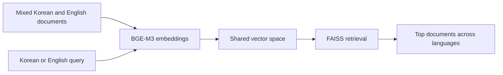

# BGE-M3 multilingual embedding in practice

## Questions this post answers

- Why does multilingual embedding matter when Korean queries must retrieve English documents?
- Why does this post use only dense mode even though BGE-M3 supports more retrieval styles?
- What retrieval scenarios should you verify first in a mixed Korean/English corpus?
- If multilingual retrieval does not improve results, where should you look first?

> The value of multilingual embedding is not translation by itself but placing multiple languages in one meaning space that still respects search intent.

> Korean AI Stack 101 (3/6)

Example code: [github.com/yeongseon-books/korean-ai-stack-101](https://github.com/yeongseon-books/korean-ai-stack-101/tree/main/en/03-bge-m3-multilingual)

Mixed-language corpora appear quickly in real systems. Rollback guides may be in English, support policies in Korean, and product names in English. This post tests that cross-language retrieval boundary directly.

---

## Core flow



---

## Why start with a dense baseline

If you attach sparse retrieval and reranking immediately, it becomes hard to tell which layer actually helped. Dense-only retrieval already answers an important question: can a Korean query reach the right English operational document?

---

## Minimal runnable example

```python
import faiss
from sentence_transformers import SentenceTransformer

MODEL_NAME = 'BAAI/bge-m3'
DOCUMENTS = [
    {'lang': 'ko', 'text': '벡터 검색 품질은 청크 경계와 임베딩 모델 선택에 크게 좌우됩니다.'},
    {'lang': 'en', 'text': 'The deployment playbook explains how to roll back a failed release in Kubernetes.'},
    {'lang': 'en', 'text': 'Korean customer support teams often label billing incidents separately from delivery incidents.'},
]

model = SentenceTransformer(MODEL_NAME)
vectors = model.encode([item['text'] for item in DOCUMENTS], normalize_embeddings=True).astype('float32')
index = faiss.IndexFlatIP(vectors.shape[1])
index.add(vectors)

query = '배포 실패 시 쿠버네티스 롤백 절차를 찾고 싶습니다.'
query_vec = model.encode([query], normalize_embeddings=True).astype('float32')
distances, indices = index.search(query_vec, 3)
print(distances, indices)
```

---

## What to notice in this code

- The corpus is intentionally multilingual.
- Queries should be tested in both Korean and English.
- The example uses **dense retrieval only** to establish a clean baseline.
- Logging language labels with scores makes language bias easier to spot.

---

## Where engineers get confused

- Multilingual retrieval does not eliminate all language-specific tuning.
- Hybrid search is not automatically better.
- Topic ambiguity can matter more than language ambiguity.

---

## Checklist

- [ ] Add at least one Korean-query-to-English-document test.
- [ ] Add at least one English-query-to-Korean-document test.
- [ ] Stabilize dense retrieval before adding sparse or reranking layers.
- [ ] Record document language together with the scores.

---

## Summary

The practical value of this BGE-M3 exercise is the baseline it creates. Once cross-lingual retrieval behaves sensibly, you can connect OCR output and generation layers with a much clearer sense of where failure will surface.

<!-- blog-only:start -->
Next: [Document text extraction with CLOVA OCR API](./04-clova-ocr.md)
<!-- blog-only:end -->

<!-- toc:begin -->
## In this series

- [Korean embedding models compared — KoSimCSE, BGE-M3, Solar](./01-korean-embedding-models.md)
- [Building sentence similarity search with KoSimCSE](./02-kosimcse-similarity.md)
- **BGE-M3 multilingual embedding in practice (current)**
- Document text extraction with CLOVA OCR API (upcoming)
- Using HyperCLOVA X and Solar API (upcoming)
- Assembling a Korean RAG pipeline (upcoming)

<!-- toc:end -->

---

## References

- [BAAI/bge-m3](https://huggingface.co/BAAI/bge-m3)
- [BGE-M3 paper](https://arxiv.org/abs/2402.03216)
- [FAISS getting started](https://github.com/facebookresearch/faiss/wiki/Getting-started)

Tags: Korean NLP, LLM, Embeddings, OCR
