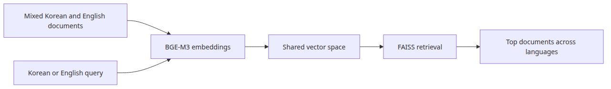
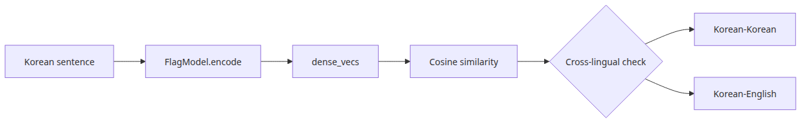
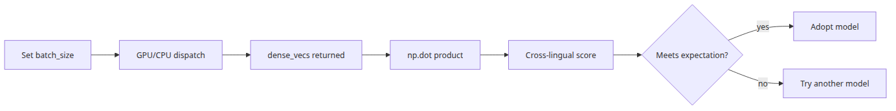
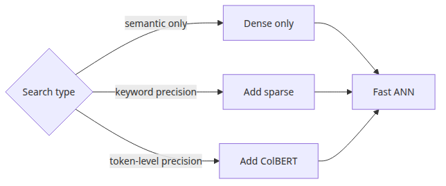

# BGE-M3 multilingual embedding in practice

Many Korean teams search across a corpus where the query is Korean but half the documents are English. That is the point where a Korean-only retrieval baseline starts to look clean in tests and brittle in production.

This is the third post in the Korean AI Stack 101 series. Here, we use BGE-M3 to measure a dense multilingual baseline over mixed Korean-English corpora before adding more complex retrieval signals.

## Questions this post answers

- Where does BGE-M3 outperform KoSimCSE on a corpus mixing Korean and English?
- What does it mean for a single model to emit dense, sparse, and multi-vector representations at once?
- Why is the dense-only baseline often enough for the first version of multilingual search?
- Why can the score distribution differ between languages even for the same query meaning?

> The first thing to do when starting multilingual retrieval is not to combine fancy multi-vector signals, but to measure the dense baseline cleanly.

> Korean AI Stack 101 (3/6)

Example code: [github.com/yeongseon-books/korean-ai-stack-101](https://github.com/yeongseon-books/korean-ai-stack-101/tree/main/en/03-bge-m3-multilingual)

## Why this matters

This post moves into a Korean retrieval scenario that is the daily reality at Korean companies: queries arrive in Korean, but a large fraction of the document corpus is written in English. The previous post used KoSimCSE on Korean-only short sentences. Here we use BGE-M3 on a mixed Korean-English corpus.

BGE-M3 deserves its own stage for two reasons. First, internal documentation search at Korean companies is almost impossible without a multilingual encoder — manuals and incident postmortems are in English while user queries are in Korean. Second, BGE-M3 is the first widely available open model that emits dense, sparse, and multi-vector representations at once, which means later hybrid retrieval can fuse scores from the same backbone. This post focuses on the dense baseline; sparse and multi-vector are deferred to the next stage.

## Mental Model

Multilingual dense retrieval decomposes into four steps.

```text
[multilingual corpus (ko+en)]      [Korean query]
        |                                |
        v                                v
[BGE-M3 encode -> 1024d]      [BGE-M3 encode -> 1024d]
        |                                |
        v                                v
[FAISS IndexFlatIP] <-------- search ----+
        |
        v
[top-k (language-agnostic)]
```

Three things matter most:

- **Model absorbs the language asymmetry**: the corpus may be English while the query is Korean, but both end up in the same vector space. KoSimCSE does not align languages well.
- **Normalization is still required**: BGE-M3 dense outputs are not unit length by default. Always set `normalize_embeddings=True`.
- **Dense alone is meaningful**: a multilingual encoder has already learned to fold some keyword signal into its dense vectors, so the dense baseline already shows a clear lift over KoSimCSE on mixed corpora.

Two more facts:

- BGE-M3 dense vectors are 1024-dimensional. KoSimCSE is 768. FAISS memory grows by about 1.3x.
- Model load time is longer than KoSimCSE, adding 5-10 seconds to cold starts. Caching matters more.

## Core concepts

| Item | Meaning |
| --- | --- |
| BGE-M3 | A multilingual embedding model from BAAI supporting around 100 languages |
| `BAAI/bge-m3` | Hugging Face model id, loadable via `SentenceTransformer` |
| Dense vector | Standard 1024-dim embedding. Default for semantic retrieval |
| Sparse vector | Token-weighted representation, similar to BM25 but with learned weights |
| Multi-vector (ColBERT-style) | One small vector per token for late interaction |
| `normalize_embeddings=True` | L2 normalization, makes inner product equivalent to cosine similarity |
| `IndexFlatIP` | FAISS inner-product index; pairs naturally with normalized dense vectors |

## Before vs. After

**Before** — A KoSimCSE-only search returns only Korean documents for the Korean query "Kubernetes rollback procedure." English-language internal runbooks are invisible.

**After** — With BGE-M3 dense retrieval the behavior changes:

```python
query = '배포 실패 시 쿠버네티스 롤백 절차를 찾고 싶습니다.'
# top-1: 'Kubernetes rollback playbook for failed deploys' (score 0.78, en)
# top-2: '배포 실패 시 롤백 체크리스트' (score 0.74, ko)
# top-3: 'CI 파이프라인 실패 알림 정책' (score 0.41, ko)
```

What matters: (1) a Korean query lifts an English runbook to top-1, (2) the equivalent Korean document still ranks closely as top-2, and (3) the score gap to top-3 is wide enough to make a cutoff threshold meaningful.

## Core flow



*Core flow*

## Why start from a dense-only baseline



*Minimal runnable example*

The fact that BGE-M3 emits dense, sparse, and multi-vector signals at once does not mean you should fuse all three on day one. If you never measure how the dense baseline alone compares to KoSimCSE, you will not know whether a later improvement comes from sparse, dense, or the fusion weights. The simplest dense + IndexFlatIP combination, with Recall@5 captured once, becomes the reference point for every subsequent experiment.

## Step-by-step practice

### Step 1 — Prepare the model and a multilingual corpus

```python
import faiss
from sentence_transformers import SentenceTransformer

MODEL_NAME = 'BAAI/bge-m3'
DOCS = [
    {'lang': 'en', 'text': 'Kubernetes rollback playbook for failed deploys: kubectl rollout undo'},
    {'lang': 'en', 'text': 'Customer support label taxonomy for refund and cancellation tickets'},
    {'lang': 'ko', 'text': '배포 실패 시 롤백 체크리스트: 헬스체크, 트래픽 회수, 알림 순서'},
    {'lang': 'ko', 'text': 'CI 파이프라인 실패 시 슬랙 알림 정책과 담당자 매트릭스'},
    {'lang': 'ko', 'text': '환불 요청 처리 SLA와 cancellation 사유 코드 관리'},
]

model = SentenceTransformer(MODEL_NAME)
```

### Step 2 — Embed and index

```python
embeddings = model.encode(
    [doc['text'] for doc in DOCS],
    normalize_embeddings=True,
).astype('float32')

index = faiss.IndexFlatIP(embeddings.shape[1])
index.add(embeddings)
print('dim =', embeddings.shape[1])  # 1024
```

Confirm the dimension once. It helps later when sizing IVF training data.

### Step 3 — Search English+Korean documents with a Korean query



*What to notice in this code*

```python
query = '배포 실패 시 쿠버네티스 롤백 절차를 찾고 싶습니다.'
query_vec = model.encode([query], normalize_embeddings=True).astype('float32')
distances, indices = index.search(query_vec, 3)

for score, idx in zip(distances[0], indices[0]):
    print(f"{score:.3f}  [{DOCS[idx]['lang']}]  {DOCS[idx]['text']}")
```

Printing the language code makes the cross-lingual mapping visible at a glance.

### Step 4 — Recall by language

```python
test_cases = [
    ('배포 실패 시 쿠버네티스 롤백 절차', 0),     # gold: English runbook
    ('환불 요청 SLA 알려 주세요', 4),              # gold: Korean refund policy
    ('CI 실패 알림은 누구에게 가나요', 3),         # gold: Korean CI policy
]

hits = 0
for query, gold_idx in test_cases:
    vec = model.encode([query], normalize_embeddings=True).astype('float32')
    _, idx = index.search(vec, 1)
    if idx[0][0] == gold_idx:
        hits += 1
print(f"Recall@1 (ko query) = {hits / len(test_cases):.2f}")
```

Holding the query language fixed (Korean) while varying the gold language is the key. If Recall on English-gold cases drops below 0.6, dense alone is not enough.

### Step 5 — Compare with the same query in English (optional)

```python
en_query = 'kubernetes rollback procedure for failed deployment'
en_vec = model.encode([en_query], normalize_embeddings=True).astype('float32')
en_dist, en_idx = index.search(en_vec, 3)

for score, idx in zip(en_dist[0], en_idx[0]):
    print(f"{score:.3f}  [{DOCS[idx]['lang']}]  {DOCS[idx]['text']}")
```

If the top-1 stays the same across the Korean and English version of the same query, the model has absorbed the language asymmetry well — at least qualitatively.

## What to notice in this code



*Where engineers get confused*

- Korean and English documents are encoded with **one model** into one index. The old per-language index pattern is unnecessary with BGE-M3.
- Mixing the gold language inside the test cases reveals the real multilingual performance.
- 1024 dimensions cost more memory and time than KoSimCSE. Caching and batched encoding matter more.
- If dense Recall is good enough, do not add sparse or multi-vector yet.

## Common mistakes

- **Skipping normalization** — without `normalize_embeddings=True`, dense vector length dominates the score under `IndexFlatIP`.
- **Per-language indexes** — splitting by language defeats BGE-M3's cross-lingual alignment. Put both languages into the same index.
- **Comparing absolute scores across models** — KoSimCSE's 0.91 and BGE-M3's 0.78 are not on the same scale. Different models, different distributions.
- **Enabling dense, sparse, and multi-vector all at once** — you lose the ability to attribute improvements. Add them one at a time: dense → sparse → multi-vector.
- **Ignoring query length** — BGE-M3 supports up to 8K tokens, but very long queries dilute meaning and flatten scores. Aim for around 200 tokens.
- **Running the model in fp32 on GPU** — BGE-M3 is safe and fast in fp16. `model.half()` halves memory in one line.

## Production application

- **Multilingual internal search**: put English manuals and Korean operational guides into one index and accept Korean queries — a usable first version of internal search emerges quickly.
- **Hybrid retrieval (dense axis)**: fuse BM25 (sparse, keyword) with BGE-M3 dense via weighted sum. Domain acronyms and general paraphrases both get covered. Start with weights between 0.3 and 0.7.
- **Cross-encoder rerank**: pull top-50 candidates with BGE-M3 and rerank with `bge-reranker-large`. Multilingual queries see a clear accuracy bump.
- **Embedding caching**: 1024 dims times tens of thousands of documents is non-trivial memory. Disk caching and mmap matter.
- **Choose the right index**: ≤10K → `IndexFlatIP`. ≥100K → `IndexIVFFlat` (nlist≈√N), train with at least 10K samples. ≥1M → `IndexHNSWFlat`.
- **Per-language monitoring**: weekly, split Recall@5 into Korean-query/English-gold and Korean-query/Korean-gold groups. A drop on one side signals corpus-mix or model-change pressure.

## Checklist

- [ ] Both Korean and English documents live in the same index.
- [ ] Dense baseline Recall@5 has been measured once and recorded.
- [ ] Normalization and IndexFlatIP are paired.
- [ ] Same-meaning Korean and English queries have been spot-checked for consistent top-1.
- [ ] Dense-only limitations are written down before sparse or multi-vector are added.

## Exercises

1. Grow the corpus to 6 English and 6 Korean documents, then measure Recall@1 over 5 Korean queries. Split the Recall by gold language and compare.
2. Switch to `normalize_embeddings=False` and observe how long English documents distort the scores.
3. Index the same corpus with KoSimCSE and compare Recall@5 on Korean-gold vs English-gold cases against BGE-M3. What pattern emerges?

## Summary · Next article

The value of the BGE-M3 dense example is that it draws a clear baseline for multilingual retrieval. Lifting an English runbook to top-1 from a Korean query is already a significant step, and only on top of that baseline can the additional gain from sparse or multi-vector be measured. One commitment — encoding Korean and English into the same space with one model — is what makes a usable internal-search v1 possible.

The next article (episode 4) covers the CLOVA OCR API. We will reliably pull text out of Korean document images and shape the result into the form a BGE-M3 corpus expects, with code.

<!-- toc:begin -->
## In this series

- [Korean embedding models compared — KoSimCSE, BGE-M3, Solar](./01-korean-embedding-models.md)
- [Building sentence similarity search with KoSimCSE](./02-kosimcse-similarity.md)
- **BGE-M3 multilingual embedding in practice (current)**
- Document text extraction with CLOVA OCR API (upcoming)
- Using HyperCLOVA X and Solar API (upcoming)
- Assembling a Korean RAG pipeline (upcoming)

<!-- toc:end -->

---

## References

- [BAAI/bge-m3 model card](https://huggingface.co/BAAI/bge-m3)
- [BGE-M3 paper (M3-Embedding)](https://arxiv.org/abs/2402.03216)
- [FAISS getting started](https://github.com/facebookresearch/faiss/wiki/Getting-started)
- [SentenceTransformers semantic search examples](https://www.sbert.net/examples/sentence_transformer/applications/semantic-search/README.html)

Tags: Korean NLP, LLM, Embeddings, OCR
