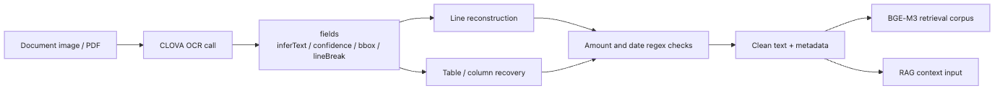

# Document text extraction with CLOVA OCR API

## Questions this post answers

- When you add OCR, should you inspect text accuracy first or response structure first?
- Why do bounding boxes and `lineBreak` hints matter so much in post-processing?
- Why can you validate most of the OCR pipeline even without a real API key?
- Why should OCR output be cleaned before it enters embedding or RAG steps?

> The first useful OCR output is not plain text but a structured extraction payload that still needs reconstruction.

> Korean AI Stack 101 (4/6)

Example code: [github.com/yeongseon-books/korean-ai-stack-101](https://github.com/yeongseon-books/korean-ai-stack-101/tree/main/en/04-clova-ocr)

This example defaults to a bundled mock response so it stays runnable without a CLOVA key or a sample image. The important lesson is not the HTTP call. It is how to read the JSON payload and reconstruct useful lines for downstream retrieval.

---

## Core flow


---

## Why start with a mock payload

Most OCR integration pain lives after the API call. Teams usually struggle with row order, broken line reconstruction, or split numbers before they struggle with authentication.

---

## Minimal runnable example

```python
MOCK_RESPONSE = {
    'images': [
        {
            'fields': [
                {'inferText': '공급가액', 'inferConfidence': 0.997, 'lineBreak': False},
                {'inferText': '45,000원', 'inferConfidence': 0.994, 'lineBreak': True},
                {'inferText': '부가세', 'inferConfidence': 0.996, 'lineBreak': False},
                {'inferText': '4,500원', 'inferConfidence': 0.991, 'lineBreak': True},
            ]
        }
    ]
}

for image in MOCK_RESPONSE['images']:
    current = []
    for field in image['fields']:
        current.append(field['inferText'])
        if field['lineBreak']:
            print(' '.join(current))
            current = []
```

---

## What to notice in this code

- The code reads `lineBreak` as carefully as `inferText`.
- Confidence values are preserved because downstream cleanup often needs them.
- The raw payload and reconstructed lines should be inspected together.
- A mock example is often the fastest way to validate post-processing logic.

---

## Where engineers get confused

- Better OCR accuracy does not automatically mean better RAG quality.
- Confidence is not a truth oracle.
- PDF OCR and image OCR look similar but fail differently.

---

## Checklist

- [ ] Store the raw payload together with the post-processed text.
- [ ] Decide whether `lineBreak`, coordinates, or confidence are required downstream.
- [ ] Add special validation for amounts, dates, and identifiers.
- [ ] Verify line or paragraph reconstruction before embedding the text.

---

## Summary

OCR is not a side feature. It defines the quality of the text entering the rest of the pipeline. Once that structure is clear, it becomes much easier to reason about the generation step in the next post.

<!-- toc:begin -->
## In this series

- [Korean embedding models compared — KoSimCSE, BGE-M3, Solar](./01-korean-embedding-models.md)
- [Building sentence similarity search with KoSimCSE](./02-kosimcse-similarity.md)
- [BGE-M3 multilingual embedding in practice](./03-bge-m3-multilingual.md)
- **Document text extraction with CLOVA OCR API (current)**
- Using HyperCLOVA X and Solar API (upcoming)
- Assembling a Korean RAG pipeline (upcoming)

<!-- toc:end -->

---

## References

- [NAVER Cloud CLOVA OCR overview](https://www.ncloud.com/product/aiService/ocr)
- [CLOVA OCR API guide](https://api.ncloud-docs.com/docs/ai-application-service-ocr-ocr)
- [OCR post-processing patterns](https://cloud.google.com/document-ai/docs/process-documents-client-libraries)

Tags: Korean NLP, LLM, Embeddings, OCR
